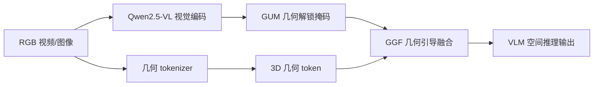
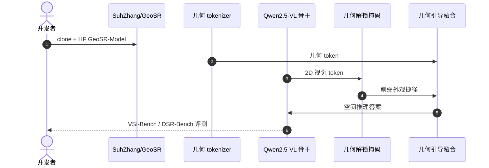

# GeoSR：Make Geometry Matter for Spatial Reasoning

**GeoSR**（*Make Geometry Matter for Spatial Reasoning*；[arXiv:2603.26639](https://arxiv.org/abs/2603.26639)，[项目页](https://suhzhang.github.io/GeoSR/)，[代码](https://github.com/SuhZhang/GeoSR)）由 **新加坡国立大学（NUS）** 提出（ECCV 2026 Oral）。

## 一句话定义

**用几何解锁掩码与几何引导融合，迫使 VLM 在静态与动态空间推理中真正使用 3D 几何 token。**

## 英文缩写速查

| 缩写 | 英文全称 | 简要说明 |
|------|----------|----------|
| GeoSR | Geometry-aware Spatial Reasoning | 本文方法；几何解锁 + 几何引导融合 |
| GUM | Geometry-Unleashing Masking | 几何解锁掩码；削弱 2D 外观捷径 |
| GGF | Geometry-Guided Fusion | 几何引导融合；强制 VLM 使用 3D token |
| VLM | Vision-Language Model | 视觉-语言模型；Qwen2.5-VL 等骨干 |
| VSI | Visual-Spatial Intelligence | 视觉空间智能；VSI-Bench 评测套件 |

## 为什么重要

- 用几何解锁掩码与几何引导融合，迫使 VLM 在静态与动态空间推理中真正使用 3D 几何 token。
- 为机器人感知、重建或空间推理链路提供可引用的 **深度论文实体**，便于与站内方法页交叉。
- 开源状态已按项目页核查：已开源。

## 核心信息

| 项 | 内容 |
|----|------|
| **机构** | 新加坡国立大学（NUS） |
| **出处** | ECCV 2026 Oral |
| **论文** | <https://arxiv.org/abs/2603.26639> |
| **项目页** | <https://suhzhang.github.io/GeoSR/> |
| **开源** | **已开源** — 官方仓库 [`SuhZhang/GeoSR`](https://github.com/SuhZhang/GeoSR)（2026-09-12 项目页核查）。 |
| **Hugging Face** | <https://huggingface.co/SuhZhang/GeoSR-Model> |

## 核心原理

GeoSR 针对 VLM **空间推理**中几何 token 被 2D 外观捷径淹没的问题：先用 **Geometry-Unleashing Masking（GUM）** 在训练时 mask 易作弊的 2D 区域，再用 **Geometry-Guided Fusion（GGF）** 将 3D 几何 token 与 VLM 视觉流显式融合。几何来自独立 tokenizer（深度/点云等），迫使模型在静态与动态空间 QA 中真正调用 3D 结构。

### 流程总览

## 评测与指标

- **VSI-Bench：** GeoSR 达 **51.9** 分，显著优于仅 2D VLM 与 naive 几何拼接基线。
- **DSR-Bench（动态空间推理）：** **66.1** 分，证明 GUM+GGF 对时序/动态 QA 同样有效。
- **消融：** GUM 单独与 GGF 单独均不及联合训练，说明「去捷径 + 强融合」缺一不可。
- **HF 权重：** [`SuhZhang/GeoSR-Model`](https://huggingface.co/SuhZhang/GeoSR-Model) 提供完整 checkpoint，便于在自定义 spatial QA 上微调。

## 结论

**GeoSR 以 GUM+GGF 迫使 VLM 使用 3D 几何 token，在 VSI-Bench 51.9、DSR-Bench 66.1 上领先，适合机器人 spatial QA / VLA 前置模块。**

- 从 HF [`SuhZhang/GeoSR-Model`](https://huggingface.co/SuhZhang/GeoSR-Model) 加载，按 [`SuhZhang/GeoSR`](https://github.com/SuhZhang/GeoSR) README 准备几何 tokenizer 输入（深度/点云格式）。
- GUM mask 策略需与训练一致；推理时随意关闭 mask 可能恢复 appearance shortcut，几何利用率下降。
- 与 [VLA](../methods/vla.md) 集成时，将 GeoSR 作为 spatial reasoning head，而非替换低层 motor policy。
- 自定义 benchmark 上先复现 **VSI-Bench 51.9** 再迁移；几何 tokenizer 质量（深度噪声）直接影响 GGF 收益。
- 动态场景需视频级几何；单帧 depth 在 DSR-Bench 类任务上会 underperform。
- 算力：Qwen2.5-VL + 几何双流，边缘部署需量化或 distillation，论文数字为 full-precision 设定。

## 工程实践

| 项 | 建议 |
|----|------|
| 复现入口 | https://github.com/SuhZhang/GeoSR |
| 权重/数据 | https://huggingface.co/SuhZhang/GeoSR-Model |
| 开源状态 | 已开源 |
| 依赖风险 | 按 README 安装；GPU/数据集门槛以仓库说明为准 |

## 源码运行时序图

运行时节点对齐 `SuhZhang/GeoSR` README 中的安装与评测脚本。

## 局限与风险

- 论文设定与真实机器人传感器噪声、标定误差、算力预算可能存在差距。
- 权重与训练数据规模较大，边缘设备需评估推理延迟。

## 关联页面

- [Vla](../methods/vla.md)
- [Paper Sa 2509 06266 Spatial Reasoning With Vision Language Models In](../entities/paper-sa-2509-06266-spatial-reasoning-with-vision-language-models-in.md)
- [Generative World Models](../methods/generative-world-models.md)

## 参考来源

- [`geosr_spatial_reasoning_arxiv_2603_26639.md`](../../sources/papers/geosr_spatial_reasoning_arxiv_2603_26639.md)
- [`geosr-project.md`](../../sources/sites/geosr-project.md)
- [`suhzhang-geosr.md`](../../sources/repos/suhzhang-geosr.md)
- 论文：<https://arxiv.org/abs/2603.26639>

## 推荐继续阅读

- [项目页](https://suhzhang.github.io/GeoSR/)
- [arXiv:2603.26639](https://arxiv.org/abs/2603.26639)
- [Hugging Face](https://huggingface.co/SuhZhang/GeoSR-Model)
