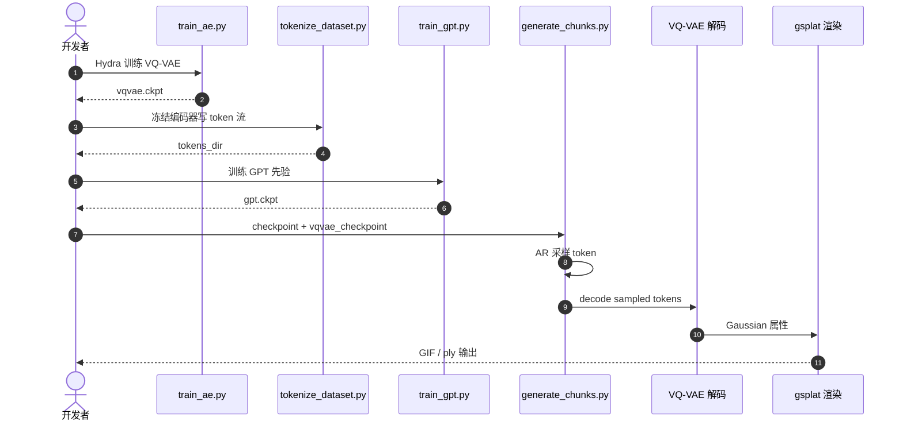

# GaussianGPT：Towards Autoregressive 3D Gaussian Scene Generation

**GaussianGPT**（[arXiv:2603.26661](https://arxiv.org/abs/2603.26661)，[项目页](https://nicolasvonluetzow.github.io/GaussianGPT/)，[代码](https://github.com/nicolasvonluetzow/GaussianGPT)）由 **慕尼黑工业大学（TU Munich）** 提出（ECCV 2026 Oral）。

## 一句话定义

**用稀疏 VQ-VAE 将 3D Gaussian 场景压缩为离散 token 流，再以带 3D RoPE 的 GPT 式 transformer 自回归生成完整场景，同一套采样机制支持 completion 与 outpainting。**

## 英文缩写速查

| 缩写 | 英文全称 | 简要说明 |
|------|----------|----------|
| 3DGS | 3D Gaussian Splatting | 显式高斯原语 + 可微渲染的场景表示 |
| VQ-VAE | Vector Quantized Variational Autoencoder | 向量量化自编码器；本文用于 Gaussian 压缩 |
| LFQ | Lookup-Free Quantization | 无 lookup 表的向量量化；离散化 latent 特征 |
| RoPE | Rotary Positional Embedding | 旋转位置编码；本文扩展到 3D 体素坐标 |
| GPT | Generative Pre-trained Transformer | 因果自回归 transformer 先验 |

## 为什么重要

- 在 diffusion / flow-matching 主导的 3D 生成之外，给出 **逐步构造场景** 的自回归范式：completion、outpainting、温度采样与可变生成长度天然统一。
- 输出为 **显式 3D Gaussian**，可直接接入 `gsplat` 等现代神经渲染管线，便于 Sim2Real / 仿真资产链路的 splat 交付。
- **已开源** 完整训练与推理栈及 scene-level、PhotoShape 物体级 checkpoint，复现门槛相对可控（依赖 MinkowskiEngine + CUDA 12.9 编译链）。

## 核心信息

| 项 | 内容 |
|----|------|
| **机构** | 慕尼黑工业大学（TU Munich） |
| **出处** | ECCV 2026 Oral |
| **论文** | <https://arxiv.org/abs/2603.26661> |
| **项目页** | <https://nicolasvonluetzow.github.io/GaussianGPT/> |
| **开源** | **已开源** — [`nicolasvonluetzow/GaussianGPT`](https://github.com/nicolasvonluetzow/GaussianGPT)；权重见 [`kaldir.vc.cit.tum.de/gaussiangpt`](https://kaldir.vc.cit.tum.de/gaussiangpt/)（2026-09-19 项目页核查）。 |
| **Hugging Face Papers** | <https://huggingface.co/papers/2603.26661> |

## 核心原理

GaussianGPT 分两阶段：**(1) 压缩** 与 **(2) 自回归先验**。

1. **3D Gaussian 压缩：** 将 per-voxel Gaussian 投影到稀疏 3D 网格，稀疏 3D CNN 编码为低维 latent；lookup-free quantization 得到离散 codebook 索引。对称解码器用 `gsplat` 重渲染、占用与 codebook 熵损失联合训练。
2. **Token 序列化：**  occupied 体素按固定 **xyz 顺序** 遍历，每个体素交错写入 **位置 token** 与 **特征 token**，形成 1D 序列。
3. **GPT 先验：** 带 **3D RoPE** 的因果 transformer 做 next-token 预测，联合建模几何与外观。
4. **推理模式：** 从 BOS 无条件采样；或以部分 token / 空间范围 prompt 做 **completion**；重复 **outpainting** 拼接超出训练 chunk 的大场景。

相对 diffusion 的 holistic refine，本文强调 **逐步组合** 与 **上下文可控**（温度、top-k/p、prompt 比例或空间半平面 cut）。

### 流程总览

## 评测与指标

- 项目页展示 **无条件 chunk 生成**、**部分场景 completion**、**多块 outpainting 大场景** 三类定性结果；定量指标与 ablation 以 [arXiv PDF](https://arxiv.org/abs/2603.26661) 为准。
- 训练/评测数据含 **PhotoShape**（物体级）、**ASE**、**3D-FRONT**（场景级）；Gaussian 由 **Voxel-GS**（L3DG 简化 Scaffold-GS，每体素单 Gaussian）预处理。
- 与 [GaussianDream](../entities/paper-sa-2605-20752-gaussiandream-a-feed-forward-3d-gaussian-world-m.md) 等 **feed-forward 操纵 WM** 不同，GaussianGPT 面向 **生成式场景先验**，不直接输出机器人动作或物理 rollout。

## 与其他工作对比

| 对照 | 差异读法 |
|------|----------|
| Diffusion / flow 3D 生成 |  holistic 去噪 refine；GaussianGPT **逐步 token 构造**，completion/outpainting 与 unconditional 共用同一 AR 采样 |
| [VGGT-World](../entities/paper-sa-2603-12655-vggt-world-transforming-vggt-into-an-autoregress.md) | 同为 **自回归**，但 VGGT-World 预测 **几何 foundation 特征时序**；GaussianGPT 直接生成 **3D Gaussian 原语** |
| [GaussianDream](../entities/paper-sa-2605-20752-gaussiandream-a-feed-forward-3d-gaussian-world-m.md) | 前者 **feed-forward 操纵世界模型**；GaussianGPT 是 **内容/场景生成先验**，服务 splat 资产而非策略闭环 |
| [GaussianWorld](../entities/paper-sa-2412-04380-gaussianworld-gaussian-world-model-for-streaming.md) | 后者强调 **流式 Gaussian WM**；GaussianGPT 强调 **可控生成与编辑**（completion/outpainting） |

## 结论

**GaussianGPT 把 3D Gaussian 场景生成写成 VQ 离散化 + GPT 自回归，在显式 splat 表示上统一 unconditional、completion 与 outpainting，是 diffusion 之外可复现的 3D 生成基线。**

- 复现从 [`kaldir.vc.cit.tum.de/gaussiangpt`](https://kaldir.vc.cit.tum.de/gaussiangpt/) 下载 **成对** VQ-VAE + GPT checkpoint，再跑 `generate_chunks.py` 做快速 smoke test。
- 完整训练需按 README 编译 **MinkowskiEngine（CUDA 12 分支）**、`gsplat`、`pytorch3d` 与 Flash Attention；GCC ≤ 13，并设置 `TORCH_CUDA_ARCH_LIST`。
- 场景级与物体级（PhotoShape）使用不同 `conf/data` 与模型规模；勿混用 checkpoint。
- completion 有两种入口：`generate_chunks.py`（序列前缀比例）与 `complete_chunks.py`（**空间半平面** prompt，更贴近 outpainting 论文设定）。
- 大场景用 `generate_scene.py` tile + `decode_scene.py` 解码；SLURM 可通过 `GAUSS_SHARD_ID` 分片。
- 接入机器人 Sim2Real 时，输出 splat 仍需 **尺度/碰撞/物理** 对齐；本文不提供动力学 WM。

## 工程实践

| 项 | 建议 |
|----|------|
| 复现入口 | <https://github.com/nicolasvonluetzow/GaussianGPT> |
| 权重 | <https://kaldir.vc.cit.tum.de/gaussiangpt/> |
| 快速推理 | `python generate_chunks.py checkpoint=<gpt.ckpt> vqvae_checkpoint=<vqvae.ckpt> num_samples=4` |
| 训练顺序 | `train_ae.py` → `tokenize_dataset.py` → `train_gpt.py` |
| 开源状态 | **已开源**（代码 + checkpoint） |
| 依赖风险 | CUDA 12.9 + 多扩展源码编译；3D-FRONT 原始下载已下线，可用 Hugging Face 镜像替代 |

## 源码运行时序图

节点对齐 [`nicolasvonluetzow/GaussianGPT`](https://github.com/nicolasvonluetzow/GaussianGPT) README 中的训练与 `generate_chunks.py` 推理路径。

## 局限与风险

- 依赖 **重编译 CUDA 栈**（MinkowskiEngine、gsplat、Flash Attention），环境失败时优先单独构建扩展查看 nvcc 日志。
- **3D-FRONT 原始源** 已不可用；复现需换用社区 re-release 或自备 Voxel-GS 预处理 Gaussian。
- 生成结果为 **静态 splat 场景块**，不含接触动力学；接入操纵/导航仿真仍需额外物理与资产后处理。
- AR 长序列采样成本随场景 token 数增长；大场景依赖 **分块 outpainting + tile 拼接**。

## 关联页面

- [Generative World Models](../methods/generative-world-models.md)
- [GaussianDream](../entities/paper-sa-2605-20752-gaussiandream-a-feed-forward-3d-gaussian-world-m.md)
- [VGGT-World](../entities/paper-sa-2603-12655-vggt-world-transforming-vggt-into-an-autoregress.md)

## 参考来源

- [`gaussiangpt_arxiv_2603_26661.md`](../../sources/papers/gaussiangpt_arxiv_2603_26661.md)
- [`gaussiangpt-project.md`](../../sources/sites/gaussiangpt-project.md)
- [`nicolasvonluetzow-gaussiangpt.md`](../../sources/repos/nicolasvonluetzow-gaussiangpt.md)
- 论文：<https://arxiv.org/abs/2603.26661>

## 推荐继续阅读

- [项目页](https://nicolasvonluetzow.github.io/GaussianGPT/)
- [GitHub 仓库](https://github.com/nicolasvonluetzow/GaussianGPT)
- [Hugging Face Papers](https://huggingface.co/papers/2603.26661)
