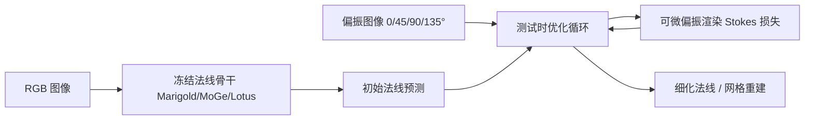

# Poppy：Polarization-based Plug-and-Play Guidance for Enhancing Monocular Normal Estimation

**Poppy**（*Poppy: Polarization-based Plug-and-Play Guidance for Enhancing Monocular Normal Estimation*；[arXiv:2603.27891](https://arxiv.org/abs/2603.27891)，[项目页](https://irnkim.github.io/poppy/)，[代码](https://github.com/irnkim/poppy)）由 **石溪大学（Stony Brook University）** 提出（ECCV 2026 Oral）。

## 一句话定义

**测试时用单次偏振测量与可微渲染损失，在不重训 RGB 法线骨干的前提下细化单目表面法线。**

## 英文缩写速查

| 缩写 | 英文全称 | 简要说明 |
|------|----------|----------|
| DoP | Degree of Polarization | 偏振度；区分漫反射与镜面反射分量 |
| Stokes | Stokes Vector | 斯托克斯向量；描述偏振态的四分量表示 |
| PBR | Polarization-based Reflectance | 偏振反射模型；可微渲染中分解法线与反射率 |
| TTO | Test-Time Optimization | 测试时优化；冻结 RGB 骨干，仅迭代法线/refinement |
| AoLP | Angle of Linear Polarization | 线偏振角；与表面法线几何约束相关 |

## 为什么重要

- 测试时用单次偏振测量与可微渲染损失，在不重训 RGB 法线骨干的前提下细化单目表面法线。
- 为机器人感知、重建或空间推理链路提供可引用的 **深度论文实体**，便于与站内方法页交叉。
- 开源状态已按项目页核查：已开源。

## 核心信息

| 项 | 内容 |
|----|------|
| **机构** | 石溪大学（Stony Brook University） |
| **出处** | ECCV 2026 Oral |
| **论文** | <https://arxiv.org/abs/2603.27891> |
| **项目页** | <https://irnkim.github.io/poppy/> |
| **开源** | **已开源** — 官方仓库 [`irnkim/poppy`](https://github.com/irnkim/poppy)（2026-09-12 项目页核查）。 |

## 核心原理

Poppy 是**测试时偏振 plug-and-play 引导**：冻结 Marigold / MoGe / Lotus 等 RGB 单目法线骨干，额外采集 0°/45°/90°/135° 偏振图像，通过可微偏振渲染将 Stokes 一致性作为损失，迭代细化初始法线预测。无需重训大模型，偏振几何约束在镜面/漫反射分解处提供额外监督。

### 流程总览



## 评测与指标

- **合成数据：** 相对仅 RGB 骨干，平均角度误差降低 **23–26%**（依骨干与数据集而定）。
- **真实采集：** 在真实偏振相机数据上，角度误差降低 **6–16%**，增益随场景反射特性变化。
- **即插即用：** 同一偏振引导模块可无缝接入 Marigold、MoGe、Lotus 三种冻结骨干，无需分别微调。
- **ECCV 2026 Oral：** 强调 test-time 范式——偏振传感器作为推理阶段传感器而非训练阶段数据增强。

## 与其他工作对比

> 下表只做**定位对照**，不做跨设定横比：本页数字来自论文与项目页摘录，与下列各页不共享同一评测协议。

| 对照 | 差异读法 |
|------|----------|
| 冻结的 RGB 单目法线骨干（Marigold / MoGe / Lotus） | 它们是 Poppy 的**起点而非对手**：Poppy 不改权重，只在推理时加一圈偏振引导优化。因此增益天然依赖起点质量，合成 23–26%、实测 6–16% 的区间本身就说明「骨干越准、可压的空间越小」 |
| 重训式偏振法线方法 | 同样用偏振几何，但把它放在**训练期**：需要成对偏振数据集与一次完整训练，换来推理零额外开销；Poppy 反过来——零训练成本、每帧多付若干次迭代。选型问的是「你缺数据还是缺延迟」 |
| [立体匹配基础模型](../methods/stereo-matching-foundation-models.md) | 同为几何前端，但**信息来源不同**：立体靠视差（需基线与纹理），偏振靠反射的 Stokes 一致性（在镜面/弱纹理处反而更强）。互为补集，不是二选一 |
| [抓取位姿估计](../methods/grasp-pose-estimation.md) | 下游消费方：细化后的法线可直接收紧接触法向约束；但从法线到可抓 mesh 中间还有重建一环，增益不会一比一传导 |
| [CNN vs ViT 骨干](../comparisons/cnn-vs-vit-backbones.md) | 该页讨论「换骨干能换来什么」；Poppy 给的是另一条轴——**不换骨干，换推理时的传感器模态**。硬件已有偏振相机时，这条轴通常比换骨干便宜 |

## 结论

**Poppy 用单次偏振测量 + 测试时可微渲染，在不重训 RGB 法线骨干的前提下显著降低角度误差，适合已有偏振相机的抓取/重建管线升级。**

- 先选定与场景匹配的 RGB 骨干（Marigold/MoGe/Lotus），再按 [`irnkim/poppy`](https://github.com/irnkim/poppy) README 配置偏振输入通道。
- 偏振标定（角度响应、暗电流）直接影响 Stokes 损失；真机部署前必须做相机标定，勿只用合成增益外推。
- 测试时迭代次数与步长决定延迟；机器人在线场景需 profiling 单次 refine 耗时。
- 镜面占比高的物体增益更大；纯 Lambertian 场景预期接近真实数据下限 **~6%** 改善。
- 可与 [Grasp Pose Estimation](../methods/grasp-pose-estimation.md) 链路对接：细化法线 → 接触法向约束，但需验证 mesh 重建质量。
- 无偏振硬件时仅能使用 RGB 骨干基线；Poppy 价值在**已有偏振模态**的增量，而非替代 RGB 训练。

## 工程实践

| 项 | 建议 |
|----|------|
| 复现入口 | https://github.com/irnkim/poppy |
| 权重/数据 | 见项目页 Resources |
| 开源状态 | 已开源 |
| 依赖风险 | 按 README 安装；GPU/数据集门槛以仓库说明为准 |

## 源码运行时序图

```mermaid
sequenceDiagram
    autonumber
    actor Dev as 开发者
    participant Repo as irnkim/poppy
    participant RGB as 冻结 RGB 法线骨干
    participant Pol as 偏振输入 0/45/90/135°
    participant Opt as 测试时优化
    participant Render as 可微偏振渲染
    Dev->>Repo: 安装 Marigold/MoGe/Lotus 依赖
    Pol->>Opt: 单次偏振测量
    RGB->>Opt: 初始法线预测
    loop 测试时迭代
        Opt->>Render: 法线+反射率分解
        Render->>Opt: Stokes 一致性损失
    end
    Opt-->>Dev: 细化法线 / 网格重建
```

运行时节点对齐 `irnkim/poppy` README 中的安装与评测脚本。

## 局限与风险

- 论文设定与真实机器人传感器噪声、标定误差、算力预算可能存在差距。
- 无公开代码时，仅能参考方法思想，难以端到端复现。

## 关联页面

- [Stereo Matching Foundation Models](../methods/stereo-matching-foundation-models.md)
- [Grasp Pose Estimation](../methods/grasp-pose-estimation.md)
- [Cnn Vs Vit Backbones](../comparisons/cnn-vs-vit-backbones.md)

## 参考来源

- [`poppy_polarization_normal_estimation_arxiv_2603_27891.md`](../../sources/papers/poppy_polarization_normal_estimation_arxiv_2603_27891.md)
- [`poppy-project.md`](../../sources/sites/poppy-project.md)
- [`irnkim-poppy.md`](../../sources/repos/irnkim-poppy.md)
- 论文：<https://arxiv.org/abs/2603.27891>

## 推荐继续阅读

- [项目页](https://irnkim.github.io/poppy/)
- [arXiv:2603.27891](https://arxiv.org/abs/2603.27891)

