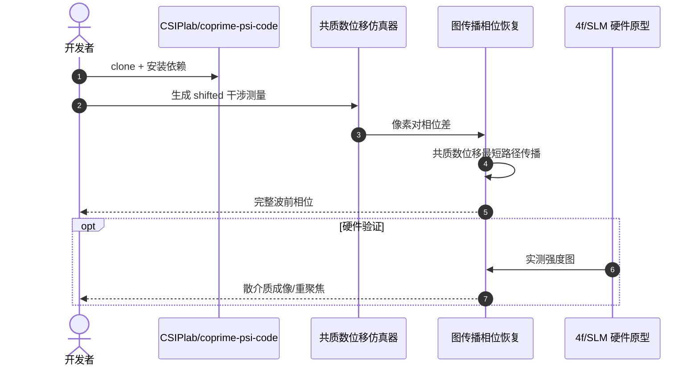

# Coprime-PSI：Provable and Robust Wavefront Sensing via Self-Reference Interferometry

**Coprime-PSI**（*Provable and Robust Wavefront Sensing via Self-Reference Interferometry*；[arXiv:2604.03564](https://arxiv.org/abs/2604.03564)，[项目页](https://csiplab.github.io/coprime-psi/)，[代码](https://github.com/CSIPlab/coprime-psi-code)）由 **加州大学河滨分校（UC Riverside）；卡内基梅隆大学（CMU）** 提出（ECCV 2026 Oral）。

## 一句话定义

**用自参考干涉与共质数位移图传播，在无稳定参考束条件下可证明地恢复完整波前相位。**

## 英文缩写速查

| 缩写 | 英文全称 | 简要说明 |
|------|----------|----------|
| PSI | Phase Shifting Interferometry | 相移干涉；通过多帧强度差恢复相位 |
| WFS | Wavefront Sensing | 波前传感；测量光场相位畸变 |
| SLM | Spatial Light Modulator | 空间光调制器；硬件原型中施加共质数位移 |
| 4f | 4f Optical System | 四透镜傅里叶光学链路；自参考干涉实验平台 |
| GPP | Graph Phase Propagation | 图相位传播；在像素对上沿共质数位移最短路径积分 |

## 为什么重要

- 用自参考干涉与共质数位移图传播，在无稳定参考束条件下可证明地恢复完整波前相位。
- 为机器人感知、重建或空间推理链路提供可引用的 **深度论文实体**，便于与站内方法页交叉。
- 开源状态已按项目页核查：已开源。

## 核心信息

| 项 | 内容 |
|----|------|
| **机构** | 加州大学河滨分校（UC Riverside）；卡内基梅隆大学（CMU） |
| **出处** | ECCV 2026 Oral |
| **论文** | <https://arxiv.org/abs/2604.03564> |
| **项目页** | <https://csiplab.github.io/coprime-psi/> |
| **开源** | **已开源** — 官方仓库 [`csiplab-coprime-psi-code`](https://github.com/CSIPlab/coprime-psi-code)（2026-09-12 项目页核查）。 |

## 核心原理

Coprime-PSI 在**自参考干涉**设定下采集 **8 帧**强度测量：物体波与自身经共质数位移后的副本干涉，无需稳定外参考束。每对像素间的 wrapped 相位差构成图边权；沿**共质数位移**（coprime shifts）构造的最短路径做相位传播，可证明地解缠为完整波前。理论保证在噪声与部分遮挡下仍鲁棒，并可直接用于散介质后的重聚焦与散射成像。

### 流程总览

## 评测与指标

- **测量效率：** 仅需 **8 次**相移干涉帧即可恢复完整波前，相较传统 PSI 显著减少采集次数。
- **可证明鲁棒性：** 共质数位移图传播在理论上保证相位解缠正确性，仿真与硬件实验均验证对噪声的容忍度。
- **ECCV 2026 Oral：** 方法在审稿与口头报告环节获认可，强调 provable recovery 而非纯启发式解缠。
- **应用演示：** 项目页展示**散介质后重聚焦**与**散射介质成像**，证明波前恢复对计算成像管线的直接价值。

## 结论

**Coprime-PSI 以 8 帧自参考干涉 + 共质数图传播，在无外参考束条件下可证明恢复完整波前，适合散介质重聚焦等计算成像场景。**

- 复现从 [`csiplab-coprime-psi-code`](https://github.com/CSIPlab/coprime-psi-code) 的仿真器入手，先验证共质数位移参数再接入实测强度图。
- 硬件链路需对齐 4f/SLM 平台的位移标定；位移误差会直接破坏图传播最短路径假设。
- 8 帧采集顺序与曝光需与 README 一致，否则 wrapped 相位差边权会错位。
- 若目标是机器人视觉而非光学台架，优先评估波前→深度/点云的下游转换成本，勿直接套用表格 PSNR。
- 散介质实验对环境振动敏感；建议在稳定光学平台上复现项目页 demo 再迁移到自定义样本。
- 与 [Stereo Matching Foundation Models](../methods/stereo-matching-foundation-models.md) 等深度感知方法对照，明确 Coprime-PSI 解决的是**物理波前**而非 RGB 深度估计。

## 工程实践

| 项 | 建议 |
|----|------|
| 复现入口 | https://github.com/CSIPlab/coprime-psi-code |
| 权重/数据 | 见项目页 Resources |
| 开源状态 | 已开源 |
| 依赖风险 | 按 README 安装；GPU/数据集门槛以仓库说明为准 |

## 源码运行时序图

运行时节点对齐 `csiplab-coprime-psi-code` README 中的安装与评测脚本。

## 局限与风险

- 论文设定与真实机器人传感器噪声、标定误差、算力预算可能存在差距。
- 无公开代码时，仅能参考方法思想，难以端到端复现。

## 关联页面

- [Object Detection](../methods/object-detection.md)
- [Perception Coordinate Postprocessing](../concepts/perception-coordinate-postprocessing.md)
- [Stereo Matching Foundation Models](../methods/stereo-matching-foundation-models.md)

## 参考来源

- [`coprime_psi_wavefront_sensing_arxiv_2604_03564.md`](../../sources/papers/coprime_psi_wavefront_sensing_arxiv_2604_03564.md)
- [`coprime-psi.md`](../../sources/sites/coprime-psi.md)
- [`csiplab-coprime-psi-code.md`](../../sources/repos/csiplab-coprime-psi-code.md)
- 论文：<https://arxiv.org/abs/2604.03564>

## 推荐继续阅读

- [项目页](https://csiplab.github.io/coprime-psi/)
- [arXiv:2604.03564](https://arxiv.org/abs/2604.03564)

