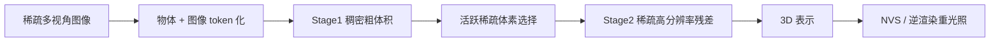
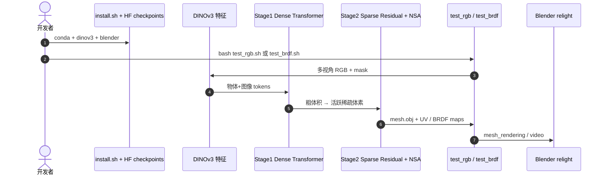

# LSRM：High-Fidelity Object-Centric Reconstruction via Scaled Context Windows

**LSRM**（*Large Sparse Reconstruction Model*；Zhengqin Li、Cheng Zhang、Jakob Engel、Zhao Dong；[arXiv:2604.05182](https://arxiv.org/abs/2604.05182)，[项目页](https://lzqsd.github.io/LSRM.github.io/)，[代码](https://github.com/facebookresearch/Large-Sparse-Reconstruction-Model)）由 **Meta 现实实验室（Meta Reality Labs Research）** 提出（ECCV 2026 Long Oral）。方法用 **原生稀疏注意力（NSA）** 扩展物中心前馈 3D 重建的 transformer 上下文，在稀疏多视角输入下输出可 **NVS** 与 **逆渲染重光照** 的高保真数字孪生。

## 一句话定义

**用原生稀疏注意力把物体与图像 token 上下文窗口扩到 SOTA 的 20×/2× 以上，前馈重建高保真可重光照 3D 资产。**

## 英文缩写速查

| 缩写 | 英文全称 | 简要说明 |
|------|----------|----------|
| LSRM | Large Sparse Reconstruction Model | 本文方法；NSA + 两阶段 coarse-to-fine 物体重建 |
| NSA | Native Sparse Attention | 原生稀疏注意力；动态选择 KV block，支撑 20× 物体 token |
| NVS | Novel View Synthesis | 新视角合成；GSO 等 benchmark |
| PSNR | Peak Signal-to-Noise Ratio | 峰值信噪比；相对 SOTA 提升 >2.4 dB |
| LPIPS | Learned Perceptual Image Patch Similarity | 感知相似度；相对 SOTA 降低 >40% |
| IR | Inverse Rendering | 逆渲染；输出可重光照材质与几何 |

## 为什么重要

- 用原生稀疏注意力把物体与图像 token 上下文窗口扩到 SOTA 的 20×/2× 以上，前馈重建高保真可重光照 3D 资产。
- 为机器人感知、重建或空间推理链路提供可引用的 **深度论文实体**，便于与站内方法页交叉。
- 开源状态已按项目页核查：已开源。

## 核心信息

| 项 | 内容 |
|----|------|
| **机构** | Meta 现实实验室（Meta Reality Labs Research） |
| **作者** | Zhengqin Li、Cheng Zhang、Jakob Engel、Zhao Dong |
| **出处** | ECCV 2026 Long Oral |
| **论文** | <https://arxiv.org/abs/2604.05182> |
| **项目页** | <https://lzqsd.github.io/LSRM.github.io/> |
| **开源** | **已开源** — [`facebookresearch/Large-Sparse-Reconstruction-Model`](https://github.com/facebookresearch/Large-Sparse-Reconstruction-Model)（CC BY-NC 4.0；2026-09-16 项目页复核） |
| **Hugging Face** | <https://huggingface.co/facebook/Large-Sparse-Reconstruction-Model> |
| **硬件验证** | **NVIDIA H200**；稀疏 Triton 内核针对 Tensor Core 优化（工程语境，非联合作者机构） |

## 核心原理

LSRM 用 **NSA** 扩展物体重建上下文：物体 token 达 prior SOTA **20×**，图像 token **>2×**。两阶段 pipeline——Stage1 **Dense Reconstruction Transformer** 出粗体积；Stage2 在 **活跃稀疏体素** 上预测高分辨率残差——并配合 **3D-aware spatial routing**（几何距离路由）与 **block-aware sequence parallelism**（All-gather-KV）。前馈输出支持 NVS 与逆渲染；稀疏模式避免 dense attention 的 O(n²) 瓶颈。

### 流程总览

## 评测与指标

- **上下文规模：** 物体 token 上下文为 prior SOTA 的 **20×**、图像 token **2×+**，使复杂遮挡物体仍保持全局一致性。
- **NVS 质量：** PSNR 相对 SOTA 提升 **>2.4 dB**；LPIPS 降低 **>40%**，感知质量显著改善。
- **逆渲染：** 输出支持 relighting，证明几何+材质分解不仅服务 NVS，也可用于 sim 资产管线。
- **ECCV 2026 Long Oral：** Meta Reality Labs 工作，强调 sparse attention 是可扩展前馈重建的关键 enabler。

## 与其他工作对比

> 下表只做**定位对照**，不做跨设定横比：本页数字来自论文与项目页摘录，与下列各页不共享同一评测协议。

| 对照 | 差异读法 |
|------|----------|
| 稠密注意力的前馈重建模型 | 同为「一次前向出 3D」，卡点在 **O(n²)**：想要更多物体 token 就得砍分辨率或砍视角。LSRM 用原生稀疏注意力把上下文推到 prior SOTA 的 **20×**，换来的代价是显存随活跃体素数走，大物体要么调低体素上限要么分块 |
| 逐场景优化（NeRF / 3DGS 类） | **成本结构相反**：逐场景优化每个物体都要训一遍，但视角够多时保真度上限高；LSRM 前馈出结果，适合批量资产化，视角数低于训练分布时 Stage1 粗体积就会先垮 |
| 单阶段前馈重建 | LSRM 是两阶段（稠密粗体积 → 活跃稀疏体素上的高分辨率残差）；多出来的这一跳正是稀疏性能用上的前提——没有 Stage1 的粗占据，就选不出该细化哪些体素 |
| [Aurora 手部重建](../entities/paper-aurora-hand-reconstruction.md) | 同为重建，但**先验强度不同**：Aurora 吃 hand-specific 结构先验，在手上更省视角；LSRM 不假设类别，靠上下文规模换泛化。类别已知时前者通常更省 |
| [CNN vs ViT 骨干](../comparisons/cnn-vs-vit-backbones.md) | 该页讲骨干选型；LSRM 的增量不在骨干本身，而在**注意力稀疏模式**——同一 ViT 家族内部，改的是能看多远而不是看得多细 |
| [生成式世界模型](../methods/generative-world-models.md) | 输出可作 sim 资产（几何 + 材质分解支持重光照）流入世界模型/仿真管线；但重光照依赖训练域材质分布，域外物体 albedo 可能被编出来，入库前需人工 QC |

## 结论

**LSRM 以 20× 物体 token 稀疏注意力实现前馈高保真物体重建，NVS PSNR +2.4 dB+、LPIPS −40%+，并支持逆渲染重光照。**

- 复现需 conda 环境 + DINOv3 权重；从 HF [`facebook/Large-Sparse-Reconstruction-Model`](https://huggingface.co/facebook/Large-Sparse-Reconstruction-Model) 与 GitHub README 对齐 Stage1/2 checkpoint。
- 输入视角稀疏度影响 Stage1 粗体积；少于训练分布视角数时先增拍视角再跑 Stage2。
- 机器人抓取若只需 mesh，可只导出几何；逆渲染分支增加算力，按任务裁剪。
- 与 [Paper Aurora Hand Reconstruction](../entities/paper-aurora-hand-reconstruction.md) 等物体重建页对照，LSRM 侧重点是**可扩展上下文**而非 hand-specific prior。
- GPU 显存随活跃体素数增长；大物体需调低 sparse voxel 上限或分块重建。
- 重光照结果依赖训练域材质分布；域外物体 albedo 可能 hallucinate，需人工 QC。

## 工程实践

| 项 | 建议 |
|----|------|
| 复现入口 | `conda create -n lsrm python=3.10` → `bash install.sh` |
| 权重 | HF `checkpoints/rgb/` + `checkpoints/brdf/` 布局见 README |
| NVS | `bash test_rgb.sh`（GSO 示例） |
| 逆渲染 | `bash test_brdf.sh`（ORB/DTC）；`test_brdf_video.sh` 重渲染 |
| 依赖 | `../dinov3` gated 权重 + `../blender` headless |
| 算力 | **NVIDIA GPU**；README 在 H200 验证，推理 **<40 GB** |
| 许可证 | **CC BY-NC 4.0** — 商业部署需另议 |

## 源码运行时序图

运行时对齐 README：`test_rgb.sh`（GSO NVS）、`test_brdf.sh`（ORB/DTC 逆渲染）、`test_brdf_video.sh`（无网络重渲染视频）。

## 局限与风险

- **CC BY-NC 4.0** 限制商业直接使用；机器人 sim 资产管线需合规审查。
- DINOv3 权重 gated；Blender 路径需手动配置。

## 关联页面

- [Generative World Models](../methods/generative-world-models.md)
- [Cnn Vs Vit Backbones](../comparisons/cnn-vs-vit-backbones.md)
- [Paper Aurora Hand Reconstruction](../entities/paper-aurora-hand-reconstruction.md)

## 参考来源

- [`lsrm_object_reconstruction_arxiv_2604_05182.md`](../../sources/papers/lsrm_object_reconstruction_arxiv_2604_05182.md)
- [`lsrm-project.md`](../../sources/sites/lsrm-project.md)
- [`facebookresearch-large-sparse-reconstruction-model.md`](../../sources/repos/facebookresearch-large-sparse-reconstruction-model.md)
- 论文：<https://arxiv.org/abs/2604.05182>

## 推荐继续阅读

- [项目页](https://lzqsd.github.io/LSRM.github.io/)
- [arXiv:2604.05182](https://arxiv.org/abs/2604.05182)
- [Hugging Face](https://huggingface.co/facebook/Large-Sparse-Reconstruction-Model)
