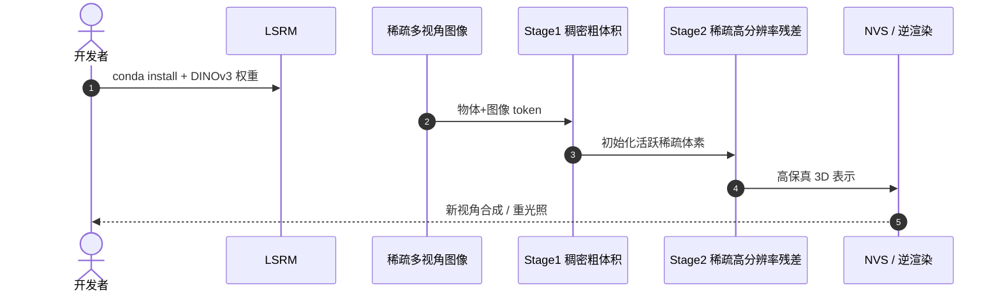

# LSRM：High-Fidelity Object-Centric Reconstruction via Scaled Context Windows

**LSRM**（*LSRM: High-Fidelity Object-Centric Reconstruction via Scaled Context Windows*；[arXiv:2604.05182](https://arxiv.org/abs/2604.05182)，[项目页](https://lzqsd.github.io/LSRM.github.io/)，[代码](https://github.com/facebookresearch/Large-Sparse-Reconstruction-Model)）由 **Meta Reality Labs, Research** 提出（ECCV 2026 Long Oral）。

## 一句话定义

**用原生稀疏注意力把物体与图像 token 上下文窗口扩到 SOTA 的 20×/2× 以上，前馈重建高保真可重光照 3D 资产。**

## 英文缩写速查

| 缩写 | 英文全称 | 简要说明 |
|------|----------|----------|
| LSRM | Large Sparse Reconstruction Model | 本文方法；两阶段稀疏注意力物体重建 |
| NVS | Novel View Synthesis | 新视角合成；重建质量评测维度之一 |
| PSNR | Peak Signal-to-Noise Ratio | 峰值信噪比；相对 SOTA 提升 >2.4 dB |
| LPIPS | Learned Perceptual Image Patch Similarity | 感知相似度；相对 SOTA 降低 >40% |
| IR | Inverse Rendering | 逆渲染；输出可重光照材质与几何 |

## 为什么重要

- 用原生稀疏注意力把物体与图像 token 上下文窗口扩到 SOTA 的 20×/2× 以上，前馈重建高保真可重光照 3D 资产。
- 为机器人感知、重建或空间推理链路提供可引用的 **深度论文实体**，便于与站内方法页交叉。
- 开源状态已按项目页核查：已开源。

## 核心信息

| 项 | 内容 |
|----|------|
| **机构** | Meta Reality Labs, Research |
| **出处** | ECCV 2026 Long Oral |
| **论文** | <https://arxiv.org/abs/2604.05182> |
| **项目页** | <https://lzqsd.github.io/LSRM.github.io/> |
| **开源** | **已开源** — 官方仓库 [`facebookresearch/Large-Sparse-Reconstruction-Model`](https://github.com/facebookresearch/Large-Sparse-Reconstruction-Model)（2026-09-12 项目页核查）。 |
| **Hugging Face** | <https://huggingface.co/facebook/Large-Sparse-Reconstruction-Model> |

## 核心原理

LSRM 用**原生稀疏注意力**扩展物体重建上下文：物体 token 窗口达 SOTA **20×**，图像 token **2×** 以上。两阶段 pipeline——Stage1 稠密粗体积初始化，Stage2 在活跃稀疏体素上做高分辨率残差 refinement——前馈输出可 NVS 与**逆渲染**（重光照）的高保真 3D 资产。稀疏模式避免 dense attention 的 O(n²) 瓶颈。

### 流程总览

## 评测与指标

- **上下文规模：** 物体 token 上下文为 prior SOTA 的 **20×**、图像 token **2×+**，使复杂遮挡物体仍保持全局一致性。
- **NVS 质量：** PSNR 相对 SOTA 提升 **>2.4 dB**；LPIPS 降低 **>40%**，感知质量显著改善。
- **逆渲染：** 输出支持 relighting，证明几何+材质分解不仅服务 NVS，也可用于 sim 资产管线。
- **ECCV 2026 Long Oral：** Meta Reality Labs 工作，强调 sparse attention 是可扩展前馈重建的关键 enabler。

## 结论

**LSRM 以 20× 物体 token 稀疏注意力实现前馈高保真物体重建，NVS PSNR +2.4 dB+、LPIPS −40%+，并支持逆渲染重光照。**

- 复现需 conda 环境 + DINOv3 权重；从 HF [`facebook/Large-Sparse-Reconstruction-Model`](https://huggingface.co/facebook/Large-Sparse-Reconstruction-Model) 与 GitHub README 对齐 Stage1/2 checkpoint。
- 输入视角稀疏度影响 Stage1 粗体积；少于训练分布视角数时先增拍视角再跑 Stage2。
- 机器人抓取若只需 mesh，可只导出几何；逆渲染分支增加算力，按任务裁剪。
- 与 [Paper Aurora Hand Reconstruction](../entities/paper-aurora-hand-reconstruction.md) 等物体重建页对照，LSRM 侧重点是**可扩展上下文**而非 hand-specific prior。
- GPU 显存随活跃体素数增长；大物体需调低 sparse voxel 上限或分块重建。
- 重光照结果依赖训练域材质分布；域外物体 albedo 可能 hallucinate，需人工 QC。

## 工程实践

| 项 | 建议 |
|----|------|
| 复现入口 | https://github.com/facebookresearch/Large-Sparse-Reconstruction-Model |
| 权重/数据 | https://huggingface.co/facebook/Large-Sparse-Reconstruction-Model |
| 开源状态 | 已开源 |
| 依赖风险 | 按 README 安装；GPU/数据集门槛以仓库说明为准 |

## 源码运行时序图

运行时节点对齐 `facebookresearch/Large-Sparse-Reconstruction-Model` README 中的安装与评测脚本。

## 局限与风险

- 论文设定与真实机器人传感器噪声、标定误差、算力预算可能存在差距。
- 权重与训练数据规模较大，边缘设备需评估推理延迟。

## 关联页面

- [Generative World Models](../methods/generative-world-models.md)
- [Cnn Vs Vit Backbones](../comparisons/cnn-vs-vit-backbones.md)
- [Paper Aurora Hand Reconstruction](../entities/paper-aurora-hand-reconstruction.md)

## 参考来源

- [`lsrm_object_reconstruction_arxiv_2604_05182.md`](../../sources/papers/lsrm_object_reconstruction_arxiv_2604_05182.md)
- [`lsrm-project.md`](../../sources/sites/lsrm-project.md)
- [`facebookresearch-large-sparse-reconstruction-model.md`](../../sources/repos/facebookresearch-large-sparse-reconstruction-model.md)
- 论文：<https://arxiv.org/abs/2604.05182>

## 推荐继续阅读

- [项目页](https://lzqsd.github.io/LSRM.github.io/)
- [arXiv:2604.05182](https://arxiv.org/abs/2604.05182)
- [Hugging Face](https://huggingface.co/facebook/Large-Sparse-Reconstruction-Model)
