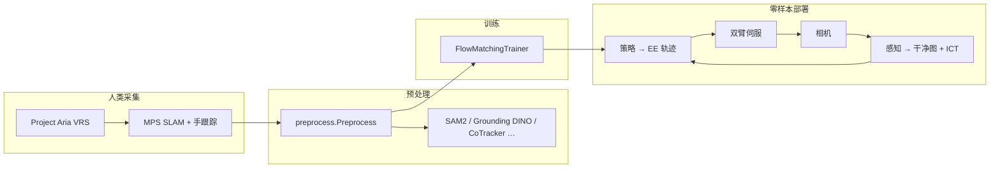
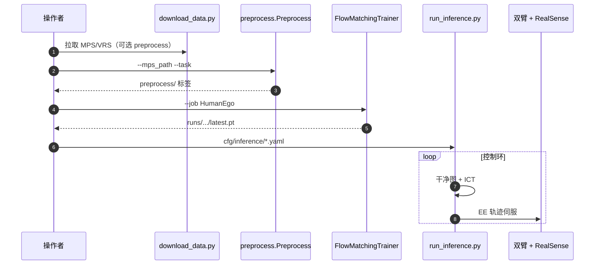

# HumanEgo

**HumanEgo**（[arXiv:2605.24934](https://arxiv.org/abs/2605.24934)，[项目页](https://humanego-ai.github.io/)，[代码](https://github.com/TX-Leo/HumanEgo)，**IROS 2026 WORLDS Workshop 最佳论文**）提出 **仅用少量人类第一人称视频、无需机器人演示** 的 **零样本 human→robot** 学习：把每条人类演示 **提升（lift）** 为 **实体级 hand–object interaction 表征**，训练 **flow-matching** 策略；部署时用 **Interaction-Centric Tokens（ICT）** + **embodiment-agnostic 干净相机图**（真臂 inpaint、虚拟夹爪）闭环输出末端轨迹。

## 一句话定义

**从几十分钟 Aria egocentric 人类视频榨干 HOI 信号，用 ICT + flow matching 直接在真机双臂上零样本伺服，而不收集机器人示教。**

## 英文缩写速查

| 缩写 | 英文全称 | 简要说明 |
|------|----------|----------|
| HOI | Hand–Object Interaction | 手–物交互实体表征 |
| ICT | Interaction-Centric Tokens | 各手/物体 6DoF 实体 token |
| MPS | Machine Perception Services | Project Aria 官方 SLAM + 手部跟踪 |
| VLA | Vision-Language-Action | 与 ego-VLA 清单同分组；本方法偏 flow + ICT |
| CFG | Classifier-Free Guidance | 训练 job `--use_cfg` |

## 为什么重要

- **数据成本轴：** 每任务约 **30 分钟** 人类视频即可（官网/论文叙事）；相对 **机器人 teleop 示教** 与 **大规模 ego 预训练语料**（如 [Gen-HumanEgo](../entities/gen-human-ego-dataset.md) 的 **1848 h** 发布数据）走 **「极少人类分钟数 + 强预处理」** 路线。
- **Embodiment gap：** 显式 **实体级 HOI + 干净图 + 虚拟夹爪**，避免直接把人类像素当机器人动作；与 **仅重定向人手** 或 **纯 VLA 端到端** 可对照阅读。
- **工程可复现：** 2026-06 起 **代码 + HF 数据 + checkpoint + 5 分钟 quick start** 全公开；`inference/` 提供 **Camera / RobotArm / Perception** 模板以便换平台。
- **清单锚点：** 亦收录 [Awesome Egocentric Vision #088](../overview/sun-awesome-ego-technology-map.md)（分组 **Ego-VLA**）。

## 流程总览

## 核心机制（归纳）

| 阶段 | 要点 |
|------|------|
| **采集** | 默认 **Meta Project Aria** + MPS；README 正扩展 Quest / AVP / RealSense / iPhone 等 |
| **预处理** | `python -m preprocess.Preprocess --mps_path … --task …`；任务 YAML 定义 **开放词汇检测 prompt**、跟踪哪只手 |
| **表征** | 实体级 **HOI**；推理环使用 **ICT**（手与物体 6DoF entity） |
| **训练** | `training.FlowMatchingTrainer --use_cfg --job HumanEgo`；hold-out 第 0 条录制做 eval |
| **推理** | `inference/run_inference.py`；HF 预训练 `Leo-TX/HumanEgo/serve_bread/latest.pt` 等 |

## 评测与指标

- **论文 / 清单 Highlights：** 四真实任务平均成功率约 **92.5%**（每任务 **~30 min** 人类视频设定）。
- **发布任务示例：** `serve_bread`、`water_flowers`（仓库配置与 HF 数据对齐）。
- **本页不搬运** 完整 ablation 表；数值与基线以 [PDF](https://arxiv.org/pdf/2605.24934) 为准。

## 与其他工作对比

| 维度 | HumanEgo | 对照 |
|------|----------|------|
| 机器人数据 | **零**机器人示教 | [EgoMimic](./paper-ego-03-egomimic.md)：Aria 人类数据与机器人遥操数据**共训** |
| 人类数据量 | 每任务约 30 分钟 | [Gen-HumanEgo](./gen-human-ego-dataset.md)：1848 h 大规模 ego 语料，供预训练 |
| 表征 | 实体级 HOI + ICT + flow matching | [EgoVLA](./paper-loco-manip-161-161-egovla.md)：端到端 VLA，多模态编码后模仿学习 |

## 结论

**HumanEgo 把「极少 egocentric 人类分钟数」推到可部署机器人策略，关键在实体 HOI + ICT + 干净图，而不是堆机器人 teleop 数据。**

- **真影响指标的是 HOI 提升 + ICT/干净图接口**，不是单纯放大人类像素或端到端 VLA 参数量。
- **每任务 ~30 min 人类视频** 是方法主张的核心约束；完整 HF 数据集用于复现，但 **数据效率叙事** 仍按分钟级采集理解。
- **零样本** 指 **无机器人演示**；换机器人/相机仍需 **手眼标定 + 三类硬件接口** 实现，并非 plug-and-play 二进制。
- **预处理很重**（foundation models + MPS）；预算应算 **GPU 预处理时间**，不是只算训练 epoch。
- **与 Gen-HumanEgo 等大规模 ego 数据正交**：后者供 **预训练/语料**；HumanEgo 供 **分钟级任务适配管线** 参照。
- **开源完整**：优先走官方 **quick start 两录制 smoke test**，再扩 `download_data.py --task all`。

## 工程实践

| 场景 | 命令/入口 |
|------|-----------|
| 环境 | `bash setup.sh`（默认跳过可选 hand 替代与硬件驱动） |
| 快速端到端 | `scripts/download_data.py --task serve_bread --num 2 --input-only` → preprocess → `FlowMatchingTrainer` |
| 跳过预处理 | 下载含 `preprocess/` 的 tar（~4 GB 两录制） |
| 预训练策略 | `huggingface-cli download Leo-TX/HumanEgo --include "serve_bread/*"` |
| 真机 | `SKIP_HARDWARE=0 bash setup.sh` → `inference/run_inference.py` |

### 源码运行时序图

## 局限与风险

- **默认绑定 Aria 生态：** MPS 手跟踪是主线；其他硬件需自证等价预处理质量。
- **预处理算力与时间：** README 示例 ~33 s 视频在 4090 上 preprocess ~20 min。
- **「任何机器人」** 需自行实现 `inference` 抽象；官方示例为 **Trossen 双臂 + RealSense**。
- **许可：** GitHub 标注 **Other**；商用前读 LICENSE 与 HF 条款。

## 关联页面

- [操作任务（Manipulation）](../tasks/manipulation.md)
- [模仿学习](../methods/imitation-learning.md)
- [VLA](../methods/vla.md)
- [Gen-HumanEgo 数据集](../entities/gen-human-ego-dataset.md) — 大规模人类 ego **语料** 对照
- [Awesome Egocentric Vision](../entities/awesome-egocentric-vision.md)

## 参考来源

- [`sources/papers/humanego_arxiv_2605_24934.md`](../../sources/papers/humanego_arxiv_2605_24934.md)
- [`sources/repos/humanego.md`](../../sources/repos/humanego.md)
- [`sources/sites/humanego-ai-github-io.md`](../../sources/sites/humanego-ai-github-io.md)
- [`sources/papers/sun_awesome_ego_2605_24934_humanego-zero-shot-robot-learning-from-m.md`](../../sources/papers/sun_awesome_ego_2605_24934_humanego-zero-shot-robot-learning-from-m.md) — 清单 #088 摘录
- [IROS 2026 九篇获奖盘点（公众号）](../../sources/blogs/wechat_iros_2026_awards_9_papers_2026-10-02.md)

## 推荐继续阅读

- [论文 PDF](https://arxiv.org/pdf/2605.24934)
- [项目页](https://humanego-ai.github.io/)
- [YouTube 视频](https://youtu.be/pdL46diijuY)
- [GitHub 仓库](https://github.com/TX-Leo/HumanEgo)
- [HF 数据集](https://huggingface.co/datasets/Leo-TX/HumanEgo)
