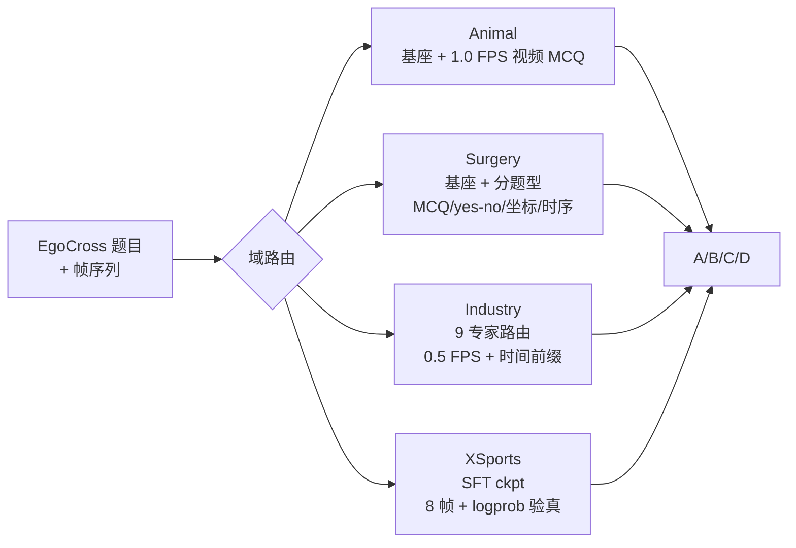
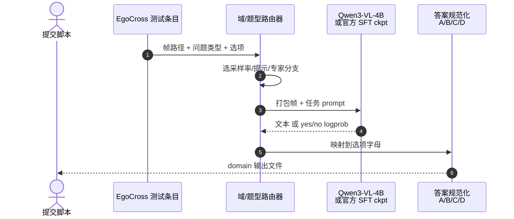

# The Right Inference Strategy Is All You Need

**The Right Inference Strategy Is All You Need: Nearly Training-Free Domain-Wise Inference for EgoCross Challenge**（Wu et al.；[arXiv:2606.00829](https://arxiv.org/abs/2606.00829)；队 **WFJ-KnowinEnvision**）针对 [EgoCross](https://arxiv.org/abs/2606.00829) **源受限赛道**：**固定 Qwen3-VL-4B**，官方任务数据 **仅 20 条**。方法 **不改基座规模**，而为 **手术 / 工业 / 极限运动 / 动物** 四域分别设计 **推理程序**（帧采样、提示模板、logprob 验真、专家路由），overall **66.98%**。

## 一句话定义

**在极小 SFT 预算下，用分域推理接口把冻结 VLM 里已有的视觉–语言知识「接」到 EgoCross 题型上，而不是靠换大模型或大规模微调。**

## 英文缩写速查

| 缩写 | 英文全称 | 简要说明 |
|------|----------|----------|
| VLM | Vision-Language Model | 视觉–语言多模态大模型 |
| VLA | Vision-Language-Action | 视觉–语言–动作策略（机器人侧延伸） |
| MCQ | Multiple-Choice Question | 四选一问答格式 |
| SFT | Supervised Fine-Tuning | 有监督微调（本文仅 2 epoch×20 样本用于两域） |
| Ego | Egocentric Vision | 第一人称可穿戴视角 |

## 为什么重要

- **赛道约束真实：** 不能换 Qwen 更大 checkpoint 时，**推理策略** 成为主战场——对 **数据稀缺 egocentric / 机器人 VLA 部署** 有类比价值。
- **反直觉结论：** 基座并非「完全不会 rare 域」，而是 **任务格式与域偏移** 阻断了知识迁移。
- **可复现：** 代码 [Egocross-Challenge](https://github.com/YUEVII/Egocross-Challenge) 已开源（归档 [egocross-challenge.md](../../sources/repos/egocross-challenge.md)）。

## 核心信息

| 字段 | 内容 |
|------|------|
| **机构** | 香港科技大学广州校区（HKUST-GZ）；Knowin（产业合作） |
| **基座** | Qwen3-VL-4B（赛方锁定） |
| **训练** | Animal/Surgery：**零更新**；XSports/Industry：官方 20 样本 **2 epoch SFT** |
| **开源** | **已开源** — GitHub 推理与提交脚本 |

## 核心机制

### 总览：四域分治

### 分域要点

| 域 | 模型 | 关键接口 |
|----|------|----------|
| **Animal** | 冻结 4B | 原生 **video** 输入 1.0 FPS；识别/交互/时序定位分分支 |
| **Surgery** | 冻结 4B | EgoSurgery 直接 MCQ；CholecTrack20 用 yes/no、坐标回归、**最早起始**检测 |
| **Industry** | 混合 | ENIGMA **9 路确定性专家**（2×SFT 时序 + base 计数/空间/下一交互）；≤10 帧 |
| **XSports** | 2-epoch SFT | 8 帧均匀采样；**option-guided yes/no logprob**；特殊动作用 **pairwise A/B margin** |

### 设计原则

1. **按域歧义选 cue** — 手术重细粒度工具；工业重物体–操作 grounding；XSports 重快动作与时序；动物重低视角交互。
2. **能 frozen 则 frozen** — 仅当 20 样本 SFT 明显补格式缺口时才用官方 ckpt。
3. **答案层稳定** — 贪婪解码 + logprob 验真，减少开放式生成漂移。

## 源码运行时序图

[Egocross-Challenge](https://github.com/YUEVII/Egocross-Challenge) 典型 **提交推理** 路径：

## 工程实践

| 项 | 建议 |
|----|------|
| 帧率 | Animal 1.0 FPS 保时序；Industry 0.5 FPS + **时间前缀** 助定位 |
| 验真 | 可见性/主导工具/选项对比用 **next-token logprob**，别只靠自由生成 |
| 路由 | 工业 ENIGMA 按 **question type** 硬路由，避免单一 prompt 包打天下 |
| XSports | 特殊动作优先 **pairwise margin**，option-guided 作窄域兜底 |
| 预算 | 先 exhaust **推理侧** 再考虑增参；与本赛道设定一致 |

## 实验与评测

**Table 1 — Final accuracy（提交结果）**

| Animal | XSports | Industry | Surgery | **Overall** |
|--------|---------|----------|---------|-------------|
| 77.05% | 63.41% | 64.49% | 65.72% | **66.98%** |

- **解读：** 四域均衡在 **63–77%**；无单域极端拉满 overall，说明 **分域接口** 而非某一 trick 主导。
- **对照意义：** 同一 4B 基座在 **无接口设计** 时大量失败；接口对齐后 recover「已有知识」。

## 结论

**EgoCross 源受限设定下，66.98% 说明：固定小 VLM 的上限Often 被推理格式卡住，而不是参数规模绝对不够。**

1. **分域推理程序** 是主贡献；2-epoch×20 样本 SFT 仅用于 XSports/Industry 必要处。
2. **Animal 77%** 证明 frozen 基座 + 合适 **video 打包** 即可强；**Surgery 66%** 靠分题型验真而非端到端生成。
3. **Industry 路由** 展示 MCQ VQA 在结构化产线上的 **专家分解** 范式。
4. **XSports logprob** 对 **快动作选项** 比纯生成更稳。
5. 下一步：hand-crafted 路由 → **可学习控制器**，但应保留「减轻 VLM 负担」原则。
6. 机器人侧类比：固定 VLA 骨干时，**观测打包 / 语言模板 / 动作离散接口** 与本文同构。

## 局限与风险

- **Hand-crafted 规则** 迁移到新 benchmark 需重写路由。
- **锁定 4B** 结论 **不直接** 外推到可任意 scaling 的设定。
- **Knowin 等产业数据** 可能引入未公开先验；复现以 **开源脚本 + 赛方数据** 为准。
- 未涉及 **闭环控制** — 纯 VQA；与 [VLA](../methods/vla.md) 部署还差动作头与实时性。

## 关联页面

- 列表：[awesome-egocentric-vision.md](../entities/awesome-egocentric-vision.md)
- 地图：[sun-awesome-ego-technology-map.md](../overview/sun-awesome-ego-technology-map.md)

## 参考来源

- [sun_awesome_ego_2606_00829_the-right-inference-strategy-is-all-you.md](../../sources/papers/sun_awesome_ego_2606_00829_the-right-inference-strategy-is-all-you.md)
- [egocross-challenge.md](../../sources/repos/egocross-challenge.md)
- 论文：<https://arxiv.org/abs/2606.00829>

## 推荐继续阅读

- EgoCross benchmark（AAAI 2026）
- 代码：<https://github.com/YUEVII/Egocross-Challenge>
