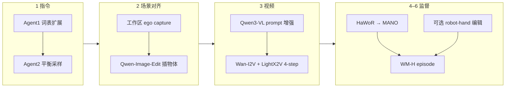
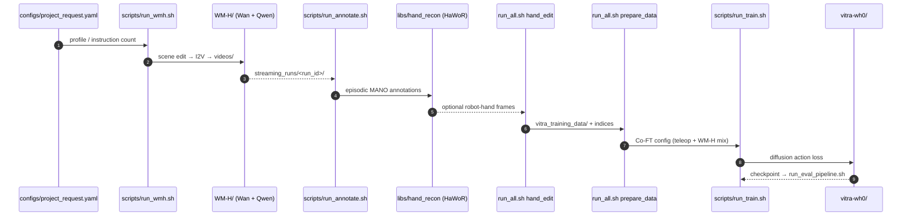

# Wh0：生成式世界模型作灵巧操纵合成数据源

**Wh0**（*Wh0: Generative World Models as Scalable Sources of Egocentric Human Hand Manipulation Data*，[arXiv:2606.22136](https://arxiv.org/abs/2606.22136)，**Under review**；Yangtao Chen 等 · **上海创智学院（Shanghai Innovation Institute）** / **南京大学（NJU）** / **上海交通大学（SJTU）**；[项目页](https://chenyt31.github.io/wh0.github.io/)，[代码](https://github.com/chenyt31/Wh0)）把 **视频世界模型** 当 **可按条件扩缩的人手 ego 操纵工厂**：合成 **WM-H（50k episode）**，再与少量 **Unitree G1 + Inspire** 遥操作数据 **Co-FT** 预训练的 **VITRA 式 VLA**，在 **18 项未见灵巧任务** 上把零样本成功率从 **8.3% 提到 38.9%**。

## 一句话定义

**用世界模型按指令/物体/场景批量造「部署对齐」的第一人称人手操纵视频，抽 MANO 动作当初始化 VLA 的共训监督——算力换数据规模，场景与本体对齐换 sim2real 与 ego→robot 迁移。**

## 英文缩写速查

| 缩写 | 英文全称 | 简要说明 |
|------|----------|----------|
| WM-H | World-Model Human-hand dataset | 本文 50k 合成 ego 人手操纵集 |
| WM-H EA | WM-H with Embodiment Alignment | 稀疏帧人手→机器人手外观编辑变体 |
| VLA | Vision-Language-Action | 视觉–语言–动作策略；骨干 VITRA + PaliGemma |
| MANO | hand Model with Articulated and Non-rigid defOrmations | 统一人手/机器人 retarget 动作空间 |
| Co-FT | Co–Fine-Tuning | 多数据源联合后训练（非单源 FT） |
| I2V | Image-to-Video | Wan-I2V-A14B 从编辑首帧生成操纵视频 |
| HO | Hand–Object Distance | 消融中的手–物 grounding 距离（cm） |

## 为什么重要

- **灵巧数据三角困境有名字：** 遥操作 **对齐部署但贵**；仿真 **可扩但有 sim2real gap**；真人 ego **可扩但与机器人场景/本体双 misalign**。Wh0 用 **可控生成** 同时打 **规模 + 场景对齐 + 本体对齐** 三个旋钮。
- **世界模型角色不同：** 不当动力学仿真器，而当 **人手 HOI 视频生成器**——与 [Cosmos Curator](./cosmos-curator.md) 切滤真视频、[Cosmos Transfer](./cosmos-transfer.md) 换外观是互补工序；本文是 **从零合成新 episode**。
- **解锁人类预训练 priors：** 仅 400 条 robot FT 会 **过拟合已见任务**（VITRA 8.3%）；Co-FT WM-H 让 Ego4D 预训的操纵能力 **在部署相机与工作区上可调用**。
- **开源可跑通：** 官方 [chenyt31/Wh0](https://github.com/chenyt31/Wh0) 含 WM-H 生成 + VITRA 训练；quick 配置可 **10 视频 + 100 step** smoke（需 80GB GPU 级硬件）。

## 方法栈与 WM-H 流程

### WM-H 合成管线

| 阶段 | 关键设计 | 对齐什么 |
|------|----------|----------|
| 指令 | 名词 h-index **201**、形容词 **117** | 操纵词汇覆盖 |
| 场景 | **部署相机**拍机器人工作区背景 | **Scene gap** ↓ |
| 视频 | Wan-I2V + 增强文本 prompt | 手–物交互多样性 |
| 本体 | 稀疏帧 Qwen-Image-Edit → 灵巧手外观 | **Embodiment gap** ↓ |
| 动作 | HaWoR 回归 MANO（+ MegaSAM 相机） | 可训练 102D 动作标签 |

生成成本约 **5.44 GPU-h / 1k 视频**（论文）；50k 量级 **~272 GPU-h** 量级（线性外推）。

### 策略与 Co-FT

- **骨干：** [VITRA](https://github.com/microsoft/VITRA) 预训（Ego4D / Epic / EgoExo4D / SSv2 等）；PaliGemma 编码观测+语言+FoV → **扩散 action decoder**。
- **动作：** 相机系 MANO：\(\Delta t,\Delta r\in\mathbb{R}^3\) + \(\theta_h\in\mathbb{R}^{15\times3}\)（左右手；本文主用右手）；与 VITRA 人类统计 **共用归一化**。
- **Co-FT 混合（每 batch）：** **28% G1 teleop · 68% WM-H · 4% WM-H EA**；数据量 400 : 50k，但 batch **过采样 robot** 保部署约束。

## 源码运行时序图

复现入口：`bash scripts/agent_run.sh --run quick`（仓根目录；见 [`sources/repos/chenyt31_wh0.md`](../../sources/repos/chenyt31_wh0.md)）。

## 实验与评测

| 设置 | 内容 |
|------|------|
| **平台** | [Unitree G1](./unitree-g1.md) + Inspire 灵巧手；头戴 ego 相机；Vision Pro 遥操作 |
| **训练** | 400 条专家 teleop（已见物体/背景）；+ 50k WM-H Co-FT |
| **评测** | **18 任务**（抓/放/工具交互等）× **20 次**；**零样本**（无测试任务 demo） |
| **主指标** | 任务成功率（%） |

### 主结果（Table 1）

| 方法 | 预训练 | 适配 | 策略 | 成功率 ↑ |
|------|--------|------|------|----------|
| π₀.₅ | Robot | Teleop | FT | 7.78±15.6 |
| VITRA | Human | Teleop | FT | 8.3±8.6 |
| VITRA Real Version | Human | Teleop + HOI4D ego | Co-FT | 21.4±23.4 |
| **Wh0** | Human | Teleop + **WM-H** | Co-FT | **38.9±19.8** |

### 消融要点（Table 2）

| 变体 | 任务成功率 | 读法 |
|------|------------|------|
| Teleop only | 8.3% | 少样本 robot FT 基线 |
| w/o scene align. | 20.0% | 有 HOI 模式但工作区/视角漂移 |
| w/o emb. align. | 34.7% | 人手 appearance 下 grounding 好，换 robot 手掉点 |
| WM-H 5k / 25k | 27.8% / 32.5% | **规模** 仍单调增益 |
| Wh0 50k | **38.9%** | 场景 + 本体 + 规模三者齐备 |

## 与其他工作对比

| 数据源 | 规模 | 场景对齐 | 本体对齐 | 本文用法 |
|--------|------|----------|----------|----------|
| 遥操作 | 低（400） | ✓ | ✓ | Co-FT **28%** batch 锚定 |
| 仿真 | 高 | 中（sim2real） | 可配 | 非本文主线 |
| 真人 ego（Ego4D/HOI4D） | 高 | ✗ 日常环境 | ✗ 人手 | VITRA Real **21.4%** |
| **WM-H（Wh0）** | **50k** | ✓ 工作区 capture | ✓ + EA 4% | Co-FT **68%** 多样性 |
| Cosmos / 驾驶 WM | 高 | 任务相关 | 多非灵巧手 | 不同问题设定（见 [Generative World Models](../methods/generative-world-models.md)） |

## 结论

**Wh0 说明：对已有 human-video 预训的 dexterous VLA，瓶颈往往不是再采几百条 teleop，而是缺「部署对齐、可扩规模」的 ego 操纵监督——可控视频 WM + MANO 提取 + 少量真机 Co-FT 比纯 robot FT 或被动 HOI4D 共训更贴部署。**

1. **先对齐再扩规模：** 无场景对齐仍优于纯 teleop（20% vs 8.3%），但满血需 **工作区 capture + 部署相机**；无本体对齐在 robot 手下掉 **~4.2 pp**。
2. **Co-FT 配比是工程核心：** 68% WM-H 提供多样性，28% teleop **按 batch 过采样** 锚定 G1+Inspire；4% EA 稳 appearance shift 下 action feature。
3. **世界模型≠物理仿真：** 生成视频不保证接触动力学真实；成功来自 **视觉–语义–手轨迹监督**，真机仍要 teleop 约束与零样本回归。
4. **对比 HOI4D 真视频：** VITRA Real Version 21.4% < Wh0 38.9% — **合成+对齐** 可优于 **未对齐真人 ego** 共训。
5. **算力账：** ~5.44 GPU-h/k 视频；50k 需百 GPU-hour 级预算 + 多模型权重（Wan/Qwen/HaWoR/VITRA）。
6. **开源路径：** [GitHub](https://github.com/chenyt31/Wh0) 可 smoke；满血 50k 需自建集群与 `weights/` 资产。

## 工程实践

| 项 | 建议 / 仓库默认 |
|----|----------------|
| 硬件 | **≥1× 80GB GPU**（WM-H 生成；多卡 `default` profile 自动 merge） |
| 环境 | Linux + CUDA + **uv**；`torch==2.6.0+cu124`（策略）；Qwen3-VL FP8 用独立 **vLLM**（设 `WMH_PYTHON`） |
| Quick smoke | `bash scripts/agent_run.sh --run quick` → 10 视频 + 100 train steps + 可视化 |
| 从已有 run 续跑 | `paths.input_path` 指向 `streaming_runs/<run_id>` 跳过生成 |
| G1 数据采集 | Unitree **xr_teleoperate**（仓内 thirdparty） |
| 权重 | `scripts/download_weights.sh` → `weights/`（VITRA、HaWoR、Wan、Qwen、MANO 等） |
| Robot-hand 编辑 | 默认每 **4** 帧编辑；训练链 **20%** 概率选 edited clip |

## 局限与风险

- **Under review：** 指标以 arXiv + 项目页为准；peer review 可能修订设定。
- **WM-H 50k 非一键下载：** 需自跑生成管线；成本与 Wan/Qwen 许可、HaWoR 门控相关。
- **平台绑定：** 实验强绑定 **G1 + Inspire + 特定相机**；换手机构需重采 teleop 并重做 scene capture。
- **动作空间：** MANO 102D + retarget 到 robot；复杂接触/力控未建模。
- **生成失败模式：** I2V 幻觉、错误接触、HaWoR 漂移会直接污染标签；需质检（论文用 HO 距离与 ablation，非自动拒采）。
- **与 Cosmos 路线差异：** 本文栈是 **Wan + Qwen + VITRA**；不是 NVIDIA Cosmos Predict/Transfer 配方。

## 关联页面

- [VLA](../methods/vla.md) — 视觉–语言–动作总览
- [Generative World Models](../methods/generative-world-models.md) — 生成式 WM 作数据引擎
- [Wan 视频基础模型](./paper-wan-video.md) — I2V 骨干族
- [Cosmos Curator](./cosmos-curator.md) — 真视频切滤标（对比：本文 **合成** episode）
- [Unitree G1](./unitree-g1.md) — 评测人形平台
- [Manipulation](../tasks/manipulation.md) · [Teleoperation](../tasks/teleoperation.md)
- [Sim2Real](../concepts/sim2real.md) · [Video-as-Simulation](../concepts/video-as-simulation.md)
- [Awesome Egocentric Vision](./awesome-egocentric-vision.md) — 本页亦列于清单 **029/249**

## 参考来源

- [Wh0 论文归档（arXiv:2606.22136）](../../sources/papers/wh0_arxiv_2606_22136.md)
- [Wh0 项目页归档](../../sources/sites/wh0-project.md)
- [chenyt31/Wh0 仓库](../../sources/repos/chenyt31_wh0.md)
- [Awesome Egocentric 策展摘录](../../sources/papers/sun_awesome_ego_2606_22136_wh0-generative-world-models-as-scalable.md)

## 推荐继续阅读

- [Wh0 项目页](https://chenyt31.github.io/wh0.github.io/)
- [GitHub: chenyt31/Wh0](https://github.com/chenyt31/Wh0)
- [VITRA（Microsoft）](https://github.com/microsoft/VITRA)
- [Wan 2.2 技术栈](./paper-wan-video.md)
