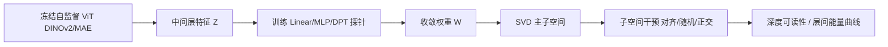
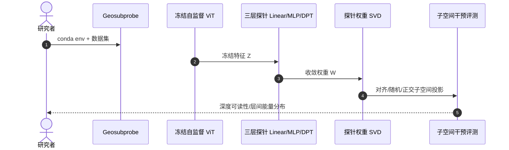

# Geosubprobe：Understanding Geometric Representations in Self-Supervised Vision Transformers via Subspace Intervention

**Geosubprobe**（*Understanding Geometric Representations in Self-Supervised Vision Transformers via Subspace Intervention*；[arXiv:2607.01987](https://arxiv.org/abs/2607.01987)，[项目页](https://zhou-weichen.github.io/Geosubprobe-project/)，[代码](https://github.com/Zhou-Weichen/Geosubprobe)）由 **富山大学（University of Toyama）等** 提出（ECCV 2026）。

## 一句话定义

**对收敛后的线性探针权重做 SVD 子空间干预，揭示 DINOv2/MAE 等自监督 ViT 如何编码可压缩的几何信号。**

## 英文缩写速查

| 缩写 | 英文全称 | 简要说明 |
|------|----------|----------|
| SVD | Singular Value Decomposition | 奇异值分解；对收敛探针权重 W 提取主子空间 |
| DPT | Dense Prediction Transformer | 稠密预测 Transformer 头；MAE 几何信号需 DPT 才可读 |
| ViT | Vision Transformer | 视觉 Transformer；DINOv2/MAE 等自监督骨干 |
| Probe | Linear/MLP/DPT Probe | 线性或 DPT 探针；在冻结特征上预测深度/法线等 |
| MAE | Masked Autoencoder | 掩码自编码器；与 DINOv2 几何编码机制对照 |

## 为什么重要

- 对收敛后的线性探针权重做 SVD 子空间干预，揭示 DINOv2/MAE 等自监督 ViT 如何编码可压缩的几何信号。
- 为机器人感知、重建或空间推理链路提供可引用的 **深度论文实体**，便于与站内方法页交叉。
- 开源状态已按项目页核查：已开源。

## 核心信息

| 项 | 内容 |
|----|------|
| **机构** | 富山大学（University of Toyama）等 |
| **出处** | ECCV 2026 |
| **论文** | <https://arxiv.org/abs/2607.01987> |
| **项目页** | <https://zhou-weichen.github.io/Geosubprobe-project/> |
| **开源** | **已开源** — 官方仓库 [`Zhou-Weichen/Geosubprobe`](https://github.com/Zhou-Weichen/Geosubprobe)（2026-09-12 项目页核查）。 |

## 核心原理

Geosubprobe 对**收敛后的探针权重 W** 做 **SVD**，得到几何相关主子空间；通过对冻结 ViT 特征施加对齐/随机/正交**子空间干预**，量化几何信号的可压缩性与层间分布。DINOv2 上简单 Linear 探针即可达深度可读性 **0.9157**；MAE 则需 **DPT** 头才能释放几何信息，且几何能量在**中间层**峰值而非末层。

### 流程总览

## 评测与指标

- **DINOv2 Linear 可读性：** 深度线性探针可达 **0.9157**，说明几何信息高度可压缩至低维子空间。
- **MAE vs DINOv2：** MAE 几何信号弱于 DINOv2 且依赖 **DPT** 探针；Linear 探针几乎无法读出深度。
- **层间峰值：** 几何相关奇异值能量在**中间层**达到峰值，而非最后一层——对 feature 提取层选择有直接指导。
- **子空间干预：** 对齐子空间保留深度性能，随机/正交投影显著 degrade，验证几何编码的结构性而非噪声。

## 与其他工作对比

> 下表只做**定位对照**，不做跨设定横比：本页数字来自论文与项目页摘录，与下列各页不共享同一评测协议。

| 对照 | 差异读法 |
|------|----------|
| 常规线性探针（probing）研究 | 同为「拿探针读表征里有什么」，但**只看分数**：探针准 = 信息在，探针差 = 信息不在，读不出信息**怎么排布**。Geosubprobe 多做一步——对收敛后的 W 做 SVD 再干预，于是能区分「几何信号弱」和「几何信号被探针头读不动」（MAE 就是后者） |
| 特征可视化 / 注意力图 | 同为解释性工具，但**证据强度不同**：可视化是相关性证据；对齐/随机/正交三种子空间投影是干预性证据——随机与正交投影显著掉点，才说明那组奇异方向真的承载几何而非巧合 |
| [CNN vs ViT 骨干](../comparisons/cnn-vs-vit-backbones.md) | 该页从任务表现选骨干；本页给的是**同一选择的机理侧读法**：DINOv2 与 MAE 的差距不只在分数，还在「要多重的探针头才读得出」，这直接决定下游要不要挂 DPT |
| [立体匹配基础模型](../methods/stereo-matching-foundation-models.md) | **解释对象不同**：那边是端到端匹配算法的精度，本页解释的是冻结骨干**表征的几何性**。本页结论落到工程上是一句话——取中间层而非末层，与匹配算法本身无关 |
| [目标检测](../methods/object-detection.md) | 同样常从冻结 ViT 取特征，但语义任务的最优层与几何任务未必同一层；本页的中间层峰值结论限定在**深度/几何**读出，不要直接套到检测头的取层 |

## 结论

**Geosubprobe 用探针权重 SVD 子空间干预揭示：DINOv2 几何高度可压缩（Linear 0.9157），MAE 需 DPT，且几何信号在中间层最浓。**

- 复现从 [`Zhou-Weichen/Geosubprobe`](https://github.com/Zhou-Weichen/Geosubprobe) 的 probe 训练脚本开始，固定 ViT checkpoint 再跑 SVD。
- 若机器人管线用 DINOv2 特征做 depth/normal，优先取**中间层**而非最后一层 token，与论文层间峰值一致。
- MAE backbone 不能直接套用 DINOv2 Linear depth 头；需 DPT 或换 DINOv2 族模型。
- 子空间干预实验可指导 **feature distillation**：保留 top-k 奇异方向即可维持大部分深度可读性。
- 与 [Stereo Matching Foundation Models](../methods/stereo-matching-foundation-models.md) 对照时，Geosubprobe 解释的是**表征几何性**而非立体匹配算法。
- 探针需在目标数据集上收敛后再 SVD；未收敛 W 的子空间分析无意义。

## 工程实践

| 项 | 建议 |
|----|------|
| 复现入口 | https://github.com/Zhou-Weichen/Geosubprobe |
| 权重/数据 | 见项目页 Resources |
| 开源状态 | 已开源 |
| 依赖风险 | 按 README 安装；GPU/数据集门槛以仓库说明为准 |

## 源码运行时序图

运行时节点对齐 `Zhou-Weichen/Geosubprobe` README 中的安装与评测脚本。

## 局限与风险

- 论文设定与真实机器人传感器噪声、标定误差、算力预算可能存在差距。
- 无公开代码时，仅能参考方法思想，难以端到端复现。

## 关联页面

- [Cnn Vs Vit Backbones](../comparisons/cnn-vs-vit-backbones.md)
- [Object Detection](../methods/object-detection.md)
- [Stereo Matching Foundation Models](../methods/stereo-matching-foundation-models.md)

## 参考来源

- [`geosubprobe_subspace_intervention_arxiv_2607_01987.md`](../../sources/papers/geosubprobe_subspace_intervention_arxiv_2607_01987.md)
- [`geosubprobe-project.md`](../../sources/sites/geosubprobe-project.md)
- [`zhou-weichen-geosubprobe.md`](../../sources/repos/zhou-weichen-geosubprobe.md)
- 论文：<https://arxiv.org/abs/2607.01987>

## 推荐继续阅读

- [项目页](https://zhou-weichen.github.io/Geosubprobe-project/)
- [arXiv:2607.01987](https://arxiv.org/abs/2607.01987)

