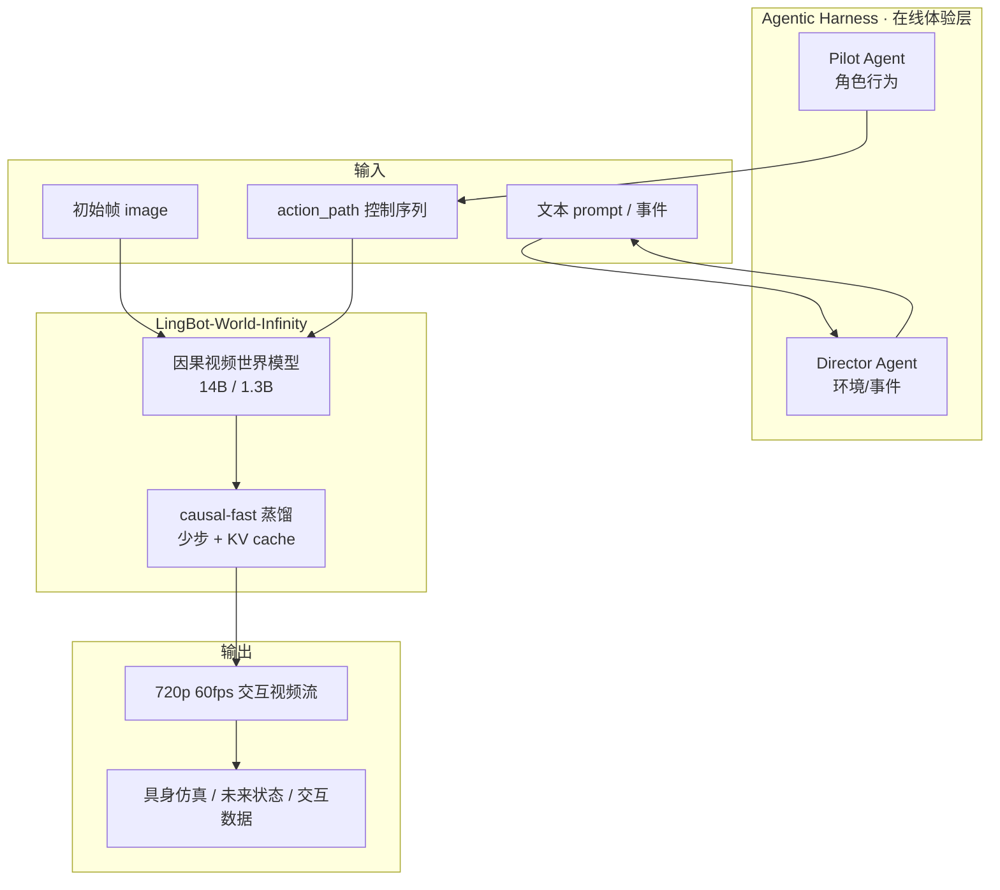
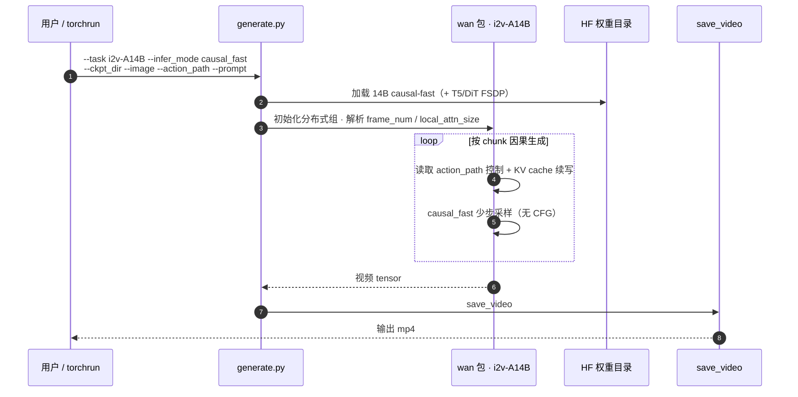

# LingBot-World 2.0 / LingBot-World-Infinity

**LingBot-World 2.0**（亦称 **LingBot-World-Infinity**，*Infinite Worlds with Versatile Interactions*，arXiv:[2607.07534](https://arxiv.org/abs/2607.07534)，[项目页](https://technology.robbyant.com/lingbot-world-v2)，[代码](https://github.com/robbyant/lingbot-world-v2)，[HF 权重集合](https://huggingface.co/collections/robbyant/lingbot-world-v2)）是蚂蚁 **Robbyant** 在 [LingBot-World 1.0](./paper-sa-2601-20540-advancing-open-source-world-models-lingbot-world.md) 上的 **交互式升级**：从「高质量视频世界生成」推进到 **可实时游玩、可多人共 steering、可长时探索而不漂移** 的 **live world simulator**，并引入 **Pilot / Director 双 Agent harness** 把世界建模与角色/事件编排解耦。

> **Awesome 坐标：** 同时收录于 [Awesome World Models](https://github.com/sun254667/awesome-world-models) **079/571**（分组 42 Visual / Video World Models）与 **161/571**（分组 51 General Interactive Frameworks）。

## 一句话定义

**用因果预训练 + causal-fast 蒸馏，把 14B 视频世界模型做成 720p@60fps、亚秒延迟的可玩交互世界，并用 Pilot/Director Agent 与 action-conditioned 动力学把「玩游戏」延伸到具身仿真与交互数据生成。**

## 英文缩写速查

| 缩写 | 英文全称 | 简要说明 |
|------|----------|----------|
| WM | World Model | 预测环境未来状态的生成/动力学模型 |
| I2V | Image-to-Video | 以初始帧 + 条件生成后续视频 |
| CFG | Classifier-Free Guidance | 无分类器引导采样；causal-pretrain 变体使用 |
| KV | Key-Value Cache | 因果分块推理中的注意力缓存 |
| FSDP | Fully Sharded Data Parallel | 多卡 sharded 推理/训练 |
| NC-SA | NonCommercial ShareAlike | CC BY-NC-SA 4.0 非商业许可 |

## 核心信息

| 字段 | 内容 |
|------|------|
| **机构** | 蚂蚁灵波（Robbyant / Ant Group） |
| **arXiv** | [2607.07534](https://arxiv.org/abs/2607.07534)（2026-07-08） |
| **模型** | **14B** 主模型 + **1.3B** 轻量 causal-fast |
| **实时指标（项目页）** | **720p @ 60 fps**；**亚秒级** 控制延迟 |
| **开源（截至 2026-09-10）** | **已开源** — 代码 + 5 项 HF 权重（含 14B pretrain/bid、1.3B fast） |
| **许可** | **CC BY-NC-SA 4.0** |
| **代码基座** | [Wan2.2](https://github.com/Wan-Video/Wan2.2) |

## 为什么重要

- **从「生成短视频」到「可玩世界」：** 1.0 强调高保真开源视频世界；2.0 把 **交互视界、延迟与多用户 steering** 写成一等公民——更接近 [Video as Simulation](../concepts/video-as-simulation.md) 与 [Generative World Models](../methods/generative-world-models.md) 里的 **可部署交互环境** 目标。
- **Agentic harness 范式：** **Pilot** 负责角色行为规划/执行，**Director** 负责随进度注入新环境元素——与纯 end-to-end 视频模型或单一 VLA 不同，把 **世界动力学** 与 **高层事件编排** 分层，便于 gameplay 与 storytelling。
- **具身仿真出口：** 项目页明确从 **egocentric / 合成 / web** 视频学 **action-conditioned 视觉动力学**，对接机器人 **未来状态预测、仿真与交互数据生成**——与 [LingBot-VLA 2.0](./lingbot-vla-v2.md)、[LingBot-Map](../methods/lingbot-map.md) 同属 Robbyant **感知–世界–动作** 栈。
- **开源可复现：** 2026-07-09 首发推理与权重；2026-09-10 README 宣布 **14B 全变体 + 1.3B causal-fast** 齐备；`generate.py` 提供 **KV cache 分块 causal 推理** 路径。

## 四大升级（论文 / README）

| # | 升级 | 要点 |
|---|------|------|
| 1 | **Unbounded Interaction Horizon** | 因果预训练；长时交互质量一致、控制 **visual drift** |
| 2 | **Rapid Response** | 蒸馏 **causal-fast**；驱动 **720p 60 fps** 流 |
| 3 | **Diverse Interactive Elements** | 攻击、射箭、施法、射击等 + **文本驱动事件** |
| 4 | **Agentic Harness** | **Pilot + Director**；多人 **Player/Director** 共 steering |

## 流程总览

## 源码运行时序图

`generate.py`（基于 Wan2.2 `i2v-A14B`）的典型 **causal_fast** 多卡推理路径：

**复现路径：** `git clone` → `pip install -r requirements.txt` + `flash-attn` → `huggingface-cli download robbyant/lingbot-world-v2-14b-causal-fast` → `torchrun ... generate.py` 或 `run_fast.sh`。

## 模型变体与选型

| 权重 | 类型 | 典型用途 |
|------|------|----------|
| `lingbot-world-v2-14b-causal-fast` | causal-fast | **默认实时交互**；4 steps/chunk |
| `lingbot-world-v2-14b-causal-pretrain` | causal-pretrain | 研究/高质量；40 steps + CFG |
| `lingbot-world-v2-14b-bid` | bidirectional | 非因果/双向设定 |
| `lingbot-world-v2-1.3b-causal-fast` | causal-fast 1.3B | **单 GPU** 轻量部署 |
| `...-causal-fast-diffusers` | Diffusers | 生态集成 |

## 评测要点

| 维度 | 公开表述 |
|------|----------|
| **实时性** | 720p **60 fps**；**亚秒级** 控制延迟（项目页） |
| **长时交互** | 小时级探索 **无 visual drift**（项目页 / 摘要） |
| **交互丰富度** | 多样动作 + 文本事件；Pilot/Director 多人 steering |
| **横向对照** | [ABot-World-0](./paper-abot-world-0.md) 使用 WorldRoamBench 等；LingBot 2.0 以 **实时可玩 + Agent harness** 为主打，完整定量表见 arXiv PDF |

## 对比定位

| 对照 | LingBot-World 2.0 差异 |
|------|-------------------------|
| [LingBot-World 1.0](./paper-sa-2601-20540-advancing-open-source-world-models-lingbot-world.md) | 1.0 偏 **开源高保真视频世界**；2.0 加 **实时可玩 + Agent harness + 无界交互** |
| [ABot-World-0](./paper-abot-world-0.md) | 同为交互世界；ABot 强调 **5B 可控性** 与 WorldRoamBench；LingBot 2.0 强调 **60fps 实时 + 双 Agent** |
| Genie 3 / 闭源交互产品 | LingBot 2.0 **权重+推理开源**（NC 许可）；第三方 Reactor/LingGuang 体验 ≠ 官方 WAIC 全能力 demo |
| [LingBot-VLA 2.0](./lingbot-vla-v2.md) | VLA 输出 **关节动作**；World 2.0 输出 **像素世界演化**——可作 VLA 的 **仿真/数据** 上游 |

## 工程实践

| 项 | 建议 |
|----|------|
| **硬件** | 14B causal-fast 示例用 **8×GPU** FSDP；1.3B 面向单卡 |
| **依赖** | torch **≥2.4**；**flash-attn** 必装；跟随 Wan2.2 文档 |
| **输入** | `--image` 初始帧 + `--action_path` 控制目录 + `--prompt` |
| **长序列** | `--frame_num`、`--local_attn_size`、`--sink_size` 控制 KV 窗口 |
| **许可** | **CC BY-NC-SA 4.0** — 商业机器人产品需合规审查 |
| **在线试玩** | [Reactor](https://www.reactor.inc/lingbot-world-v2) / [LingGuang](https://www.lingguang.com/support) 方便体验；复现以 GitHub 为准 |

## 结论

**LingBot-World 2.0 把 Robbyant 世界模型线从「能生成」推到「能玩、能共编、能长时跑」——causal-fast + KV cache 是实时 720p60 的工程核心，Pilot/Director 则是把交互复杂度从单一 diffusion 里拆出来的产品化接口。**

- **实时性来自蒸馏 + 缓存，不是单纯放大 1.0：** causal-fast 变体 + chunk-wise KV 才是 60fps 可玩路径；causal-pretrain 仍偏质量研究配置。
- **Agent harness 是差异化接口：** 多人 Player/Director 共 steering 把「世界模型」变成 **可协作介质**，而不只是单人 prompt 视频。
- **具身叙事要分清输出模态：** 它生成 **像素世界**，不直接输出关节动作；与 LingBot-VLA 组合才是完整 **sim → policy** 栈。
- **开源完整度已可复现推理：** 2026-09-10 起 14B 全变体 + 1.3B 齐备；许可 NC 是量产前必查项。
- **局限诚实：** 项目页承认 **长程世界记忆、物理忠实度、更高效推理** 仍在探索——勿把 demo 级交互等同于物理正确 sim。

## 局限与风险

- **长程记忆与物理：** 官方列出 **true long-term world memory**、**faithful physics** 为 open challenges。
- **第三方 demo 差异：** Reactor/LingGuang 便捷但 README 写明官方 full capability 见 WAIC 2026。
- **非商业许可：** CC BY-NC-SA 4.0 限制产品化。
- **算力：** 14B 实时路径默认多卡；真机边缘部署需 1.3B 或进一步蒸馏。
- **评测口径：** WorldRoamBench 等对照见 [ABot-World-0](./paper-abot-world-0.md)；本页数字以 arXiv / 项目页 / README 为准。

## 参考来源

- [lingbot_world_v2_arxiv_2607_07534.md](../../sources/papers/lingbot_world_v2_arxiv_2607_07534.md) — 本次 ingest 主摘录
- [lingbot-world-v2-technology-robbant.md](../../sources/sites/lingbot-world-v2-technology-robbant.md) — 项目页与开源核查
- [lingbot-world-v2.md](../../sources/repos/lingbot-world-v2.md) — 官方仓库归档
- [sun_awesome_wm_2607_07534_...](../../sources/papers/sun_awesome_wm_2607_07534_infinite-worlds-with-versatile-interacti.md) — Awesome 策展坐标
- 论文 PDF：<https://arxiv.org/pdf/2607.07534>

## 关联页面

- [LingBot-World 1.0（索引）](./paper-sa-2601-20540-advancing-open-source-world-models-lingbot-world.md)
- [LingBot-VLA 2.0](./lingbot-vla-v2.md) — 同团队 VLA 栈
- [LingBot-Map](../methods/lingbot-map.md) — 流式 3D 几何
- [Generative World Models](../methods/generative-world-models.md)
- [World Action Models](../concepts/world-action-models.md)
- [Video as Simulation](../concepts/video-as-simulation.md)
- [Awesome World Models 技术地图](../overview/sun-awesome-wm-technology-map.md)

## 推荐继续阅读

- [项目页（交互 demo）](https://technology.robbyant.com/lingbot-world-v2)
- [GitHub README / Quick Start](https://github.com/robbyant/lingbot-world-v2)
- [HF 权重集合](https://huggingface.co/collections/robbyant/lingbot-world-v2)
