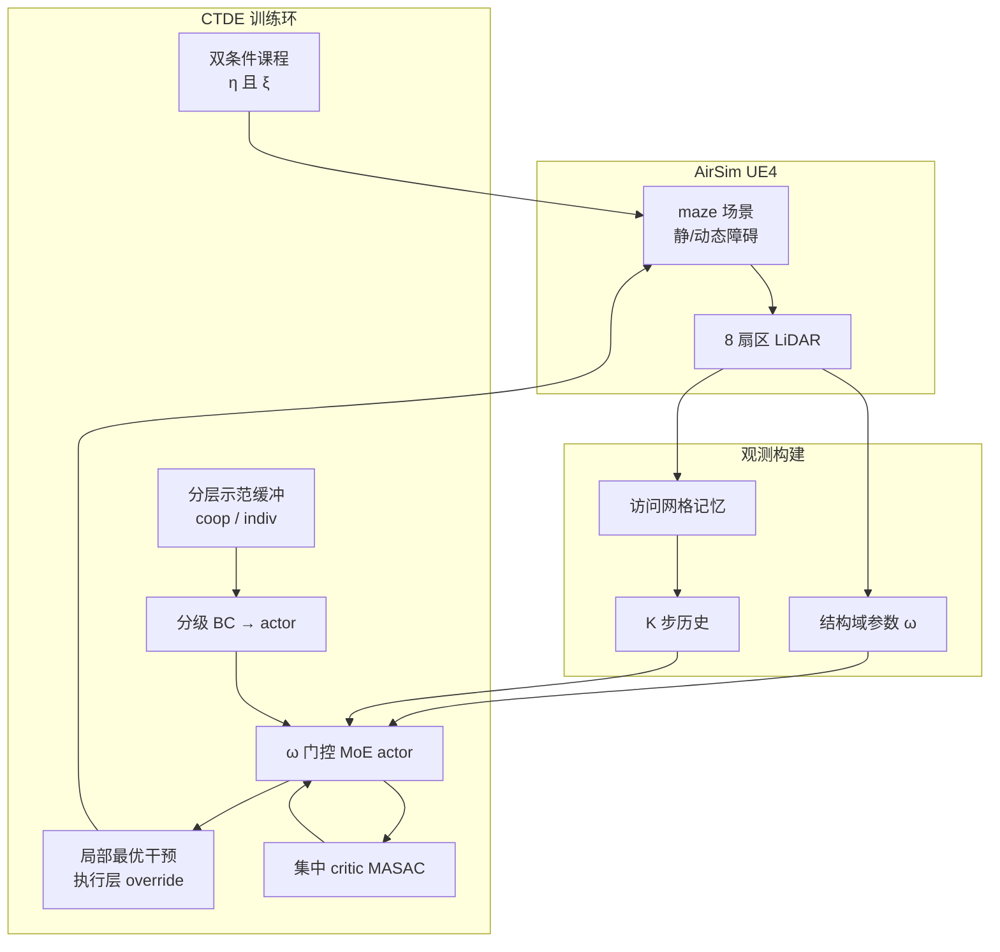

# 系统化 MADRL 多 UAV 复杂环境协作导航

Yu Su 与 Nabil Aouf（**City St George's University of London**）在 [arXiv:2607.25754](https://arxiv.org/abs/2607.25754) 提出面向 **无全局定位、强遮挡迷宫结构** 的 **双 UAV 协作导航** 框架：在 **CTDE + Multi-Agent SAC** 骨干上，用四套 **系统化** 机制同时对付局部最优、稀疏协作信号、训练遗忘与跨场景坐标记忆——并在 **AirSim / UE4** 中相对 **MAPPO** 与 stripped **MASAC** 验证协作成功率与碰撞率。

## 一句话定义

**把「逃出死胡同、学会一起到站、别撞、别只记住训练迷宫」拆成四个可插拔模块，用 LiDAR 局部几何 \(\omega\) 驱动 MoE，而不是再训一张全局地图。**

## 英文缩写速查

| 缩写 | 英文全称 | 简要说明 |
|------|----------|----------|
| UAV | Unmanned Aerial Vehicle | 无人机；本文 3D 速度控制、固定高度 1.8 m |
| MADRL | Multi-Agent Deep Reinforcement Learning | 多智能体深度强化学习总称 |
| CTDE | Centralized Training with Decentralized Execution | 训练用集中 critic，执行 decentralised |
| MASAC | Multi-Agent Soft Actor-Critic | 本文策略梯度骨干（相对 MAPPO 基线） |
| MAPPO | Multi-Agent Proximal Policy Optimization | 论文主对比基线（21 维观测，无 \(\omega\)） |
| MoE | Mixture of Experts | 结构门控多专家 actor，跨场景关键 |
| BC | Behavioural Cloning | 分级克隆损失直接加在 actor 上 |
| η / ξ | Cooperative success rate / Collision rate | 全队到达率 / 碰撞率（含静、动、机间） |

## 为什么重要

- **问题贴近工业/灾备多机巡检：** 复杂结构 + 无 GPS + 多机非平稳，比单机 point-goal 更易陷入 **结构性局部最优** 与 **协作稀疏奖励**。
- **执行层干预 vs 纯 intrinsic reward：** 局部最优模块 **无额外可训练参数**，在诊断触发时 **override 动作**，与仅加探索 bonus 的 map-based / curiosity 路线形成对照。
- **示范按「协作完成度」分层：** 全队成功与部分成功分池 + 场景/起终点配额，BC **直连 actor**，避免 GAIL/LfD 两阶段蒸馏误差——针对 **智能体学习进度失衡**。
- **课程不只看得分：** 阶段推进需 **\(\eta\) 与 \(\xi\) 同时达标**，并回测旧场景 + replay 预填充，显式抑制 **灾难性遗忘** 与 **高风险刷成功率**。
- **泛化对象是可重复的局部几何：** \(\omega\in[0,1]^4\) 由实时 LiDAR 算死胡同/单墙/窄口/开阔，MoE 在 **未见 maze_mix**（含 **1.5 m/s** 横移动态障碍）上 \(\eta=0.75\)，MAPPO 泛化落差 **0.25**。

## 核心信息

| 字段 | 内容 |
|------|------|
| 机构 | City St George's University of London |
| 发表 | arXiv [2607.25754](https://arxiv.org/abs/2607.25754)（2026-07-28） |
| 代码 | **未开源** — 无项目页/GitHub（截至 2026-09-25，步骤 2.5 以 arXiv 为准） |
| 仿真 | Microsoft [AirSim](./airsim.md) + UE4；RTX 6000 Ada 49 GB |
| 配置 | **2 UAV**；8 扇区 LiDAR 12 m；观测 **33 维**（含 4 维 \(\omega\)）；1500 training episodes |
| 场景 | 训练 **maze_05**；零样本测试 **maze_mix**（静+动态障碍，20 ep） |
| 主要基线 | MAPPO；Standard MASAC（移除全部 proposed 机制） |

## 核心原理

### 输入 / 输出

| 侧 | 内容 |
|----|------|
| 感知 | 8 扇区 LiDAR（最小距离 + 帧差）、目标相对位姿、速度、访问记忆 |
| 结构 | 域参数 \(\omega\)：\(\omega_{\mathrm{dead/wall/narrow/open}}\) 由当前 LiDAR 确定性计算 |
| 历史 | 长度 \(K\) 观测序列 → 共享 **LSTM** |
| 动作 | 连续 3D 归一化速度 \([-1,1]^3\) |
| 训练 | 集中 critic + **MoE actor**（\(\omega\) 门控 \(N_e\) 专家）；actor 损失 = SAC + 动态权重 BC |

### 流程总览

### 四块机制（压缩）

1. **局部最优干预：** 网格访问计数 + 方向新颖度 + 回溯/重访惩罚；死胡同时评分切到 **净空优先**；目标被挡时 \(\kappa_t\) 恢复部分距离塑形，避免绕路 **reward vacuum**。
2. **分层示范 + BC：** \(\mathcal{D}_{\mathrm{coop}}\) / 每 agent \(\mathcal{D}^i_{\mathrm{ind}}\)；场景与起终点配额；\(\beta_{\mathrm{coop}}\) 随 coop 池占用线性增大。
3. **双条件课程：** 推进需 \(\eta\geq\tau_\eta\) **且** \(\xi\leq\tau_\xi\)；升阶后 **回测** 旧场景 + **预填充** replay；训练中比例 \(p_{\mathrm{hist}}\) 复习已掌握场景。
4. **结构泛化：** \(\omega\) 进观测并驱动门控；去掉 MoE 时 maze_05 仍可 ~0.7 \(\eta\)，但 **maze_mix 仅 0.25** — 跨布局记忆被 MoE+\(\omega\) 取代。

## 源码运行时序图

**不适用**：截至 **2026-09-25**，arXiv 与 HTML 全文 **未提供** 官方仓库或可运行发布链接，无可对齐的训练/评测入口。若作者后续开源 AirSim 场景与 MASAC 训练脚本，应按 README 补 `sequenceDiagram`（建议节点：AirSim 步进 → 干预 override → replay/demo 采样 → critic/actor 更新）。

## 工程实践

| 项 | 建议 / 论文设定 |
|----|----------------|
| 复现现状 | **代码未发布**；仅能作方法与指标对照 |
| 仿真栈 | [AirSim](./airsim.md) + 自定义 maze；与 [quad-swarm-rl](./quad-swarm-rl.md) / PyBullet 轻量 MARL **环境不同** |
| 对比规划路线 | 需要地图/ESDF 时看 [EGO-Planner Swarm](./ego-planner-swarm.md)、[FLAP](./paper-flap-fov-active-perception-3d-navigation.md) — 本文 **end-to-end RL**，无显式全局规划 |
| 指标读法 | 主看 **\(\eta\)**（全队到达）与 **\(\xi\)**（安全）；报告 **跨场景 \(\eta\) 落差** 与 **均终距** |
| 规模 | 当前仅 **双机**；结论 §V 明确更大编队与 **真机** 为未来工作 |
| Sim2Real | 未验证；部署需 LiDAR 扇区化、速度环与 [Sim2Real](../concepts/sim2real.md) 全链路 |

## 实验与评测

| 设置 | 结果要点（Table IV–V，20 ep） |
|------|-------------------------------|
| maze_05 训练 | 完整框架 \(\eta=0.800\)、\(\xi=0.050\)；MAPPO 0.550 / 0.200；Standard MASAC 0.500 / 0.400 |
| maze_mix 零样本 | 完整框架 \(\eta=0.750\)、\(\xi=0.100\)、Dist. **3.260 m**；MAPPO 0.300 / 0.350（落差 0.25）；MASAC 0.450 / 0.400 |
| 动态障碍 | maze_mix 含 **1.5 m/s** 横向往复障碍；完整框架 **全 episode 检测到动态障碍** 仍保持上述 \(\eta,\xi\) |
| 消融 maze_05 | w/o intervention：长期高 \(\xi\)、\(\eta\) 最终 ~0.40；w/o demo：早期几乎无成功；w/o MoE：maze_05 ~0.70 但 **maze_mix 0.250** |

## 结论

**多 UAV 迷宫协作的真正瓶颈是「稀疏协作信号 + 结构性死锁 + 只记住训练坐标」——本文用执行层脱困、按协作度分层的 BC、双条件课程和 LiDAR 结构 MoE 四条线同时掐断这三类失败。**

- **优先抄模块组合而非单点：** 去掉 **intervention** 或 **demo** 会在前 800 episode 几乎学不动；去掉 **MoE** 单场景仍尚可，但 **未见 maze 泛化崩塌** — 跨场景读表时必看 MoE+\(\omega\)。
- **安全与成功率要一起门禁：** 仅追 \(\eta\) 的课程会让 MAPPO 在 maze_mix 上 **\(\xi=0.35\)**；双条件 + 干预把完整框架压在 **0.10** 碰撞量级。
- **基线选型：** MAPPO 21 维观测 **故意不含 \(\omega\)**（论文视为方法一部分）；与完整框架对比时勿把 \(\omega\) 当作「不公平信息」而单独给 MAPPO，除非做额外消融。
- **工程边界：** **AirSim 仿真、双机、无代码** — 选型时当作 **MADRL 方法论参考**，不能替代 [PX4](./px4-autopilot.md)/规划栈交付；真机前需重写感知扇区、动态障碍检测与速度跟踪。
- **与站内栈关系：** 轻量 MARL 原型见 [quad-swarm-rl](./quad-swarm-rl.md)；地图/优化导航见 [multirotor 栈](../overview/multirotor-simulation-planning-control-stack.md)；多智能体 **社会通信导航** 对照 [CommNav](./paper-commnav.md)。

## 与其他工作对比

| 路线 | 代表 | 与本文分界 |
|------|------|------------|
| 地图 / 轨迹优化 | [EGO-Planner Swarm](./ego-planner-swarm.md)、[FLAP](./paper-flap-fov-active-perception-3d-navigation.md) | 显式 ESDF/FOV 优化；需建图或在线地图，非 end-to-end RL |
| 轻量 MARL Gym | [quad-swarm-rl](./quad-swarm-rl.md)、gym-pybullet-drones | PyBullet、低保真；无 AirSim 迷宫 + 动态障碍设定 |
| 多智能体社会导航 | [CommNav](./paper-commnav.md) | Habitat 找人 + 通信模块；非 UAV LiDAR 几何迷宫 |
| 基线算法 | MAPPO / stripped MASAC | 同 CTDE 族；缺 intervention/demo/课程/MoE 时 \(\eta,\xi\) 与泛化显著变差 |

## 局限与风险

- **未开源、未真机：** 复现成本完全在读者侧；hyperparameter（Table II）需从 PDF 逐项对齐。
- **双机与固定高度：** 团队规模、3D 机动与异构机未验证；动态障碍仅一类横向运动模式。
- **与全局规划分工：** 无显式地图/通信协议；强依赖 onboard LiDAR 与塑形奖励，极端稀疏目标或 GPS-denied 大尺度任务需另设层次规划。
- **MASAC vs MAPPO：** 骨干算法不同；Standard MASAC 消融说明 **机制** 增益大于单纯换算法。

## 关联页面

- [多旋翼仿真—规划—飞控栈总览](../overview/multirotor-simulation-planning-control-stack.md)
- [AirSim](./airsim.md) · [quad-swarm-rl](./quad-swarm-rl.md)
- [强化学习](../methods/reinforcement-learning.md) · [Sim2Real](../concepts/sim2real.md)
- [EGO-Planner Swarm](./ego-planner-swarm.md) · [FLAP](./paper-flap-fov-active-perception-3d-navigation.md) · [CommNav](./paper-commnav.md)

## 参考来源

- [论文摘录（arXiv:2607.25754）](../../sources/papers/cooperative_multi_uav_madrl_arxiv_2607_25754.md)
- Su & Aouf, *Cooperative Multi-UAV Navigation in Complex Environments via Systematic Multi-Agent Deep Reinforcement Learning*, arXiv:2607.25754, 2026. <https://arxiv.org/abs/2607.25754>

## 推荐继续阅读

- [MAPPO 原文（Yu et al., 2021）](https://arxiv.org/abs/2103.01955) — 论文 Table IV 主基线
- [Microsoft AirSim 文档](https://microsoft.github.io/AirSim/) — 仿真与传感器 API
- [EGO-Planner Swarm 仓库](https://github.com/ZJU-FAST-Lab/ego-planner-swarm) — 地图式多机规划对照
