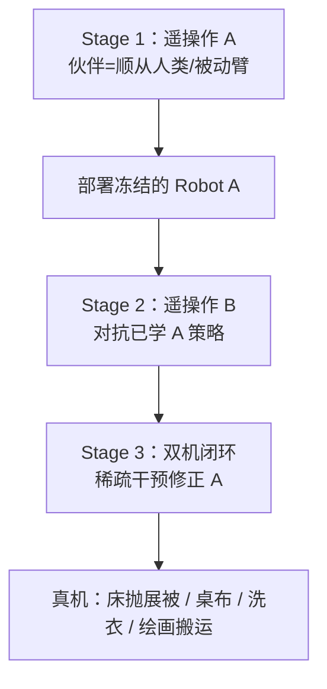

# SAI：序贯非对称模仿学习耦合双机策略

**SAI**（*Sequential Asymmetric Imitation for Learning Coupled Robot Policies*，[arXiv:2606.16490](https://arxiv.org/abs/2606.16490)，[项目页](https://cyc0429.github.io/sai-project-page/)）由 **芝诺机器人（Zeno AI）**、**浙江大学**、**浙江工业大学** 与 **悉尼大学** Yincong Chen、Ranpeng Qiu、Zihao Li 等提出：在**两台双臂移动操作臂**通过共享物体物理耦合的场景下，用**单遥操作者**的三阶段模仿课程学出去中心化协调策略，无需同步双操作员示范或显式机间通信。

## 一句话定义

**先教会 A、再让 B 对抗已部署的 A、最后在协调失败点稀疏修正 A——用伙伴分布逐级变真，而不是靠同步双遥操作或显式协调通道。**

## 英文缩写速查

| 缩写 | 英文全称 | 简要说明 |
|------|----------|----------|
| SAI | Sequential Asymmetric Imitation | 本文三阶段单遥操作课程 |
| IL | Imitation Learning | 从示教学习策略 |
| ACT | Action Chunking Transformer | 动作块 Transformer 骨干之一 |
| DP | Diffusion Policy | 扩散动作生成骨干之一 |
| PCI | Partner-Conditioned Imitation | 基线：条件于伙伴状态的模仿 |
| CPI | Closed-loop Partner Interaction | 闭环伙伴交互（Zeno-1 训练阶段名，概念相关） |

## 为什么重要

- **协作失败常是时序而非局部技能：** 相位失配、伙伴延迟、交互冲突会让两台各自能干的机器人一起失败。
- **采集成本：** 同步双操作员长程示范难扩；SAI 只需**一名**遥操作者，通过课程把伙伴从顺从人类 → 已学 A → 双机闭环逐级替换。
- **去中心化可部署：** 策略不交换消息、伙伴状态、未来动作或 latent；协调从**共享物理世界**涌现。
- **与 Zeno 研究线衔接：** 同作者团队的 [TRACE](./paper-trace-causal-memory.md) 解决**延迟证据记忆**，[Zeno-1](./paper-zeno-1-collaborative-intelligence.md) 把协作推到基础模型尺度。

## 核心信息

| 项 | 内容 |
|----|------|
| **机构** | 芝诺机器人（Zeno AI）；浙江大学（ZJU）；浙江工业大学（ZJUT）；悉尼大学（USYD） |
| **平台** | 两台双臂移动操作臂；刚体 + 可变形共享物体 |
| **策略形式** | 两台独立 visuomotor 策略（ACT / Diffusion 等骨干均可） |
| **开源** | **待发布**（截至 2026-09-15 项目页无 GitHub） |

## 流程总览

## 核心原理

1. **伙伴分布逐级变真：** 顺从支持 → 已部署学习伙伴 → 闭环机-机交互 + 靶向纠错。
2. **三阶段不对称：** 先 bootstrap A，再训 B 对抗 A，最后只稀疏改 A 的协调失误（过早拉扯、让步不足、恢复错误）。
3. **指标不只成功率：** 评测**相位同步**（事件级对齐）与 **yield/wait**（伙伴延迟时的减速等待）。
4. **骨干无关：** ACT 与 Diffusion Policy 上均优于 Independent Imitation，说明增益来自**课程结构**。

## 源码运行时序图

**不适用** — 截至 **2026-09-15** [项目页](https://cyc0429.github.io/sai-project-page/) 与 arXiv **未提供** SAI 训练/部署官方仓库。同期 [corl-trace](../../sources/repos/corl-trace.md) 为 TRACE 记忆模块实现，**不能**替代 SAI 双机课程采集与训练栈。

## 实验与评测

### 真机任务套件

| 任务 | 特点 |
|------|------|
| Bed-throw spreading | 可变形物体；交接、后退、搬运、放置多相位 |
| Tablecloth spreading | 张力与伙伴延迟扰动下的协调抓取展开 |
| Laundry collection | 异步共享工作区：接近、收集、递送 |
| Painting transport | 刚体协作搬运：同步抓举、移动、下放 |

### 关键现象

- **任务成功率：** SAI 在四类任务上均高于 Independent Imitation 与 Partner-Conditioned Imitation（项目页与论文报告一致提升）。
- **伙伴延迟（桌布）：** 暂停 Robot B 时，独立模仿继续拉扯导致布料失稳；SAI **减速、等待、恢复后继续**。
- **骨干兼容：** 在 ACT 与 Diffusion Policy 上均观察到对 Independent Imitation 的稳定优势。

## 结论

**物理耦合的双机协作可以主要靠模仿课程结构学到，而不必依赖同步双遥操作或显式协调机制。**

1. **单遥操作三阶段课程** 是核心贡献：bootstrap A → B 对抗已部署 A → 稀疏干预 A。
2. **去中心化部署** 可行：无消息/伙伴状态/未来动作交换；协调从共享物体与接触涌现。
3. **过程指标与结果指标并重：** 相位同步与 yield/wait 能区分「会做局部动作」与「真会协作」。
4. **伙伴延迟鲁棒性** 在桌布等任务上可目视验证，是协作策略的关键验收项。
5. **骨干无关性** 表明工程上可先选定 ACT/DP，再套 SAI 采集流程。
6. **复现入口未开放** — 入库日无官方代码；需跟踪项目页更新。
7. **与 Zeno-1 对照：** SAI 是**课程/数据侧**答案；Zeno-1 用 CPI 在基础模型尺度做闭环伙伴交互 — 见 [paper-zeno-1-collaborative-intelligence](./paper-zeno-1-collaborative-intelligence.md)。

## 局限与风险

- **待发布代码：** 无法独立复现三阶段采集协议与评测脚本。
- **平台特定：** 两台双臂移动操作臂 + 特定任务集；迁移到其他本体需重新设计课程阶段边界。
- **不含显式通信：** 极端遮挡或长延迟场景下，纯去中心化可能仍不足（对比 Zeno-1 的持久记忆与预测内省）。

## 关联页面

- [Bimanual Manipulation](../tasks/bimanual-manipulation.md)
- [Imitation Learning](../methods/imitation-learning.md)
- [TRACE](./paper-trace-causal-memory.md)
- [Zeno-1](./paper-zeno-1-collaborative-intelligence.md)

## 参考来源

- [SAI 论文摘录](../../sources/papers/sai_sequential_asymmetric_imitation_arxiv_2606_16490.md)
- [SAI 项目页归档](../../sources/sites/sai.md)

## 推荐继续阅读

- [arXiv:2606.16490](https://arxiv.org/abs/2606.16490)
- [SAI 项目页](https://cyc0429.github.io/sai-project-page/)
