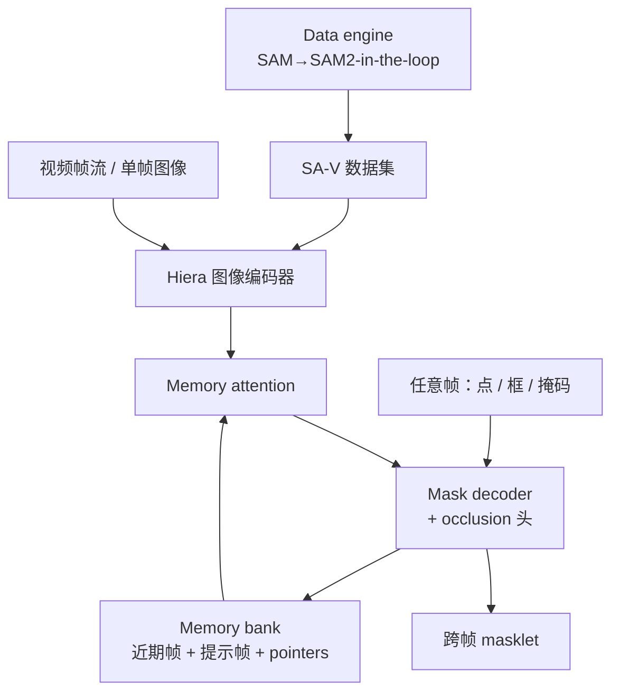
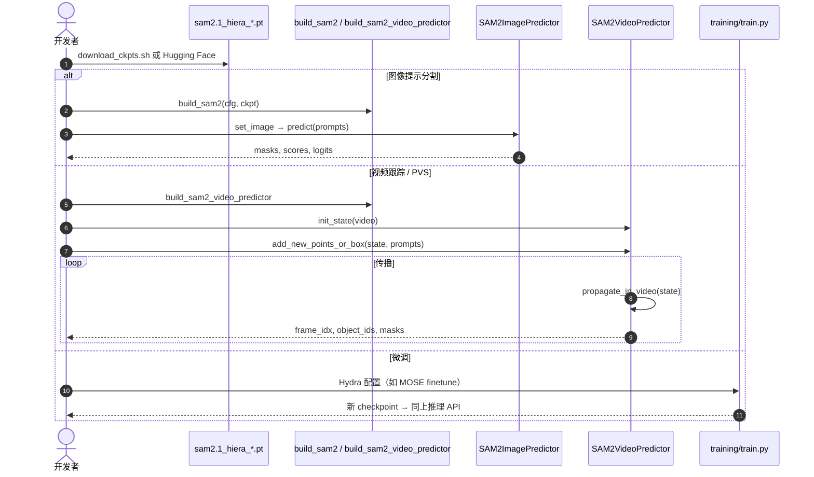

# SAM 2：图像与视频中的 Segment Anything

**SAM 2**（*Segment Anything Model 2*；论文 *SAM 2: Segment Anything in Images and Videos*，[arXiv:2408.00714](https://arxiv.org/abs/2408.00714)，[代码](https://github.com/facebookresearch/sam2)）由 **Meta FAIR** 提出：把 [SAM](./paper-segment-anything.md) 的可提示分割推广到视频（Promptable Visual Segmentation），用流式 memory 在任意帧提示并传播 masklet；同时在静态图上更准、约 **6×** 更快。仓库默认推荐 **SAM 2.1** 权重。

## 一句话定义

**在任意视频帧（或单帧图像）上用点/框/掩码提示目标，借助流式记忆跨帧跟踪与纠错，输出时空 masklet 的统一分割基础模型。**

## 英文缩写速查

| 缩写 | 英文全称 | 简要说明 |
|------|----------|----------|
| SAM 2 | Segment Anything Model 2 | 本文图像+视频统一模型 |
| PVS | Promptable Visual Segmentation | 任意帧可提示、可 refinement 的视频分割任务 |
| SA-V | Segment Anything Video | 50.9K 视频、35.5M masks 的视频分割数据集 |
| VOS | Video Object Segmentation | 首帧 mask 传播的经典设定（PVS 特例） |
| Hiera | Hierarchical Vision Transformer | SAM 2 图像编码器骨干 |
| IoU | Intersection over Union | 掩码质量；多 mask 时用于选传播候选 |
| J&F | Region Jaccard and Boundary F | VOS 常用综合指标 |
| FPS | Frames Per Second | 流式推理吞吐（论文 A100 测速） |

## 为什么重要

- **机器人/具身：** 相机序列上跟踪物体或机体部件 mask，再投影到点云/地图——[OVO](./ovo-semantic-mapping.md) 默认用 SAM 2；[GO2 SAM 流水线](../queries/go2-3d-semantic-mapping-sam-pipeline.md) 的时序侧首选。
- **相对「SAM + 外挂 tracker」：** 统一模型可在后续帧一键纠错，记忆保留目标上下文。
- **可复现：** 权重、推理、**训练/微调**、demo、SA-V 均开放（Apache-2.0 / CC BY 4.0）。

## 核心信息

| 项 | 内容 |
|----|------|
| **机构** | 元宇宙人工智能（Meta AI）/ FAIR |
| **任务** | Promptable Visual Segmentation（含图像特例） |
| **数据** | SA-V：50.9K 视频；Manual+Auto ≈642.6K masklets / 35.5M masks |
| **骨干** | MAE 预训练 Hiera（Tiny / Small / B+ / Large） |
| **开源** | **已开源**（推理 + 训练 + demo）：<https://github.com/facebookresearch/sam2> |
| **项目页** | <https://ai.meta.com/sam2> |
| **权重备注** | 论文主结果对应仓库 **SAM 2.1** 改进 checkpoint |

## 核心原理

### 方法栈

| 模块 | 作用 |
|------|------|
| Image encoder (Hiera) | 每帧一次；层次特征供解码跳连 |
| Memory attention | 当前帧特征 cross-attend 记忆库（近期帧 + 提示帧 + object pointers） |
| Prompt encoder / mask decoder | 与 SAM 同族；支持多 mask；新增目标是否出现（occlusion）头 |
| Memory encoder / bank | 将当前预测写入 FIFO 记忆，供后续帧条件化 |
| 训练 | 联合图像+视频；模拟多帧交互点击/框/掩码 |

### 流程总览

## 源码运行时序图

官方仓 [facebookresearch/sam2](https://github.com/facebookresearch/sam2)（`segment-anything-2` 会 301 到本仓；归档见 [sources/repos/sam2.md](../../sources/repos/sam2.md)）：

- **最短复现路径：** `pip install -e .` → 下载 SAM 2.1 Large → `SAM2ImagePredictor` 或 `build_sam2_video_predictor` notebook。
- **多目标 / 加速：** 见仓库 `SAM2VideoPredictor` 与 `vos_optimized=True`（`torch.compile`）。

## 工程实践

| 项 | 建议 |
|----|------|
| 默认权重 | 新部署用 **SAM 2.1**（与旧 SAM 2 权重不混用代码版本） |
| 图像 vs 视频 API | 静态图用 `SAM2ImagePredictor`；序列跟踪用 video predictor + `init_state` |
| 纠错 | 丢跟踪时在失败帧加正/负点，利用 memory 恢复，不必整段重标 |
| 微调 | `training/` + 自有 DAVIS 风格数据或 SA-V 抽帧；示例配 MOSE |
| 机器人集成 | 输出仍是 2D mask；3D 融合依赖位姿/外参（见 [GO2 Query](../queries/go2-3d-semantic-mapping-sam-pipeline.md)） |
| 安装坑 | 需较新 PyTorch；CUDA extension 编译失败时多数推理仍可用（见 `INSTALL.md`） |

## 实验与评测

- **视频零样本：** 17 个基准；交互设定下约 **3×** 更少交互达更高精度。
- **图像：** 37 个零样本集；SA-23 上 1-click mIoU **58.9**（SAM **58.1**），约 **6×** 更快。
- **VOS：** Hiera-B+ / L 在 A100 约 **43.8 / 30.2 FPS**；SA-V val/test 显著高于既有 VOS 方法。
- **数据引擎：** SAM 2 in-the-loop 标注相对既有 model-assisted 约 **8.4×** 更快（论文宣称）。

## 结论

**SAM 2 把「提示式分割」从单帧变成可纠错的时空能力，并在静态图上同时改进精度与速度。**

1. **需要跨帧一致 mask 时优先 SAM 2** — 不要默认「SAM + 独立 tracker」除非有特殊约束。
2. **任意帧可提示** — 失败帧补一点即可，记忆保留目标上下文。
3. **图像任务也可直接上 SAM 2** — 更快更准，API 与 SAM 相近。
4. **SA-V 覆盖 part/遮挡** — 开放世界与部件级跟踪比传统 VOS 数据更贴近「anything」。
5. **生产用 2.1 权重 + 官方训练入口** — 微调路径已在 `training/` 文档化。
6. **仍无类别名** — 语义标签继续外接检测器/CLIP/VLM。

## 与其他工作对比

| 对照 | 差异读法 |
|------|----------|
| [SAM](./paper-segment-anything.md) | 仅图像；ViT；无官方视频 memory；SAM 2 为其自然推广 |
| 经典 VOS（XMem / Cutie 等） | 多假设首帧 GT mask；SAM 2 面向点击级 PVS + 开放物体/部件 |
| [OVO](./ovo-semantic-mapping.md) | 消费 SAM 2 mask 做在线开放词汇 3D 地图 |
| [SAM 3D Body](./sam-3d-body.md) | 同系 Meta「SAM」品牌下的 3D 人体网格，任务不同 |

## 局限与风险

- **长时剧烈外观变化 / 切镜：** memory 窗口有限，仍可能丢目标，需人工或检测器重提示。
- **无语义：** 与 SAM 相同，类别靠外模块。
- **算力：** 实时多目标、高分辨率仍吃 GPU；边缘部署需蒸馏或更小 Hiera。
- **数据许可：** SA-V 为 CC BY 4.0；商用集成需自审合规。
- **版本碎片：** 社区仍混用 SAM / SAM 2 / 2.1 / MobileSAM；文档与权重要钉死。

## 关联页面

- [Query：机器人视觉感知栈选型闭环](../queries/robot-perception-stack-selection-loop.md) — 本页属**第②层 2D 检测/分割选型**（视频可提示分割，时序一致但缺类别语义）
- [Segment Anything（SAM）](./paper-segment-anything.md) — 静态图前代与 SA-1B
- [GO2 三维语义建图与 SAM 流水线](../queries/go2-3d-semantic-mapping-sam-pipeline.md)
- [OVO](./ovo-semantic-mapping.md) / [DualMap](./dualmap.md) / [OV-SAM3D](./ov-sam3d.md)
- [SAM 3D Body](./sam-3d-body.md) — 相关 Meta 感知栈（3D 人体）

## 参考来源

- [sam2_arxiv_2408_00714.md](../../sources/papers/sam2_arxiv_2408_00714.md) — 论文摘录与开源核查
- [sam2.md](../../sources/repos/sam2.md) — GitHub 仓库归档
- [ai-meta-sam2.md](../../sources/sites/ai-meta-sam2.md) — 项目页归档
- [arXiv:2408.00714](https://arxiv.org/abs/2408.00714) — 原文
- [facebookresearch/sam2](https://github.com/facebookresearch/sam2) — 官方代码

## 推荐继续阅读

- [Meta SAM 2 项目页](https://ai.meta.com/sam2)
- [SAM 2 Demo](https://sam2.metademolab.com/)
- [SA-V 数据集](https://ai.meta.com/datasets/segment-anything-video)
- [SAM 2 训练 README](https://github.com/facebookresearch/sam2/blob/main/training/README.md)
