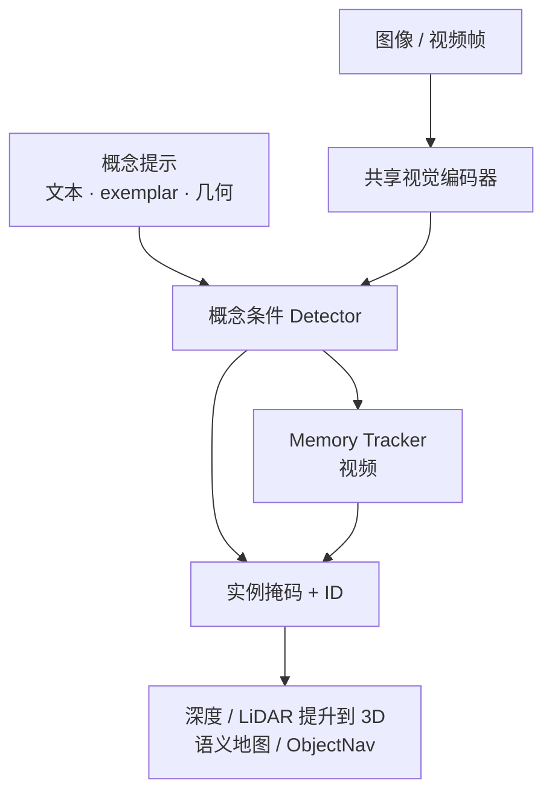
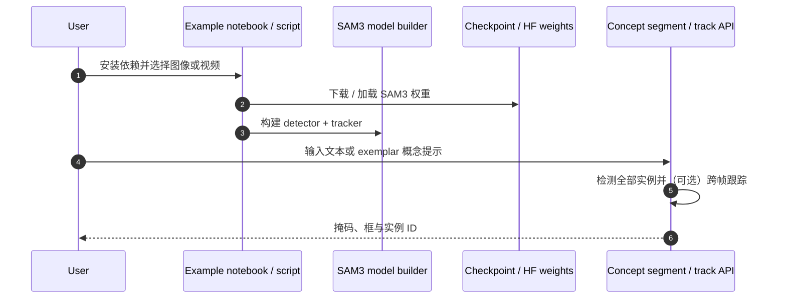

# SAM 3：Segment Anything with Concepts

**SAM 3**（*Segment Anything Model 3*；论文 *SAM 3: Segment Anything with Concepts*，[arXiv:2511.16719](https://arxiv.org/abs/2511.16719)，[代码](https://github.com/facebookresearch/sam3)）由 **Meta** 提出：在 [SAM](./paper-segment-anything.md) / [SAM 2](./paper-sam2.md) 可提示分割之上，增加 **Promptable Concept Segmentation（PCS）**——用短名词短语或图像 exemplar 找出概念的 **全部** 实例。

## 一句话定义

**给定文本概念或 exemplar，在图像/视频中检测、分割并跟踪该概念的所有匹配实例的统一基础模型。**

## 英文缩写速查

| 缩写 | 英文全称 | 简要说明 |
|------|----------|----------|
| SAM 3 | Segment Anything Model 3 | 本文模型 |
| PCS | Promptable Concept Segmentation | 概念提示 → 穷尽实例分割 |
| SA-Co | Segment Anything with Concepts | 配套概念分割基准 / 数据引擎产物 |
| OV | Open-Vocabulary | 开放词汇，不绑固定类别表 |
| VOS | Video Object Segmentation | 视频目标分割；PCS 的时序侧能力 |
| IoU | Intersection over Union | 掩码质量指标 |

## 核心信息

| 项 | 内容 |
|----|------|
| **机构** | 元宇宙人工智能（Meta AI）/ Meta Superintelligence Labs |
| **任务** | Promptable Concept Segmentation（含图像与视频） |
| **提示** | 短名词短语、图像 exemplar、或组合；亦保留点/框等几何提示族 |
| **开源** | **已开源**：<https://github.com/facebookresearch/sam3> |
| **项目入口** | <https://ai.meta.com/sam3/> |
| **与前代** | SAM：静态可提示；SAM 2：视频 masklet；SAM 3：**开放词汇概念穷尽** |

## 为什么重要

- **零样本导航前端：** 课程与工程常用 **「SAM3 出实例掩码 + BLIP-2 做图文评分」** 支撑开放词汇目标发现（见 [零样本目标导航](../tasks/zero-shot-object-navigation.md)）。
- **相对检测器固定类表：** 文本概念可覆盖训练集未见物体描述，更贴近「去找红色灭火器」类指令。
- **可复现：** 官方推理/微调仓与权重入口公开，便于 Orin/工作站部署选型。

## 核心原理

### 方法栈（归纳）

| 模块 | 作用 |
|------|------|
| 共享视觉骨干 | 图像 detector 与 video tracker 共用表示 |
| 概念条件检测 | 文本/exemplar 条件化，检出全部匹配实例 |
| Presence head | 解耦「是否存在」与「在哪里」，提升开放词汇检测 |
| 记忆式跟踪 | 视频侧继承 SAM 2 族流式记忆与身份保持 |

### 流程总览

## 源码运行时序图

官方仓 [facebookresearch/sam3](https://github.com/facebookresearch/sam3)：

关键复现路径：按仓库 README 完成安装与 checkpoint 下载 → 跑官方 notebook 验证文本概念分割 → 再接到 ROS/导航节点做 2D→3D 提升。

## 工程实践

| 项 | 建议 |
|----|------|
| 与 BLIP-2 分工 | SAM3：哪里有哪些实例；BLIP-2：图文相关性/描述；勿用 BLIP-2 单独当像素级分割器 |
| 机载 | Orin NX 上优先 TensorRT/FP16；概念检测可离板、掩码跟踪机载 |
| 建图 | 掩码需深度/LiDAR 融合；见 [2D→3D 语义提升 Gap](../concepts/2d-to-3d-semantic-lifting-gap.md) |
| 选型 | 只要点选单目标跟视频 → SAM2；要「找出所有椅子」→ SAM3 |

## 实验与评测

- 论文报告在 PCS 设定上相对既有系统约 **2×** 精度增益，并改进前代 SAM 视觉分割能力。
- 发布 **SA-Co** 基准以覆盖远超 COCO/LVIS 规模的概念集（研究页叙述）。

## 结论

SAM 3 把 Segment Anything 从「提示一个物体」推进到「提示一个概念并穷尽实例」，是开放词汇具身感知的重要 2D 基元。

- ObjectNav / 语义地图优先用 **概念穷尽**，不要只靠单点 SAM 点击。
- 文本提示质量直接影响召回；含属性的短语（颜色、材质）通常优于单名词。
- 视频跟踪仍要处理遮挡与重识别，不能假设每帧独立检测无损拼接。
- 与 BLIP-2 组合时明确接口：掩码来自 SAM3，语义分数可来自 BLIP-2/VLM。
- 部署前用目标域小样本测「概念漂移」（实验室家具 vs 家庭杂乱）。

## 局限与风险

- **不是 3D 模型：** 不输出度量网格；提升误差见 2D→3D Gap 页。
- **延迟：** 全概念穷尽比单目标 SAM2 更重，需按任务裁剪提示集。
- **与 SAM 3D Body 区分：** [SAM 3D Body](./sam-3d-body.md) 是人体网格，不是本 PCS 模型。

## 与其他工作对比

| 工作 | 相对 SAM 3 |
|------|------------|
| [SAM](./paper-segment-anything.md) | 静态可提示单/少目标；无开放词汇概念穷尽 |
| [SAM 2](./paper-sam2.md) | 视频 masklet 跟踪强；概念级「找出所有 X」仍弱于 SAM 3 |
| [OV-SAM3D](./ov-sam3d.md) | 走向 3D 开放词汇分割；SAM 3 停在 2D/视频 PCS |
| Grounding DINO 等 | 检测框为主；SAM 3 直接出概念级掩码与跟踪 |

## 关联页面

- [SAM](./paper-segment-anything.md) · [SAM 2](./paper-sam2.md)
- [BLIP-2](./paper-blip2.md)
- [零样本目标导航](../tasks/zero-shot-object-navigation.md)
- [GO2 三维语义建图 SAM 流水线](../queries/go2-3d-semantic-mapping-sam-pipeline.md)
- [四足×VLN 实战营总览](../overview/quadruped-vln-embodied-workshop.md)

## 参考来源

- [SAM 3 论文摘录（arXiv:2511.16719）](../../sources/papers/sam3_arxiv_2511_16719.md)
- [SAM 3 代码仓](../../sources/repos/sam3.md)

## 推荐继续阅读

- Meta 研究页：<https://ai.meta.com/research/publications/sam-3-segment-anything-with-concepts/>
- 仓库：<https://github.com/facebookresearch/sam3>
