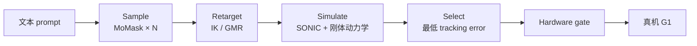

# Sample, Simulate, Select（S³，arXiv:2609.26420）

**Sample, Simulate, Select（S³）**（*Physics-in-the-Loop Text-to-Motion for Humanoids Without Training*，[arXiv:2609.26420](https://arxiv.org/abs/2609.26420)，[项目页](https://raphaelmemmesheimer.github.io/sample-simulate-select/)，波恩大学 AIS）在 **不训练** 的前提下，把 **部署控制器本身** 放进 text-to-motion 闭环：**Sample** 冻结 MoMask 采 N 条 motion → **Simulate** direction-matching IK 重定向 G1 + **SONIC** 全动力学 rollout → **Select** tracking 最优者。

## 一句话定义

用真机同款的 SONIC 物理仿真当 verifier，对 text-to-motion 候选做 best-of-N，量 any-of-N 上限而非再训一个 language-humanoid 模型。

## 英文缩写速查

| 缩写 | 英文全称 | 简要说明 |
|------|----------|----------|
| S³ | Sample, Simulate, Select | 本文三阶段零训练管线 |
| IK | Inverse Kinematics | direction-matching 重定向到 G1 |
| GMR | Generalized Motion Retargeting | 对照 retargeter（与 IK 互补失败） |
| AUROC | Area Under ROC | 运动学风险分类器区分度 |
| MoMask | — | 冻结 text-to-motion 生成器 |

## 为什么重要

- **Training-free 基线：**  recent language-humanoid 多靠训练桥接；S³ 量 **纯 physics-in-the-loop 选择** 能闭合多少 gap。
- **Verifier = 部署栈：** 确定性仿真即 oracle — best-of-N **按构造** 达到 any-of-N 上限；测的是 **上限高度** 与 **不可恢复失败类**。
- **Sim→Real 对齐：** 177 gate 片段真机 **全部站立**；tracking error sim **0.115** vs real **0.114 rad**（r=0.94）。

## 核心信息

| 字段 | 内容 |
|------|------|
| 机构 | 波恩大学（University of Bonn）Autonomous Intelligent Systems |
| 机器人 | Unitree G1 + 预训练 SONIC tracking policy |
| 生成器 | 冻结 MoMask（HumanML3D） |
| 开源 | **未开源** — 项目页 Code disabled（2026-09-24） |

## 流程总览

## 核心原理

- **Any-of-N 上限：** verifier 无偏时，选择 = 「该 prompt 是否存在可 upright 样本」。
- **Kinematic verifier 不足：** AUROC 0.90 的 fall predictor 只恢复约 **25%** S³ 增益 — **同 prompt 内排序** 难于 **总体分类**。
- **不可恢复类：** **降低骨盆**（sit/kneel/deep bend）— 冻结生成器不产生可执行样本；retargeter 消融合并上限 **95.0%** 仍留 ~10/200。

## 源码运行时序图

**不适用** — 无公开代码；复现需自备 MoMask、SONIC、IK/GMR 与 HumanML3D 评测脚本。

## 工程实践

| 项 | 建议 |
|----|------|
| N 的选择 | N=8 时 200-prompt 直立 **89.5%**；曲线见项目页 interactive（基于 1600 rollouts） |
| Retargeter | IK 偏 locomotion；GMR 保 pelvis — **双 retargeter OR** 提 ceiling |
| 安全 | 真机先 gantry 再脱保；177 片段均 standing complete |
| 语义指标 | S³ pick 与 first-sample 在 text–motion evaluator 上相当 — **语义损失主要在 robot 投影** |

## 实验与评测

| 设定 | 无选 | S³ |
|------|------|-----|
| 200 stratified, N=8 upright | 83.5% | **89.5%** |
| Full 4184 prompts | 80.5% | **89.5%** |
| Hardware gate passes | 33 | **85** |
| 真机 gate clips | — | **177/177** standing |

## 结论

**S³ 给出 language→G1 的 **零训练** physics-in-the-loop 上限：选优有效但无法创造生成器不产出的低骨盆行为；kinematic verifier 不能替代 rollout 排序。**

1. **Selection 实现 ceiling** — 89.5%@N=8 是 MoMask×SONIC 栈的上界读法。
2. **Ranking ≠ classifying** — 同 prompt 候选太像，运动学分数不够用。
3. **Pelvis-down 类需改生成器或 retarget** — 不是加大 N 能解。
4. **Sim 可信** — r=0.94 支撑用 SONIC rollout 做 gate。
5. 与 [PredActor](./paper-predactor.md) 对照：端到端 learned joint diffusion vs **无训练** MoMask+SONIC 桥。

## 关联页面

- [SONIC](../methods/sonic-motion-tracking.md)
- [Locomotion](../tasks/locomotion.md)
- [Sim2Real](../concepts/sim2real.md)
- [PredActor](./paper-predactor.md)

## 推荐继续阅读

- [S³ 项目页（交互曲线 + 真机视频）](https://raphaelmemmesheimer.github.io/sample-simulate-select/)
- [arXiv:2609.26420](https://arxiv.org/abs/2609.26420)

## 参考来源

- [S³ 论文归档](../../sources/papers/sample_simulate_select_arxiv_2609_26420.md)
- [S³ 项目页归档](../../sources/sites/sample-simulate-select-memmesheimer.md)
