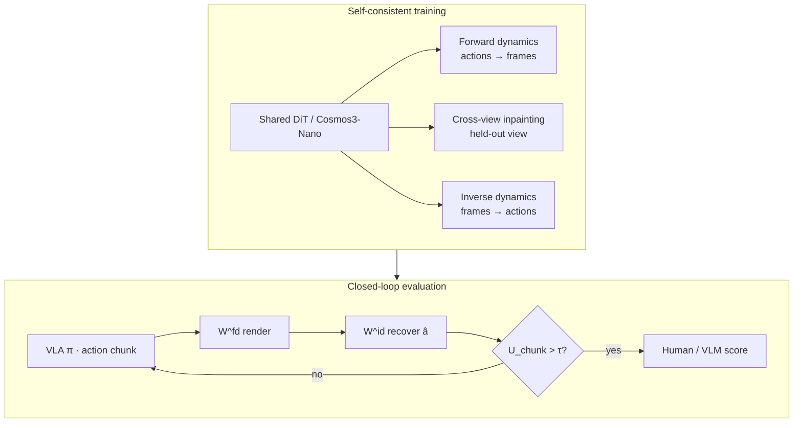

# SC3-Eval（自一致视频生成策略评估 · arXiv:2606.18610）

**SC3-Eval**（*SC3-Eval: Evaluating Robot Foundation Models via Self-Consistent Video Generation*，[arXiv:2606.18610](https://arxiv.org/abs/2606.18610)；Wei-Cheng Tseng 等 · **多伦多大学（University of Toronto）** / **矢量研究所（Vector Institute）** / **英伟达（NVIDIA）** / **物理智能（Physical Intelligence）** / **斯坦福大学（Stanford）** / **加州大学伯克利分校（UC Berkeley）**；[项目页](https://weichengtseng.github.io/sc3-eval/)）把预训练视频基础模型改造成 **动作条件、多视角、可闭环** 的策略评估器：用 **前向–逆向动力学一致性、跨视角一致性、测试时一致性** 三条轴抑制自回归漂移与视角分裂，使想象 rollout 的成功率排序贴近真机。亦收录于 [Awesome World Models](./awesome-world-models.md) **816 Policy Evaluation with World Models**（清单第 **391/571**）。

## 一句话定义

**一套自一致视频生成配方：用前向/逆向联合训练、跨视角 inpainting 与逆动力学不确定性早停，把视频基础模型变成可信的真机 VLA 策略评估器。**

## 英文缩写速查

| 缩写 | 英文全称 | 简要说明 |
|------|----------|----------|
| SC3 | Self-Consistent (×3) | 前向–逆向 / 跨视角 / 测试时 三轴一致性 |
| WM | World Model | 动作条件未来观测生成器（本文作评估沙盒） |
| VLA | Vision-Language-Action | 被评估的多视角语言条件策略（文中 π₀.₅） |
| MMRV | Mean Maximum Rank Violation | 策略两两排序一致性指标（越小越好） |
| FD / ID / CVI | Forward / Inverse Dynamics / Cross-View Inpainting | 共享骨干上的三种联合训练模式 |
| OOD | Out-of-Distribution | 文中 reverse table bussing（目的地对调） |
| UVA | Unified Video Action（族） | 视频–动作统一 token 动力学骨干参考架构 |

## 为什么重要

- **真机评测不可规模化：** 通用操纵策略跨任务/环境评估需要大量物理时间与人工复位；视频 WM 提供可扩展 surrogate。
- **三难同时打：** 相对「只训前向」的 Ctrl-World / IRASim / Cosmos-Predict 2.5，SC3-Eval 显式处理 **漂移、多相机一致性、OOD 策略行为**。
- **不止 aggregate 相关：** 除 Pearson / MMRV 外，还报告 **failure-mode 复现**（language / lifting / placing），便于诊断而非只排序。
- **与 [GigaWorld-1](./paper-gigaworld-1-policy-evaluation.md) 互补：** GigaWorld-1 强调「长时序动作忠实 > 短时视觉逼真」的评估器研究；SC3-Eval 给出一条 **自一致训练 + 测试时早停** 的可操作配方与真机相关数字。

## 核心原理（方法）

### 问题设定

给定策略集 \(\{\pi_i\}\) 与真机成功率 \(R_i\)，构造世界模拟器 \(\mathcal{W}\)，使 \(\mathcal{W}\) 内 rollout 得分 \(R_{\mathcal{W},i}\) 与 \(R_i\) **线性相关且排序一致**（Pearson \(r\) + MMRV）。

### 统一动力学骨干

采用视频–动作共享 token 的统一动力学模型（UVA 族）：同一网络可作 \(\mathcal{W}^{fd}\)（动作→帧）或 \(\mathcal{W}^{id}\)（帧→动作），取决于哪些 token 被遮挡/去噪。实现上自 **Cosmos3-Nano** 预训练权重初始化，损失为 rectified-flow / flow matching。

### 三轴自一致性

| 轴 | 训练或推理 | 作用 |
|----|------------|------|
| **Forward–inverse** | 联合训 FD + ID（共享参数） | 前向帧须能让 ID 恢复命令动作 → 锚定物理可行动作流形，抑制纯前向无法惩罚的漂移 |
| **Cross-view** | 随机遮一视角做 inpainting | 多相机（2×第三人称 + 腕部）互监督，无需显式 memory bank |
| **Test-time** | 推理复用 \(\mathcal{W}^{id}\) | \(U_{\mathrm{chunk}}(t)=\frac{1}{l}\sum\|a_i-\hat a_i\|_2\)，超阈值 \(\tau\) 终止 off-manifold rollout |

模式混合（每实例独立采样）：\(p_{\mathrm{FD}}=0.8\)、\(p_{\mathrm{CVI}}=0.1\)、\(p_{\mathrm{ID}}=0.1\)。

### 流程总览

### 闭环与 horizon decoupling

遵循策略自身的 receding-horizon：策略提议长度 \(l'\) 的动作块，世界模型预测 \(l'\) 帧，但只把前 \(l\) 帧写入观测再 replan（\(l'>l\)）。训练用更长 horizon 贴近预训练先验并暴露更丰富物体运动；部署丢弃多余帧。

## 源码运行时序图

**不适用** — 截至 **2026-08-11** 项目页未挂训练/推理代码或权重；[`WeiChengTseng/sc3-eval`](https://github.com/WeiChengTseng/sc3-eval) 仅为 GitHub Pages 静态站（见 [项目页归档](../../sources/sites/weichengtseng-sc3-eval.md)）。

## 工程实践

| 项 | 实践要点 |
|----|----------|
| 数据 | 自采 **381 h** table bussing；12 类物体；三同步相机 **480×640** @ **20 Hz**（另混 **10 Hz**）；动作 **7D delta-EE**（平移 3 + axis-angle 3 + gripper） |
| 训练 | **32×GB200**，约 **2.2** 墙钟日；AdamW lr \(10^{-4}\)，有效 batch **512**，**24k** step；伪动作增强 \(p=0.5\) + multi-FPS |
| 推理 | 闭环约 **2.3 s / 24-frame chunk**（单 GB200）；远慢于物理仿真 → 适合阶段性 checkpoint 筛选而非每次迭代 |
| 评测协议 | 七个 π₀.₅ checkpoint；每 checkpoint **36–37** 匹配初态；offline（真机动作条件）vs online（策略吃生成帧）；盲评三准则 |
| 选型 | 需要 **真机相关的多视角 VLA 想象评估 + 显式防漂移** 时优先读本文；需要 **已开源可复现** 见 [Ctrl-World](./paper-ctrl-world.md) / [IRASim](./paper-irasim.md)；需要 **评估器研究结论** 见 [GigaWorld-1](./paper-gigaworld-1-policy-evaluation.md) |

## 评测与指标

| 设定 | SC3-Eval | 对照要点（同协议） |
|------|----------|-------------------|
| InD offline \(r\) / MMRV | **0.959** / **0.018** | 优于 Ctrl-World / IRASim / Cosmos-Predict 2.5 |
| InD online | **0.984** / **0.022** | online 可优于 offline（策略可补偿漂移） |
| OOD offline | **0.962** / **0.022** | reverse bussing 未入训练 |
| OOD online | **0.870** / **0.171** | OOD + 闭环最难；仍具竞争力 |
| 汇总闭环（全文） | **\(r=0.929\)**，**MMRV=0.119** | 消融：去 ID→0.842；去 CVI→0.802；去 early-term→0.871；去 horizon decoupling→0.807 |

补充：offline 可报 frame-level PSNR；online 无帧级参照。Failure-mode 复现率在四类 outcome 上领先基线。

## 结论

**SC3-Eval 证明：视频策略评估器的关键不是「画面更真」，而是用前向–逆向与跨视角自一致性把想象钉在可行动作流形上，并用测试时早停截断不可靠轨迹。**

1. **真影响指标是闭环相关与排序** — 全文闭环 Pearson **0.929**、MMRV **0.119**；InD online 甚至 **0.984**，说明闭环不等于必然更差。
2. **三轴互补** — 去 ID / 去 CVI / 去 early-term / 去 horizon decoupling 均显著掉点；跨视角主要救腕部重入场景，ID 主要压 OOD 漂移。
3. **诊断价值高于只排名** — 能复现 language / lifting / placing 失败类别，适合 checkpoint 选型与失败归因。
4. **工程代价清楚** — 训练需大集群 GB200；推理 **2.3 s/chunk**，不能替代实时物理仿真做日常刷分。
5. **开源边界** — 截至入库日 **确认未开源**；复现入口只有论文与项目页视频，选型时勿当可部署工具链。
6. **任务域窄** — 单场景 table bussing ≈ **20 s** 短时程；更长 horizon 预期局部校正失效 + 视觉先验崩坏。

## 局限与风险

- **速度：** 闭环保真代价是比物理仿真慢数个数量级（§5）。
- **时长：** 训练/验证在短时操作；长时程漂移与骨干时序先验耗尽是预期失败模式。
- **数据私有：** 381 h 自采数据与权重未公开 → 外部无法直接复训同分布评估器。
- **不确定性未校准：** \(U_{\mathrm{chunk}}\) 是经验可靠性指示，非校准概率；训练 ID 见真值帧、部署见生成帧，存在分布差。
- **勿把项目页仓当代码：** `WeiChengTseng/sc3-eval` 只是静态站。

## 与相邻工作的分界（对比）

| 对比轴 | SC3-Eval | [Ctrl-World](./paper-ctrl-world.md) | [IRASim](./paper-irasim.md) | [GigaWorld-1](./paper-gigaworld-1-policy-evaluation.md) |
|--------|----------|-------------------------------------|-----------------------------|--------------------------------------------------------|
| **主卖点** | 三轴自一致 + 早停评估 | 多视角 VLA 闭环 + 合成 SFT | 细粒度 trajectory-to-video | 评估器研究 / WMBench |
| **防漂移** | FD↔ID 联合 + \(U_{\mathrm{chunk}}\) | 位姿记忆检索 | Frame-Ada 动作对齐 | 动作忠实指标导向 |
| **跨视角** | 显式 inpainting 监督 | 联合预测 + 记忆 | 任务相关视角 | 多 WM 家族对照 |
| **开源** | **未开源** | **已开源** | **已开源** | 以项目页为准 |
| **额外用途** | 失败模式复现 | 合成轨迹 SFT | 模型规划 | roadmap + WMES |

## 关联页面

- [Generative World Models](../methods/generative-world-models.md) — 生成式 WM 方法谱系
- [Video-as-Simulation](../concepts/video-as-simulation.md) — 视频即仿真
- [world-models-route-03-virtual-sandbox](../overview/world-models-route-03-virtual-sandbox.md) — 虚拟评估沙盒路线
- [评测选型闭环](../queries/embodied-eval-benchmark-selection-loop.md) — WM 作策略评估器的选型层
- [Ctrl-World](./paper-ctrl-world.md) / [IRASim](./paper-irasim.md) — 文中强基线且已开源
- [GigaWorld-1](./paper-gigaworld-1-policy-evaluation.md) — 「动作忠实 > 视觉逼真」评估器结论
- [Masked Visual Actions](./paper-masked-visual-actions.md) / [DriftWorld](./paper-driftworld.md) — 同属虚拟评估，条件与时延不同
- [WorldEcho / WorldSync](./paper-worldecho-worldsync.md) — 测动作跟随本身，不是自一致评估器
- [Awesome World Models 技术地图](../overview/sun-awesome-wm-technology-map.md) — 策展坐标 391/571

## 参考来源

- [SC3-Eval 论文摘录](../../sources/papers/sc3_eval_arxiv_2606_18610.md)
- [SC3-Eval 项目页归档](../../sources/sites/weichengtseng-sc3-eval.md)
- [Awesome WM 策展摘录](../../sources/papers/sun_awesome_wm_2606_18610_sc3-eval-evaluating-robot-foundation-mod.md)

## 推荐继续阅读

- Tseng et al., *SC3-Eval*, arXiv:2606.18610 — <https://arxiv.org/abs/2606.18610>
- 项目页（定性视频与相关图）— <https://weichengtseng.github.io/sc3-eval/>
- 对照已开源基线：[Ctrl-World](https://github.com/Robert-gyj/Ctrl-World)、[IRASim](https://github.com/bytedance/IRASim)
