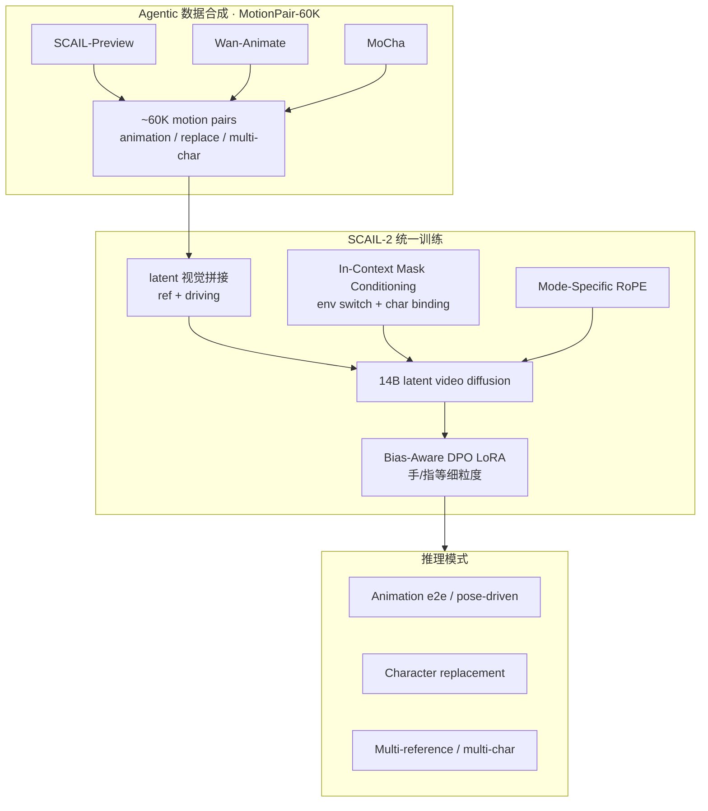
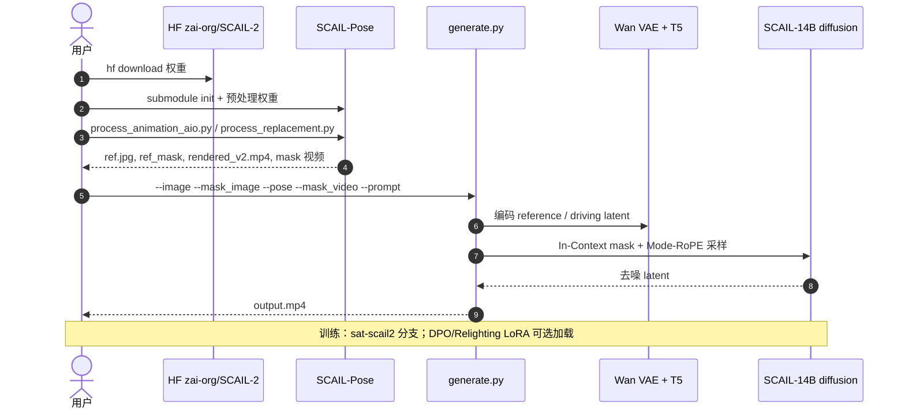

# SCAIL-2：端到端 In-Context 受控角色动画

**SCAIL-2**（*Unifying Controlled Character Animation with End-to-end In-Context Conditioning*，arXiv:2606.10804；[项目页](https://teal024.github.io/SCAIL-2/)，[代码](https://github.com/zai-org/SCAIL-2)，[权重](https://huggingface.co/zai-org/SCAIL-2)）由 **清华大学 / Z.ai（智谱）** 提出：在 **latent 视频扩散** 上构建统一 **motion transfer** 接口，用 **直接视觉 latent 拼接** 替代 skeleton / inpainting 等中间表示，并以 **In-Context Mask Conditioning**、**Mode-Specific RoPE** 与 **Bias-Aware DPO** 统一单角色动画、多角色交互与跨身份替换。

## 英文缩写速查

| 缩写 | 英文全称 | 简要说明 |
|------|----------|----------|
| SCAIL | Studio-Grade Character Animation via In-Context Learning | 同组前作 SCAIL-1 系列名；SCAIL-2 为去中间表示的演进 |
| ICL | In-Context Learning | 本文指 mask + 视觉 latent 的 in-context 条件，非 LLM few-shot |
| RoPE | Rotary Position Embedding | 旋转位置编码；本文按任务模式分配独立 RoPE |
| DPO | Direct Preference Optimization | 直接偏好优化；Bias-Aware DPO 针对合成数据细粒度偏差 |
| VAE | Variational Autoencoder | Wan 系视频 VAE，latent 空间扩散 |
| e2e | End-to-End | 端到端 driving：driving 视频不经 skeleton 渲染 |

## 为什么重要

- **去中间表示的角色动画主线：** 骨架图在遮挡、多角色深度歧义与跨物种 driving 上易丢信息；SCAIL-2 把 reference + driving **视觉 latent** 与 **语义化 mask 通道** 一并送入扩散模型，统一 animation / replacement / multi-character。
- **数据合成 → 涌现能力：** **MotionPair-60K** 由 SCAIL-Preview、Wan-Animate、MoCha 等 teacher 合成，配合 **reverse driving** 训练，报告零样本动物/物体/跨具身 driving 与大相机跟随（OOD 仍可能有 artifact）。
- **对机器人知识库的锚点：** 输出是 **2D/视频角色表演**，不是关节力矩或 WBC；若用于真机，仍需 [Motion Retargeting](../concepts/motion-retargeting.md) 与物理跟踪，边界见 [Character Animation vs Robotics](../concepts/character-animation-vs-robotics.md)。勿与 [机器人 ICL](../concepts/robot-in-context-learning.md)（策略 few-shot）混为一谈。

## 核心信息

| 项 | 内容 |
|----|------|
| **机构** | 清华大学 · Z.ai（智谱） |
| **出处** | arXiv 2025（arXiv:2606.10804） |
| **论文** | <https://arxiv.org/abs/2606.10804> |
| **开源** | **已开源** — 推理（主分支）、训练（`sat-scail2`）、HF 权重（MIT）、SCAIL-Pose 预处理 |
| **前作** | SCAIL（arXiv:2512.05905）— 3D-consistent pose ICL；SCAIL-2 进一步 bypass skeleton |

## 流程总览

## 核心结构 / 机制

### 1）In-Context Mask Conditioning

- **Environment switch：** 黑/白编码背景在某像素是否应可见，替代传统 background inpainting mask 作为硬中间产物。
- **Character binding slots：** 彩色通道编码 **角色区域 ↔ driving 运动** 的对应；多角色时用于 **identity isolation**。
- **工程要点：** 官方 README 强调 animation 模式 **mask 错误会导致行为退化为 replacement**；多 ref 时按颜色分配 ref / background mask。

### 2）Mode-Specific RoPE

- 单模型服务 animation、replacement、multi-character 等模式；为各模式配置 **独立 RoPE**，避免时空注意力路由混淆。

### 3）MotionPair-60K 与 reverse driving

- Teacher 合成异构 pair；**reverse driving** 让模型学习超越 teacher 的 driving 分布。
- **涌现（项目页 / README）：** 跨身份替换、动物 driving、SAM3D-Body mesh 渲染控制、相机大运动跟随等零样本行为。

### 4）Bias-Aware DPO

- 将 pose-driven 合成器的 **细粒度偏差**（尤其手/指）建模为 preference pair；DPO LoRA 已发布，可在 `generate.py` 与 ComfyUI 启用。

## 评测与指标（归纳）

| 场景 | 要点 |
|------|------|
| 单角色动画 | 项目页对比 pose-driven SOTA 与商业服务；X-Dance、Studio-Bench 上复杂 motion / 跨身份 |
| 多角色 | 强调 depth-ambiguous 重叠 skeleton 基线易错；SCAIL-2 端到端 identity isolation |
| 角色替换 | 无 background inpainting 中间步；遮挡、人-物交互、跨身份 |
| 零样本 OOD | 动物、物体 motion、跨具身；artifact 风险需预期 |

详细数值以 [arXiv PDF](https://arxiv.org/abs/2606.10804) 为准；本页不搬运完整实验表。

## 与其他工作对比

| 对照对象 | 差异 |
|----------|------|
| pose-map / skeleton 驱动管线 | 骨架图在遮挡、多角色深度歧义与跨物种 driving 上丢信息；SCAIL-2 直接拼 **视觉 latent**，把中间表示从管线里删掉 |
| background inpainting 式角色替换 | 需要显式 inpainting 中间步；本文用 **In-Context Mask**（environment switch + character binding）在同一前向内完成 |
| SCAIL-1（arXiv:2512.05905） | 前作强调 **3D-consistent pose ICL**，仍保留 pose 中间表示；SCAIL-2 更激进地 bypass 它——复现入口不可混用 |
| [RigMo](./rigmo.md) / [Generative Motion Rig](./generative-motion-rig.md) | 输出层不同：这两者产出 **3D rig / 关键帧资产**，SCAIL-2 产出 **2D 视频表演** |
| 轻量 pose retarget | 延迟与算力低一个量级；SCAIL-2 用 14B 视频扩散换可用上限，动态/多角色场景才值这个成本 |
| 机器人策略栈（[VLA](../methods/vla.md) 等） | **不可比**：本文输出是视频，不是关节力矩或 WBC 指令；真机链路需接 [Motion Retargeting](../concepts/motion-retargeting.md) 与物理跟踪，边界见 [Character Animation vs Robotics](../concepts/character-animation-vs-robotics.md) |

## 结论

**SCAIL-2 把「受控角色动画」从 skeleton/inpainting 管线推进到 latent 视频扩散上的统一 in-context 接口，在开源权重与 ComfyUI 生态下具备强工程可用性，但仍是视频生成而非物理机器人控制。**

- **真影响：** 去掉 skeleton 中间表示后，多角色交互、跨身份替换与 OOD driving（动物/物体）的 **可用上限** 明显高于 pose-map 管线；Mask + Mode-RoPE 是复现关键，不是可选后处理。
- **次要代价：** 依赖 **合成 teacher 数据**（MotionPair-60K 未单独发布）；零样本 OOD 与细部仍可能 artifact；14B + 视频扩散 **算力与延迟** 显著高于轻量 pose retarget。
- **部署读法：** 先 `SCAIL-Pose` 生成 **正确语义 mask** → `generate.py`；replacement 用 **描述生成结果** 的 prompt（非指令式）；真机链路请停在「参考视频/资产」层，勿直接当 WBC 输出。

## 源码运行时序图

官方仓提供完整 **推理 + 预处理** 路径；训练见 `sat-scail2` 分支。

复现路径：`pip install -r requirements.txt` → 下载 HF 权重 → `SCAIL-Pose` 预处理 → `python generate.py --model SCAIL-14B ...`。

## 工程实践（速览）

| 项 | 说明 |
|----|------|
| 环境 | Python 3.10–3.12；`requirements.txt` |
| 权重 | `hf download zai-org/SCAIL-2`；可选 `convert.py` → safetensors |
| 分辨率 | 混合训练；e2e 支持 512p/704p；H/W 需被 32 整除 |
| 预处理 | OpenMMLab/MMPose 环境 + NLF/DWPose 权重；e2e 模式用 SAM3 mask |
| 集成 | ComfyUI 官方 PR；多 reference 实验功能 |
| 许可 | HF 模型 **MIT** |
| 开源边界 | MotionPair-60K **未**单独发布；需按论文 teacher 自建或用小样本 demo |

## 局限与风险

- **非物理、非 3D 可控：** 生成视频可能在接触、遮挡边界出现 temporal artifact；不能替代仿真中的动力学一致 motion。
- **Mask 敏感：** 错误 mask 导致模式混淆；replacement prompt 需描述 **已替换后的画面**，非「把 A 换成 B」式指令（可用 Gemini `prompt_enhancer.py` 辅助）。
- **算力：** 14B 视频扩散 + 长序列；单卡需 `--offload_model` 等技巧。
- **与 SCAIL-1 关系：** SCAIL-1 强调 3D-consistent pose ICL；SCAIL-2 更激进地 bypass pose 中间表示——选型时勿混为同一复现入口。

## 关联页面

- [Character Animation vs Robotics](../concepts/character-animation-vs-robotics.md) — 角色表演生成 vs 物理人形控制
- [Diffusion-based Motion Generation](../methods/diffusion-motion-generation.md) — 扩散运动/视频生成总览
- [机器人 In-Context Learning](../concepts/robot-in-context-learning.md) — 同名概念在机器人策略侧的 taxonomy
- [RigMo](./rigmo.md) — 无标注 mesh rig+motion（3D 资产线）
- [Generative Motion Rig（Disney）](./generative-motion-rig.md) — DCC generative keyframing（闭源对照）
- [SSVAE](./paper-sa-2512-05394-ssvae.md) — 同 `zai-org` 视频生成栈相关 VAE 工作

## 参考来源

- [sources/papers/scail2_arxiv_2606_10804.md](../../sources/papers/scail2_arxiv_2606_10804.md)
- [sources/sites/scail-2-project.md](../../sources/sites/scail-2-project.md)
- [sources/repos/scail-2.md](../../sources/repos/scail-2.md)

## 推荐继续阅读

- [SCAIL-2 项目页](https://teal024.github.io/SCAIL-2/) — 方法动画、benchmark 对比与 BibTeX
- [GitHub zai-org/SCAIL-2](https://github.com/zai-org/SCAIL-2) — 推理 README 与 mask 语义
- [Hugging Face zai-org/SCAIL-2](https://huggingface.co/zai-org/SCAIL-2) — 权重与 LoRA
- [arXiv:2606.10804](https://arxiv.org/abs/2606.10804) — 论文全文
- [SCAIL-1（arXiv:2512.05905）](https://arxiv.org/abs/2512.05905) — 前作 pose ICL 脉络
