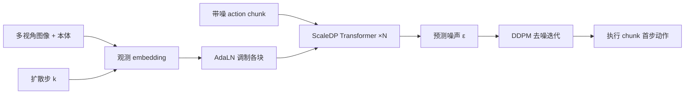

# ScaleDP：十亿参数可扩展扩散 Transformer 操作策略

**ScaleDP**（*Scaling Diffusion Policy in Transformer to 1 Billion Parameters for Robotic Manipulation*，[arXiv:2409.14411](https://arxiv.org/abs/2409.14411)，[项目页](https://scaling-diffusion-policy.github.io/)）由 **朱敏杰、朱易辰、徐志远、李金明、温俊杰、刘宁、程然、沈超敏、彭亚欣、冯菲菲、唐健** 等提出（**美的集团 AI 研究中心**、**华东师范大学**、**上海大学**、**北京人形机器人创新中心 X-Humanoid** 等；* 共一）。方法在 **Diffusion Policy Transformer（DP-T）** 上引入 **AdaLN 观测融合** 与 **非因果动作自注意力（unmasking）**，使 visuomotor 扩散策略可沿 **10M→1B** 参数缩放并在 **MetaWorld** 与 **Franka / 双臂 UR5** 真机任务上优于 DP-T。

## 一句话定义

**不是换扩散公式，而是改 DP-T 怎么注入观测、怎么在 action chunk 里互看 token，深 Transformer 才能像 NLP/ViT 一样越大越好。**

## 英文缩写速查

| 缩写 | 英文全称 | 简要说明 |
|------|----------|----------|
| ScaleDP | Scalable Diffusion Transformer Policy | 本文方法族（Ti/S/B/L/H） |
| DP-T | Diffusion Policy in Transformer | Chi et al. 系 Transformer 扩散策略基线 |
| DP | Diffusion Policy | 用 DDPM 生成动作 chunk 的 IL 框架 |
| AdaLN | Adaptive Layer Normalization | 由 \((k,o)\) 回归 scale/shift 的条件注入 |
| IL | Imitation Learning | 从示教学习；本文为 BC + 扩散 |
| CFG | （本文未强调） | 与 class-conditional 图像 DiT 不同，属机器人动作扩散 |

## 为什么重要

- **Scaling law 进机器人 IL：** 社区期望「更大模型 + 更多数据 → 更好泛化」；原文证明 **vanilla DP-T 加层反而掉点**，ScaleDP 给出可训练的 **1B 级** 扩散策略实例。
- **与图像 DiT 对照：** [DiT（ICCV 2023）](./paper-dit-scalable-diffusion-transformers.md) 在 **类条件图像** 上靠 AdaLN 缩放；ScaleDP 把 **AdaLN + 去 mask** 迁到 **动作 chunk 扩散**，是具身侧的平行叙事。
- **工程警示：** 项目页 **Code 按钮链到 DexVLA**，**不是** 本文仓库——选型时勿误判「已开源可复现」。

## 核心信息

| 项 | 内容 |
|----|------|
| **机构** | 美的集团（Midea Group）；华东师范大学（ECNU）；上海大学；北京人形机器人创新中心（X-Humanoid） |
| **出处** | IEEE **ICRA 2025**（Accepted）；arXiv:2409.14411（2024-09） |
| **设置** | 多视角图像 + 本体（6D 位姿 + 夹爪）；动作 chunk 扩散（与 [Diffusion Policy](../methods/diffusion-policy.md) 一致） |
| **规模** | ScaleDP-Ti / S / B / L / H：约 **10M–1B** 参数（层数、hidden、head 联合缩放） |
| **仿真** | MetaWorld **50** 任务；最大 ScaleDP vs DP-T 平均 **+21.6%**（论文） |
| **真机** | **7** 任务（4 单臂 Franka + 3 双臂 UR5）；项目页 ScaleDP-H 七任务平均成功率 **92.14%** vs DP-T **39.28%** |
| **开源** | **未开源**（步骤 2.5：项目页仅误链 [DexVLA](https://github.com/juruobenruo/DexVLA)，无 ScaleDP 官方仓/权重） |

## 核心原理

1. **问题：** DP-T 用 **cross-attention** 融观测时，深层 **梯度幅度方差大**，MetaWorld 上 8→14 层成功率从 ~80% 降至 ~75%。
2. **AdaLN 块：** 将时间步 \(k\) 与观测 \(o\) 的 embedding 之和回归 **\(\gamma(k,o), \beta(k,o)\)**，对动作 token 做 adaptive layer norm（式子见论文 Eq.2），稳定条件注入。
3. **非因果自注意力：** 去掉 action 序列上的 **因果 mask**，chunk 内各步 token 双向可见，训练时利用 **未来动作监督**，缓解推理只取 **首步动作** 的复合误差。
4. **推理：** 仍为 DDPM 迭代去噪；与 DP 相同从 chunk 取 \(a_t\)。

### 流程总览

## 源码运行时序图

**不适用** — 步骤 2.5 核查：[scaling-diffusion-policy.github.io](https://scaling-diffusion-policy.github.io/) 的 Code 指向第三方 **DexVLA**，截至 **2026-09-28** 无 ScaleDP 官方可运行仓库；复现需对照论文自研或跟踪作者后续发布。

## 评测与指标

### MetaWorld（50 任务，论文）

- 最大 **ScaleDP** 相对 **DP-T** 平均成功率提升约 **21.6%**。
- **Scaling：** 随 ScaleDP-Ti→H 参数量增加，平均成功率单调改善（与 DP-T 「加深反而变差」对照）。

### 真机（项目页表，成功率 %）

| 模型 | Close Laptop | Flip Mug | Stack Cube | Place Tennis | Put Tennis in Bag | Sweep Trash | Bimanual Stack | **Average** |
|------|-------------|----------|------------|--------------|-------------------|-------------|----------------|-------------|
| DP-T | 80 | 70 | 50 | 5 | 20 | 50 | 0 | **39.28±29.08** |
| ScaleDP-H | 95 | 95 | 90 | 70 | 100 | 95 | 100 | **92.14±9.58** |

- 中间规模 **ScaleDP-S/B/L** 随参数量递进（项目页完整表）。
- arXiv 摘要另报单臂/双臂 **相对提升百分比**，与项目页一句话 **+22.5%** 口径可能不同——写报告时以 **PDF 表格** 为准。

## 与其他工作对比

| 对照 | ScaleDP（本文） | DP-T / 原始 Diffusion Policy | [DiT 图像骨干](./paper-dit-scalable-diffusion-transformers.md) |
|------|-----------------|------------------------------|----------------------------------------------------------------|
| 任务 | 机器人 visuomotor IL | 同框架，Transformer 骨干 | ImageNet 类条件 **图像** 生成 |
| 缩放关键 | AdaLN + unmasking | cross-attn 深网不稳定 | AdaLN-Zero + patch ViT |
| 参数级 | **10M–1B** | 扩深/扩头无效或有害 | **Gflops–FID** 缩放 |
| 开源 | **无官方仓** | [real-stanford/diffusion_policy](https://github.com/real-stanford/diffusion_policy) 等生态 | [facebookresearch/DiT](https://github.com/facebookresearch/DiT) |

## 结论

**ScaleDP 证明机器人扩散 Transformer 策略可以吃到「大模型缩放」，但前提是换掉 DP-T 的 cross-attention 融合并允许 chunk 内双向动作上下文。**

- 选型大参数 DP 前，先确认用的是 **ScaleDP 式 AdaLN + unmasking**，而不是盲目加深 DP-T。
- **1B 参数** 带来 MetaWorld 与真机表上的增益，但 **算力/延迟** 与 VLA 级部署需单独预算。
- 项目页 **DexVLA 代码链不可用** 于本文复现；工程落地目前只能 **论文复现** 或等官方发布。
- 与 VLA 的 DiT 动作头不同：本文仍是 **纯视觉+本体 IL 扩散**，不含语言条件。
- 读 scaling 曲线时同时看 **方差**（项目页 ± 很大任务间差异），小样本真机 trial 数有限（单臂 20、双臂 10）。

## 工程实践

| 项 | 建议 |
|----|------|
| 基线 | 先在 MetaWorld 复现 **DP-T vs ScaleDP-S** 再上大模型 |
| 条件注入 | 优先 **AdaLN** 路径，监控层间梯度 std（论文 Fig.1 动机） |
| Action chunk | 训练用 **非因果** mask；部署仍只执行首步，与 DP 一致 |
| 开源跟进 | lint 时复查项目页 Code 是否仍指向 DexVLA |

## 局限与风险

- **无公开代码/权重**，复现门槛高。
- **1B 模型** 真机实时性未在项目页给出 Hz 指标。
- 项目页模板 **Code 链接错误**，易误导集成 DexVLA。
- 机构 tag（`midea`）在注册表无独立 label 时，正文 **核心信息** 表仍写中文全称。

## 关联页面

- [Diffusion Policy（方法）](../methods/diffusion-policy.md)
- [Diffusion Transformer（概念）](../concepts/diffusion-transformer.md)
- [DiT 图像缩放（论文实体）](./paper-dit-scalable-diffusion-transformers.md)
- [操作任务](../tasks/manipulation.md)
- [模仿学习](../methods/imitation-learning.md)

## 参考来源

- [ScaleDP 论文归档（arXiv:2409.14411）](../../sources/papers/scaledp_arxiv_2409_14411.md)
- [ScaleDP 项目页](../../sources/sites/scaling-diffusion-policy-github-io.md)

## 推荐继续阅读

- [Diffusion Policy 原论文（RSS 2023）](https://diffusion-policy.cs.columbia.edu/)
- [real-stanford/diffusion_policy](https://github.com/real-stanford/diffusion_policy) — DP 官方实现生态
- [ICRA 2025 论文集](https://www.ieee-ras.org/conferences-workshops/fully-sponsored/icra) — 会议版本细节
