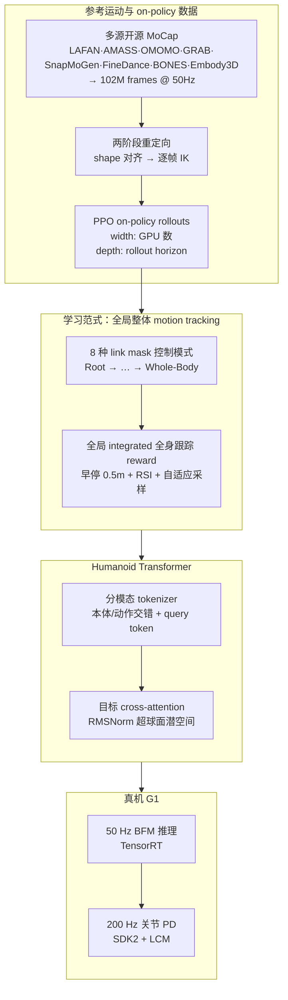

# ScaleBFM（Scaling Behavior Foundation Model for Humanoid Robots）

**ScaleBFM** 是上海人工智能实验室牵头、多校与 Galbot 合作的人形 **BFM scaling 技术报告**（arXiv:2607.15163，[项目页](https://scalebfm.github.io/)）：在 [BFM](./paper-behavior-foundation-model-humanoid.md) 同团队的「行为与任务解耦」叙事上，把 **motion tracking** 确立为可扩展预训练范式，并实证 **学习范式 × 训练数据 × Humanoid Transformer 架构** 三轴如何协同放大控制保真度与跨域泛化。

## 英文缩写速查

| 缩写 | 英文全称 | 简要说明 |
|------|----------|----------|
| BFM | Behavior Foundation Model | 大规模行为数据预训练的人形全身基础控制器 |
| WBC | Whole-Body Control | 多关节协调的低层执行问题 |
| PPO | Proximal Policy Optimization | 本文 BFM 预训练所用 on-policy RL 算法 |
| MPKPE | Mean Per-Keypoint Position Error | 关键点位置跟踪误差（分 global/local） |
| HT | Humanoid Transformer | 本文提出的可扩展 Transformer 策略骨干 |

## 为什么重要

- **首次系统拆解 BFM scaling 三轴**：相较 [SONIC](../methods/sonic-motion-tracking.md) 对 MoCap/算力/容量的初步 scaling，本文把 **PPO on-policy 数据量（GPU 并行 × rollout horizon）** 与 **参考运动行为覆盖（多源 102M 帧）** 分开度量，并给出 **同质 vs 异质** 数据扩展的两类 regime——对后续人形 foundation 数据策展有直接指导意义。
- **全局整体跟踪范式有明确 ablation**：相对 BeyondMimic 式 reward（**BFM-Bym** 消融）与去掉根平移/根–姿态解耦的惯例，**integrated global whole-body tracking** 在 BONES / Ours 双测试集上 consistently 降低 **G-MPKPE**，说明「行为语义」与「全身协调」需要同一奖励里一起学。
- **Humanoid Transformer 证明架构 matters**：**3M 参数 M 档 Transformer** 已优于显著更大的 MLP；潜空间在 **RMSNorm 超球面** 上无辅助 loss 即呈现 locality、跨行为分区与噪声鲁棒性，且大模型下 **八控制模式潜表示收敛**——解释 mode 间 scaling 饱和现象。
- **真机栈可复用**：[Unitree G1](./unitree-g1.md) 上 BFM 50 Hz（TensorRT）+ PD 200 Hz（LCM/SDK2），global 模式用 **VIVE Ultimate Tracker** 根定位，local 模式相对根重锚定；与 [ReactiveBFM](./paper-reactivebfm.md) 共享团队与部署文化。

## 流程总览

## 核心机制（归纳）

### 1）问题形式化与 motion tracking 代理任务

- 将人形控制表述为 **GCRL**：行为 $\boldsymbol{B}$ 定义为 $(s^p, a)$ 轨迹，**goal $s^g$ 是外部规格而非行为本体**。
- **BFM vs 普通 tracker**：motion tracking 是 **学行为的代理任务**，而非唯一部署接口；同一 checkpoint 可通过 **不同 mask 的 goal** 接稀疏到稠密多种控制模式。
- **全局整体跟踪**：奖励要求再现 **全局坐标系下的 integrated whole-body 参考**，避免根平移缺失或根–姿态解耦带来的 **行为歧义与协调弱化**。

### 2）八模式掩码控制接口

- 目标为根相对笛卡尔 **link pose + 与当前偏差**；actor 接收 **masked 目标 + mask 向量**，critic 看 **完整未 mask 目标 + 速度项**（非对称 actor–critic）。
- **八种 curated modes**（附录详列）：从仅 pelvis 的 Root Mode 到 14 link 的 Whole-Body Mode；训练时 $\boldsymbol{m}_i \sim \mathcal{M}$ 均匀采样，未激活 link 由策略 **inpainting**。
- **Global vs Local 部署**：global 用外部位姿跟踪器对齐根 xy 与航向；local 将控制信号 **相对当前根重锚定**（航向仍可用 IMU + 首帧标定），适配无全局定位场景。

### 3）数据 scaling：数量 × 多样性

| 维度 | 操作 | 主要结论 |
|------|------|----------|
| **On-policy 数量** | 扩 GPU（width）与 rollout horizon（depth） | **联合扩维** 最优（如 64×64）；单扩一维不稳定 |
| **参考运动同质扩展** | XXS→S（同 BONES-SEED 域，occupancy ~0.94） | 域内 benchmark 仅边际收益 |
| **参考运动异质扩展** | S→L（+LAFAN/AMASS/OMOMO 等，occupancy→0.9995） | **Ours Test**（Xsens+100Style）大幅提升，BONES 域内增益有限 |

- **102M 帧语料**：全开源数据集聚合 + 两阶段 retarget；**早停 + RSI**（终止点邻域重初始化）与 **自适应失败加权采样** 塑造 on-policy 分布质量。

### 4）Humanoid Transformer

- **结构**：有限窗本体/动作/目标 → 共享 tokenizer；本体与动作 token **交错** 为 context；**query token** 聚合历史（context 不可 attend 到 query）；目标序列 **cross-attention** 条件化。
- **潜空间**：goal embedding 经 RMSNorm 落在 **连续超球面**；满足 locality、全局行为分区、中等噪声下跟踪指标稳定（BONES 噪声 level 20 仍 Succ 0.9646）。
- **规模与部署**：M 档 **3.00M 参数** 为精度–效率折中（真机 >50 Hz）；actor 未来窗含 **随机远帧 offset** 补偿通信延迟。

## 主要量化结果

### Whole-body 模式基准（3M Humanoid Transformer）

| Test Set | 方法 | Succ ↑ | G-MPKPE ↓ | L-MPKPE ↓ |
|----------|------|--------|-----------|-----------|
| BONES | SONIC† | 0.9239 | 0.1740 | 0.0436 |
| BONES | BFM-Bym（BeyondMimic reward） | 0.9644 | 0.1005 | 0.0406 |
| BONES | **BFM-Global（本文）** | **0.9677** | **0.0798** | 0.0400 |
| BONES | BFM-Local | 0.7286 | 0.2281 | **0.0398** |
| Ours | SONIC | 0.5937 | 0.5035 | 0.0430 |
| Ours | BFM-Bym | 0.9709 | 0.1224 | 0.0403 |
| Ours | **BFM-Global（本文）** | **0.9776** | **0.0915** | 0.0396 |

- 相对 SONIC，**G-MPKPE** 在 BONES / Ours 上约 **54% / 82%** 降幅（摘要口径）；**L-MPKPE** local 模式相对既有控制器 **>10%** 改善。
- †BONES 随机子集可能与 SONIC 训练集重叠；Ours 为跨源未见动作，更能体现 **异质数据 scaling** 价值。
- 基线还包括 GMT、TWIST；全面落后于本文 BFM-Global。

## 与其他工作的关系

- **[BFM（CVAE，arXiv:2509.13780）](./paper-behavior-foundation-model-humanoid.md)**：同作者团队、同「掩码多接口」哲学，但 ScaleBFM 走 **PPO + Transformer + 全局 tracking scaling 实证**，BFM 走 **CVAE 在线蒸馏**；二者是 **互补技术路线** 而非同一模型的 v2。
- **[SONIC](../methods/sonic-motion-tracking.md)**：同为 motion-tracking BFM 预训练；SONIC 强调 **离散行为表征 + 多命令对齐 + NVIDIA 规模**；ScaleBFM 强调 **三轴 scaling 定律式分解 + Humanoid Transformer + 八模式稀疏接口**。
- **[ReactiveBFM](./paper-reactivebfm.md)**：共享 Zeng / Niu / Pang / Wang 等作者；ScaleBFM 提供 **低层可扩展 tracker 基座**，ReactiveBFM 在其上叠 **闭环 AR-MDM 规划**。
- **[Perceptive BFM](./paper-perceptive-bfm.md)**：补 **地形感知** 与 operator–environment mismatch；ScaleBFM 假设参考在全局/局部重锚定后可跟踪，未显式建模楼梯/块级几何。

## 工程实践与开源状态

- **训练：** IsaacLab（Unitree G1, 29 DoF）；评测 MuJoCo sim-to-sim。
- **真机：** G1 + 板载/外接 GPU；Wi-Fi TCP 缓冲带时间戳的流式控制信号；八模式可 **在线切换**。
- **开源（截至 2026-07-18）：** 项目页与 [GitHub `zengweishuai/ScaleBFM`](https://github.com/zengweishuai/ScaleBFM) 已上线，**代码待发布** — README 公告 **2026-07-26 前** 逐步释出重定向、训练、部署；归类 **部分开源 / 待发布**。论文正文亦写将 open-source all resources。

## 常见误区或局限

- **不是 CVAE-BFM 的简单放大版**：架构为 **Transformer + PPO**，与 arXiv:2509.13780 的 CVAE+DAgger 管线不同。
- **Local 模式 Succ 低于 Global**：稀疏接口 + 无全局根定位时 whole-body 任务更难（BONES BFM-Local Succ 0.73）；读表时需区分 **G- vs L-MPKPE** 与部署模式。
- **Transformer 继续放大有 mode trade-off**：某些控制模式提升伴随其他模式略降，与 **共享潜空间跨模式收敛** 相关，不是单纯「越大越好」。
- **八模式是否终极接口未定论**：论文讨论节明确指出与未来高层策略集成方式仍开放。

## 关联页面

- [Behavior Foundation Model](../concepts/behavior-foundation-model.md)
- [Whole-Body Control](../concepts/whole-body-control.md)
- [Humanoid Policy Network Architecture](../concepts/humanoid-policy-network-architecture.md)
- [SONIC（规模化运动跟踪）](../methods/sonic-motion-tracking.md)
- [BFM（CVAE 多接口）](./paper-behavior-foundation-model-humanoid.md)
- [ReactiveBFM（闭环规划–控制）](./paper-reactivebfm.md)
- [Unitree G1](./unitree-g1.md)
- [Isaac Gym / Isaac Lab](./isaac-gym-isaac-lab.md)
- [AMASS](./amass.md)

## 参考来源

- [sources/papers/scaling_bfm_arxiv_2607_15163.md](../../sources/papers/scaling_bfm_arxiv_2607_15163.md)
- [sources/sites/scalebfm-github-io.md](../../sources/sites/scalebfm-github-io.md)
- [sources/repos/scalebfm.md](../../sources/repos/scalebfm.md)
- Zeng, Yin, Niu et al. *Scaling Behavior Foundation Model for Humanoid Robots*. arXiv:2607.15163, 2026. <https://arxiv.org/abs/2607.15163>

## 推荐继续阅读

- [ScaleBFM 项目页](https://scalebfm.github.io/) — scaling 曲线、潜空间可视化、真机八模式与 loco-manip 视频
- [SONIC 项目页](https://nvlabs.github.io/GEAR-SONIC/) — motion-tracking BFM scaling 对照
- [BFM 项目页](https://bfm4humanoid.github.io/) — 同团队 CVAE 路线演示
- [ReactiveBFM 项目页](https://xiao-chen.tech/reactivebfm) — 闭环上层与 ScaleBFM 低层栈衔接
