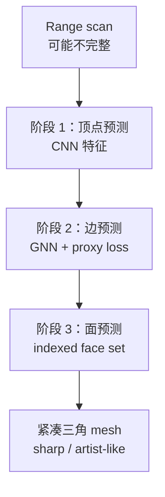

# Scan2Mesh：From Unstructured Range Scans to 3D Meshes（CVPR 2019）

**Scan2Mesh**（[arXiv:1811.10464](https://arxiv.org/abs/1811.10464)，[CVPR 2019 PDF](https://openaccess.thecvf.com/content_CVPR_2019/papers/Dai_Scan2Mesh_From_Unstructured_Range_Scans_to_3D_Meshes_CVPR_2019_paper.pdf)，[项目页](https://niessnerlab.org/projects/dai2019scan2mesh.html)）由 **慕尼黑工业大学（TUM）** 的 Angela Dai 与 Matthias Nießner 提出：**数据驱动生成式** 网络将 **非结构化、可能不完整** 的 range scan 直接预测为 **indexed face set**（顶点 + 面索引），输出更接近 **艺术家 CAD** 的紧凑三角 mesh。

> **同名消歧：** 本文 **不是** [PUMA](./paper-puma-lidar-mesh-odometry.md) 的几何 **scan-to-mesh 配准**；PUMA 用已有 mesh 地图做 LiDAR 里程计，本文用深度学习 **从 scan 生成 mesh**。

## 一句话定义

**分三阶段（顶点→边→面）用 CNN+GNN 与 proxy loss，把 range scan 直接生成带面索引的紧凑三角 mesh。**

## 英文缩写速查

| 缩写 | 英文全称 | 简要说明 |
|------|----------|----------|
| Scan2Mesh | From Unstructured Range Scans to 3D Meshes | 本文方法；学习式 scan→mesh 生成 |
| GNN | Graph Neural Network | 处理 mesh 边/面拓扑阶段 |
| CNN | Convolutional Neural Network | 处理 range scan / 体素特征 |
| CAD | Computer-Aided Design | 艺术家手工建模；本文 mesh 风格对照 |
| Range scan | Depth / LiDAR range image | 输入：非结构化深度扫描 |
| IFS | Indexed Face Set | 输出：顶点坐标 + 三角面索引表 |

## 为什么重要

- **表示路线分水岭：** 相对 **隐式函数 + marching cubes**，直接预测 **indexed face set** → mesh 更 **sharp、compact**，迈向 CAD 级结构。
- **分阶段离散映射：** 顶点 / 边 / 面 **proxy loss** 解决 mesh 生成的 **组合离散性**，是后续 mesh 生成、场景补全路线的经典引用。
- **与机器人地图区分：** 物体级 **scan→mesh** 常用于 **数字化资产、抓取模型、仿真物体**；室外 LiDAR **SLAM mesh 地图** 见 [PUMA](./paper-puma-lidar-mesh-odometry.md)。
- **TUM 3D 理解线：** 与 ScanNet、3D-EPN 等同期 TUM 工作同属 **3D 深度学习重建** 脉络。

## 核心信息

| 项 | 内容 |
|----|------|
| **机构** | 慕尼黑工业大学（Technical University of Munich, TUM） |
| **出处** | CVPR 2019, pp. 5574–5583 |
| **论文** | <https://arxiv.org/abs/1811.10464> |
| **项目页** | <https://niessnerlab.org/projects/dai2019scan2mesh.html> |
| **开源** | **确认未开源** — 项目页仅 Paper 链接，无官方代码（2026-09-15 核查） |

## 流程总览

## 核心原理

### 分阶段生成与 proxy loss

| 阶段 | 预测对象 | 机制 |
|------|----------|------|
| 1 | **Vertices** | 卷积编码 scan；回归/分类顶点位置 |
| 2 | **Edges** | 图网络在顶点图上预测边；**一对一离散映射** proxy loss |
| 3 | **Faces** | 在边结构上预测三角面索引；输出 **indexed face set** |

每阶段与 GT mesh 建立 **离散对应**，避免端到端直接回归拓扑时的组合爆炸。

## 与其他工作对比

| 路线 | 代表 | 相对 Scan2Mesh |
|------|------|----------------|
| 隐式函数重建 | Occupancy / SDF + marching | 网格更密、噪声多；本文更 **compact** |
| 点云后处理 | Poisson / Ball pivoting | 非学习、难处理 **不完整 scan** 语义补全 |
| 几何 SLAM mesh | [PUMA](./paper-puma-lidar-mesh-odometry.md) | **已有地图** 上配准，非生成式 |
| 解析 SDF 查询 | [Points as Tori](./paper-points-as-tori.md) | 点云→SDF 查询；非直接面片拓扑 |

## 源码运行时序图

**不适用** — 截至 2026-09-15，[Nießner Lab 项目页](https://niessnerlab.org/projects/dai2019scan2mesh.html) **未提供** 官方可运行代码或权重；第三方课程复现（如 `sirine90/Scan2Mesh`）非官方实现。

## 工程实践

| 项 | 内容 |
|----|------|
| **复现** | 无官方仓库；需自实现或参考非官方第三方（不可当作论文官方结果） |
| **数据** | 论文以 ShapeNet 等 **物体级** range scan 为主 |
| **部署** | 物体数字化、仿真资产管线；**非** 室外 LiDAR 实时 SLAM 默选项 |
| **后续工作** | 可链到 TUM 同期场景理解（ScanNet、3D-EPN 等）与 mesh 生成综述 |

## 评测

| 项 | 内容 |
|----|------|
| **任务** | 非结构化 range scan → mesh 重建 |
| **数据** | ShapeNet 等（论文设定） |
| **指标** | Chamfer / mesh 质量定性；相对隐式 baseline **更 sharp** |
| **读法** | 关注 **拓扑正确性 + 表面锐利度**；室外大规模地图需另选 [PUMA](./paper-puma-lidar-mesh-odometry.md) 等几何 SLAM 路线 |

## 结论

**Scan2Mesh 确立了「直接预测 indexed face set」的 mesh 生成范式，但与 LiDAR mesh SLAM 是不同问题设定。**

1. 需要 **物体级 CAD-like mesh** 时引用本文；需要 **车载 LiDAR 地图 mesh** 时引用 [PUMA](./paper-puma-lidar-mesh-odometry.md)。
2. 官方 **无代码** → 论文结论用于 **方法选型与引用**，复现需自研或谨慎对待第三方实现。
3. 分阶段 proxy loss 是核心可迁移思想，可借鉴到后续 mesh diffusion / 拓扑预测工作。
4. 不完整 scan 的 **语义补全** 能力来自学习式生成，与几何 Poisson 重建假设不同。
5. 与 [Points as Tori](./paper-points-as-tori.md) 对照：一条走 **显式面片拓扑**，一条走 **SDF 查询**。

## 局限与风险

- **无官方实现：** 项目页未列代码，复现成本高。
- **物体级：** 非大规模室外 SLAM；直接套到机器人导航地图需额外工程。
- **数据域：** ShapeNet 合成/扫描与真实 LiDAR 序列分布差异大。
- **同名混淆：** 检索 "Scan2Mesh" 时务必核对作者（Dai & Nießner, CVPR 2019）与 [PUMA](./paper-puma-lidar-mesh-odometry.md)。

## 关联页面

- [PUMA（几何 scan-to-mesh SLAM）](./paper-puma-lidar-mesh-odometry.md)
- [Points as Tori（PSR / SDF 对照）](./paper-points-as-tori.md)
- [六种空间表示](../concepts/embodied-perception-six-spatial-representations.md)
- [操作任务](../tasks/manipulation.md)

## 参考来源

- [scan2mesh_cvpr_2019_dai.md](../../sources/papers/scan2mesh_cvpr_2019_dai.md)
- [niessnerlab-scan2mesh.md](../../sources/sites/niessnerlab-scan2mesh.md)

## 推荐继续阅读

- [CVPR 2019 Open Access 页面](https://openaccess.thecvf.com/content_CVPR_2019/html/Dai_Scan2Mesh_From_Unstructured_Range_Scans_to_3D_Meshes_CVPR_2019_paper.html)
- [Nießner Lab 项目页](https://niessnerlab.org/projects/dai2019scan2mesh.html)
