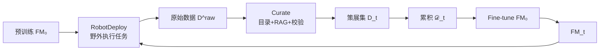

# Robot-Powered Data Flywheel（RPDF）

**Robot-Powered Data Flywheel**（*Deploying Robots in the Wild for Continual Data Collection and Foundation Model Adaptation*，[arXiv:2511.19647](https://arxiv.org/abs/2511.19647)，Stanford + TRI）提出：把配备基础模型的机器人部署到 **互联网语料欠代表的杂乱野外环境**，在 **完成有用任务** 的同时自动采集、策展数据并 **持续微调** 同一类基础模型，形成「部署 → 数据 → 更强模型 → 更好部署」闭环。实例系统 [Scanford](./scanford.md) 在东亚图书馆两周扫 **2103** 架书架，VLM 书识别 **32.0%→71.8%**，困难英/中 OCR **+21.8 / +7.2 pp**，馆员估计节省 **18.7 h**。

## 一句话定义

**让机器人一边在野外干正事，一边把预训练模型缺的那口「脏真实数据」自动采回来并喂回微调——模型从消费者变成数据发电机。**

## 英文缩写速查

| 缩写 | 英文全称 | 简要说明 |
|------|----------|----------|
| RPDF | Robot-Powered Data Flywheel | 本文框架：野外机器人驱动的 FM 持续适应飞轮 |
| FM | Foundation Model | 基础模型；本文实例为 VLM（Qwen2.5-VL） |
| VLM | Vision-Language Model | 视觉–语言多模态模型 |
| OCR | Optical Character Recognition | 光学字符识别；域邻接评测任务 |
| RAG | Retrieval-Augmented Generation | 检索增强生成；用图书馆目录约束 VLM 书标签 |
| SPL | — | 本文未用；任务为书识别与 OCR 准确率 |

## 为什么重要

- **数据墙的另一条路：** 不只靠互联网爬取或昂贵遥操作，而用 **已部署机器人 + 任务结构** 自动产标注（图书馆 catalog 作弱监督）。
- **域邻接泛化：** 图书馆书脊数据还能抬升 **困难 OCR**（低分辨率、遮挡、书法字体）——说明野外数据补的是 **预训练分布空洞**，不只刷榜单一任务。
- **与具身 VLA 飞轮的前传：** 论文讨论未来扩展到 **VLA/LLM**；与 [LeoInAI 产业地图](../queries/humanoid-robot-data-collection-landscape.md) 中遥操作/可穿戴路线互补。

## 核心信息

| 字段 | 内容 |
|------|------|
| 机构 | 斯坦福大学（Stanford）；丰田研究所（Toyota Research Institute） |
| arXiv | [2511.19647](https://arxiv.org/abs/2511.19647)（v1，2025-11-24） |
| 项目页 | <https://scanford-robot.github.io/> |
| 开源 | **确认未开源**（2026-09-07；无代码/权重/数据集链接） |
| 实例 | [Scanford](./scanford.md) — Franka FR3 + TidyBot++ |
| 骨干 | Qwen2.5-VL-7B 微调；亦评测 Gemini |
| 真机部署 | 东亚图书馆 **2 周**（10 天 × 4 h） |

## 流程总览

## 结论

**RPDF 证明：短周期野外机器人部署 + 结构化自动策展，就能用极少人工把 VLM 从「能用」推到「在该杂乱域真有用」，并外溢到 OCR 等域邻接能力。**

1. **1.5 h 数据就大半见效** — ≈1352 图后 domain-specific 与 OCR 增益趋平；不必假设数月遥操作才能启动飞轮。
2. **自动标注靠任务结构** — 图书馆 sectional catalog + VLM RAG + 字符串/排序校验，零人工标注仍得 5019 对训练数据。
3. **野外杂乱是 feature** — 多语言、褪色书脊、遮挡正是互联网预训练盲区；选任务要落在模型 **ZPD**（太难要人工，太易无增益）。
4. **部署效用可量化** — 2103 书架 / 18.7 h / 日均 2.6 次短干预，飞轮不是纯实验室循环。
5. **工程边界** — 仅 VLM 实例、中等任务工程；未开源；100% 任务成功仍未达到，单靠微调不够。

## 源码运行时序图

**不适用**：截至 **2026-09-07** 无官方可运行仓库；无法对齐 README 绘制复现时序。硬件栈可参考 TidyBot++ 与 Franka 公开文档，但不是本文官方入口。

## 局限与风险

- **单域实例：** 图书馆盘点；泛化到其他 RPDF 需重做策展与任务工程。
- **未开源：** 无法复现 LiDAR 漂移校正与 catalog 管线细节。
- **VLA 未验证：** 未来工作；勿与 [Figure Index](./figure-ai.md) 等人形数据平台混为同一机制。

## 关联页面

- [Scanford](./scanford.md) — 系统实例
- [Data Flywheel](../concepts/data-flywheel.md)
- [人形机器人数据采集产业地图（Query）](../queries/humanoid-robot-data-collection-landscape.md)
- [Arcadia](./paper-arcadia.md) — 另一「部署反馈写回模型」闭环

## 推荐继续阅读

- [arXiv:2511.19647](https://arxiv.org/abs/2511.19647)
- [Scanford 项目页](https://scanford-robot.github.io/)

## 参考来源

- [论文摘录（arXiv:2511.19647）](../../sources/papers/scanford_robot_powered_data_flywheel_arxiv_2511_19647.md)
- [Scanford 项目页归档](../../sources/sites/scanford.md)
