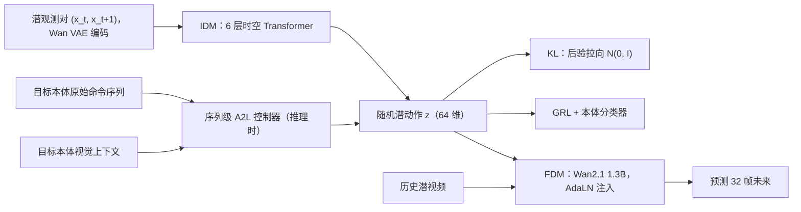

# SCAR（自监督连续动作表示：跨本体统一潜动作接口）

**SCAR**（*SCAR: Self-Supervised Continuous Action Representation Learning*，[arXiv:2605.16412](https://arxiv.org/abs/2605.16412)，v1 2026-05-13）由 Hongjia Liu、Fan Feng、Minghao Fu、Xinyue Wang、Haofei Lu、Biwei Huang（UCSD、KTH）提出。[Aether AI](./aether-ai.md) 官方博客在 **2026-08-09** 发布解读页（Field notes #08，标签 World Models · Latent Actions）。它的出发点是：**世界模型不该绑定某台机器人的原始命令，而应该以「可控变化」本身为条件。**

## 一句话定义

**用逆动力学模型从视觉转移里推断连续潜动作、用前向动力学模型以潜动作为条件预测未来，再用 KL 先验和对抗本体分类压掉外观与本体信息，得到一个可以在不同机器人之间共享的动作接口。**

## 英文缩写速查

| 缩写 | 英文全称 | 简要说明 |
|------|----------|----------|
| SCAR | Self-Supervised Continuous Action Representation | 本文方法 |
| IDM | Inverse Dynamics Model | 从潜观测对推断潜动作 |
| FDM | Forward Dynamics Model | 以潜动作为条件预测未来潜视频 |
| GRL | Gradient Reversal Layer | 对抗本体分类器，使潜动作不含本体信息 |
| KL | Kullback-Leibler divergence | 把潜动作后验拉向标准高斯，限制容量 |
| A2L | Action-to-Latent controller | 推理时把原始命令序列映射到潜动作空间 |
| AdaLN | Adaptive Layer Normalization | 潜动作注入 FDM 的方式 |
| VAE | Variational Autoencoder | 冻结的 Wan 因果 VAE 用于视频编码 |
| SSIM-L | Last-frame SSIM | 最后一帧 SSIM，衡量长程预测 |

## 为什么重要

- **重新定义动作接口。** 原始命令是「局部接口」：同一条命令在不同身体、控制器、标定下代表不同的物理干预。SCAR 让世界模型以「这次转移里可控的那部分变化」为条件，本体变成干扰变量。
- **有理论支撑的潜动作设计。** 作者给出充分条件：在单射性等假设下，IDM 能恢复真实动作到可逆重参数化；对抗不变性再把本体相关成分去掉，统一潜动作空间可恢复到「每个本体一个可逆双射」。
- **低数据跨本体适配。** 目标本体只有 10 条轨迹时，潜动作接口在 RoboTwin 与 Procgen 上都比原始动作更好，本体泄漏也更低（自报）。
- **与同团队工作互补。** [TC-WM](./paper-task-centric-world-models.md) 精简「状态」，SCAR 精简「动作」，[CD-LAM](./paper-cd-lam.md) 处理潜动作里的视觉混杂。

## 核心信息

| 项 | 内容 |
|----|------|
| **机构** | 加州大学圣地亚哥分校（UCSD）、瑞典皇家理工学院（KTH）；解读托管在以太智能（Aether AI）博客 |
| **作者** | Hongjia Liu、Fan Feng、Minghao Fu、Xinyue Wang、Haofei Lu、Biwei Huang |
| **视频编码** | 冻结 Wan 因果 VAE；49 帧窗口，预测 32 帧 |
| **IDM** | 6 层时空 Transformer，潜动作维度 \(d_z=64\)，随机（有后验分布） |
| **FDM** | 从 Wan2.1 1.3B 预训练权重初始化，潜动作经 AdaLN 注入 |
| **训练** | AdamW，10,000 步，有效 batch 16 |
| **数据** | RoboTwin `place_a2b_left`（aloha-agilex、arx-x5、franka、ur5），Procgen 两组共 6 个环境 |
| **指标** | SSIM、PSNR、MSE、SSIM-L（生成质量）；本体分类器概率；冻结动作探针 |
| **开源** | 截至 2026-10-10 无代码 / 权重链接 |

## 核心原理（方法）

### 生成假设与可辨识性

作者假设：本体无关潜动作 \(u_t\) 经本体专属实现变成命令 \(a^e_t=h(u_t,e)\)，驱动转移 \(s_{t+1}=F(s_t,a^e_t)\)，再经渲染 \(x_t=R(s_t)\) 被看到。在实现、动力学、渲染都单射的假设下：

1. **IDM 可辨识：** 全局最优的 IDM 能把实际动作恢复到连续可逆重参数化 \(\tilde a_t=\rho(a^e_t)\)。
2. **对抗不变性：** 最优本体分类器下 \(\min_\omega\mathcal L_{CE}=H(e\mid z)=H(e)-I(e;z)\)，梯度反转把编码器推向 \(z\perp e\)。线性证明中，本体簇中心张成干扰子空间 \(V\)，不变性迫使 \(\mathrm{row}(M)=V^\perp\)。
3. **统一恢复：** 潜动作 \(z=\Phi_e(u)\)，\(\Phi_e\) 是每个本体的可逆双射；本体间对齐 \(T=\Phi_{e_2}\circ\Phi_{e_1}^{-1}\)。从 \(z\) 还原 \(u\) 仍需知道本体 ID。

作者明确说这是理想化假设下的 **充分条件**，不保证任何训好的模型都能完美零样本迁移。理论也解释了为什么 KL 和前向预测缺一不可：前向预测防止「不变但无用」的塌缩，KL 防止潜动作变成任意视觉编码。

### 流程总览

训练时 z 来自 IDM 的后验；部署时用 A2L 从原始命令 + 视觉上下文预测潜动作序列，接到同一个 FDM 上。

## 工程实践

| 项 | 要点 |
|----|------|
| 动作空间对齐 | RoboTwin 原始动作补齐到 16 维共享接口；Procgen 用 one-hot 离散动作 |
| KL 与 GRL 的分工 | KL 限容量、压外观捷径（例如光照变化）；GRL 去本体判别方向。论文图 4 显示只用 GRL 时光照等场景变化仍会被带过去 |
| A2L 要用序列级 | 逐步（pointwise）A2L 明显更差；序列级 A2L 不改 FDM 已接近原始动作基线，轻量微调后超过 |
| 评测读法 | Table 1 是 **后验潜动作诊断**（IDM 从评测转移本身推潜动作），作者说明不是可部署接口；部署相关看 Table 3 |
| 源码运行时序图 | **不适用**（截至 2026-10-10 无公开代码） |
| 开源状态 | 博客与 arXiv 均未列代码 / 权重 |

## 实验与评测

### 跨域迁移（m=10，三种子平均，SSIM / PSNR，自报）

| 方法 | Procgen G1 | Procgen G2 | RoboTwin 目标任务 | RoboTwin 迁移任务 |
|------|------------|------------|-------------------|-------------------|
| Target-Only-GT | 0.421 / 13.28 | 0.374 / 12.74 | 0.536 / 15.69 | 0.573 / 16.47 |
| Shared-GT | 0.493 / 14.06 | 0.451 / 13.52 | 0.713 / 16.70 | 0.731 / 17.14 |
| Shared-Latent | 0.565 / 15.02 | 0.526 / 14.46 | 0.743 / 17.99 | 0.756 / 18.26 |
| SCAR-kl | 0.579 / 15.18 | 0.545 / 14.74 | 0.752 / 18.27 | 0.763 / 18.51 |
| SCAR-grl | 0.572 / 15.09 | 0.536 / 14.61 | 0.745 / 18.01 | 0.761 / 18.42 |
| **SCAR-kl-grl** | **0.594 / 15.37** | **0.563 / 15.03** | **0.759 / 18.49** | **0.770 / 18.70** |

- 两个趋势：潜动作条件优于原始动作条件；KL + GRL 在所有设置下进一步提升。作者承认提升在重建指标上「中等」，但跨域、跨任务、跨数据量一致。
- 目标本体数据从 10 增到 50、100 条，SCAR-kl-grl 仍优于原始动作基线（图 5）。

### 本体泄漏（aloha / arx / ur5 潜动作 → franka 画面）

| 方法 | 源本体概率 ↓ | 目标本体概率 ↑ | Target−Source ↑ |
|------|--------------|----------------|-----------------|
| Shared-Latent | 0.1020 | 0.8105 | 0.7085 |
| **SCAR-kl-grl** | **0.0736** | **0.8333** | **0.7598** |

### 动作接口（Franka，m=50，SSIM / PSNR）

| 方法 | 目标任务 | 迁移任务 |
|------|----------|----------|
| Shared-GT | 0.746 / 17.97 | 0.758 / 18.09 |
| Pointwise-A2L | 0.676 / 15.96 | 0.709 / 16.42 |
| Sequence-A2L | 0.741 / 17.80 | 0.748 / 17.92 |
| **Sequence-A2L-FT** | **0.768 / 18.78** | **0.768 / 18.62** |

### 冻结动作探针

Shared-Latent 训练误差最低（MSE 0.0766），但 SCAR-kl-grl 在留出数据上最好（评测 MSE 0.134、L1 0.273）。作者的解读：正则化没有丢掉动作信息，只是减少训练集特有的捷径。

## 结论

**SCAR 证明了一件事：在低数据的跨本体设置下，从视觉转移学到、经过 KL 与本体对抗约束的连续潜动作，是比原始命令更好的世界模型条件接口。**

- **真影响指标是本体泄漏与迁移任务表现。** 重建指标提升幅度中等（RoboTwin SSIM 0.743 → 0.759），更有说服力的是源本体概率下降（0.102 → 0.074）和零样本迁移任务上的一致提升。
- **KL 与 GRL 都要用。** 单用 GRL 几乎没有收益（RoboTwin 目标任务 0.745 对 Shared-Latent 0.743），单用 KL 已拿到大部分提升，两者叠加最好。
- **部署靠序列级 A2L。** 逐步映射会明显退化；序列级 A2L + 轻量微调才能超过原始动作基线。
- **目前只是生成质量层面的证据。** 没有闭环策略成功率、没有真机，规模是 Wan2.1 1.3B 与 RoboTwin 单任务；作者自己把真实机器人数据、野外视频与闭环策略学习列为后续工作。

## 与其他工作对比

| 对比轴 | SCAR | [CD-LAM](./paper-cd-lam.md) | [CLAM](./paper-rcl-2505-04999-clam-continuous-latent-action-models-for-robot-l.md) | [LAPA](./paper-shenlan-wm-03-lapa.md) / [villa-X](./paper-shenlan-wm-05-villa-x.md) |
|--------|------|--------|------|-------------|
| 潜动作形式 | 连续、随机（高斯先验） | 连续 32 维 | 连续 | LAPA 为离散 VQ 码 |
| 要去掉的干扰 | 本体信息 + 外观捷径 | 背景 / 相机 / 场景混杂 | — | — |
| 去偏手段 | KL + 梯度反转 | 前景加权重建 + 原语对比 + 零转移校准 | — | — |
| 主要下游 | 世界模型条件接口 | 动作条件视频世界模型 + VLA 预训练 | 策略学习 | VLA 预训练 |
| 理论 | 跨本体可辨识的充分条件 | 因果干预测试 | — | — |

- [Motion-Focused Latent Action](./paper-sa-2606-16251-motion-focused-latent-action-enables-cross-embod.md) 同样追求跨本体潜动作，可对照阅读。
- [What Matters for Latent Actions](./paper-latent-actions-matter.md) 的 41 项设计实证没有把「本体对抗」单独作为变量，SCAR 补充了这一维度。
- SCAR 的 IDM 是 [逆动力学模型](../concepts/inverse-dynamics-model.md) 的自监督版本；在 [世界动作模型](../concepts/world-action-models.md) 体系里属于「动作接口」层。

## 局限与风险

- **没有闭环或真机实验。** 所有结果都是视频生成质量与表示探针。
- **规模小。** RoboTwin 只用一个任务（`place_a2b_left` → `place_a2b_right`），FDM 是 1.3B 模型，训练 10k 步。
- **理论依赖强假设。** 单射性、结构化干扰、非塌缩预测都是理想化条件；线性证明设定与实际非线性网络之间有差距。
- **还原原始动作需要本体 ID。** 潜动作是本体无关的，执行时仍要靠每个本体的 A2L 或解码器。
- **未开源**（截至 2026-10-10），无法复核实现。
- **博客页本身没有数值**，本页数字全部来自 arXiv HTML。

## 关联页面

- [Aether AI（以太智能）](./aether-ai.md) — 托管本文解读的公司博客
- [CD-LAM](./paper-cd-lam.md) — 同团队：潜动作因果去偏
- [TC-WM](./paper-task-centric-world-models.md) — 同团队：任务中心世界模型状态
- [What Matters for Latent Actions](./paper-latent-actions-matter.md)
- [CLAM](./paper-rcl-2505-04999-clam-continuous-latent-action-models-for-robot-l.md) — 连续潜动作模型
- [Motion-Focused Latent Action](./paper-sa-2606-16251-motion-focused-latent-action-enables-cross-embod.md)
- [LAPA](./paper-shenlan-wm-03-lapa.md) · [villa-X](./paper-shenlan-wm-05-villa-x.md)
- [RoboTwin](./robotwin.md) — 跨本体评测数据来源
- [逆动力学模型](../concepts/inverse-dynamics-model.md)
- [世界动作模型](../concepts/world-action-models.md)
- [生成式世界模型](../methods/generative-world-models.md)
- [跨本体专题枢纽](../overview/hub-cross-embodiment.md)

## 参考来源

- [Aether AI 博客：SCAR（2026-08-09）](../../sources/blogs/aether_scar.md)
- [SCAR 论文归档（arXiv:2605.16412）](../../sources/papers/scar_arxiv_2605_16412.md)

## 推荐继续阅读

- [Aether AI 博客原文](https://aetherlabs.ai/articles/scar-self-supervised-continuous-action-representation-learning.html)
- [arXiv:2605.16412](https://arxiv.org/abs/2605.16412)
- [PDF](https://arxiv.org/pdf/2605.16412)
