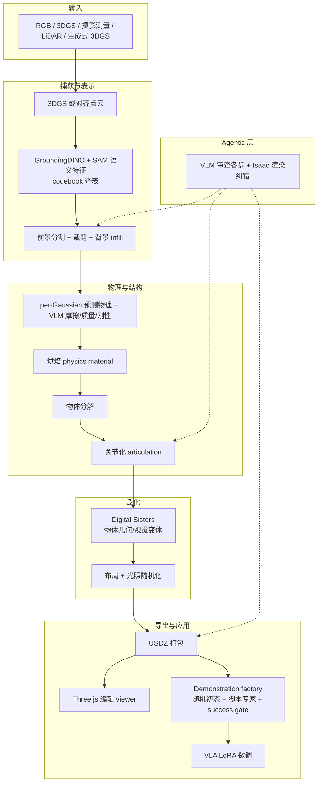

# SceneAgent（3D 捕获 → 预测物理仿真环境与策略训练）

**SceneAgent**（*3D Capture-Derived Scenes with Predictive Physics for Policy Evaluation and Training Environments*，2026 preprint；[项目页](https://computationalrobotics.seas.harvard.edu/SceneAgent/)）由 **哈佛大学（Harvard University）Computational Robotics Group** 提出：**agentic Real2Sim** 把 **3D Gaussian Splatting（3DGS）**、摄影测量或 LiDAR 捕获（亦可从 RGB 经 COLMAP + NerfStudio `splatfacto` 重建）转成带 **语义、per-Gaussian 预测物理、分解与关节** 的可交互仿真环境，并沿 **Digital Sisters**（非精确复刻的物体变体）做域随机化；导出 **Universal Scene Description（USDZ）** 供 **Isaac Lab、MuJoCo、Unreal Engine** 等使用。下游包含 **demonstration factory**（脚本专家 + 物理有界初始状态）与 **VLA LoRA** 纯仿真微调闭环。

## 一句话定义

**用 VLM-agent 编排的多源 3D 捕获管线，把高斯/点云场景烘焙成带预测物理与 sisters 变体的 USD 仿真资产，并用 splat 背景 + mesh 前景合成演示来微调操作策略。**

## 英文缩写速查

| 缩写 | 英文全称 | 简要说明 |
|------|----------|----------|
| Real2Sim | Real to Simulation | 从真实 3D 捕获构造可训练/可评测的仿真环境 |
| 3DGS | 3D Gaussian Splatting | 高保真场景辐射场；本文同时作 per-Gaussian 物理载体 |
| USD / USDZ | Universal Scene Description | 场景与资产交换格式；导出至 Isaac Lab / MuJoCo 等 |
| VLA | Vision-Language-Action | 视觉-语言-动作策略；页面示例 π₀.₅、GR00T 1.6 + LoRA |
| VLM | Vision-Language Model | 物性估计、流水线审查与场景 inspect |
| SAM | Segment Anything Model | 与 GroundingDINO 联用做开放词汇分割与语义特征 |
| UMI | Universal Manipulation Interface | Franka 改型夹爪/setup，与 DROID 生态对齐 |

## 为什么重要

- **Real2Sim 单位是「可训可评的场景栈」：** 不只可视化 splat，而是 **语义 + 预测物理 + 关节 + USD 导出 + 演示合成 + VLA 微调** 串成闭环；与只重建外观或只评测空场景的工作相比，更贴近 **操作 foundation model** 的数据与部署需求。
- **Digital Sisters 显式命名域随机化：** 相对 **digital twin** 的精确复刻，**sisters** 强调 **保任务语义的几何/视觉微扰** 与布局/光照随机——页面将其与 **SimFoundry digital cousins**、**PolaRiS** 类基线放在同一评测叙事里（完整 Pearson 协议仍待发布）。
- **Agent 解决异构 3D 与易错转换：** 分割错误尺度/朝向/放置是常见失败模式；agent 可在 **Isaac Lab 内渲染审查** 并迭代修正，覆盖 **COLMAP 重建、互联网 photogrammetry、生成式 Marble 场景** 等多源输入。
- **算力叙事：** 相对依赖 **生成式视频世界模型** 的路线，项目页强调 **更低算力** 且可对 **特定零件/房间** 精确建模——适合「先捕获再训策略」而非「纯生成多视角视频」。

## 核心信息

| 项 | 内容 |
|----|------|
| **作者** | Luke Hollis、Tianxing Fan、Heng Yang（Harvard Computational Robotics Group；* 前两作者同等贡献） |
| **机构** | 哈佛大学（Harvard University），School of Engineering and Applied Sciences |
| **输入** | RGB 序列、3DGS（`.ply`）、摄影测量、LiDAR；生成式 3DGS（如 World Labs Marble） |
| **输出** | USDZ 场景；Three.js 交互编辑 viewer；仿真内演示数据集 |
| **项目页** | <https://computationalrobotics.seas.harvard.edu/SceneAgent/> |
| **GitHub** | <https://github.com/ComputationalRobotics/SceneAgent>（**静态项目页导出**，非管线） |
| **开源（截至 2026-09-27）** | **宣称将开源 / 待发布** — 页脚称 code、processed scenes、example objects **将随论文发布**；仓内无可运行 pipeline |

## 流程总览

## 核心原理

### 几何—语义—物理管线

1. **语义特征：** 为每个 3D Gaussian 推断语义并写入 **codebook**（LangSplat 启发），便于快速查询。
2. **实例化：** 前景物体与背景分离，裁剪物体 Gaussians，对空洞做 **predictive infill**。
3. **预测物理：** 结合语义、per-Gaussian 物理模型与 **VLM** 估计摩擦、刚性、质量、密度，**烘焙** 为仿真 **physics material**。
4. **结构与交互：** **分解** 物体为部件，按需添加 **关节**；**VLM 审查** 转换质量与位姿。
5. **Digital Sisters：** 生成 **非 twin 级精确** 的物体变体；场景级 **物体摆放与光照** 随机化，用于 sim→real 泛化。

### 混合表示与观测合成

- **背景：** 部署环境的 **3DGS**（Gaussian splat）。
- **前景：** 机器人与物体的 **mesh**（带预测物理）。
- **策略训练观测：** 深度合成——**mesh 前景渲染叠在 splat 背景** 上，使 IL 数据与真机部署外观对齐。

### Demonstration factory（策略训练块）

| 模块 | 机制 |
|------|------|
| 初始状态 | 桌面任务区域随机摆放、 manipulated 物体尺寸采样、相机/机器人基座位姿扰动 |
| 物理有界 | 随机布局后 **物理沉降**，保证初态在真实桌面可达 |
| 专家 | **脚本 pick-place**（定位→接近→下降→抓取→搬运→释放），使用仿真 **ground-truth 位姿** |
| 过滤 | **Success gate** 丢弃未达容器/目标的 episode |
| 训练 | 多措辞语言指令 + 相机流/动作对；**LoRA** 微调预训练 VLA（页面示例 Physical Intelligence **π₀.₅**、NVIDIA **GR00T 1.6**） |

### Agentic 编排

- **动机：** 3D 数据格式多样，分割/分解模型 **易错**（尺度、旋转、放置）。
- **手段：** Agent **swarm** 按步调用工具；在 **Isaac Lab** 内渲染相机视图做 **视觉 inspect & correct**。
- **覆盖：** 从原始 RGB 跑 COLMAP + `splatfacto`，到处理公开 photogrammetry / 既有 splat / **World Labs Marble** 等生成场景。

## 源码运行时序图

**不适用**（截至 2026-09-27）：官方 [ComputationalRobotics/SceneAgent](https://github.com/ComputationalRobotics/SceneAgent) 仅为 **项目页静态导出**，无训练/推理/管线 CLI；Real2Sim 与 demonstration factory 代码 **待随论文发布**。

## 工程实践

| 项 | 内容 |
|----|------|
| 下游仿真 | Isaac Lab、MuJoCo、Unreal Engine（USDZ） |
| 真机 setup | Franka Emika Panda + 改型 **DROID / UMI** 夹爪（页面主推） |
| 混合场景 | 单物体 SceneAgent 资产 + Omniverse / Isaac 艺术家背景（厨房、机房、化学台等） |
| 交互编辑 | Three.js viewer：机器人位姿、背景 splat 裁剪、Omniverse 物体注入 |
| 开源状态 | **待发布** — 见 [computationalrobotics-sceneagent.md](../../sources/repos/computationalrobotics-sceneagent.md) |
| 第三方栈（页面提及） | GroundingDINO、SAM、LangSplat 系语义、NerfStudio splatfacto、COLMAP |

## 评测速览

> 项目页 **「Evaluation in Progress」**；以下均为 **页面叙述级**，非正式 arXiv 表格。

- **Sim-only VLA 微调 → 真机：** Franka 上 rollout；页面称 sim-only 微调后真机表现 **与仿真相近**，相对 **SimFoundry**、**PolaRiS** 等 **initial results** 相近或更好。
- **规模示例：** 实验室空间与示例物体上 **~10k sim episodes** 训练实验进行中。
- **缺失：** 截至入库日 **无 arXiv**、**无 Pearson/MMRV 表**、**无可复现评测脚本**。

## 结论

**SceneAgent 把「捕获→预测物理 USD 场景→sisters 随机化→splat+mesh 演示→VLA LoRA」收成一条 agentic Real2Sim 训练链；真影响在 sim-ready 物理与 sisters，而非 splat 可视化本身。**

1. **选型锚点是闭环而非 splat** — 若只需漫游外观，NuRec/Marble 类即可；若要 **Franka/DROID 类 IL + 接触丰富任务**，本工作的 **per-Gaussian 物理 + 关节 + USD** 叙事更贴工程。
2. **Digital Sisters ≠ pose 噪声** — 物体级几何/视觉变体 + 场景布局/光照随机，意图对齐 **SimFoundry cousins** 的 affordance 保语义扩增；部署前应等 **隔离 ablation** 发布再定预算。
3. **Agent 价值在纠错而非替工具** — 分割尺度/朝向错误用 **Isaac 渲染审查** 闭环；与 [Agentic Real2Sim](./paper-agentic-real2sim.md) 的 episode 编排类似，但输出是 **场景资产 + USD** 而非 MuJoCo 回放包。
4. **观测合成是训练关键** — mesh 前景 + splat 背景深度合成，把 **不可交互 Gaussian 重建** 变成 **可录演示** 的观测域；复现时须对齐相机与 splat 标定。
5. **评测仍待论文** — 页面自比 SimFoundry/PolaRiS **无公开 Pearson**；在数字落地前按 **「进行中」** 读 success rate 叙述。
6. **开源勿误判** — GitHub 仓 **不是** 管线；页脚 **code/scenes soon** → 选型阶段标记 **待发布**，lint 可跟进。

## 常见误区或局限

- **GitHub ≠ 实现：** [ComputationalRobotics/SceneAgent](https://github.com/ComputationalRobotics/SceneAgent) 描述为 static export；勿与 **NVlabs/SimFoundry** 等可跑管线混淆。
- **与 SimFoundry 对照：** [SimFoundry](./paper-simfoundry-real2sim-scene-generation.md) 从 **单段 RGB 视频** 模块化孪生 + **digital cousins**，已报告 **Pearson 0.911** 且 **部分开源**；SceneAgent 强调 **原生 3DGS/LiDAR 捕获栈**、**per-Gaussian 物理**、**digital sisters** 术语，**定量评测尚未对齐发布**。
- **与 Agentic Real2Sim 对照：** [Agentic Real2Sim](./paper-agentic-real2sim.md) 单位是 **DROID episode → MuJoCo 回放**；SceneAgent 单位是 **空间捕获 → USD 场景 + 合成演示训练**，二者可互补而非替代。
- **与 Lucida 对照：** [Lucida](./paper-lucida-r2s.md) 聚焦 **可编辑 indoor mesh 资产 + GizmoAct 放置**，无 VLA 训练闭环；SceneAgent 走 **Gaussian 捕获 + 预测物理 + IL 工厂**。
- **生成式 3DGS 全场景：** 页面称整场景 Marble→分割 **更慢、更易错**，未来迭代预期改善；当前工程上更稳的是 **前景物体 + 艺术家背景** 混合。
- **长尾软体/铰接展示 ≠ 默认质量：** 毛巾、喷气引擎等 demo 证明管线野望；实际 SLA 仍取决于 agent 纠错轮次与资产复杂度。

## 与其他页面的关系

- [Sim2Real](../concepts/sim2real.md) — Real2Sim 资产与 sim2real 微调闭环
- [仿真评测基础设施](../concepts/simulation-evaluation-infrastructure.md) — real-to-sim 相关性语境（本文定量待补）
- [SimFoundry](./paper-simfoundry-real2sim-scene-generation.md) — 视频孪生 + cousins + Pearson 锚点
- [Agentic Real2Sim](./paper-agentic-real2sim.md) — VLM agent 编排的另一 Real2Sim 形态
- [Lucida](./paper-lucida-r2s.md) — 组合式 indoor Real2Sim 几何路线
- [Isaac Gym / Isaac Lab](./isaac-gym-isaac-lab.md) — 主要下游仿真之一
- [Manipulation](../tasks/manipulation.md) — 操作场景与 DROID/Franka 设定
- [VLA](../methods/vla.md) · [Imitation Learning](../methods/imitation-learning.md) — LoRA 微调与演示格式
- [Real2Sim 纵深](../../roadmap/depth-real2sim.md) — Stage 2–3 物性/孪生/表亲知识链

## 参考来源

- [sceneagent_harvard_preprint_2026.md](../../sources/papers/sceneagent_harvard_preprint_2026.md)
- [harvard-computationalrobotics-sceneagent.md](../../sources/sites/harvard-computationalrobotics-sceneagent.md)
- [computationalrobotics-sceneagent.md](../../sources/repos/computationalrobotics-sceneagent.md)
- 项目页：<https://computationalrobotics.seas.harvard.edu/SceneAgent/>
- GitHub（静态站）：<https://github.com/ComputationalRobotics/SceneAgent>

## 推荐继续阅读

- [SimFoundry 项目页](https://research.nvidia.com/labs/gear/simfoundry/) — cousins 与 Pearson 评测对照基线（页面自引）
- [Agentic Real2Sim 项目页](https://agentic-real2sim.github.io/) — episode 级 agentic Real2Sim
- LangSplat / GroundingDINO / SAM — 页面语义与分割栈
- NerfStudio `splatfacto` — RGB→3DGS 重建入口（页面 pipeline 提及）
