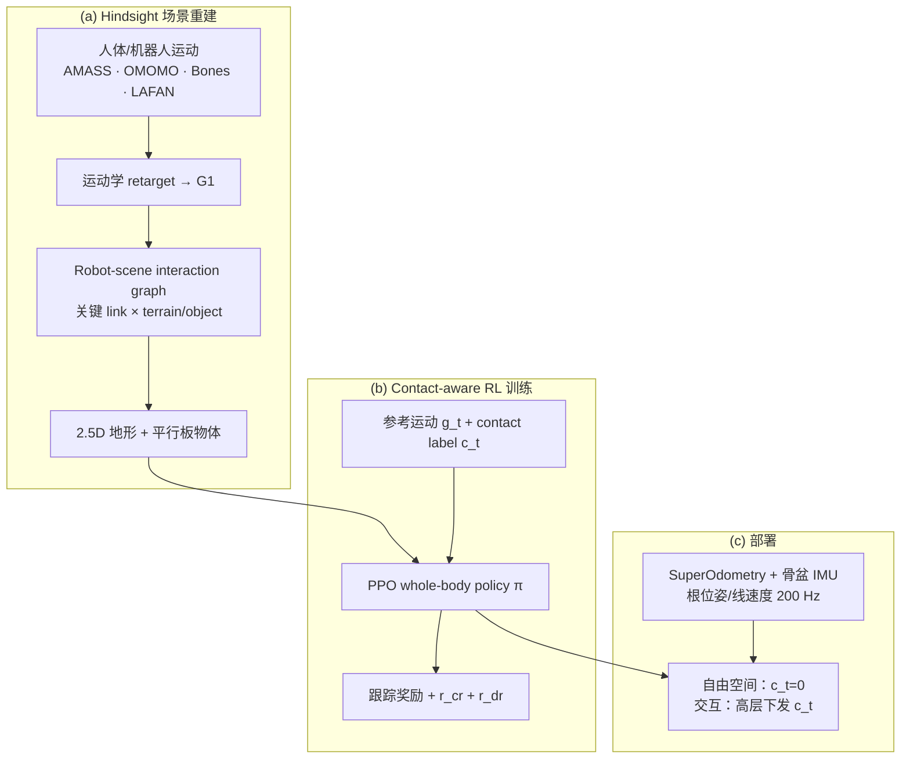

# SceneBot（Contact-Prompted Whole-Body Tracking with Scene-Interaction）

**SceneBot**（arXiv:2606.27581，Amazon FAR / Stanford / CMU）提出 **接触条件化（contact-prompted）** 的通用人形全身运动跟踪框架：在参考运动之外，高层只需指定 **哪些 body link 应与 terrain 或 object 建立接触**，单一 PPO 策略即可覆盖 **自由空间 locomotion、不平地形穿越与双手搬箱等全身操作**；训练数据来自 **hindsight scene reconstruction**——从 retarget 后机器人运动反推 **robot-scene interaction graph** 并合成地形与物体资产，无需大规模带场景标注的动捕库。

## 英文缩写速查

| 缩写 | 英文全称 | 简要说明 |
|------|----------|----------|
| WBT | Whole-Body Tracking | 全身参考运动跟踪控制 |
| PPO | Proximal Policy Optimization | 本文 whole-body contact-aware 策略训练算法 |
| GRF | Ground Reaction Force | 足底与地形接触产生的支撑反力 |
| RL | Reinforcement Learning | 在重建场景中用跟踪+接触奖励学习策略 |
| G1 | Unitree G1 Humanoid | 论文真机与 sim-to-sim 评测平台 |
| WBC | Whole-Body Control | 协调多肢关节满足平衡与接触任务 |

## 为什么重要

- **填补「通才 tracker 的接触鸿沟」：** 规模化 motion tracker（如 [SONIC](../methods/sonic-motion-tracking.md)、[Humanoid-GPT](./paper-humanoid-gpt.md)）主要在 **自由空间** 证明 scaling；SceneBot 指出纯运动学跟踪在 **物体/地形接触** 下存在物理歧义，并用 **per-link contact label** 作为轻量高层接口消解歧义。
- **单策略统一三类行为：** 论文 Table 1 对比声称，SceneBot 是首个在 **多样参考跟踪 + 地形 + 物体** 三维同时打勾的 **单策略** whole-body controller（相对 BeyondMimic、SONIC、TWIST、OmniRetarget、CHIP 等组合能力）。
- **数据引擎可复用：** **Hindsight reconstruction** 把 AMASS / OMOMO / Bones / LAFAN 等 **无场景上下文** 的人体运动变成 contact-rich 机器人-场景配对数据（约 **7.5 小时**），为「缺交互标注」提供可扩展路线，并与 [OmniRetarget](./paper-loco-manip-161-114-omniretarget.md) 的 **scene-aware retarget** 形成对照（论文：重建场景更利于 RL 收敛、抓取失败更少）。
- **工程闭环完整：** 真机 **SuperOdometry + 骨盆 IMU** 融合根状态（200 Hz）；项目页提供 **浏览器 MuJoCo 交互 demo** 与搬箱上楼等长时程真机视频，且强调 **全部 demo 单策略**。

## 流程总览

## 核心机制（归纳）

### Contact label 接口

| 设计 | 说明 |
|------|------|
| **输入** | $\pi(c_t, g_t, s_t, p_{\text{root,t}})$；$g_t$ 含关节/头腕 pose/根误差（遵循 BeyondMimic 类约定） |
| **$c_t$ 语义** | 二值向量：link $i \in \{\text{L/R wrist, L/R foot, pelvis}\}$ 是否应与 **terrain** 或 **object** 建立接触 |
| **非 vision task policy** | 标签只定义在机器人侧，不绑定具体物体 mesh；保持低层 tracker，高层可用规则/规划器/遥操作生成 $c_t$ |
| **自由空间回退** | 平地数据无 contact label 时，terrain reward 仅在 $c=1$ 激活；部署 **$c_t \equiv 0$** 即可跟踪常规平地动作 |

### Hindsight scene reconstruction

1. **Interaction graph：** 低相对速度/加速度 → 候选接触边；剪枝碰撞区间外冲突与物体 **force-closure** 不可行边。
2. **Terrain：** 2.5D elevation map，接触点处加 plateau → 合并相近高度 → 挖除机器人穿透区。
3. **Object：** 与接触面平行的 plate 集合；抓取轨迹由相关边空间均值确定。
4. **训练辅助：** 物体重建轨迹未必从地面静止开始 → 力闭合前 **heuristic stabilizing force**；**contact-mismatch termination** 限时建立期望接触。

## 评测：奖励与关键消融

- **$r_{\text{cr}}$：** desired/actual contact 一致（仅期望接触时计分）。
- **$r_{\text{dr}}$：** 累计接触时长，clip **0.5 s** 防拒释。
- **Global root 必要：** 无全局根位姿/线速度时，terrain 成功率 **100%→45%**，object **95%→20%**（局部跟踪漂移）。
- **Hand label 必要：** 无手部 contact label 训练 → 物体抓取成功率近零。
- **相对 SONIC（sim-to-sim，各 20 未见序列）：** free-space 同级（SR 均 100%）；object **95% vs 5%**；terrain **100% vs 15%**；sit **100% vs 0%**。

### 真机与状态估计

- **平台：** Unitree G1；笔记本 i5-13200H + RTX 3050 经以太网跑策略与估计。
- **根状态：** SuperOdometry（LiDAR）+ 骨盆 IMU 融合 pitch/roll；yaw 用 KF 融合角速度与 SuperOdometry；相对 mocap 平均位置误差 **0.032 m**、姿态 **0.018 rad**、线速度 **0.092 m/s**（10 次实验 **80%** 任务成功率）。

## 与代表性方法对比（论文 Table 1 摘要）

| 能力 | BeyondMimic | SONIC | OmniRetarget | CHIP | SceneBot |
|------|-------------|-------|--------------|------|----------|
| 多样参考跟踪 | ✗ | ✓ | ✗ | ✓ | ✓ |
| 地形交互 | ✗ | ✗ | ✓ | ✗ | ✓ |
| 物体交互 | ✗ | ✗ | ✓ | ✓ | ✓ |
| **单策略同时三项** | ✗ | ✗ | ✗ | ✗ | **✓** |

## 常见误区或局限

- **不是 vision-based loco-manipulation policy：** SceneBot 仍是 **低层 tracker**；物体几何由仿真重建场景提供，真机部署依赖状态估计与参考/label 流，而非端到端感知规划。
- **重建质量绑定 retarget：** 脚滑、物理不一致的生成动作会破坏 interaction graph（论文 §5）。
- **与 SONIC scaling 正交：** SceneBot 解决 **接触歧义与场景数据**，不否定 SONIC/Humanoid-GPT 在自由空间的 scaling 叙事；二者可组合为「scaling tracker + contact interface」。
- **代码/数据未开源：** 截至入库日项目页标注 **Coming Soon**；复现需等待官方 release。

## 与其他页面的关系

- [SONIC（规模化运动跟踪）](../methods/sonic-motion-tracking.md) — 自由空间强基线；SceneBot 在相同跟踪范式上扩展 **contact conditioning** 与 **场景重建数据**。
- [OmniRetarget](./paper-loco-manip-161-114-omniretarget.md) — **scene-aware retarget** 对照；SceneBot 主张 **reconstruction-first** 更利于训练稳定性。
- [CHIP](./paper-loco-manip-161-005-chip.md) — 同属接触相关人形控制，CHIP 强调 compliance hindsight；SceneBot 强调 **显式 contact label + 统一 tracker**。
- [Loco-Manipulation](../tasks/loco-manipulation.md) — 搬箱上楼、地形+物体长时程任务的应用坐标。
- [Contact-Rich Manipulation](../concepts/contact-rich-manipulation.md) — 接触丰富操作的概念层；SceneBot 提供 **全身 tracker 侧** 的 contact 接口实例。
- [人形运动跟踪方法选型](../queries/humanoid-motion-tracking-method-selection.md) — 将 SceneBot 纳入「接触丰富场景 tracking」分支。

## 推荐继续阅读

- 论文：<https://arxiv.org/abs/2606.27581>
- 项目页（含浏览器 demo）：<https://ericcsr.github.io/scenebot/>
- 对照：[SONIC 项目页](https://nvlabs.github.io/GEAR-SONIC/)
- 场景数据对照：[OmniRetarget 项目页](https://omniretarget.github.io/)

## 参考来源

- [scenebot_arxiv_2606_27581.md](../../sources/papers/scenebot_arxiv_2606_27581.md) — arXiv 策展摘录
- [scenebot-ericcsr-github-io.md](../../sources/sites/scenebot-ericcsr-github-io.md) — 项目页 demo 与控制说明

## 关联页面

- [SONIC（规模化运动跟踪）](../methods/sonic-motion-tracking.md)
- [BeyondMimic](../methods/beyondmimic.md)
- [Whole-Body Control](../concepts/whole-body-control.md)
- [Motion Retargeting](../concepts/motion-retargeting.md)
- [Loco-Manipulation](../tasks/loco-manipulation.md)
- [OmniRetarget](./paper-loco-manip-161-114-omniretarget.md)
- [人形运动跟踪方法选型](../queries/humanoid-motion-tracking-method-selection.md)
