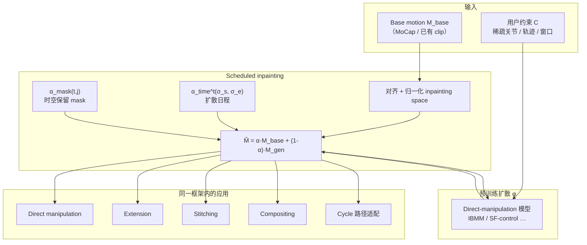

# Scheduled Inpainting：交互式生成式运动编辑（GME）

**Scheduled inpainting**（*Interactive Generative Motion Editing via Scheduled Inpainting*，[arXiv:2607.29133](https://arxiv.org/abs/2607.29133)，DisneyResearch\|Studios / ETH Zürich）定义 **interactive generative motion editing（GME）**：对 **外部来源** 的已有动画 clip，在 **实时交互** 下同时做 **大结构编辑**（延长、拼接、合成）与 **稀疏空间 direct manipulation**，并通过 **training-free 推理** 接在 IBMM、SF-control 等预训练模型之上。

## 英文缩写速查

| 缩写 | 英文全称 | 简要说明 |
|------|----------|----------|
| GME | Interactive Generative Motion Editing | 本文任务：保留 + 生成式编辑 + 交互操控的统一工作流 |
| IBMM | Implicit Bézier Motion Model | 文内主 backone 之一；Bézier 运动表示 + 精确时空控制 |
| MoCap | Motion Capture | 可被 inpaint 保留/编辑的 exemplar 运动序列 |
| DNO | Denoising Noise Optimization | 推理基线：优化初始噪声以匹配编辑（离线、~10 s 级） |
| VFX | Visual Effects | 运动编辑主场景之一（与游戏开发并列） |
| DCC | Digital Content Creation | Maya / Blender / Houdini 等动画软件生态 |

## 为什么重要

- **填「只能生成、不能改旧片」的缺口**：CondMDI / IBMM 等可交互改 **自己刚生成的** 运动，但此前 **不能 structure-preserving 地编辑外部 MoCap**；文本编辑（MotionFix / MotionLab）又缺 **空间精度**。
- **Training-free 可插拔**：不改预训练权重，仅推理期混合 base motion——算力成本与 vanilla 采样同级（~25 步、~0.19 s），相对 noise-inversion（400+ 步）与 DNO（每 clip 优化）更适合 **迭代式艺术家工作流**。
- **与 [Generative Motion Rig](./generative-motion-rig.md) 互补**：GMR 把 generative betweener **嵌进 Blender**；本文给出 **exemplar 保留式编辑** 的算法核，可视为同组 Neural Motion Rig 线的 **编辑/inpainting 层**（二者均未开源）。

## 流程总览

## 核心结构 / 机制

### 1）Scheduled inpainting 混合

扩散每步将 **生成结果** 与 **base motion** 按强度混合后送回 denoiser：

- $\widehat{\mathcal{M}_{gen}^{0}} = \alpha^{t}\mathcal{M}_{base} + (1-\alpha^{t})\mathcal{M}_{gen}^{0}$
- $\alpha^{t} = \alpha_{time}^{t}(\sigma_s,\sigma_e) \times \alpha_{mask}(t,j)$

**日程** $\sigma_s/\sigma_e$：$t>\sigma_s$ 时完全保留 base；$t<\sigma_e$ 时不 inpaint；中间线性过渡——艺术家调节 **「多像原片」vs「多像新生成」**。

### 2）时空 mask 构造（按应用切换）

| 应用 | mask 要点 |
|------|-----------|
| Direct manipulation | 默认全 1 保留；在约束 $c_i$ 邻域用 Gaussian kernel 降低权重，允许局部生成 |
| Extension | 区间 $[t_s,t_e)$ 设 0，其余 1；生成段仍可再被拖拽编辑 |
| Stitching | 前 $T_0$ / 后 $T_1$ 帧 inpaint 两段 base，中间 $T_{gen}$ 纯生成过渡 |
| Compositing | 沿 **关节维** 对不同 clip 分区 inpaint |
| Cycle 适配 | root 生成或跟用户曲线，其余关节 inpaint stylized cycle |

### 3）Inpainting space（避免混合伪影）

- 首帧平移到原点，首尾方向对齐 +x；两序列分别 0-mean / 1-var 归一化。
- Root 用 **差分坐标**，其余 **root-relative**——避免反向行走、速度差 clip 平均成「原地抖」。
- 变换在 **模型原生表示之外** 进行：denoise 输出 → 转到 inpainting space 混合 → 再转回模型空间。

### 4）与 naive inpainting / 图像域技法对照

- MDM 式 **二值 inpainting**：被 inpaint 区域 **完全不可再编辑**。
- Noise-inversion / DNO：每 clip 需 **离线优化** 或 **数百步反演**，无法支撑实时迭代。
- 本文把图像域 partial inversion 思路扩展为 **用户可控 schedule + 时空 mask**，并首次系统覆盖 GME 任务集。

## 工程实践（速览）

| 项 | 说明 |
|----|------|
| 依赖模型 | 需 **direct-manipulation** 预训练扩散（文内 IBMM、SF-control；CondMDI 类全姿态约束较弱） |
| 延迟 | ~25 denoise 步 ≈ **0.19 s**/编辑（Table 2）；艺术家测试帧率低于传统插值但可接受 |
| 推荐 schedule | $\sigma_s=500,\ \sigma_e=50$ 在保留与编辑间平衡（ablation） |
| 开源 | **未开源** — 仅 PDF / arXiv / 项目页视频 |
| 源码运行时序图 | **不适用**（无可运行官方实现） |
| 机器人侧读法 | 产出仍是 **角色动画 clip**；上真机需 retarget + 跟踪；**不要**与 [GMR = General Motion Retargeting](../methods/motion-retargeting-gmr.md) 混淆 |

## 评测摘要

- **vs IBMM  alone**：无位移时 foot-sliding 相当（0.0105 vs 0.0101 m/frame），L2P/L2R **显著更低**（更保真 base）；有位移编辑时 foot-sliding 仅 +~1 mm/frame。
- **vs MotionLab / CondEditor / DNO / noise-inversion**：大结构编辑（如前滚→后滚）与稀疏约束跟随更稳；MotionLab 对 walk-back / 稀疏手部位移易失败。
- **Usability（n=2 专业艺术家，1 h）**：修复 parkour MoCap 穿透与 naive stitch；**非破坏性**与 crawl→run 自动过渡获好评。

## 局限与风险

- **分布外编辑**：超出训练分布的目标动作仍可能不可行；文内建议未来做 **可行性可视化**。
- **保留 vs 约束对抗**：inpainting 越强，部分生成模型越 **忽略新约束**。
- **高频细节**：生成式重建会损失少量高频，编辑结果一并受影响。
- **超长序列**：显著长于训练序列时，base 保真度下降。
- **闭源**：无法本地复现完整 DCC 集成；与 GMR 插件关系需以论文描述为准。

## 结论

**GME 的关键不是新 backbone，而是 training-free 的 scheduled inpainting：用日程 + 时空 mask 在「保留 exemplar」与「生成式改写」之间给出可调旋钮，并把延长/拼接/合成/拖拽收进同一交互框架。**

1. **任务定义本身有价值** — 首次系统地把 **外部 clip 的结构保留编辑** 与 **direct manipulation** 放进同一实时工作流；别把它当成 MotionFix 的文本编辑升级版。
2. **σ_s=500、σ_e=50 是实用默认** — ablation 显示这是在 LaFan1 / 内部集上 **保真 vs 可编辑性** 的甜点；完全不做 inpaint（1000/1000）重建误差暴涨。
3. **Inpainting space 对齐不是可选** — 反向 roll、异速 clip 混合时，不做对齐会出现 **飘向原关键帧再 warp** 的伪影（Figure 13）。
4. **相对 IBMM-only，保真是主增益** — 末帧随机位移 1 m 时 L2P 仍约为 IBMM 的一半量级；foot-sliding 代价很小（~1 mm/frame）。
5. **别用 offline inversion 冒充交互编辑** — DNO 20 步 ≈ 10.3 s 仍不够保真；noise-inversion 要 400 步才高保真，破坏迭代 UX。
6. **制片选型** — 要 **Blender 插件式 generative keyframing** → [Generative Motion Rig](./generative-motion-rig.md)；要 **已有 MoCap 的 generative 修片/stitch** → 本文；要 **机器人 NPZ/URDF 确定性修整** → [关键帧工具选型](./robot-motion-keyframe-editors.md)。
7. **开源预期应放低** — 截至入库日 **无官方代码**；复现停留在算法层 + 自备 IBMM/SF-control 权重。

## 关联页面

- [Generative Motion Rig（Disney）](./generative-motion-rig.md) — 同组 DCC 集成；GMR 亦提及 inpainting 式 MoCap 编辑
- [ARDY](./ardy.md) — 交互式约束 **合成** 对照（改自生成流，非 exemplar 保留）
- [Diffusion-based Motion Generation](../methods/diffusion-motion-generation.md) — 扩散运动生成总览
- [机器人关键帧与运动编辑工具](./robot-motion-keyframe-editors.md) — 确定性 stitch/extend 对照
- [Character Animation vs Robotics](../concepts/character-animation-vs-robotics.md) — 表演意图 vs 物理可控
- [Blender](./blender.md) — 潜在 DCC 宿主（文内 animation software integration）

## 参考来源

- [sources/papers/scheduled_inpainting_arxiv_2607_29133.md](../../sources/papers/scheduled_inpainting_arxiv_2607_29133.md)
- [sources/sites/disney-scheduled-inpainting-gme.md](../../sources/sites/disney-scheduled-inpainting-gme.md)

## 推荐继续阅读

- [Disney Research 项目页](https://studios.disneyresearch.com/2026/07/30/interactive-generative-motion-editing-via-scheduled-inpainting/) — 摘要与 PDF
- [arXiv:2607.29133](https://arxiv.org/abs/2607.29133)
- [Implicit Bézier Motion Model（IBMM）](https://studios.disneyresearch.com/) — 文内主 backbone（同作者组）
