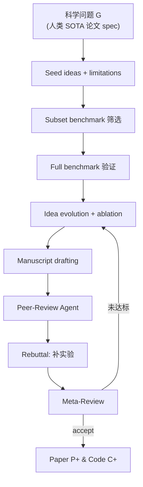

# ScientistTwo（arXiv:2609.19644）

**ScientistTwo**（*Pioneering the Human Knowledge Frontier with Autonomous AI*，Google Cloud AI Research 等，[arXiv:2609.19644](https://arxiv.org/abs/2609.19644)）是 **问题驱动** 的 expert-level **自主研究 multi-agent**：以顶会已接受论文所定义的挑战为输入，自动 **复现 SOTA → 提出并验证想法 → ablation → 写稿 → 模拟 peer-review + rebuttal 实验 → meta-review**，在 **107** 任务上报告 **80.4%** beat human SOTA（平均 **+25.2%** 相对增益）。

## 一句话定义

给定人类科学问题，多 agent 闭环完成「超越现有 SOTA 的实证研究 + 可审计论文与代码」，而非单指标 benchmark 刷分。

## 英文缩写速查

| 缩写 | 英文全称 | 简要说明 |
|------|----------|----------|
| SOTA | State of the Art | 人类已发表最优基线 |
| LLM | Large Language Model | 各 stage 生成与 critic |
| E2E | End-to-End | idea→code→exp→paper 全链 |
| CoE | Chain of Evidence | integrity audit 框架（沿袭 ScientistOne） |
| RL | Reinforcement Learning | 评测域之一（非唯一） |

## 为什么重要

- **AI Auto-Research 里程碑：** 相对 AI Scientist / ScientistOne，强调 **多数据集 holistic benchmark**、**ablation 驱动 refine**、**rebuttal 补实验**（非只改稿）。
- **机器人读者：** robotics 为 **八域之一**；本页服务 **研究自动化治理** 与 [ai-auto-research](../concepts/ai-auto-research.md) 交叉，**不** 替代 embodied 控制论文选型。
- **审计标准：** CoE Integrity Audit（分数复现、spec 合规、引用真实性、方法–代码一致）— 49/49 论文四维通过、0/1814 幻觉引用（论文报告）。

## 核心信息

| 字段 | 内容 |
|------|------|
| 机构 | Google Cloud AI Research；University of Waterloo（合作） |
| arXiv | [2609.19644](https://arxiv.org/abs/2609.19644) |
| 项目页 | <https://scientist-two.github.io/> |
| 生成论文数 | 86 篇（beat SOTA 子集） |
| 开源形态 | **分散 codebase**（随生成论文），无单一 monorepo |

## 流程总览

各 stage 采用 **critic → accept / refine / reject** 环（见论文 Table 1）。

## 工程实践

| 检查项 | 建议 |
|--------|------|
| 任务定义 | 输入是 **「超越某篇已接受论文」** — 非开放式 chat 研究 |
| 评测 | ScholarPeer 7.5/10、Stanford Agentic Reviewer 5.7/10 vs ICLR/NeurIPS 接受稿均值 |
| 复现 | 依赖各生成论文附带脚本；读 integrity audit 四维再信分数 |
| 与 autoresearch 对照 | [karpathy-autoresearch](./karpathy-autoresearch.md) 限 `train.py`+5min — ScientistTwo 是全稿+多域 |

## 源码运行时序图

**不适用**（无统一官方 harness 仓库；**部分开源**为 per-paper executable codebase，见项目页 86 篇预览）。若 Google 发布统一 agent 框架应另建 `sources/repos/`。

## 实验与评测读法

- **107 挑战：** 来自 ICLR / ICML / NeurIPS 等 **人类已接受** 工作；非机器人专用集。
- **80.4% success：** 相对 **原论文 human SOTA** 的指标提升 — 需逐篇读 domain 与 metric。
- **审稿对照：** 唯一在 Stanford Agentic Reviewer 上报告 **非零 accept rate（72.1%）** 的 autonomous agent（论文 Table）。

## 结论

**ScientistTwo 代表「审计过的 autonomous discovery」上限样本：强在闭环 empirical rigor + integrity，弱在仍依赖人类问题 formulation 与顶会 spec。**

1. **Problem-driven：** 人类给挑战，AI 找超越 SOTA 的路径 — 不是无目标探索。
2. **Rebuttal 执行实验** 是区别于「只会改 LaTeX」agent 的关键。
3. **Integrity audit** 应成为 AI 生成论文的 **最低信任门槛**。
4. Robotics 仅为评测域之一；读 control 论文请走本库 loco-manip / RL 实体页。
5. 分散 codebase — 复现单篇需进项目页具体 paper artifact。

## 局限与风险

- **Spotlight 级质量：** 论文自述尚未稳定达到 ICML Spotlight 线。
- **自动审稿偏置：** ScholarPeer / Agentic Reviewer ≠ 真人 AC 决策。
- **算力与成本：** 107 全规模实验的 compute 未对普通 lab 友好。

## 关联页面

- [ai-auto-research](../concepts/ai-auto-research.md)
- [karpathy-autoresearch](./karpathy-autoresearch.md)
- [paper-rsi-survey-2607-07663](./paper-rsi-survey-2607-07663.md)
- [recursive-self-improvement](../concepts/recursive-self-improvement.md)

## 参考来源

- [scientisttwo_arxiv_2609_19644.md](../../sources/papers/scientisttwo_arxiv_2609_19644.md)
- [scientist-two-github-io.md](../../sources/sites/scientist-two-github-io.md)
- [arXiv:2609.19644](https://arxiv.org/abs/2609.19644)

## 推荐继续阅读

- [ScientistTwo 项目页](https://scientist-two.github.io/)
- [AI Auto-Research 概念页](../concepts/ai-auto-research.md)
- [Hugging Face Papers 2609.19644](https://huggingface.co/papers/2609.19644)
