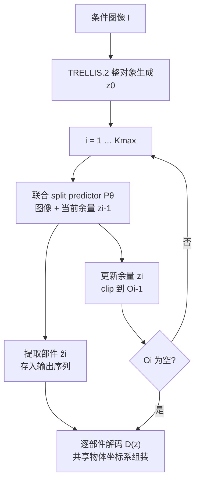

# SCULPT（减法式 3D 部件生成）

**SCULPT**（*Subtractive Composition for 3D Part Generation*，[arXiv:2608.13541](https://arxiv.org/abs/2608.13541)，[项目页](https://sculpt-part.github.io/)，2026）由 **上海交通大学** 与 **华为** 合作提出（Sikuang Li、Chen Yang、Jiemin Fang 等）：把 **part-aware 3D 生成** 从「先生成再切分」或「预定义布局加法合成」改为 **减法式组合**——在 **TRELLIS.2** 结构化潜空间里，每步由 **联合 split predictor** 同时去噪 **一个提取部件** 与 **更新余量**，二者在 **原生稀疏支撑并集** 上共享 **interface shell**，rollout 至余量为空或达上限，部件数随对象自适应。

## 一句话定义

**从完整对象的图像条件结构化潜表示出发，迭代「提取一个语义部件 + 更新余量」的耦合去噪，使部件边界、几何与纹理在生成过程中共同决定，而非生成后再分割或事后拼合。**

## 英文缩写速查

| 缩写 | 英文全称 | 简要说明 |
|------|----------|----------|
| SCULPT | Subtractive Composition for 3D Part Generation | 本文方法名；减法式 3D 部件组合生成 |
| CD | Chamfer Distance | 点云/网格几何误差；越低越好 |
| CFM | Conditional Flow Matching | 条件流匹配；TRELLIS.2 各阶段 rectified-flow 训练目标 |
| DiT | Diffusion Transformer | 扩散 Transformer 骨干；联合 split predictor 的基础块 |
| O-Voxel | Occupancy Voxel | TRELLIS.2 稀疏体素支撑表示；结构化潜空间的第一阶段 |
| VLM | Vision-Language Model | 视觉-语言模型；本文主条件为单张图像而非文本 |

## 为什么重要

- **编辑友好资产：** 动画、多材质制造与交互内容需要 **可独立编辑的语义部件**，同时整体仍视觉连贯；SCULPT 把部件数从「固定槽位/布局」改成 **rollout 长度**，缓解 variable-cardinality 难点。
- **生成器内分解：** 相对 PartField / SAM3D 等 **后验分割**，减法式让生成器在 split 时同时完成 **接触面两侧** 的几何与材质，而非只给已有表面贴标签。
- **相对加法部件合成：** 相对 OmniPart / Part123 等 **直接多部件合成**，从完整对象 latent 出发可改善 **共享边界对齐** 与 **组装后整体保真**（论文 object-level CD 亦 SOTA）。
- **仿真数据上游：** 与 [PhysForge](./paper-physforge-physics-grounded-3d-assets.md)、[PhysX-Omni](./physx-omni.md) 同属 **单图→部件化 3D 资产** 谱系，但 SCULPT 聚焦 **纹理部件几何分解**，不自带关节/物理字段。

## 核心信息

| 项 | 内容 |
|----|------|
| **机构** | 上海交通大学（SJTU）、华为（Huawei） |
| **输入** | 单张条件图像 \(\mathcal{I}\)（数据集渲染 / T2I / 真实照片） |
| **输出** | 有序、变长的带纹理部件网格序列 + 可组装完整对象（共享 \([-1,1]^3\) 物体坐标系） |
| **骨干** | 预训练 **TRELLIS.2** 整对象生成器 \(G_\phi\) + 三阶段 **decomposition flow transformer** split predictor \(P_\theta\) |
| **训练数据** | **PartVerse-XL**（过滤后 37,425 对象 / 330,455 supervised splits） |
| **开源** | **未开源**（截至 2026-08-24：项目页无 GitHub/HF；见 [sites 归档](../../sources/sites/sculpt-part-project.md)） |

## 核心原理

### 方法栈

| 模块 | 作用 |
|------|------|
| \(G_\phi\)（TRELLIS.2） | 图像 → 完整对象结构化潜变量 \(\boldsymbol{z}_0=(\boldsymbol{z}^v,\boldsymbol{z}^g,\boldsymbol{z}^m)\) |
| Joint denoising branch | 自 TRELLIS.2 初始化；图像 + flow time 条件下预测 part–remainder 耦合速度场 |
| Remainder-control branch | ControlNet 式分支；零初始化残差把 **当前余量** 注入各 DiT block |
| \(\mathcal{L}_{\mathrm{comp}}\) | 稀疏阶段：预测部件∪余量可微并集应覆盖输入余量支撑（\(\lambda_{\mathrm{comp}}=0.1\)） |
| Support clip | 推理时将硬化支撑 **clip 到 \(\mathcal{O}_{i-1}\)**，保证 subtractive 状态不扩张 |
| Decoder \(\mathcal{D}\) | 各输出潜变量独立解码为纹理网格，**无需** per-part 配准或重缩放 |

### 流程总览

关键直觉：**分割式**保留外壳但边界事后决定；**加法式**暴露部件数但边界易裂；SCULPT 用 **固定签名、变长 rollout** 的 part–remainder 耦合去噪，在 **interface shell** 上允许支撑重叠，使相邻部件在原生 3D 支撑上对齐。

## 源码运行时序图

**不适用**（截至 2026-08-24）。项目页与论文均未提供可运行官方代码、权重或公开训练入口；仅有 Web 交互 demo 与 PDF。若后续开源，应补 `sources/repos/` 并在本节约成 `sequenceDiagram`（对齐 README 的 infer / rollout 脚本）。

## 工程实践

| 项 | 建议 / 论文设定 |
|----|----------------|
| 上游依赖 | 需 **TRELLIS.2** 公开 checkpoint 与 O-Voxel 三阶段解码栈 |
| Rollout 上限 | \(K_{\max}=24\)；空余量提前终止；非空 capped remainder 作为额外输出保留 |
| 占用阈值 | 稀疏阶段 \(\tau_{\mathrm{occ}}\) 硬化 + clip（消融显示 clip 对 CD 关键） |
| 训练规模 | 32 GPU × batch 1 × 800K steps；三阶段 predictor 各 30 blocks |
| Split 过滤 | 几何/材质阶段丢弃 <8 或 >8192 token 的 extracted part（约 1.5% splits） |
| 评测协议 | PartObjaverse：部件匈牙利匹配 + 语义组合并 + 组装对象三级 CD/F1 |
| 复现现状 | **代码未发布** — 适合架构/指标选型，不能当可复现基线仓库 |
| 下游 | 内容创作、材质分派、爆炸视图编辑；**不含** 关节/物理仿真字段（见 PhysForge 对照） |

## 实验与评测

- **PartObjaverse（200 mesh，与训练集标签独立）：**
  - **Part level CD：** **0.0107**（OmniPart 0.0136；TRELLIS.2+PartField 0.0115，约 **−7.0%**）。
  - **Part level F1@.05：** **0.7599**（OmniPart 0.7025）。
  - **Object level CD：** **0.0020**（OmniPart 0.0032）；**F1@.05 0.9212**（0.8732）。
- **消融（part level）：** 仅稀疏阶段适配 CD **0.0439**；去 composition loss **0.0279**；去 clip **0.0260** → 三件套（全阶段适配 + \(\mathcal{L}_{\mathrm{comp}}\) + clip）缺一不可。
- **泛化：** 四张 benchmark 图 + T2I + 真实 tumbler 照片；部件带木/金属/陶瓷等纹理，组装保持原物体轮廓。
- **复杂案例：** 递归对已提取部件再 split 可达 **100+** 细粒度组件（项目页演示）。

## 结论

**SCULPT 把 part-aware 3D 生成改写成「整对象 latent 上的减法式 part–remainder 联合去噪」，真影响是 PartObjaverse 上部件与组装整体几何同时 SOTA，且边界在生成中而非分割后决定；代价是绑定 TRELLIS.2 生态、rollout 有上限，且截至入库日无可复现代码。**

1. **真影响：减法式 rollout** — 用固定两步输出接口表达变长部件数，缓解加法/槽位模型的 cardinality 建模难。
2. **真影响：interface shell** — 原生稀疏支撑并集 + 重叠边界，避免硬体素面划分导致的缝隙与材质断裂。
3. **真影响：相对后验分解** — 对 TRELLIS.2+PartField part-level CD 约 **−7.0%**，组装对象 CD/F1@.05 亦领先。
4. **真影响：相对直接部件生成** — 对 OmniPart part CD **0.0107 vs 0.0136**，object F1@.05 **0.9212 vs 0.8732**。
5. **次要代价：F1@.1 在 part/semantic 级略低于 TRELLIS.2+PartField** — 更粗阈值下后验分解偶发更高，但 F1@.05 与 CD 仍偏 SCULPT。
6. **部署读法：单图 in-the-wild** — 支持真实照片，但依赖 TRELLIS.2 整对象先验与 PartVerse 风格监督。
7. **部署读法：未开源** — 目前仅适合方法与指标对照，不能本地跑通训练/推理。

## 与其他工作对比

| 路线 | 代表 | 相对 SCULPT |
|------|------|-------------|
| 后验 3D 分割 | TRELLIS.2 + PartField / SAM3D | 保留整对象外壳，但边界事后决定；SCULPT part-level CD 约 **−7.0%** |
| 直接部件生成 | OmniPart、Part123 | 暴露变长部件数，但共享边界易裂；SCULPT object F1@.05 **0.9212 vs 0.8732**（OmniPart） |
| 物理接地部件化 | [PhysForge](./paper-physforge-physics-grounded-3d-assets.md) | 含关节/物理字段与 sim-ready 导出；SCULPT 聚焦 **纹理几何分解** |
| Sim-ready 统一生成 | [PhysX-Omni](./physx-omni.md) | VLM + TRELLIS 解码刚/软/关节体；非减法式 recurrent split |
| 程序化资产 | [Articraft](./articraft.md) | Agent + SDK 符号生成；非学习式 latent subtractive |
| 薄壳单图 3D | [DiffGI](./paper-diffgi.md) | geometry image 薄壳；非部件级 subtractive 分解 |

## 局限与风险

- **无公开代码/权重：** 不能复现 Table 1 或接入 [3DGenStudio](./3dgenstudio.md) 类 Comfy 管线。
- **Rollout 上限：** \(K_{\max}=24\)；超复杂装配可能留下 capped remainder，需人工或二次处理。
- **非 sim-ready：** 输出为 **带纹理部件网格**，不含关节、质量、affordance 等仿真字段；交互仿真仍看 [PhysForge](./paper-physforge-physics-grounded-3d-assets.md) / [Articraft](./articraft.md)。
- **训练域：** PartVerse-XL 过滤 Objaverse 子集；极薄结构、非流形或开边界对象（对比 [DiffGI](./paper-diffgi.md) 薄壳路线）未单独强调。
- **误区：减法式 = 传统 mesh boolean。** 这里是 **潜空间 recurrent split + 流匹配去噪**，不是 CAD 布尔减材。

## 关联页面

- [PhysForge](./paper-physforge-physics-grounded-3d-assets.md) — VLM 蓝图 + KVI 扩散的 **物理接地部件化** 生成；共享 PartObjaverse 评测语境
- [PhysX-Omni](./physx-omni.md) — VLM + TRELLIS 解码的 **sim-ready** 统一资产生成
- [DiffGI](./paper-diffgi.md) — 另一路 **单图 3D** 表征（geometry image + 薄壳）
- [3DGenStudio](./3dgenstudio.md) — 含 TRELLIS.2 工作流的 **3D 生成工程栈**
- [Articraft](./articraft.md) — **程序化** sim-ready 资产生成对照
- [Sim2Real](../concepts/sim2real.md) — 生成资产进入仿真/真机数据管线的总语境
- [Manipulation](../tasks/manipulation.md) — 操作仿真对 **可编辑部件资产** 的需求背景

## 参考来源

- [SCULPT 论文摘录](../../sources/papers/sculpt_arxiv_2608_13541.md)
- [SCULPT 项目页归档](../../sources/sites/sculpt-part-project.md)

## 推荐继续阅读

- 论文 PDF：<https://arxiv.org/pdf/2608.13541>
- 项目页交互 demo：<https://sculpt-part.github.io/>
- TRELLIS.2 骨干（Microsoft）：<https://arxiv.org/abs/2512.14692>（结构化 3D 潜空间整对象生成；SCULPT 直接初始化自此）
