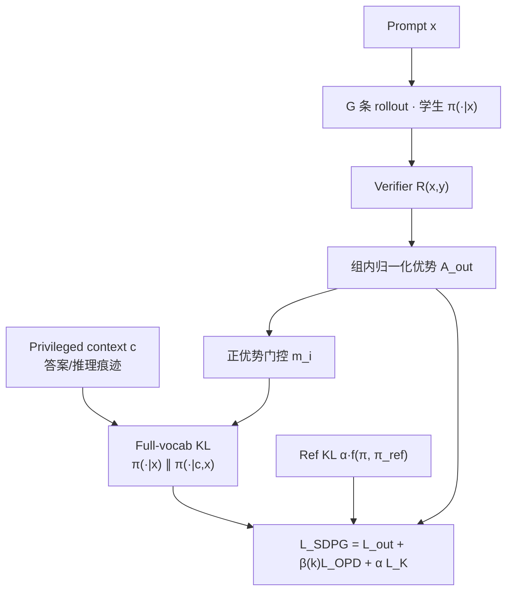

# SDPG（自蒸馏策略梯度 · LLM RLVR）

**SDPG**（**S**elf-**D**istilled **P**olicy **G**radient，[arXiv:2606.04036](https://arxiv.org/abs/2606.04036)）是 UCLA / Princeton 等提出的 **LLM 推理后训练** 框架：在 **GRPO/DAPO** 的稀疏 verifier 优势上，叠加 **全词表 on-policy 自蒸馏**（同一模型在 privileged context 下作教师、无 context 下作学生，reverse KL）与 **reference-policy KL** 正则。代码：[lauyikfung/SDPG](https://github.com/lauyikfung/SDPG)（**已开源**，基于 [verl](https://github.com/volcengine/verl)）。

> **同名消歧：** 机器人 **视觉 RL** 另有 **Stochastic Decoupled Policy Gradient**（[arXiv:2605.26478](https://arxiv.org/abs/2605.26478)）→ [paper-sdpg-visual-rl-stochastic-decoupled](./paper-sdpg-visual-rl-stochastic-decoupled.md)。

## 一句话定义

把 **privileged context 的全词表自蒸馏** 写成与 GRPO 互补的稠密 token 信号，并用 **正优势门控 + β 调度 + ref KL** 稳住 RLVR 训练。

## 英文缩写速查

| 缩写 | 英文全称 | 简要说明 |
|------|----------|----------|
| SDPG | Self-Distilled Policy Gradient | 本文 LLM 后训练方法 |
| RLVR | Reinforcement Learning with Verifiable Rewards | 可验证奖励的 LLM 强化学习 |
| GRPO | Group Relative Policy Optimization | 组内相对优势、无 critic |
| OPD | On-Policy Distillation | 在学生 rollout 分布上蒸馏 |
| KL | Kullback–Leibler divergence | 分布散度；本文含 reverse/full-vocab KL |
| DAPO | Decoupled Clip and Dynamic sAmpling Policy Optimization | GRPO 族 dual-clip 变体 |

## 为什么重要

- **稀疏奖励瓶颈：** GRPO 等 RLVR 把同一序列级优势赋给每个 token，信用分配粗；纯自蒸馏（OPSD/OPCD）稠密但缺 verifier 时可能强化错误轨迹。
- **SDPG 合并两路监督：** \(\mathcal{L}_{\text{out}}\)（verifier / GRPO）+ \(\beta \mathcal{L}^{+}_{\text{OPD}}\)（privileged 全词表 KL）+ \(\alpha \mathcal{L}_{\mathcal{K}}(\pi_\theta,\pi_{\text{ref}})\)。
- **理论澄清：** reverse KL \(D_{\mathrm{KL}}(p_t\|\mathrm{SG}[q_t])\) 在学生侧梯度等价于 **中心化 log-ratio 优势** 的策略梯度步，便于与 RPG/UFKL 族统一。
- **工程可复现：** verl + Ray + Qwen3-4B 数学 DAPO 脚本；对比 GRPO / OPSD / RLSD。

## 流程总览



## 核心机制（知识归纳）

### 1. 双分布与全词表 OPD

- 学生：\(p_t(a)=\pi_\theta(a\mid x,y_{<t})\)
- 教师（同参）：\(q_t(a)=\pi_\theta(a\mid c,x,y_{<t})\)
- 蒸馏项：\(D_{\mathrm{KL}}(p_t\|\mathrm{SG}[q_t])\) 在 `update_policy` 内 **on-the-fly** 计算，无需预存教师 logprob。

### 2. 与 GRPO 的耦合

- Outcome 项沿用 **DAPO dual-clip PPO** + 组内 **归一化标准差** 优势（与 Dr.GRPO 等稳定技巧同族）。
- **正优势门控**（`BETA_POSITIVE_ADV_ONLY`）：仅在 \(A_{\text{out}}>0\) 的 response 上启用蒸馏，减轻错误轨迹上的教师噪声。
- **β warmup-decay**：训练早期减弱过强教师信号。

### 3. Reference KL 模式

| `KL_MODE` | α 项形态 |
|-----------|----------|
| `fkl` / `rkl` | 标准 forward / reverse KL 变体 |
| `ufkl` / `urkl` | 非归一化 RPG 锚（默认 **urkl**） |

### 4. 数据格式

```
<actor question>[TEACHER_CONTEXT_TOKEN]<teacher context>
```

`rl_dataset.py` 在 token 处切分 actor / teacher 输入；GRPO 基线用 **无 teacher** parquet。

## 实验与评测

- **设置：** Qwen3-4B + 数学 DAPO boxed 数据；组大小 \(n=8\)；`train_batch_size=128`；8× GPU（README）。
- **对比：** GRPO（无 teacher）、OPSD（frozen ref teacher）、RLSD（证据重加权）、**SDPG**（当前 π 作 privileged teacher + ref KL）。
- **指标：** 数学 verifier 正确率 / 稳定性（论文；本页不搬运完整表格，以 PDF 为准）。
- **消融轴：** `KL_MODE`、`BETA`/`ALPHA`、`BETA_POSITIVE_ADV_ONLY`、`BETA_WARMUP_STEPS`。

## 与其他工作对比

| 方法 | 稠密信号 | Teacher | 与 SDPG 差异 |
|------|----------|---------|--------------|
| GRPO | 无（仅序列级 verifier） | 无 | SDPG 加全词表 privileged KL |
| OPSD | 全词表 KL | **Frozen** π_ref(·\|c,x) | SDPG 用 **当前** π，并保留 GRPO outcome |
| RLSD | 重加权 advantage | 当前 π | SDPG 显式 KL 项 + ref 正则 |
| [Prism-GRPO](./paper-prism-grpo.md) | quality 打破同结果组 | 无 | **VLA 机器人** GRPO；非 LLM 数学 |

## 源码运行时序图

```mermaid
sequenceDiagram
    autonumber
    actor Dev as 开发者
    participant Ray as Ray 集群
    participant Verl as verl / rpg2_trainer
    participant DS as rl_dataset.py
    participant Actor as πθ 学生
    participant Teach as πθ(·|c,x) 教师
    participant Ref as π_ref 冻结
    Dev->>Ray: ray start --head --num-gpus=8
    Dev->>Verl: run_qwen3_4b_sdpg_boxed.sh
    Verl->>DS: 加载 teacher parquet
    loop 每训练步
        DS->>Actor: prompt x（无 c）
        Actor->>Verl: G 条 rollout + logprob
        Verl->>Verl: verifier → A_out
        DS->>Teach: x + c 全序列
        Teach->>Verl: full-vocab q_t
        Verl->>Verl: gated KL + clip loss + α·KL(π, π_ref)
        Verl->>Actor: 更新 θ
    end
```

**内存注意：** SDPG 在 `update_policy` 同时物化 \((B,T,V)\) actor+teacher logits；OOM 时降 `gpu_memory_utilization`（README）。

## 工程实践

| 项 | 内容 |
|----|------|
| **开源状态** | **已开源** — [lauyikfung/SDPG](https://github.com/lauyikfung/SDPG) |
| **硬件** | 默认 **8×** A100/H100 级 GPU |
| **依赖** | verl、Ray、PyTorch 2.6、Qwen3-4B |
| **脚本** | `examples/rpg2_trainer/run_qwen3_4b_sdpg_boxed.sh` |
| **领域** | **LLM 数学推理 RLVR**，非机器人视觉控制 |

## 结论

**SDPG 在 RLVR 的稀疏 verifier 信号之外，用同模型 privileged 分支提供稠密全词表自蒸馏，并以门控与 β 调度避免错误轨迹被强化。**

1. **双监督** — outcome GRPO + per-token privileged OPD，互补稀疏与稠密信用。
2. **梯度同一性** — reverse full-vocab KL 在学生侧可读作策略梯度，便于与 KL-regularized PG 理论对齐。
3. **稳定器** — 正优势门控、β warmup-decay、frozen ref KL（默认 urkl）。
4. **实证** — Qwen3-4B 数学任务上优于 GRPO 与 OPSD/RLSD 等自蒸馏基线（论文；细节以 PDF 为准）。
5. **复现栈** — verl + 公开 parquet + 一键脚本；注意 8 GPU 与 logits 显存峰值。
6. **与机器人 SDPG 无关** — 仅缩写相同；VLA 侧 GRPO 改进见 [Prism-GRPO](./paper-prism-grpo.md)、[Temporal GRPO](./paper-temporal-grpo.md)。

## 局限与风险

- **算力门槛：** 默认 8 GPU，非单卡消费级可复现。
- **Privileged context 依赖：** 数学任务用「正确答案」作 c；其他领域需设计可验证的 privileged 信号。
- **verl 版本耦合：** 升级 verl 可能破坏 API；锁定 commit 再跑实验。

## 关联页面

- [Reinforcement Learning](../methods/reinforcement-learning.md)
- [Prism-GRPO](./paper-prism-grpo.md)（VLA 侧 GRPO 改进）
- [SDPG 视觉 RL](./paper-sdpg-visual-rl-stochastic-decoupled.md)（同名消歧）

## 参考来源

- [sources/papers/sdpg_self_distilled_policy_gradient_arxiv_2606_04036.md](../../sources/papers/sdpg_self_distilled_policy_gradient_arxiv_2606_04036.md)
- [sources/repos/sdpg-lauyikfung.md](../../sources/repos/sdpg-lauyikfung.md)
- [sources/sites/sdpg-lauyikfung-website.md](../../sources/sites/sdpg-lauyikfung-website.md)

## 推荐继续阅读

- 项目页：<https://lauyikfung.github.io/SDPG>
- 论文：<https://arxiv.org/abs/2606.04036>
- GitHub：<https://github.com/lauyikfung/SDPG>
- [verl](https://github.com/volcengine/verl)
