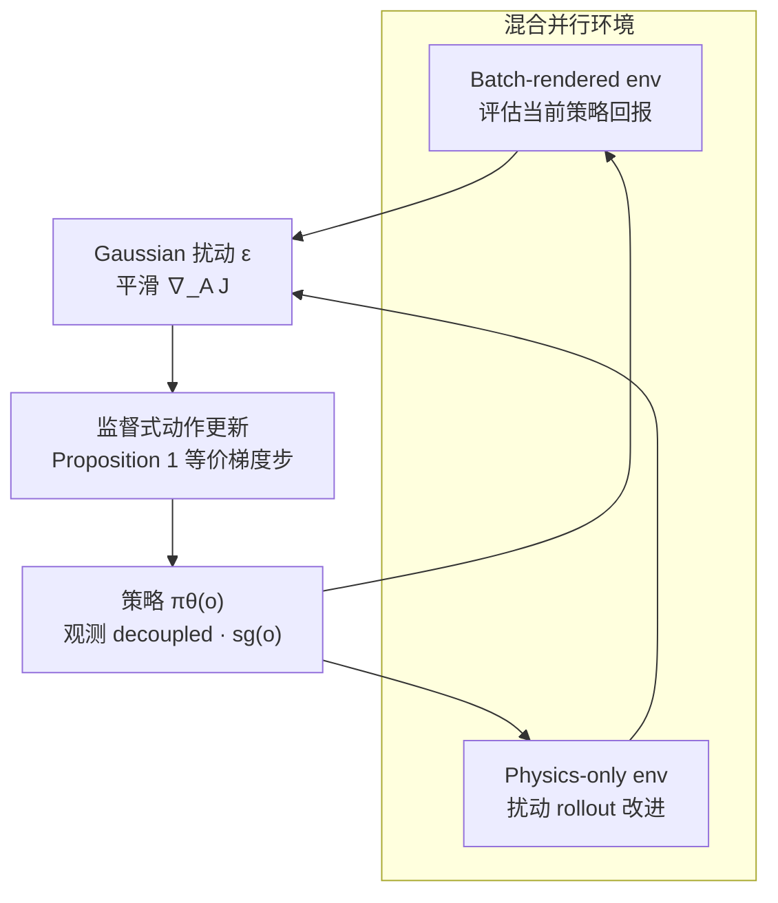
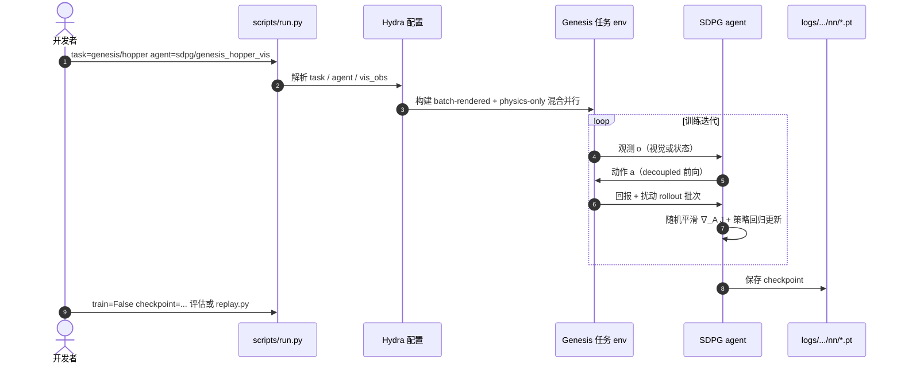

# SDPG（随机解耦策略梯度 · 视觉 RL）

**SDPG**（**S**tochastic **D**ecoupled **P**olicy **G**radient，[arXiv:2605.26478](https://arxiv.org/abs/2605.26478)）是 Yale / SJTU / Sydney 等提出的 **轻量视觉 on-policy RL** 方法：用 **随机扰动** 估计轨迹级梯度，避免全长可微反传；结合 **decoupled**（观测 stop-gradient）与 **混合并行环境**（少量 batch-rendered + 大量 physics-only），在 **单张 RTX 4080** 上 **数小时内** 端到端训练多样 visuomotor 策略。项目页：[haoxiangyou.github.io/sdpg-website](https://haoxiangyou.github.io/sdpg-website/)；代码：[HaoxiangYou/SDPG](https://github.com/HaoxiangYou/SDPG)（**已开源**）。

> **同名消歧：** 缩写 SDPG 亦指 UCLA 的 LLM **Self-Distilled Policy Gradient**（[arXiv:2606.04036](https://arxiv.org/abs/2606.04036)）→ [paper-sdpg-self-distilled-policy-gradient](./paper-sdpg-self-distilled-policy-gradient.md)。

## 一句话定义

用 **随机平滑轨迹梯度 + 解耦视觉反传 + 渲染/物理混合并行**，在消费级单卡上把 **端到端视觉 on-policy RL** 做到与蒸馏同量级墙钟，并支撑 **Go2 零样本 sim2real**。

## 英文缩写速查

| 缩写 | 英文全称 | 简要说明 |
|------|----------|----------|
| SDPG | Stochastic Decoupled Policy Gradient | 本文视觉 RL 方法（勿与 LLM 自蒸馏 SDPG 混用） |
| RL | Reinforcement Learning | 强化学习 |
| PG | Policy Gradient | 直接优化策略参数的梯度法 |
| PPO | Proximal Policy Optimization | 高并行 on-policy 基线（视觉版显存极高） |
| Sim2Real | Simulation to Real | 仿真策略零样本部署真机 |
| RGB | Red Green Blue | 第三人称或 egocentric 彩色图像观测 |
| GPU | Graphics Processing Unit | 训练与 batch 渲染算力 |

## 为什么重要

- **视觉 on-policy 的显存墙：** 视觉 PPO 常需 **4096** 级并行 batch 渲染，Hopper 级任务即可 **~48–50 GB**；SDPG 在 **64** batched env 下约 **10 GB**，与 DrQ-v2 / DreamerV3 / 蒸馏同量级。
- **相对蒸馏：** teacher-student（如 [GR00T Visual Sim2Real](./gr00t-visual-sim2real.md)）快但受 **信息不对称** 与 **DAgger 分布偏移** 限制；SDPG 主张 **端到端** 视觉策略仍可在墙钟上竞争。
- **相对一阶可微 RL：** 避免长链接触反传与软接触近似；兼容 **非可微** 奖励与主流刚体仿真器（实现基于 [Genesis](./genesis-sim.md)）。
- **benchmark + 真机：** 发布 **egocentric** 任务套件（RGB/depth、单/多相机 + 本体感知）；**Unitree Go2** RealSense 深度导航 **<2 h** 仿真训练后 **零样本** 上真机。

## 流程总览

## 核心机制（知识归纳）

### 1. 随机解耦策略梯度

- **Decoupled：** \(\mathbf{a}_t = \pi(\cdot \mid \mathrm{sg}(\mathbf{o}_t), \theta)\)，不反传渲染/传感器路径，降显存。
- **Stochastic：** 用扰动动作序列 \(\mathbf{A}+\delta\mathcal{E}\) 的回报差估计 \(\nabla_{\mathbf{A}}\mathcal{J}\)，等价于平滑 surrogate 的梯度（Theorem 1），**无需** 轨迹全可微。
- **监督重写（Proposition 1）：** 梯度步可写为 \(\|\mathbf{A} - \mathrm{sg}(\mathbf{A} + \mathbf{d}(\mathbf{A}))\|^2\) 的回归，便于与现有 on-policy 栈组合。

### 2. 混合环境与工程稳定器

- **Batch-rendered：** 带像素观测，测策略表现。
- **Physics-only：** 无渲染负担，承载扰动 rollout → **数量级减少** 需渲染的并行数。
- **自适应探索** + **reward-invariant 归一化** 抑制数值爆炸（论文对比 SAPO 等梯度尖峰）。

### 3. 评测与 sim2real

- **Visual MuJoCo：** 奖励与 **状态策略** 对齐；墙钟接近 **蒸馏**，显著快于 DrQ-v2 / DreamerV3；Humanoid 任务最终回报更高（项目页 Fig.2）。
- **Egocentric 套件：** 灵巧操作 + 困难 locomotion，统一 **端到端 SDPG** 训练。
- **Go2：** egocentric **深度** 感知，崎岖地面/箱子/楼梯；仿真 **<2 h** 单 GPU → 真机 **零样本**。

## 实验与评测

- **Visual MuJoCo（第三人称 RGB）：** 最终回报对齐 **状态策略**；墙钟与 **蒸馏** 同量级，显著快于 DrQ-v2 / DreamerV3；Humanoid 任务回报更高（项目页 Fig.2）。
- **显存（64 batched env，GB）：** SDPG ~10.2–10.5；视觉 PPO† ~48–50；DrQ-v2 / DreamerV3 / Distillation ~8–11.6（†PPO 按 4096 env 估计）。
- **Egocentric 套件：** 灵巧操作 + 困难 locomotion；RGB/depth、单/多相机；全部 **端到端 SDPG** 训练。
- **Go2 sim2real：** RealSense 深度 egocentric；崎岖/箱子/楼梯；**零样本** 部署（项目页视频）。

## 与其他工作对比

| 方法 | 视觉训练范式 | 典型并行/显存痛点 | SDPG 相对定位 |
|------|--------------|-------------------|---------------|
| 视觉 PPO | 端到端 on-policy | 4096 env batch 渲染 → **~50 GB** | 混合 env → **~10 GB** |
| DrQ-v2 / DreamerV3 | 离策略 / 世界模型 | 序贯更新慢 | SDPG 墙钟接近蒸馏、Humanoid 回报更高 |
| Teacher-Student 蒸馏 | 两阶段 IL | 快但信息不对称 | SDPG 主张端到端仍可比墙钟 |
| 一阶 decoupled PG | 可微仿真 | 长链梯度不稳 | SDPG 用随机扰动，无需轨迹可微 |

## 源码运行时序图

官方 [HaoxiangYou/SDPG](https://github.com/HaoxiangYou/SDPG) 以 **Hydra + Genesis** 为运行时主干：

复现路径：`conda` 环境 → `pip install -e ".[dev]"` → `python scripts/run.py`；视觉任务设 `task.config.vis_obs=True` 与 `agent=sdpg/*_vis`。

## 工程实践

| 项 | 内容 |
|----|------|
| **开源状态** | **已开源** — [GitHub](https://github.com/HaoxiangYou/SDPG) + 项目页链出 |
| **栈** | Python 3.11、Genesis（`externals/Genesis` 可选）、Hydra |
| **入口** | `scripts/run.py`（训练/评估）、`scripts/replay.py`（轨迹回放） |
| **自定义环境** | `envs/genesis_env/README.md` |
| **Baselines** | `externals/rl_games`、`drqv2` 等 vendored |

## 结论

**SDPG 把视觉 on-policy RL 的瓶颈从「必须几千路 batch 渲染」改成「少量渲染 + 大量物理扰动 rollout」，在单卡消费级 GPU 上实现端到端 visuomotor 训练，并在 Go2 上验证零样本 sim2real。**

1. **随机平滑轨迹梯度** — 替代全长可微反传，兼容非可微奖励与刚体接触仿真。
2. **Decoupled 观测** — 梯度不穿过渲染路径，显存与一阶视觉 RL 同量级下降。
3. **混合并行** — batch-rendered 评价值、physics-only 承载扰动；~10 GB vs 视觉 PPO ~48–50 GB（论文表）。
4. **墙钟与回报** — Visual MuJoCo 上接近蒸馏速度、优于 DrQ-v2/DreamerV3；Humanoid 回报更高。
5. **开源可复现** — Genesis + Hydra 官方仓；egocentric benchmark 与 Go2 视频可对照。
6. **选型边界** — 与 teacher-student 蒸馏互补：要端到端视觉 on-policy 且单卡预算紧时优先评估 SDPG；多阶段蒸馏仍可能在极复杂 loco-manip 上更稳。

## 局限与风险

- **Genesis 绑定：** 官方实现深度依赖 Genesis；迁移 Isaac Lab / MuJoCo 需自行移植环境接口。
- **Under review：** 截至入库日论文仍在审稿；数字以项目页为准。
- **与 LLM SDPG 同名：** 检索与引用须核对 arXiv（2605.26478 vs 2606.04036）。

## 关联页面

- [Reinforcement Learning](../methods/reinforcement-learning.md)
- [Sim2Real](../concepts/sim2real.md)
- [Genesis 仿真器](./genesis-sim.md)
- [GR00T Visual Sim2Real](./gr00t-visual-sim2real.md)（蒸馏路线对照）
- [SDPG（LLM 自蒸馏）](./paper-sdpg-self-distilled-policy-gradient.md)（同名消歧）

## 参考来源

- [sources/papers/sdpg_visual_rl_arxiv_2605_26478.md](../../sources/papers/sdpg_visual_rl_arxiv_2605_26478.md)
- [sources/repos/sdpg-haoxiangyou.md](../../sources/repos/sdpg-haoxiangyou.md)
- [sources/sites/sdpg-haoxiangyou-website.md](../../sources/sites/sdpg-haoxiangyou-website.md)

## 推荐继续阅读

- 项目页：<https://haoxiangyou.github.io/sdpg-website/>
- 论文：<https://arxiv.org/abs/2605.26478>
- GitHub：<https://github.com/HaoxiangYou/SDPG>
