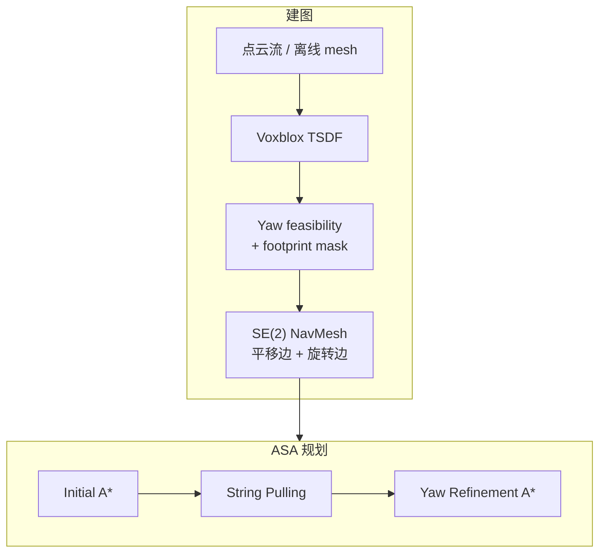

# SE(2) Navigation Mesh

**SE(2) Navigation Mesh**（arXiv:2607.01454，Robotic Systems Lab, ETH Zürich）重新定义全局导航地图：经典 NavMesh 用圆柱近似使 **可通行性与 yaw 无关**，对长方形四足/移动机械臂在窄门、楼梯、悬垂结构下 **过度保守**。本文用 **离散 yaw channel + continuous-yaw footprint mask + 分层连通图** 编码 $f(p,\psi)$，并给出 **ASA** 三阶段规划与 **Voxblox 在线 slab 更新**。

## 一句话定义

**把 NavMesh 从「位置二值可行」升级为「位置×朝向」联合可行域的结构化离散近似，使窄通道里「正着能过、横着不能」的 restricted 区域得以保留并高效规划。**

## 英文缩写速查

| 缩写 | 英文全称 | 简要说明 |
|------|----------|----------|
| SE(2) | Special Euclidean group in 2D | 平面位置 + 航向的配置空间 |
| ASA | A*–String Pulling–A* | 本文三阶段路径规划 |
| NavMesh | Navigation Mesh | 凸多边形 + 邻接图的全局导航表示 |
| TSDF | Truncated Signed Distance Field | Voxblox 等增量建图所用体素场 |
| HM3D | Habitat-Matterport 3D | 论文仿真场景来源之一 |
| PRM | Probabilistic Roadmap | 采样规划基线 |

## 为什么重要

- **表达能力–效率矛盾：** 点云/体素缺表面拓扑；稠密 mesh 全局搜索贵；经典 NavMesh 快但 **丢 yaw 自由度**。
- **>50% 可通行面积增益（6/6 HM3D 场景）：** 来自保留 **restricted region**，而非缩小安全距离。
- **Validity check 加速 ~100×：** SE(2) NM 查询 ~0.01 ms vs 体素 footprint ~1 ms——footprint 检查前移到建图阶段。
- **真机闭环：** ANYmal + ZED X Mini，全 onboard **4 Hz** 局部 slab 更新。

## 流程总览

## 核心机制

### 1）Yaw channel 与 continuous-yaw mask

- 离散 $N_\Psi$ 个航向；位置 $p$ 在第 $i$ 通道可行当 footprint 与 walkable voxel 对齐。
- **Continuous-yaw mask：** 覆盖 yaw bin 的 **扫掠 footprint 并集**——保证相邻 channel 间 **原地旋转** 有几何安全空间（易被忽略的关键细节）。

### 2）Safe / Restricted / Inaccessible

| 类型 | 条件 |
|------|------|
| Safe | 全部 yaw 可行 |
| Restricted | 部分 yaw 可行（**主要增益来源**） |
| Inaccessible | 无可行 yaw |

### 3）两类连通边

- **平移边：** 同一 yaw layer 内相邻多边形
- **旋转边：** 同一物理区域在相邻 yaw layer 的副本之间

### 4）ASA 三阶段

1. **Initial A*：** layer-specific region；代价含纵/横移与旋转 **估计时间**（非纯欧氏长度）
2. **String Pulling：** 在 polygon corridor 内拉直 **位置路径**（不优化 yaw）
3. **Yaw Refinement A*：** 固定走廊后重新优化朝向序列

### 5）在线 slab 更新

- 点云 → Voxblox mesh → 仅重建受影响 **slab**（水平/竖直窗口有界）
- 局部更新后重连邻接；避免全局重建随地图增长变慢

## 核心信息

| 字段 | 内容 |
|------|------|
| arXiv | [2607.01454](https://arxiv.org/abs/2607.01454) |
| 机构 | Robotic Systems Lab, ETH Zürich |
| 项目页 | [se2-navmesh.github.io](https://se2-navmesh.github.io/) |
| 真机 | ANYmal + Jetson Orin onboard |

## 实验与评测（文内摘要）

| 维度 | 结果 |
|------|------|
| 可通行面积 | 6 个 HM3D 场景 **均 +50%** vs 经典 NavMesh |
| 构建时间 | 多边形数 ×8–10，总时间仅 ×2–3 |
| 受限场景规划 | Tasks 1–4：**ASA 最短时间与最高 SPC** |
| 随机 start–goal | Gym/Studio 100 对；ASA SPC 领先 PRM-SE2NM 等 |
| 真机 | 多楼层、0.8 m 窄通道、门洞、悬垂障碍 |

## 工程实践

| 项 | 内容 |
|----|------|
| **开源状态** | 截至 2026-09-15 项目页 **未列 GitHub**（Anonymous Submission）；记为 **待发布** |
| **交互 demo** | 项目页 HM3D 场景 + 浏览器 ASA |
| **在线频率** | 局部 slab **4 Hz**（83 ms avg）；全局重建随地图增长落后 |

## 与其他工作对比

> 下表只做 **定位对照**：各方法的场景集、机器人足印与成功判据不同，**面积与 SPC 数字不可跨工作横比**；本页数字均出自论文与项目页的同一组实验。

| 对照 | 差异读法 |
|------|----------|
| **经典 NavMesh**（要替代的默认做法） | 用 **圆柱近似** 足印，可通行性与 yaw 无关——对长方形四足/移动机械臂在窄门、楼梯、悬垂结构下 **过度保守**。本文 6 个 HM3D 场景 **均 +50%** 可通行面积就是这一保守性的代价度量 |
| **均匀栅格 / 更高分辨率地图** | 提精度靠加密，内存与搜索成本随分辨率爆炸；SE(2) NavMesh 加的是 **yaw 维度的结构**（离散 channel + continuous-yaw mask），多边形数 ×8–10 而总构建时间仅 ×2–3 |
| **PRM-SE2NM 等采样规划**（论文对照组） | 随机 start–goal 100 对里 ASA 的 SPC 领先；但读法要分场景——ASA 的优势集中在 **拓扑受限** 环境，开放区域 sampling planner 可能更快，只是路径代价更高 |
| **isolated-yaw 逐层检查** | 只验单个 yaw 层的可行性，会误判相邻朝向间的可达性；**continuous-yaw footprint mask** 是保证层间旋转安全的必要构造，属本文的关键实现细节而非调参 |
| [足迹规划](../concepts/footstep-planning.md) | **下游而非竞品**：本文产出的是全局 SE(2) 可行域与路径，落脚点选择仍归足迹规划层。不要把 4 Hz 的 slab 更新频率当成步态控制频率 |
| [MPC](../methods/model-predictive-control.md) | 同样在栈上更低层：ASA 给出的航向连续路径是 MPC/局部控制的参考，本文不涉及动力学可行性——地形 mesh 质量与定位失败会直接传导到 yaw feasibility |

## 结论

**SE(2) NavMesh 的核心不是「更密的栅格」，而是把 yaw 可行性前置到地图生成，使规划器查询的是「这个多边形在哪些朝向下存在」——在窄环境与长方形机器人上同时赢得面积与搜索效率。**

- Continuous-yaw mask 是层间旋转安全的必要构造；只做 isolated-yaw 检查会误判相邻朝向可达性。
- ASA 的优势集中在 **拓扑受限** 场景；开放区域 sampling planner 可能更快，但 ASA 路径代价仍更低。
- Restricted region 可桥接原本断开的 safe components——对全局连通性有时比「多几块可行面积」更重要。
- 在线 slab 更新使表示可随点云流增长而保持有界延迟；适合 leg robot onboard 导航。
- 代码待发布前，应以 arXiv + 项目页交互 demo 为复现入口。

## 局限与风险

- Yaw 离散化 $N_\Psi$ 与 voxel 分辨率带来精度–内存权衡。
- 匿名投稿期代码未公开；工程复现需等待官方仓库。
- 规划器假设已知定位与地形 mesh 质量；感知失败会传导到 yaw feasibility。

## 关联页面

- [Locomotion](../tasks/locomotion.md)、[Footstep Planning](../concepts/footstep-planning.md)

## 推荐继续阅读

- [SE(2) NavMesh 项目页](https://se2-navmesh.github.io/)
- [arXiv:2607.01454](https://arxiv.org/abs/2607.01454)

## 参考来源

- [sources/sites/se2-navmesh.md](../../sources/sites/se2-navmesh.md)
- [PinkRobot 顶刊 2026 文献解读](../../sources/blogs/wechat_pinkrobot_se2_navmesh_2026_2026-09-15.md)
