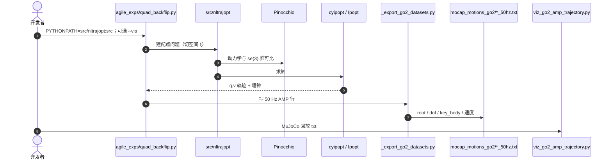

# SE(3) 切空间浮动基轨迹优化

**SE(3) Tangent TO**（论文 *A Comparative Study of Floating-Base Space Parameterizations for Agile Whole-Body Motion Planning*，[arXiv:2508.11520](https://arxiv.org/abs/2508.11520)，[代码](https://github.com/upatras-lar/se3_trajopt)）由 **帕特雷大学 LAR / Archimedes** 提出：在**相同**直接配点、相同 Ipopt、弱任务代价下，系统比较欧拉角、三种四元数用法与 **SE(3) 切空间坐标**，证明大转角空翻不必上专用流形求解器——把位姿放进 \(\mathfrak{se}(3)\) 即可用现成 NLP。

## 一句话定义

**浮动基怎么参数化，会决定空翻是「翻过去」还是「优化成跳」；切空间表示在欧式 Ipopt 里同时保住几何与求解器成熟度。**

## 英文缩写速查

| 缩写 | 英文全称 | 简要说明 |
|------|----------|----------|
| SE(3) | Special Euclidean Group in 3D | 刚体位姿李群；切空间坐标 \(\xi\in\mathbb{R}^6\) |
| TO | Trajectory Optimization | 直接配点全身 NLP |
| RPY | Roll–Pitch–Yaw | 欧拉角浮动基姿态 |
| NLP | Nonlinear Program | Ipopt 内点法求解 |
| AMP | Adversarial Motion Priors | 扩展仓把 TO 轨迹写成 50 Hz 参考，供模仿 RL |

## 为什么重要

- **选型有对照表：** 文献常只展示一种浮动基写法；这里强制同一转录与暖启动，空翻上差距才看得见。
- **工程折中明确：** 直接在 SE(3) 流形上优化更「正确」，但成熟求解器仍是欧式的。切空间 = 流形几何 + Ipopt。
- **可跑、可接 RL：** 官方仓出 MeshCat 轨迹；[go2_flip_TO](https://github.com/yusongmin1/go2_flip_TO) 再写成 AMP txt，把 TO 专家轨迹接到跟踪策略。

## 核心信息

| 项 | 内容 |
|----|------|
| **机构** | 帕特雷大学（University of Patras）LAR；雅典娜研究中心（Athena RC）/ Archimedes |
| **平台** | Talos；Unitree G1 后空翻；Unitree Go2 侧空翻 |
| **栈** | Pinocchio 解析雅可比（切空间）或 CasADi AD（四元数/欧拉）+ Ipopt |
| **接触** | **预定义**接触日程（本篇不发现步态；发现见 [AHMP](./paper-ahmp.md)） |
| **开源** | **已开源**（BSD-2-Clause）：论文 [upatras-lar/se3_trajopt](https://github.com/upatras-lar/se3_trajopt)；Go2/AMP 扩展 [yusongmin1/go2_flip_TO](https://github.com/yusongmin1/go2_flip_TO) |

## 核心原理

直接转录变量含 \(q_k,v_k,\dot v_k\)、接触力与接触点。浮动基部分必须同时决定：**优化变量、差分、积分**。切空间方案取 \(\xi_k\)，差分为 \(\mathrm{Exp}(\xi_2)\ominus\mathrm{Exp}(\xi_1)\)，积分为 \(\mathrm{Log}(\mathrm{Exp}(\xi)\oplus\mathcal{V}_b h)\)，在离散步长下是精确 retraction。四元数 #1 用欧式积分再单位化；#2/#3 把流形算子与欧式变量混用，实验里更差。欧拉角靠 \(W(\theta)\) 把 \(\omega_b\) 映到 \(\dot\theta\)，俯仰 ±90° 奇异。

### 流程总览

## 源码运行时序图

论文官方仓 [upatras-lar/se3_trajopt](https://github.com/upatras-lar/se3_trajopt)；Go2 空翻与 AMP 导出以 [yusongmin1/go2_flip_TO](https://github.com/yusongmin1/go2_flip_TO) 为准（归档见 [go2_flip_to.md](../../sources/repos/go2_flip_to.md)）：

- **论文六任务：** 官方仓 `src/examples/agile_exps/` + MeshCat `--vis`。
- **Go2 最短路径：** `quad_backflip.py --vis` → `datasets/viz_go2_amp_trajectory.py --amp .../quad_backflip_50hz.txt`。扩展仓 PYTHONPATH **必须含** `src/nltrajopt`。
- **线性求解器：** 官方可跟 HSL；`go2_flip_TO` 文档指定 conda-forge **MUMPS**。

## 工程实践

| 项 | 建议 |
|----|------|
| 要空翻 | 用 SE(3) 切空间；不要指望欧拉或混用四元数「碰巧翻过去」 |
| 只要走跳 | Quaternion #1 与切空间都够用，迭代次数接近 |
| G1 后空翻暖启动 | 中间节点把基座朝向设倒立，否则优化器走后跳 |
| 接触日程 | 本方法**给定**；未知接触用 [AHMP](./paper-ahmp.md) |
| AMP 导出 | 默认根高度 +0.022 m；`GO2_NO_DATASET=1` 可只求解不写盘 |
| 真机 | 论文明确下一步才是硬件；当前是开环计划 |

## 实验与评测

同一设定下六任务（Table IV）：

| 任务 | 切空间 | Quaternion #1 | 欧拉 | 备注 |
|------|--------|---------------|------|------|
| Talos 走 / 跳房子 / 大跳 | 成功 | 成功 | 成功 | #3 全失败 |
| Talos 倒立 | 成功（代价同量级） | 成功 | 成功 | 迭代数切空间偏多 |
| G1 后空翻 | **成功**（28 iter） | 收敛但**未翻** | 失败 | #1 代价 0.1 vs 切空间 \(5.2\times10^{-5}\) |
| Go2 侧空翻 | **成功**（29 iter） | 收敛但**未翻** | 失败 | 论文侧空翻 0.3 m；扩展仓另有前后空翻脚本 |

暖启动噪声（Table III）：空翻上切空间在中等噪声仍 100% 可行；表中四元数「成功」常是跳不是翻。

## 结论

**大转角敏捷动作，浮动基表示不是实现细节——它会改变技能是否存在。**

1. **切空间是空翻的真门槛** — G1/Go2 空翻只有 \(\mathfrak{se}(3)\) 坐标翻成功。
2. **收敛 ≠ 完成技能** — 四元数常给出可行跳跃，看起来像成功。
3. **小转角不必教条** — 走跳倒立上欧拉/Quat#1 与切空间差不多。
4. **不要混用流形算子与欧式变量** — Quaternion #2/#3 更差，#3 全部失败。
5. **求解器路线：** 先切空间 + Ipopt，而不是一上来自研流形 SQP；论文把实时 SQP/MPC 留作未来。
6. **接 RL：** 用 `go2_flip_TO` 的 50 Hz txt 当参考，而不是在策略里重新发现空翻接触。

## 与其他工作对比

| 对照 | 差异读法 |
|------|----------|
| [AHMP](./paper-ahmp.md) | 同一 TO 内核 + **接触发现**；本篇接触固定、比表示法 |
| [Crocoddyl](./crocoddyl.md) | shooting/DDP，状态可走流形；本篇证明配点+欧式 Ipopt 也能做空翻 |
| [DSMS](../methods/dsms-contact-implicit-multiple-shooting.md) | 接触在仿真器内隐式；本篇接触显式、摩擦锥写进 NLP |
| [SE(3) 表示 / 李群](../formalizations/se3-representation.md) | 那些页偏 DL 存储与损失；本页是 **TO 决策变量** 的对照实验 |

## 局限与风险

- **无真机验证**（论文结论写明）。
- 接触日程与代价仍需人设；不是接触隐式发现步态。
- 官方仓与 `go2_flip_TO` **PYTHONPATH / 求解器 / 导出** 不一致，复现前对 README。
- 自碰撞、执行器非线性未进本 NLP。

## 关联页面

- [AHMP](./paper-ahmp.md) — 外层 CEM 接触发现
- [Trajectory Optimization](../methods/trajectory-optimization.md)
- [SE(3) Representation](../formalizations/se3-representation.md)
- [李群与刚体旋转](../formalizations/lie-group-rigid-body-motions.md)
- [Floating Base Dynamics](../concepts/floating-base-dynamics.md)
- [Pinocchio](./pinocchio.md) / [Crocoddyl](./crocoddyl.md)
- [Unitree G1](./unitree-g1.md)

## 参考来源

- [se3_tangent_to_arxiv_2508_11520.md](../../sources/papers/se3_tangent_to_arxiv_2508_11520.md)
- [se3_trajopt.md](../../sources/repos/se3_trajopt.md)
- [go2_flip_to.md](../../sources/repos/go2_flip_to.md)
- [ibrics-lar-upatras.md](../../sources/sites/ibrics-lar-upatras.md)
- [arXiv:2508.11520](https://arxiv.org/abs/2508.11520)

## 推荐继续阅读

- [upatras-lar/se3_trajopt](https://github.com/upatras-lar/se3_trajopt)
- [yusongmin1/go2_flip_TO](https://github.com/yusongmin1/go2_flip_TO)
- [补充视频](https://www.youtube.com/watch?v=zBJSsiUExCw)
- [IBRICS 项目页](https://lar.upatras.gr/projects/ibrics.html)
- [AHMP 代码](https://github.com/hucebot/ahmp)
