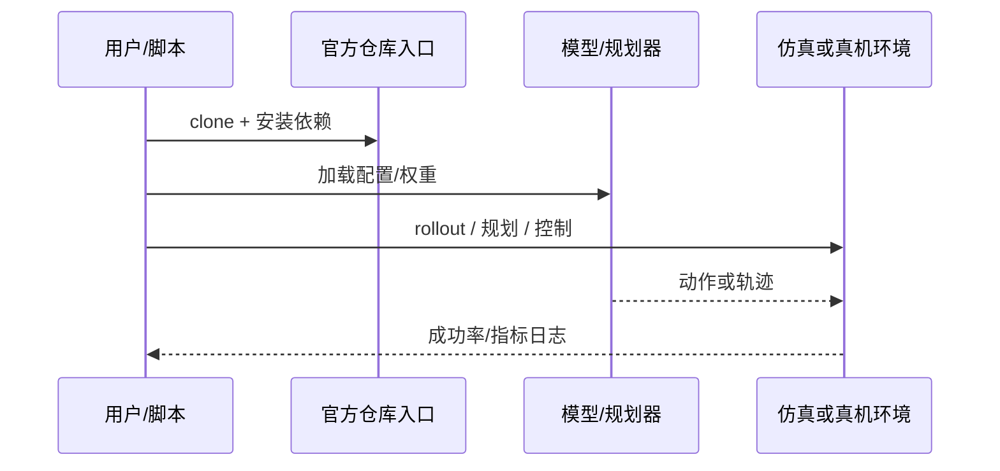

# SEED-UMI（arXiv:2609.11753）

**SEED-UMI**（[SEED-UMI: Sharing the Exoskeleton between human and robot for onE-to-one Dexterous demonstration](https://arxiv.org/abs/2609.11753)）来自 [具身智能小站 14 篇盘点](../../sources/blogs/wechat_embodied_station_14_papers_dexterous_wm_humanoid_2026-09-11.md)。人与机器人共享外骨骼做一对一灵巧示范；关节编码器 + 腕部相机配对跨具身监督。

## 一句话定义

**把外骨骼变成人与灵巧手之间的同一把尺，提升接触丰富任务的数据效率。**

## 英文缩写速查

| 缩写 | 英文全称 | 简要说明 |
|------|----------|----------|
| VLA | Vision-Language-Action | 视觉-语言-动作策略 |
| VLM | Vision-Language Model | 视觉-语言多模态模型 |
| WM | World Model | 预测未来观测或表征的动力学模型 |
| IL | Imitation Learning | 模仿学习 |
| RL | Reinforcement Learning | 强化学习 |
| DoF | Degrees of Freedom | 自由度 |

## 为什么重要

- 纳入本期 **灵巧手 / 世界模型 / 人形控制 / VLA** 主线之一。
- 开源状态：**已开源**（步骤 2.5 核查，2026-09-11）。
- 与 [14 篇技术地图](../overview/dexterous-wm-humanoid-14-papers-technology-map.md) 中同类工作可横向对照。

## 核心机制

| 项 | 内容 |
|----|------|
| **arXiv** | [2609.11753](https://arxiv.org/abs/2609.11753) |
| **项目页** | https://tengbo-yu.github.io/SEED-UMI/ |
| **代码/资源** | https://github.com/Tengbo-Yu/SEED-UMI |
| **开源** | **已开源** |
| **文内指标** | 五项接触丰富任务上考察数据效率与策略质量。 |

## 源码运行时序图

## 实验与评测

| 项 | 文内口径 |
|----|----------|
| 要点 | 五项接触丰富任务上考察数据效率与策略质量。 |

- **读法：** 本页为索引级摘要，上表取自 [公众号盘点](../../sources/blogs/wechat_embodied_station_14_papers_dexterous_wm_humanoid_2026-09-11.md) 与项目页；具体对照方法、任务集与逐项指标以 **原文 PDF** 为准（[参考来源](#参考来源)）。

## 与其他工作对比

- **手持夹爪式 UMI / 视觉重定向示范** — 采集轻便但人-机动作对应靠事后重定向近似；SEED-UMI 让人与机器人 **共享同一副外骨骼**，用关节编码器 + 腕部相机直接产出配对监督。
- **[数据手套 vs 视觉遥操作](../comparisons/data-gloves-vs-vision-teleop.md)** — 该页列出两类采集前端的精度/成本取舍；SEED-UMI 属「穿戴式高保真」一侧，代价是需要专用外骨骼硬件。
- **[遥操作](../tasks/teleoperation.md) 实时链路** — 遥操作强调 **在线** 带宽与时延闭环；SEED-UMI 用同一硬件做 **离线示范采集**，目标是数据效率而非实时控制。
- **[HuRo](./paper-huro.md)** — 不加硬件、靠流水线改造人类视频冲规模；SEED-UMI 反向以硬件换 **跨具身监督质量**，两者是「规模 vs 配对精度」的两端。
- **[模仿学习](../methods/imitation-learning.md)** — 本文优化的是 IL 的 **数据前端**，文内以五项接触丰富任务考察数据效率与策略质量。

- **读法：** 以上为知识库内 **路线级** 对照；与原文 baseline 的逐项定量比较以 **原文 PDF** 为准（[参考来源](#参考来源)）。

## 结论

**SEED-UMI 适合作为本期「已开源」边界下的快速索引页，部署前请核对仓库/README 可运行性。**

1. 核心贡献：把外骨骼变成人与灵巧手之间的同一把尺，提升接触丰富任务的数据效率。
2. 开源结论：**已开源** — 以项目页实际链接为准（入库日 2026-09-11）。
3. 横向对照见 [14 篇技术地图](../overview/dexterous-wm-humanoid-14-papers-technology-map.md)，避免与同 arXiv 重复造页。

## 关联页面

- [14 篇技术地图](../overview/dexterous-wm-humanoid-14-papers-technology-map.md)
- [VLA（Vision-Language-Action）](../methods/vla.md)
- [Generative World Models](../methods/generative-world-models.md)
- [Manipulation](../tasks/manipulation.md)

## 参考来源

- [seed-umi_arxiv_2609_11753.md](../../sources/papers/seed-umi_arxiv_2609_11753.md)
- [wechat 14篇盘点](../../sources/blogs/wechat_embodied_station_14_papers_dexterous_wm_humanoid_2026-09-11.md)
- [arXiv:2609.11753](https://arxiv.org/abs/2609.11753)

## 推荐继续阅读

- [arXiv PDF](https://arxiv.org/pdf/2609.11753)
- [项目页/资源](https://tengbo-yu.github.io/SEED-UMI/)
- [代码/资源](https://github.com/Tengbo-Yu/SEED-UMI)
