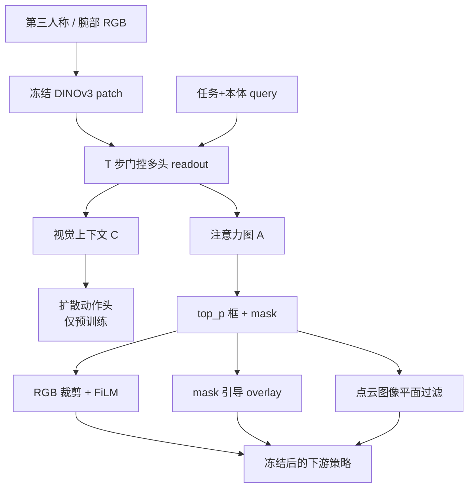
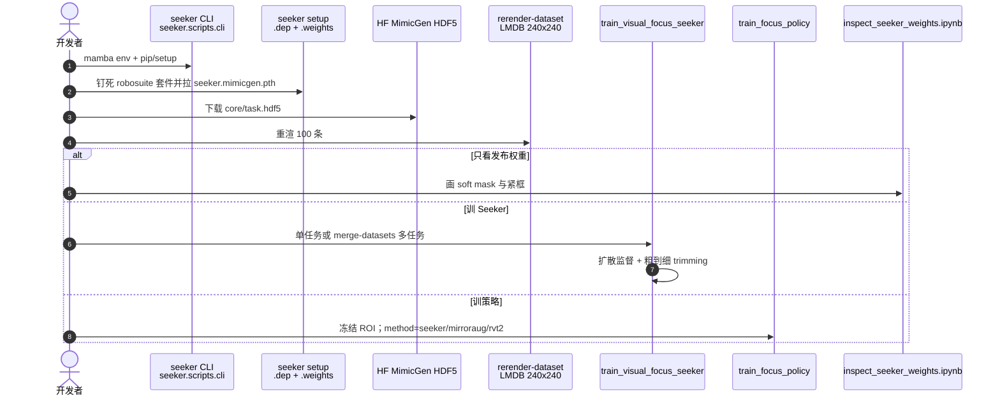

# Seeker：从动作里长出视觉注意力

**Seeker**（*Attention from Action, for Action: Emergent Visual Bottlenecks for Policy Learning*，[arXiv:2608.13422](https://arxiv.org/abs/2608.13422)，[代码](https://github.com/zheyu-zhuang/seeker)）由 **瑞典皇家理工学院（KTH）**、**弗莱堡大学** 与 **汉堡大学** 提出：把 visuomotor 的「看哪」从外部空间标签里拆出来，只用示范里的 **观察–动作流** 在冻结 [DINOv3](https://github.com/facebookresearch/dinov3) 上学一个随任务阶段和本体状态移动的 ROI。训完冻结，同一套框/mask 给 RGB 裁剪、背景增强和点云过滤。

## 一句话定义

**别用 gaze、物体框或夹爪关键帧规定「看哪」：让动作预测自己指出当前控制真正需要的那块图。**

## 英文缩写速查

| 缩写 | 英文全称 | 简要说明 |
|------|----------|----------|
| ROI | Region of Interest | 本页指动作监督长出的控制相关视觉瓶颈 |
| DINO / DINOv3 | Distillation with No Labels v3 | 冻结视觉骨干；Seeker 只在其上做 readout |
| FiLM | Feature-wise Linear Modulation | 用本体/检索上下文调制 query 或策略特征 |
| DP / DP3 | Diffusion Policy / 3D Diffusion Policy | 下游 RGB 策略与点云策略 |
| MimicGen | MimicGen | 仿真主评测；100 条/任务重渲到 240×240 |
| top_p | Nucleus mass threshold | 累加注意力质量心到 0.8 再收成框/mask |

## 为什么重要

- **瓶颈该跟控制走，不该跟语义走。** 下一步动作需要的证据可能是物体、接触、工具尖、目标区或物体间关系；物体检测框和 TCP 投影经常不是同一块。
- **动作流本来就在 IL 数据里。** 不新增 gaze、affordance 或阶段提示，也能接近特权 Oracle ROI（62.6 vs 64.2）。
- **同一 ROI 能换模态。** 冻结后既裁第三人称 RGB，也按图像平面滤点云；背景偏移时用 mask 护住交互区再 overlay。
- **代码能跑。** 默认分支 `open_source`，`seeker` CLI + 发布 `seeker.mimicgen.pth`。

## 核心信息

| 字段 | 内容 |
|------|------|
| 作者 | Zheyu Zhuang、Ruiyu Wang、Nick Heppert、Johannes Fabian Hahn、Abhinav Valada、Florian T. Pokorny、Danica Kragic |
| 机构 | 瑞典皇家理工学院（KTH）；弗莱堡大学（University of Freiburg）；汉堡大学（Universität Hamburg） |
| 出处 | arXiv:2608.13422（2026-08）；README 标 CoRL 2026 |
| 骨干 | 冻结 DINOv3；query 看任务嵌入 + 末端平移 + 夹爪（旋转默认不加） |
| 下游 | 预训练 ResNet-18 + Diffusion Policy；点云走 DP3 |
| 真机 | UFactory xArm7；第三人称 + 腕部 RGB；10 Hz 末端位控 |
| 开源（截至 2026-08-15） | **已开源**：[`zheyu-zhuang/seeker`](https://github.com/zheyu-zhuang/seeker)（MIT；默认分支 `open_source`） |

## 方法与核心结构

| 模块 | 作用 |
|------|------|
| **条件 query** | \(Q^{(0)}=\mathrm{FiLM}(Z,s)\)：任务嵌入 \(Z\)（CLIP 短描述当 ID）× 本体 \(s\) |
| **迭代门控 readout** | \(T=2\) 次：MHA 出多头 \(A_h,C_h\)，query 相关 \(\omega_h\) 融合后再 FiLM 更新 query |
| **扩散监督头** | \(\widetilde{C}\) + 本体 + 任务 → 噪声预测；**只用来长 ROI**，下游丢掉 |
| **框 / mask** | 丢掉最低两头，`top_p=0.8`；第三人称裁剪并 FiLM 回框的位置和尺度；腕部不裁 |
| **粗到细 trimming** | coarse 先定位 → fine 只看框内 token → KL 把 coarse 注意力往 fine 框收；推理只留 coarse |

Seeker 的 pooled context **不是**可 rollout 的策略：直接出动作平均接近 0（Stack-Three 最高约 20%）。它只回答「看哪」，几何和接触细节留给下游策略。

### 流程总览

## 源码运行时序图

官方仓 [zheyu-zhuang/seeker](https://github.com/zheyu-zhuang/seeker)（分支 `open_source`）入口见 [sources/repos/seeker.md](../../sources/repos/seeker.md)：

- **最短路径：** `seeker setup` → 下一份公开 MimicGen HDF5 → `rerender-dataset` → 开 notebook 看发布权重。
- **复现论文表：** 六任务各 100 条重渲后，先 `train_visual_focus_seeker`（或直接用发布 ckpt），再 `train_focus_policy`。
- **分支：** clone 后确认在 `open_source`；`main` 当前没有 README。

## 工程实践

| 项 | 建议 / 论文设定 |
|----|----------------|
| **何时用** | 示范少、背景花、控制证据局部且随阶段移动；想在不改策略头的前提下加视觉瓶颈 |
| **何时不用** | 目标几乎不动、动作单靠本体就能预测——注意力没有激励去定位；或今天就要上闭源 VLA API（这是 IL 输入层，不是运行时防护） |
| **覆盖比条数重要** | 任务内 Most-25 空间多样子集平均只比 Full-100 低 0.4 点；Least-25 掉 3.6 |
| **训练税** | 全量预训大约 1.5–1.8× 纯策略墙钟；可用更小但空间覆盖够的子集砍 |
| **推理** | 作者实现约 **+12 ms/步** |
| **像素扰动** | Seeker 预训从第一步就 `p_ov=0.5` overlay（\(\alpha=0.6\)）；慢热容易让早期伪注意力钉死 |
| **多视角** | 先只训第三人称并缓存上下文，再接入腕部，避免第三人称 ROI 把「看哪」外包给腕部 |
| **点云** | 先手工工作区，再用 Seeker 框滤投影点；100 demo 时纯手工基线太弱，论文改用 200 |
| **不要裁腕部** | 接近接触时尺度跳变太快 |

## 实验与评测

仿真：六项 MimicGen（Stack Three D1、Square D2、3-P Assembly D2、Coffee Prep. D1、Pick & Place D0、Threading D2），每任务 100 条，三随机种子。同一多任务 Seeker 冻结后给所有设定复用。

| 方法 | 六任务均 SR | 读法 |
|------|-------------|------|
| DiffPo (Pre) | 32.5 | 无瓶颈 |
| MirrorAug | 37.2 | 对称增强、仍看全图 |
| RVT2-Crop | 42.6 | 最强输入级基线；夹爪/低速关键帧会鬼影或错过连续运动 |
| **Seeker** | **62.6** | 相对 RVT2 +20.0 点；3-P Assembly / Threading 相对增益最大 |
| RAVEN | 52.1 | 外部等变策略的已发表最优对照（论文口径），不在同栈 |
| Oracle ROI | 64.2 | 特权阶段 affordance 框；Seeker 差 1.6 点 |

**背景：** 原背景训出的 mask 做 Guided Overlay，在打乱桌面纹理上仍最强；只加纹理多样性不够，细交互会被盖住。

**点云（200 demo）：** 手工工作区 + Seeker 过滤相对仅手工：Pick & Place +24.7、Stack-3 +24.0、Coffee +42.3。DP3 整体仍低于 RGB 表。

**真机（各 20 次）：** Coffee Transport / Table Cleanup / Board Assembly。

| | ID | 光照 | 背景 | OOD 均 | 保留率 |
|--|----|------|------|--------|--------|
| MirrorAug | 35.0 | — | — | 11.7 | 33.4 |
| RVT2-Crop | 48.3 | — | — | 20.0 | 41.4 |
| **Seeker** | **76.7** | 80/75/60 | 35/60/50 | **60.0** | **78.2** |

Coffee Transport 没有可靠夹爪事件，启发式框容易锁在旋转或终态末端，丢掉杯–勺交互。

## 结论

**少数据 visuomotor 先缺的是「当前动作该看哪」，不是再换一个更强的全图策略头。**

1. **真影响：动作监督够用** — 无空间标签也能贴近 Oracle ROI；生成式动作目标（扩散 / flow）比回归更能收紧 mask。
2. **真影响：显式裁剪** — FiLM-only 掉到 39.4，低分辨率裁仍有 61.2；收益来自缩小搜索，不是把框坐标当附加特征。
3. **真影响：真机外观偏移** — OOD 从 20% 拉到 60%，保留率 78%；mask 护住交互再扰动背景。
4. **次要代价：预训税** — 多约 0.5–0.8× 策略训练；空间覆盖够时可先用 25–50 条子集。
5. **次要代价：点云仍弱** — ROI 滤点解决不了 DP3 的旋转估计和稀疏工作区。
6. **部署读法：** 第三人称裁 + 腕部全图是默认；先单独稳住第三人称 ROI。
7. **工程读法：可跑** — 从 `open_source` 分支走 `setup` → 重渲 → notebook / `train_focus_policy`。

## 与其他工作对比

| 对照 | 差异读法 |
|------|----------|
| RVT-2 / PerAct 关键帧框 | 仍手写「何时定位、代理点、尺度」；Seeker 把映射交给动作损失 |
| MirrorAug / 等变策略 | 改训练分布或架构，不决定保留哪块视觉证据；可叠加 |
| [ActFovea](./paper-actfovea.md) | 运行时、免训练、护冻结 VLA；Seeker 是训练期 IL 瓶颈 |
| 物体 / VLM grounding 裁剪 | 语义框 ≠ 下一步控制证据；长程还要阶段提示 |
| [Diffusion Policy](../methods/diffusion-policy.md) | 下游默认头；Seeker 是输入接口，不是新动作参数化 |

## 局限与风险

- **示范覆盖：** 空间不变或视觉冗余阶段，动作可从本体预测，ROI 学不到「看哪」；换布局要补多样轨迹或重训。
- **多任务更吃数据：** 附录诊断用任务内 Seeker；多任务还要平衡任务，不能直接套 Most-25。
- **不是控制器：** 微调 DINO 能让 context 好一点，但会破坏稳定注意力用的几何先验。
- **真机主线不在仓里：** 开源复现默认 MimicGen；xArm 协议在附录。
- **许可叠加：** 本体 MIT；DINOv3 与钉死仿真套件走上游条款。

## 关联页面

- [Diffusion Policy](../methods/diffusion-policy.md) — 下游 RGB 头；Seeker 扩散头只作 ROI 监督
- [Imitation Learning](../methods/imitation-learning.md) — 少数据 IL 的输入级瓶颈
- [Manipulation](../tasks/manipulation.md) — 桌面长程操作任务族
- [MimicGen](./mimicgen.md) — 仿真数据与六任务协议
- [ActFovea](./paper-actfovea.md) — 对照：推理期中央凹防护，不是训练期 ROI
- [扩散模型](../concepts/diffusion-model.md) — 生成式动作目标为何比回归更能收 mask
- [VLA](../methods/vla.md) — 语言条件通才路线；本页是无语言 IL 瓶颈
- [感知栈选型闭环](../queries/robot-perception-stack-selection-loop.md) — 下游策略消费哪块视觉

## 参考来源

- [seeker_arxiv_2608_13422.md](../../sources/papers/seeker_arxiv_2608_13422.md)
- [seeker 仓库归档](../../sources/repos/seeker.md)
- Zhuang et al. — <https://arxiv.org/abs/2608.13422>
- 代码 — <https://github.com/zheyu-zhuang/seeker>

## 推荐继续阅读

- 官方仓 README 与 `seeker/model/WEIGHTS.md` — <https://github.com/zheyu-zhuang/seeker>
- MimicGen 数据 — <https://huggingface.co/datasets/amandlek/mimicgen_datasets/>
- Diffusion Policy — <https://arxiv.org/abs/2303.04137>
- RVT-2 — <https://arxiv.org/abs/2406.08545>
- DINOv3 — <https://arxiv.org/abs/2508.10104>
