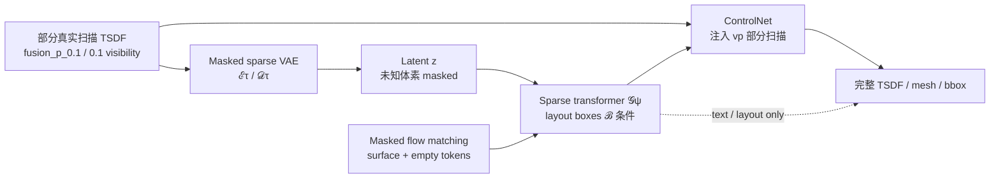
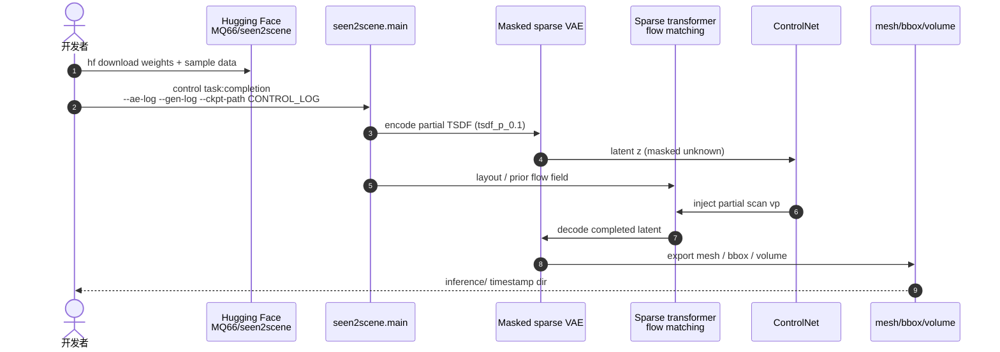

# Seen2Scene：Visibility-Guided Flow 真实 3D 场景补全

**Seen2Scene**（*Completing Realistic 3D Scenes with Visibility-Guided Flow*；[arXiv:2603.28548](https://arxiv.org/abs/2603.28548)，[ECCV 2026](https://quan-meng.github.io/projects/seen2scene/)，[代码](https://github.com/quan-meng/seen2scene)）由 **慕尼黑工业大学（TU Munich）** 与 **弗吉尼亚大学（University of Virginia）** 等提出。

## 一句话定义

**Seen2Scene** 是首个在**不完整真实 3D 扫描**上直接训练的 **flow matching** 场景补全/生成方法：用 **visibility-guided masking** 在稀疏 **TSDF** 上忽略相机未观测体素，以 **3D layout box**（及 text / 部分扫描）为条件，经 **masked sparse VAE + sparse transformer** 生成连贯、完整的室内 3D 场景。

## 英文缩写速查

| 缩写 | 英文全称 | 简要说明 |
|------|----------|----------|
| TSDF | Truncated Signed Distance Function | 截断符号距离场；本文 3D 场景主表示 |
| VAE | Variational Autoencoder | 变分自编码器；masked sparse VAE 压缩 TSDF patch |
| FM | Flow Matching | 连续归一化流/流匹配生成范式 |
| CFG | Classifier-Free Guidance | 无分类器引导；推理 `--task.guidance-scale` |
| VDB | Voxel Database | 稀疏体素结构；fVDB / VDBFusion 融合后端 |

## 为什么重要

- **训练分布对齐真实扫描：** 多数 3D 生成方法依赖**完整合成 mesh**；真实机器人/重建管线拿到的是**部分可见 TSDF**，Seen2Scene 把「未知区域 mask」写进训练目标，而非事后启发式 inpainting。
- **统一补全与生成：** 同一 sparse transformer 可 **layout 条件生成**、**text→layout→生成**，并经 **ControlNet** 专精 **partial-scan completion**——对接 [Real2Sim](../methods/crisp-real2sim.md) 与仿真资产缺口（见 [生成式世界模型](../methods/generative-world-models.md) 静态 3D 资产节）。
- **稀疏 TSDF 可扩展：** 相对稠密体素或纯 mesh 生成，稀疏网格 + fVDB 算子更适合**大场景 patch 化**（256³ patch、sliding-window 384×384×256）。
- **开源可复现：** 官方仓 + HF 权重 + 1000 场景样本数据，最低成本路径是 **HF 样本 + released checkpoint 跑 completion**。

## 核心信息

| 项 | 内容 |
|----|------|
| **机构** | 慕尼黑工业大学（TU Munich）；弗吉尼亚大学（University of Virginia） |
| **出处** | ECCV 2026 |
| **论文** | <https://arxiv.org/abs/2603.28548> |
| **项目页** | <https://quan-meng.github.io/projects/seen2scene/> |
| **开源** | **已开源** — [`quan-meng/seen2scene`](https://github.com/quan-meng/seen2scene)（MIT；2026-09-19 项目页核查） |
| **权重** | <https://huggingface.co/MQ66/seen2scene> |
| **样本数据** | <https://huggingface.co/datasets/MQ66/seen2scene-FRONT-3D> |

## 核心原理

### 问题：真实扫描 ≠ 完整合成 3D

真实 RGB-D / LiDAR 融合得到的 TSDF **大量体素未被相机观测**（遮挡、视角有限）。若在完整 synthetic mesh 上训练再部署到 partial scan，模型常**幻觉填充**或**几何不一致**。Seen2Scene 在训练与推理中**显式 mask 未知区域**，flow matching 只在 surface / empty 的可信 token 上学习分布。

### 流程总览

### 四模块分工（对齐论文 Fig.）

| 模块 | 输入 | 输出 | 备注 |
|------|------|------|------|
| **Masked sparse VAE** | TSDF patch \(v\) | Latent \(z\) | 相机不可见体素不参与编码/解码 |
| **Sparse transformer \(\mathcal{G}_\psi\)** | \(z\) + layout \(\mathcal{B}\) | Flow 速度场 | Progressive training（`--progressive-end`） |
| **ControlNet** | 部分扫描 \(v_p\) + 预训 \(\mathcal{G}_\psi\) | Completion 适配 | `src-key tsdf_p_0.1` → `latent-key tsdf_p_1.0` |
| **多条件头** | Text / layout / partial scan | 生成或补全 mesh | Text 路径：LLM 先产 layout 再生成 |

### 数据与融合管线

- **训练集：** 3D-FRONT、ScanNet++、ARKitScenes；深度扫描经 **[VDBFusion fork](https://github.com/quan-meng/vdbfusion)** 融合为 `fusion_p_*_v_*.vdb`。
- **Visibility 两级：** 低可见度 `fusion_p_0.1` 作 **completion 输入**；高可见度 `fusion_p_1.0` 作 **重建目标**（与 README 训练键一致）。
- **导出：** BlenderProc / pyrender 渲染 RGB-D；inference 可导出 **bbox / mesh / volume**。

## 评测与指标

- **补全质量：** 在 **ScanNet++** 与 **ARKitScenes** 上相对 **SG-NN**、**NKSR** 取得更好补全准确性与生成 realism（定性 + 论文定量表；具体数值以 PDF 为准）。
- **生成质量：** Layout 条件 patch 生成与 **text→3D** 路径在 clutter 真实风格场景上展示连贯 furniture/layout（项目页 qualitative）。
- **工程验收：** HF 样本 1000 场景（987 test + 13 val）**未参与训练**，可直接对照 released checkpoint 复现 completion demo。

## 与其他工作对比

| 对照 | 差异读法 |
|------|----------|
| **SG-NN / NKSR** | 传统 **surface reconstruction / completion** 基线；Seen2Scene 用 **生成式 flow matching** 在 latent 空间建模**整场景分布**，而非局部 SDF 插值 |
| [HomeWorld](../entities/paper-homeworld-whole-home-scene-generation.md) | **Text→sim-ready 全屋 3D** 分层流水线；Seen2Scene 强调 **从不完整真实扫描补全**，而非从 prompt 合成新屋 |
| [Point2Pose](../entities/paper-point2pose.md) | **多物体 6D + 在线 TSDF** 跟踪；Seen2Scene 做 **静态场景级** TSDF 补全/生成，不输出物体位姿轨迹 |
| 视频像素 WM（Cosmos / Wan 等） | 输出 **metric TSDF/mesh** 而非 RGB 帧；更适合 **几何资产 / Real2Sim**，而非闭环视觉策略 rollout |
| 合成-only 3D diffusion | 训练于 **完整 mesh**；Seen2Scene **visibility mask** 使损失只在观测一致区域回传，适配真实 partial scan |

## 结论

**Seen2Scene 把 visibility-guided flow matching 落到稀疏 TSDF，是在真实不完整扫描上学习场景补全的可复现基线；部署优先走 HF 样本 + released ControlNet 跑 completion，再考虑自训三阶段链。**

- **最快复现：** `hf download MQ66/seen2scene-FRONT-3D` + `hf download MQ66/seen2scene`，用 README 公布的 `AE_LOG/GEN_LOG/CONTROL_LOG` 跑 `control task:completion`。
- **补全 vs 生成：** Completion **必须**三件套 checkpoint；纯 layout/text 生成只需 VAE + generator。
- **Visibility 键名：** 输入 `tsdf_p_0.1`、目标 `tsdf_p_1.0` 与 fusion 导出一致；混用 visibility 级别会导致训练/推理分布漂移。
- **大场景：** `task:large-scale-generation` 走 sliding-window（256³ patch，overlap 0.2）；注意 `--task.cpu-offload` 与 GPU 显存。
- **Real2Sim 读法：** 输出 mesh/bbox 可接 Blender/Isaac 资产导入，但**物理属性、碰撞 mesh 清理**仍需下游管线；非 sim-ready 一键包。
- **数据自建成本：** 全量 3D-FRONT/ScanNet++/ARKit 融合需 VDBFusion + BlenderProc；仅评测可用 HF 1000 场景子集。

## 工程实践

| 项 | 建议 |
|----|------|
| 环境 | Python 3.11、PyTorch 2.4.1、CUDA 12；Linux + `nvcc` 编译 FlashAttention / fVDB / TorchSparse |
| 最低 demo | HF 样本数据 + released weights；`--slurm.cluster local` |
| 训练顺序 | VAE → generator（需 `AE_LOG`）→ ControlNet（需 `GEN_LOG`） |
| 推理导出 | `--task.export-as bbox mesh volume`；`--task.backend pyrender`（快）或 `blender` |
| CFG | `--task.guidance-scale 3.0`（默认量级，可按场景调） |
| 开源状态 | **已开源**（代码 + 权重 + 样本数据） |

## 源码运行时序图

节点对齐 [`quan-meng/seen2scene`](https://github.com/quan-meng/seen2scene) README 的 **Install → Checkpoints → Inference** 三节；completion 路径为 `python -m seen2scene.main control task:completion`。

## 局限与风险

- **静态场景假设：** 方法面向 **静态室内 TSDF**；动态物体、时序扫描需额外分割或单独建模。
- **依赖重：** fVDB、TorchSparse、FlashAttention 需 CUDA 编译；Windows/无 GPU 环境难以完整复现训练。
- **ScanNet++ 融合：** README 标注 full LiDAR fusion export **TODO**；自建 ScanNet++ 训练集门槛高于 3D-FRONT/ARKit。
- **Text→3D 链路：** 依赖 LLM 产 layout，layout 质量直接上限生成；论文展示为能力扩展，非唯一主路径。
- **Sim-ready 边界：** 输出几何需人工/工具链补全 URDF、碰撞简化与材质；与 [HomeWorld](../entities/paper-homeworld-whole-home-scene-generation.md) 的「可操作物体密度」目标不同。

## 关联页面

- [Generative World Models](../methods/generative-world-models.md) — 静态 3D 资产 vs 视频 WM 分工
- [六种空间表征](../concepts/embodied-perception-six-spatial-representations.md) — TSDF 在感知栈中的位置
- [CRISP Real2Sim](../methods/crisp-real2sim.md) — 真实扫描→仿真资产（NKSR 等对照）
- [Navigation / SLAM 栈](../overview/navigation-slam-autonomy-stack.md) — 扫描融合上游
- [HomeWorld](../entities/paper-homeworld-whole-home-scene-generation.md) — text→全屋 sim-ready 3D 对照

## 参考来源

- [`seen2scene_arxiv_2603_28548.md`](../../sources/papers/seen2scene_arxiv_2603_28548.md)
- [`seen2scene-project.md`](../../sources/sites/seen2scene-project.md)
- [`seen2scene.md`](../../sources/repos/seen2scene.md)
- 论文：<https://arxiv.org/abs/2603.28548>

## 推荐继续阅读

- [项目页](https://quan-meng.github.io/projects/seen2scene/)
- [GitHub 仓库](https://github.com/quan-meng/seen2scene)
- [Hugging Face 权重](https://huggingface.co/MQ66/seen2scene)
