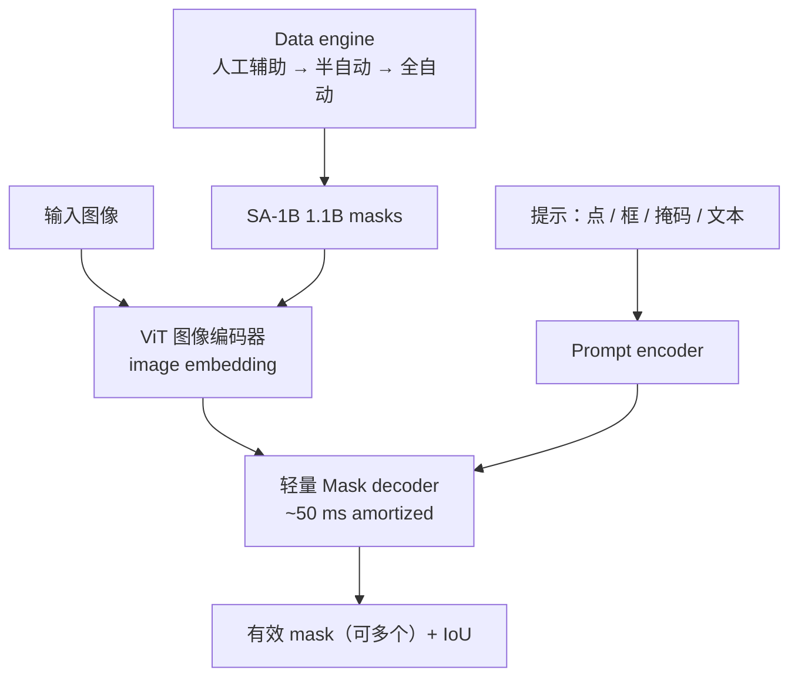
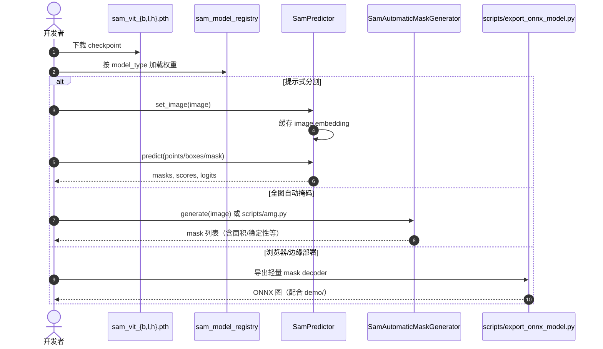

# Segment Anything（SAM）

**SAM**（*Segment Anything Model*；论文 *Segment Anything*，[arXiv:2304.02643](https://arxiv.org/abs/2304.02643)，[代码](https://github.com/facebookresearch/segment-anything)）由 **Meta AI Research（FAIR）** 提出：用可提示分割任务、交互式 data engine 与 SA-1B，训练可在新分布上零样本出 mask 的图像分割基础模型。视频与统一继任见 [SAM 2](./paper-sam2.md)。

## 一句话定义

**给定点/框/掩码（及初步文本）提示，在任意图像上返回有效对象掩码的提示式分割基础模型；图像 embedding 算一次，提示解码可交互复用。**

## 英文缩写速查

| 缩写 | 英文全称 | 简要说明 |
|------|----------|----------|
| SAM | Segment Anything Model | 本文提出的可提示分割模型 |
| SA | Segment Anything | 项目总称（任务 + 模型 + 数据） |
| SA-1B | Segment Anything 1 Billion | 11M 图 / 1.1B masks 训练与发布数据集 |
| ViT | Vision Transformer | 图像编码器骨干（B/L/H） |
| MAE | Masked Autoencoder | ViT 预训练方法 |
| IoU | Intersection over Union | 掩码质量与模型自估置信度 |
| ONNX | Open Neural Network Exchange | 官方支持导出轻量 mask decoder |
| CLIP | Contrastive Language–Image Pretraining | 论文中自由文本提示的文本编码器 |

## 为什么重要

- **机器人感知基元：** 检测器/VLM 出框或点后，SAM 补像素级 mask，是 [GO2 三维语义建图](../queries/go2-3d-semantic-mapping-sam-pipeline.md)、[OVO](./ovo-semantic-mapping.md)、[DualMap](./dualmap.md) 等管线的常见 2D 前端。
- **可组合：** 不绑定固定类别集；用 prompt engineering 接到实例分割、标注、proposal 等下游。
- **可复现：** Apache-2.0 推理仓 + 公开 checkpoint；SA-1B 供研究下载。

## 核心信息

| 项 | 内容 |
|----|------|
| **机构** | 元宇宙人工智能（Meta AI）/ FAIR |
| **任务** | Promptable image segmentation |
| **数据** | SA-1B：11M 许可图，1.1B masks（约 100/图；~99% 全自动） |
| **骨干** | MAE 预训练 ViT-B / ViT-L / ViT-H |
| **开源** | **已开源**（推理 / 权重 / ONNX）：<https://github.com/facebookresearch/segment-anything> |
| **项目页** | <https://segment-anything.com/> |

## 核心原理

### 方法栈

| 模块 | 作用 |
|------|------|
| Image encoder | 一次前向得到可复用图像 embedding |
| Prompt encoder | 点/框位置编码 + 类型嵌入；掩码卷积嵌入；文本经 CLIP |
| Mask decoder | 轻量 Transformer：融合提示与图像特征 → mask（+ IoU） |
| 歧义处理 | 单提示可输出多个有效 mask，避免「衬衫 vs 人」硬选错 |

### 流程总览

## 源码运行时序图

官方仓 [facebookresearch/segment-anything](https://github.com/facebookresearch/segment-anything)（归档见 [sources/repos/segment-anything.md](../../sources/repos/segment-anything.md)）提供提示推理、自动掩码与 ONNX 导出：

- **最短复现路径：** 安装仓库 → 下载 `vit_b`/`vit_l`/`vit_h` → `SamPredictor.set_image` + `predict`。
- **新项目优先：** 需要视频跟踪或更新图像精度/速度时，改用 [SAM 2](./paper-sam2.md)。

## 工程实践

| 项 | 建议 |
|----|------|
| 权重选型 | 质量优先 `vit_h`；资源紧用 `vit_b`/`vit_l` |
| 提示策略 | 检测框作 box 提示通常比单点稳；歧义场景取多 mask 再筛选 |
| 自动掩码 | `SamAutomaticMaskGenerator` 适合离线伪标注；注意密度与后处理阈值 |
| 机器人 2D→3D | SAM **只出像素 mask**；投影与融合见 [GO2 SAM 流水线](../queries/go2-3d-semantic-mapping-sam-pipeline.md) |
| 部署 | mask decoder 可 ONNX；图像编码仍偏重，移动端常换 MobileSAM 等变体 |

## 实验与评测

- **单点质量：** 23 个分割数据集上，单前景点 mask 常接近人工标注质量。
- **零样本迁移：** 边缘检测、object proposal、实例分割，以及初步 text-to-mask。
- **数据规模：** SA-1B 相对当时最大分割集约 **400×** 掩码量；人工阶段标注时间由约 34s 降至约 14s/mask。

## 结论

**SAM 把「分割」做成可提示的视觉基础能力：一次图像编码 + 灵活提示，即可零样本接到大量下游管线。**

1. **先想提示从哪来** — 点/框通常来自检测器或人手；SAM 本身不给类别名。
2. **复用 embedding** — 交互或多提示时先 `set_image`，再反复 `predict`。
3. **歧义要接多 mask** — 单点可能对应 part/whole；用 IoU 或下游规则筛选。
4. **SA-1B 是规模故事的一半** — 模型设计简单，泛化强依赖 data engine。
5. **机器人侧只当 2D 前端** — 3D 语义依赖位姿、内外参与融合，不是 SAM 单独完成。
6. **新任务优先评估 SAM 2** — 视频跟踪、更快图像推理见 [paper-sam2](./paper-sam2.md)。

## 与其他工作对比

| 对照 | 差异读法 |
|------|----------|
| [SAM 2](./paper-sam2.md) | 统一图像+视频；Hiera + memory；图像上更快更准 |
| [OVO](./ovo-semantic-mapping.md) / [OV-SAM3D](./ov-sam3d.md) | 下游消费 SAM(2) mask 做开放词汇 3D |
| [CMU MSCV Semantic 3D Mapping](./cmu-mscv-semantic-3d-mapping.md) | DETR+SAM 伪标注再投影的教学流水线 |
| CLIP 类模型 | 对齐语义/文本；SAM 出几何 mask，常组合使用 |

## 局限与风险

- **无内建语义标签：** 「分割万物」≠「命名万物」；需外接分类/VLM。
- **静态图像：** 跨帧一致性靠外部 tracker 或改用 SAM 2。
- **重图像编码：** 实时多相机要算力或蒸馏小模型。
- **SA-1B 许可与偏差：** 研究用途；地理/收入分布仍不均（论文 RAI 节）。
- **仓库定位：** 官方主仓偏推理；训练复现需另寻社区实现或迁到 SAM 2 `training/`。

## 关联页面

- [SAM 2](./paper-sam2.md) — 图像+视频统一继任
- [GO2 三维语义建图与 SAM 流水线](../queries/go2-3d-semantic-mapping-sam-pipeline.md) — 四足 2D→3D 选型
- [OVO](./ovo-semantic-mapping.md) / [DualMap](./dualmap.md) / [OV-SAM3D](./ov-sam3d.md) — 语义建图消费方
- [CMU MSCV Semantic 3D Mapping](./cmu-mscv-semantic-3d-mapping.md) — DETR+SAM 投影示例

## 参考来源

- [segment_anything_arxiv_2304_02643.md](../../sources/papers/segment_anything_arxiv_2304_02643.md) — 论文摘录与开源核查
- [segment-anything.md](../../sources/repos/segment-anything.md) — GitHub 仓库归档
- [segment-anything-com.md](../../sources/sites/segment-anything-com.md) — 项目页归档
- [arXiv:2304.02643](https://arxiv.org/abs/2304.02643) — 原文
- [facebookresearch/segment-anything](https://github.com/facebookresearch/segment-anything) — 官方代码

## 推荐继续阅读

- [Segment Anything 项目页](https://segment-anything.com/)
- [Meta 博客：Segment Anything](https://ai.facebook.com/blog/segment-anything-foundation-model-image-segmentation/)
- [SA-1B 数据集](https://ai.facebook.com/datasets/segment-anything/)
- [SAM 2 论文与代码](./paper-sam2.md)
