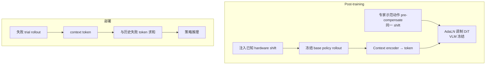

# Self-Adaptive VLA（部署期硬件漂移自适应）

**Self-Adaptive VLA**（*Self-Adaptive VLA for Robust Robot Deployment*，[arXiv:2609.30092](https://arxiv.org/abs/2609.30092)，[项目页](https://icefoxzhx.github.io/self-adaptive-vla/)）来自 **UMass Amherst** 与 **Genesis AI**：标准 **VLA 无记忆**，对 **磨损、标定误差、关节偏置** 等 **hardware shift** 脆弱。本文给出 **post-training recipe**：轻量 **context encoder** 把一次 rollout（多视角视频 + 本体 + 动作）压成 **单个 context token**，经 **AdaLN** 调制 **冻结 VLM** 上的 DiT 策略；测试时 **ensemble 多次失败 trial 的 token** 逐步恢复性能，**无需额外人类采集** 且 **闭环零 token 计算开销**（每 trial 算一次）。

## 一句话定义

VLA 部署后把失败轨迹当 context，用 shift 对齐的专家示范训练 plug-in AdaLN 模块，测试时累加失败 token 逐步补偿硬件漂移。

## 英文缩写速查

| 缩写 | 英文全称 | 简要说明 |
|------|----------|----------|
| VLA | Vision-Language-Action | 视觉–语言–动作策略 |
| AdaLN | Adaptive Layer Normalization | 用 context token 调制归一化层 |
| DiT | Diffusion Transformer | 动作头常用扩散 Transformer |
| SR | Success Rate | 任务成功率 |
| DoF | Degrees of Freedom | 关节自由度（灵巧手 20-DoF 等） |

## 为什么重要

- **维护成本：** 大规模部署不能每台机 **频繁现场重标定**；也不能假设训练站与工位 **硬件完全一致**。
- **监督仍来自专家：** rollout 只提供 **context**；标签来自对 **同一已知 shift 预补偿** 的专家动作，避免用次优 rollout 自举动作标签。
- **与测试时 steering 对照：** 类似 [RTCF](./paper-rtcf.md) / [DreamSteer](./paper-dreamsteer-vla-deployment-steering.md) 的 **部署期纠偏**，但这里是 **可训 context 模块 + token ensemble**，不是纯零参数残差。

## 流程总览

## 核心机制（详细）

| 阶段 | 做法 |
|------|------|
| 数据 | 随机 **actuation bias、joint encoder offset** 等 shift 下采集 **context rollout**；并行构造 **shift-conditioned 专家轨迹**（动作预补偿） |
| Context encoder | 压缩 multi-view video + proprio + rollout actions → **单 token**；与 timestep 条件相加后进 **AdaLN** |
| 损失 | 与 base 相同 **flow-matching**；**VLM 冻结** |
| 测试 | 每次失败产生 token；**多 token 相加** ensemble；新失败揭示被先前 masked 的 shift 分量 |

## 评测与结果

- **四项精密任务：** 双臂与 **20-DoF 灵巧手** 等；hardware shift 下相对 base 恢复 **>80%** 性能（Abstract）。
- **Assemble Ring + unknown joint offset（项目页）：** Trial0 失败 → Trial1+context 仍失败 → Trial2 **成功**（context = Trials 0+1）。
- **新工位 Station2（仅 Station1 训练）：** Base **0/5** → 1 failed trial context **2/5** → 2 failed trials **5/5**。
- **Piper / Piper-X：** Transport Corn、Cap Marker、Insert Tube；每任务 4 episode，**首次失败、加 context 后成功** 模式（项目页视频）。

## 源码运行时序图

**不适用**（截至 2026-09-26 项目页 **未列** GitHub/HF；无可运行官方实现）。

## 工程实践（含开源状态）

| 项 | 结论 |
|----|------|
| arXiv | <https://arxiv.org/abs/2609.30092> |
| 项目页 | <https://icefoxzhx.github.io/self-adaptive-vla/> |
| 代码 | **待发布**（步骤 2.5：页上无 Code 链） |
| 部署 | Context token **每 trial 一次**；闭环步进 **不重复** encoder 前向 |

## 结论

**Self-Adaptive VLA 把「失败轨迹」从纯日志变成可 ensemble 的 AdaLN 条件，在 hardware shift 与跨工位迁移上恢复大部分 base 性能，且不必追加人类示范采集。**

1. **>80% recovery** 是 Abstract 级 headline；精读时需对齐 **shift 类型**（偏置 vs 编码器 offset）与 **任务难度**。
2. **专家预补偿** 是训练能否稳定的关键——context 来自 policy，**标签永远来自专家**。
3. **Token 求和 ensemble** 假设 shift 可 **叠加暴露**；若失败模式非单调，需看论文 ablation。
4. **零闭环开销** 指 token 预计算；仍要为 **每个新工位/新 shift 组合** 准备若干失败 trial。
5. **开源前** 仅作 **部署 VLA 维护** 设计参考，与 fleet [Data Flywheel](../concepts/data-flywheel.md) 可组合（失败→context→再部署）。

## 与其他工作对比

| 对照 | 差异读法 |
|------|----------|
| Base VLA（无 context） | 对 **hardware shift** 脆弱；本文用 **失败 rollout token** 恢复 **>80%** base 性能 |
| [RTCF](./paper-rtcf.md) | **零参数** 测试时残差；Self-Adaptive VLA 需 **post-train context 模块** 但可 **ensemble 多次失败** |
| [DreamSteer](./paper-dreamsteer-vla-deployment-steering.md) | 部署 **筛选/steering**；本文 **shift 已知注入训练** + **专家预补偿** |
| [DynaWM](./paper-dynawm-vla-online-correction.md) | 在线 **流匹配重写** 动作；Self-Adaptive VLA **冻结 VLM**、只调 AdaLN 条件 |
| Fleet RL / RECAP | 更新 **整策略权重**；Self-Adaptive VLA **轻量 plug-in**，token **每 trial 一次** |

## 关联页面

- [VLA](../methods/vla.md)
- [Manipulation](../tasks/manipulation.md)
- [RTCF](./paper-rtcf.md)
- [DreamSteer VLA deployment steering](./paper-dreamsteer-vla-deployment-steering.md)

## 参考来源

- [self_adaptive_vla_arxiv_2609_30092.md](../../sources/papers/self_adaptive_vla_arxiv_2609_30092.md)
- [self-adaptive-vla-github-io.md](../../sources/sites/self-adaptive-vla-github-io.md)

## 推荐继续阅读

- [arXiv PDF](https://arxiv.org/pdf/2609.30092)
- [项目页 Assemble Ring 视频案例](https://icefoxzhx.github.io/self-adaptive-vla/)
