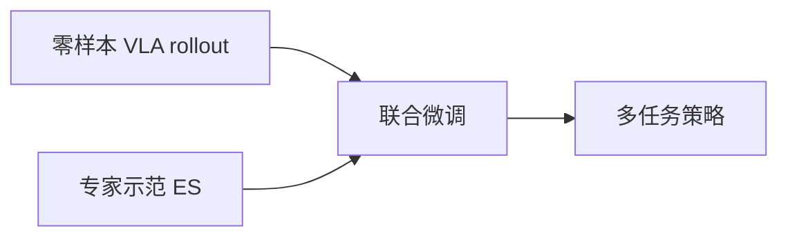

# Self-Demonstrated Generative Control：VLA 跨本体微调的自生成回放

**Self-Demonstrated Generative Control**（*Fine-Tuning VLAs with Self-Demonstrated Generative Control for Multi-Task Manipulation*；[arXiv:2608.19490](https://arxiv.org/abs/2608.19490)，[项目页](https://self-supervised-control.pages.dev/)）由 **UIUC** Prachi Garg、Steve Xing 等提出：将冻结零样本 VLA 在目标机器人上的 **在线交互 rollout** 作为额外训练数据，与少量专家示范联合微调，缓解新本体部署时的 **灾难性遗忘**。

## 一句话定义

**跨本体 VLA 适配的关键不只是补新数据，还要用目标机器人上的自生成轨迹显式保护基础策略的指令跟随与行为覆盖。**

## 英文缩写速查

| 缩写 | 英文全称 | 简要说明 |
|------|----------|----------|
| VLA | Vision-Language-Action | 视觉-语言-动作大模型 |
| ES | Expert-Supervised | 专家遥操作示范数据 |
| SS | Self-Supervised | 零样本策略自生成 rollout 监督 |
| FAST | Frequency-space Action Tokenization | π₀.₅ 族离散动作 token |
| IF | Instruction Following | 指令跟随正确性指标 |

## 为什么重要

- 新机器人上零样本 VLA 常能「靠近正确物体」却抓不稳；纯专家微调又丢语义与 place 等先验。
- 实践用户往往 **拿不到** 预训练 proprietary 数据——需要 **on-robot generative replay**。
- 纳入 [具身智能小站 2026-08-24 九篇盘点](../../sources/blogs/wechat_embodied_station_9_papers_vla_predict_grasp_2026-08-24.md) 的 VLA 本体迁移主线。

## 核心信息

| 项 | 内容 |
|----|------|
| **机构** | 伊利诺伊大学厄巴纳-香槟分校（UIUC） |
| **骨干** | 连续 action chunking VLA（π₀.₅ 族；双目标 FAST + flow matching） |
| **平台** | 真机 ALOHA；仿真 RoboTwin 新基准 |
| **开源** | **确认未开源**（项目页无 GitHub/权重；截至 2026-08-24） |

## 核心原理

1. **专家监督** — 少量 teleop 示范覆盖新任务（如 pick-up）。
2. **自监督回放** — 冻结策略在 pick-and-place 等任务族在线 rollout，动作用作自蒸馏目标。
3. **无预训练数据访问** — 回放发生在目标硬件与场景，消除跨机器人域差。

## 源码运行时序图

**不适用** — 截至 **2026-08-24** 项目页未发布可运行代码或权重。

## 工程实践

| 项 | 建议 |
|----|------|
| 何时引用 | 新本体微调 VLA 且专家数据少、又怕遗忘 place/push 等先验 |
| 数据配比 | 论文联合 ES+SS；place 无专家示范亦可从 0%→55% |
| 与纯专家微调对比 | 齿轮插入 30%→90%；held-out push 60% vs oracle 5% |

## 实验与评测

- **ALOHA：** 5 任务族、59 prompts、120 场景；IF 与任务 SR 多组对照。
- **RoboTwin：** 旧任务 16.6%→70.6%；新任务 93%→98%（联合 SS+ES）。
- **样本效率** — 14 分钟专家数据 + SS 即可多任务可用。

## 结论

**跨本体 VLA 后训练应把「自生成回放」当作与专家示范并列的数据源，而不是事后补救。**

1. **自监督蒸馏** — 失败 rollout 仍携带语义相关动作，可保护 place 等未专家标注的行为。
2. **遗忘可量化** — 纯 ES 微调会丢 push 等 held-out 技能族；SS 可保留至 60% SR。
3. **样本效率** — 接触丰富双臂任务（齿轮插入）增益最大（30%→90%）。
4. **仿真协议** — RoboTwin 子集（TSS/TES/TNO/TNC）可作跨本体保留评测参考。
5. **开源缺口** — 截至入库日仅项目页结果，复现需跟踪代码发布。

## 与其他工作对比

| 对照 | 差异读法 |
|------|----------|
| 仅专家微调 | 丢指令跟随与未示范技能；本文 SS 回放补覆盖 |
| 访问预训练 replay 数据 | 工业 VLA 常不可得；本文只用目标机器人 rollout |
| [ReflexVLA](./paper-reflexvla.md) | 同专辑另一 VLA 线：动态延迟 vs 本文跨本体遗忘 |
| DreamBooth 式生成回放 | 本文是在 **物理交互** 上的 self-distillation，不是离线图像先验采样 |

## 局限与风险

- **确认未开源** — 无法独立复现 ALOHA/RoboTwin 数字。
- **骨干绑定** — 实验锚定 π₀.₅ 族与 FAST 重实现；换骨干需重新验证。
- **自演示质量** — 基策略过差时 SS 信号可能带偏；论文讨论 sub-optimal vs oracle self-demo。

## 关联页面

- [VLA](../methods/vla.md)
- [模仿学习](../methods/imitation-learning.md)
- [Action Chunking](../methods/action-chunking.md)
- [Manipulation](../tasks/manipulation.md)
- [VLA·预测·抓取 9 篇技术地图](../overview/vla-predict-grasp-9-papers-technology-map.md)

## 参考来源

- [self_supervised_control_arxiv_2608_19490](../../sources/papers/self_supervised_control_arxiv_2608_19490.md)
- [self-supervised-control-pages-dev](../../sources/sites/self-supervised-control-pages-dev.md)
- [具身智能小站 9 篇盘点（2026-08-24）](../../sources/blogs/wechat_embodied_station_9_papers_vla_predict_grasp_2026-08-24.md)

## 推荐继续阅读

- [arXiv:2608.19490](https://arxiv.org/abs/2608.19490)
- [项目页](https://self-supervised-control.pages.dev/)
