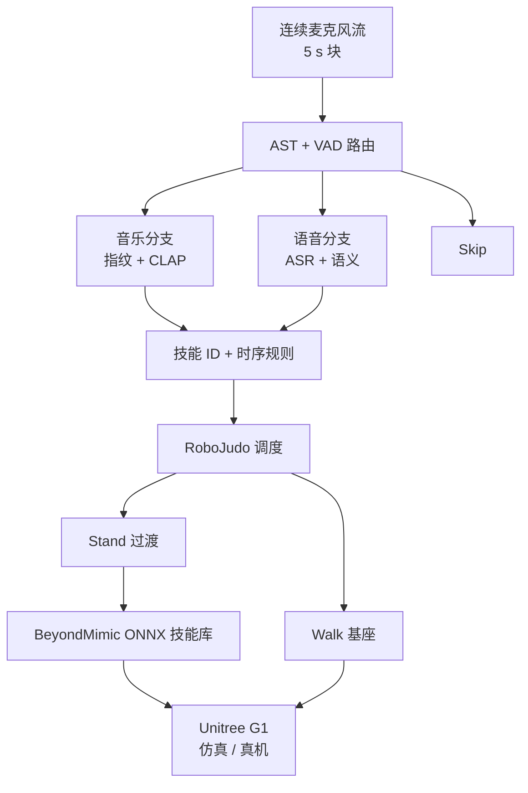

# 语义音频驱动人形全身控制（Lab-RoCoCo）

**Semantic Audio-driven Understanding for Dynamic Humanoid Whole Body Control**（Sapienza / UNINT，arXiv:[2607.14182](https://arxiv.org/abs/2607.14182)，2026-07-16）提出 **在线多模态编排器**：连续麦克风流经 **音乐/语音/跳过** 路由，音乐侧用 **音频指纹 + CLAP 嵌入** 做曲目与时序段对齐，语音侧 **ASR + 语义匹配**（或未匹配时 LLM 对话手势），经 **RoboJudo** 统一接口调度 **Walk / Stand / BeyondMimic ONNX** 技能，在 **Unitree G1** 仿真与真机验证 **上下文感知表演**。

## 一句话定义

**机器人跳舞不只靠时间轴——听清这段是副歌还是说话，再在线挑对的全身技能。**

## 英文缩写速查

| 缩写 | 英文全称 | 简要说明 |
|------|----------|----------|
| WBC | Whole-Body Control | 协调全身关节的运动执行 |
| AST | Audio Spectrogram Transformer | AudioSet 预训练，用于音乐/语音场景分类 |
| VAD | Voice Activity Detection | Silero VAD，判定语音帧占比 |
| CLAP | Contrastive Language-Audio Pretraining | 音频-文本联合嵌入，指纹失败时语义回退 |
| ASR | Automatic Speech Recognition | 语音转写（gpt-4o-mini-transcribe） |
| ONNX | Open Neural Network Exchange | BeyondMimic 技能策略的实时推理格式 |
| Sim2Real | Simulation to Real | MuJoCo G1 编排逻辑零修改上真机 |

## 核心信息

| 字段 | 内容 |
|------|------|
| 机构 | 罗马大学 Sapienza、罗马国际大学（UNINT） |
| 作者 | J. Marcelo、M. Brienza、E. Bugli、L. Comito、D. Nardi、D. Bloisi、V. Suriani |
| 平台 | Unitree G1 |
| 技能库 | BeyondMimic 模仿策略 + Walk/Stand 过渡 |
| 控制框架 | RoboJudo（TCP 技能调度） |
| 项目页 / 代码 | <https://lab-rococo-sapienza.github.io/semantic-WBC/> · [GitHub](https://github.com/Lab-RoCoCo-Sapienza/semantic-WBC) |

## 为什么重要

- **从离线编舞到在线语义调度：** 相对 AI Choreographer / EDGE 等 **生成 kinematics** 路线，本文 **不重训低层**，而是 **检索并组合已有 RL/模仿技能**。
- **双模态统一接口：** 音乐节拍段与语音指令共用 **skill ID 队列**，适合 RoboCup OnStage、展会互动等 **非脚本化** 场景。
- **可泛化到新曲目/语句：** 嵌入空间允许 **未见音频** 映射到最近技能，无需为每首歌重训 policy。
- **真机闭环证据：** 块级 84.8% 检索 + G1 现场演示，说明瓶颈在 **技能切换延迟** 而非检索本身。

## 方法

| 模块 | 机制 |
|------|------|
| **路由** | AST 场景分数 + Silero VAD → Music / Speech / Skip |
| **音乐检索** | Wang 指纹 → $(track, conf, votes, \tau)$；timed rules 按 $\tau$ 选技能；低置信 → CLAP |
| **语音** | 转写 → 技能库 top-1；失败 → LLM+TTS+等长手势 |
| **防抖** | 置信/票数阈值、语音主导度、技能冷却窗口 |
| **执行** | 可选 Stand priming → 目标技能；MuJoCo ↔ 硬件接口可切换 |

### 流程总览

## 实验要点（归纳）

| 轴 | 结果 |
|----|------|
| **块级检索** | 574 块（含 0.5–2.0 s 起始偏移）准确率 **84.8%** |
| **M30 mashup** | 30 s 换曲；过渡时间充足，Gantt 与指令序列高度一致 |
| **M20 mashup** | 20 s 换曲；Stand priming 来不及，易回退 Walk 或失稳 |
| **真机** | 检索稳定；端到端延迟高于仿真（外呼 LLM/TTS、硬件接口） |

## 常见误区或局限

- **误区：「检索准就等于编舞好」。** M20 表明 **切换动力学** 才是编排瓶颈。
- **误区：「必须端到端 RL 学跳舞」。** 本文显式 **解耦技能学习（BeyondMimic）与语义调度（编排器）**。
- **局限：** 固定 5 s 分块引入对齐延迟；外网 API 依赖影响实时性；风格变化检测仍待做（论文 future work）。

## 工程实践与开源状态

- **开源状态（2026-07-20）：** **已开源** — [Lab-RoCoCo-Sapienza/semantic-WBC](https://github.com/Lab-RoCoCo-Sapienza/semantic-WBC)；项目页 BibTeX 互指。
- **部署栈：** RoboJudo + BeyondMimic ONNX；仿真 MuJoCo G1，真机替换为 Unitree 硬件接口。

## 关联页面

- [Loco-Manipulation](../tasks/loco-manipulation.md) — 移动中表达性全身行为
- [BeyondMimic](../methods/beyondmimic.md) — 技能策略训练来源
- [Imitation Learning](../methods/imitation-learning.md) — 演示驱动技能库
- [Unitree G1](./unitree-g1.md) — 验证平台

## 参考来源

- [语义音频 WBC 论文摘录（arXiv:2607.14182）](../../sources/papers/semantic_audio_wbc_arxiv_2607_14182.md)
- [semantic-WBC 项目页](../../sources/sites/lab-rococo-semantic-wbc.md)
- [semantic-WBC 官方仓库](../../sources/repos/lab-rococo-semantic-wbc.md)

## 推荐继续阅读

- 项目页与视频：<https://lab-rococo-sapienza.github.io/semantic-WBC/>
- 代码：<https://github.com/Lab-RoCoCo-Sapienza/semantic-WBC>
- 论文 PDF：<https://arxiv.org/pdf/2607.14182>
- [视觉运球实体页](./paper-vision-dribbling-humanoid-soccer-privileged-representation.md) — 同组 Lab-RoCoCo 人形闭环另一轴
