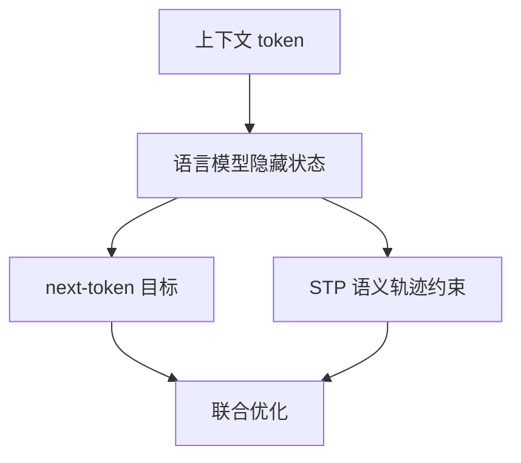

# Semantic Tube Prediction（STP）

**Semantic Tube Prediction: Beating LLM Data Efficiency with JEPA**（arXiv:2602.22617）由 Hai Huang、Yann LeCun、Randall Balestriero 提出。论文把“token 序列的隐藏状态沿语义流形形成平滑路径”作为假设，再以 Semantic Tube Prediction（STP）约束隐藏状态轨迹不要偏离该路径太远。

## 英文缩写速查

| 缩写 | 英文全称 | 简要说明 |
|------|----------|----------|
| JEPA | Joint-Embedding Predictive Architecture | 通过预测相关表征训练模型的一类目标 |
| STP | Semantic Tube Prediction | 把语言模型隐藏轨迹约束在语义 tube 附近的训练任务 |
| NTP | Next-Token Prediction | 按上下文预测下一个 token |
| ODE | Ordinary Differential Equation | 论文用来形式化隐藏状态轨迹的常微分方程 |

## 方法核心

论文先把 token 序列视作连续状态路径来分析：如果隐藏状态动力学足够平滑，来自不同上下文的理想轨迹不应任意碰撞。作者基于此提出 Geodesic Hypothesis，并将训练目标写成 next-token loss 与 STP 轨迹约束的组合。STP 不要求显式构造图像式的多视图对。

## 论文报告的结果

作者报告在 NL-RX-SYNTH 合成数据集上，STP 在训练数据减少到基线约 1/16 时仍可达到基线准确率，并讨论了生成多样性与训练信号噪声。结果来自论文设定及合成数据，不应描述为语言模型普遍摆脱 scaling law。

## 与机器人世界模型的关系

STP 的“预测目标不只看表面 token，还约束内部状态轨迹”的观点可作为表征学习的概念参照，但该工作没有机器人观测、动作条件状态转移、规划器或真机实验。不能把它当作机器人的 latent dynamics 模型。

## 局限与验证问题

- Geodesic Hypothesis 是论文的建模假设；跨模型结构和自然语言任务的适用性需要进一步验证。
- NL-RX-SYNTH 的数据效率结论不等于真实语料、机器人视频或行动序列上的提升。
- 本文引用的量化结果均以原论文指标和数据为准。

## 参考来源

- [VideoDB JEPA 长文](./article-videodb-jepa-world-models.md)
- [LeJEPA](./paper-lejepa.md)
- [From Tokens to Thoughts](./paper-from-tokens-to-thoughts.md)
- [论文来源归档](../../sources/papers/semantic_tube_prediction_arxiv_2602_22617.md)
- [arXiv:2602.22617](https://arxiv.org/abs/2602.22617)
- [作者代码仓库](https://github.com/galilai-group/llm-jepa)
