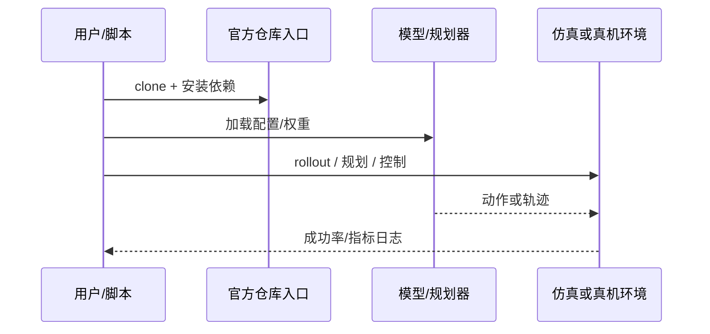

# Semigroup-JEPA（arXiv:2609.10464）

**Semigroup-JEPA**（[Semigroup-JEPA: Latent Dynamics Consistency for Zero-Shot Physics Generalization](https://arxiv.org/abs/2609.10464)）来自 [具身智能小站 11 篇盘点](../../sources/blogs/wechat_embodied_station_11_papers_vlm_manipulation_2026-09-10.md)。重力条件化 latent rollout + SIGReg，测试零样本物理泛化；sg-jepa/sg-jepa 与 HF 权重已开源。

## 一句话定义

**MuJoCo 2D/3D 预测与机器人控制任务上测试分布外重力泛化。**

## 英文缩写速查

| 缩写 | 英文全称 | 简要说明 |
|------|----------|----------|
| IL | Imitation Learning | 从专家示范学习策略 |
| VLM | Vision-Language Model | 视觉-语言多模态模型 |
| WM | World Model | 预测未来观测或表征的动力学模型 |
| RL | Reinforcement Learning | 强化学习 |
| CEM | Cross-Entropy Method | 采样优化动作/轨迹的规划器 |
| DoF | Degrees of Freedom | 自由度 |

## 为什么重要

- 纳入本期 **VLM 控制 / 世界模型 / 灵巧操作 / 规划 / 评测** 主线之一。
- 开源状态：**已开源**（步骤 2.5 核查，2026-09-10）。
- 与 [11 篇技术地图](../overview/vlm-manipulation-11-papers-technology-map.md) 中同类工作可横向对照。

## 核心机制

| 项 | 内容 |
|----|------|
| **arXiv** | [2609.10464](https://arxiv.org/abs/2609.10464) |
| **项目页** | https://sg-jepa.github.io/ |
| **代码** | https://github.com/sg-jepa/sg-jepa |
| **开源** | **已开源** |
| **文内指标** | MuJoCo 2D/3D 预测与机器人控制任务上测试分布外重力泛化。 |

## 源码运行时序图

## 实验与评测

| 项 | 文内口径 |
|----|----------|
| 评测域 | **MuJoCo 2D / 3D 预测** 与机器人控制任务 |
| 泛化变量 | **分布外重力**（训练未见的重力条件下零样本外推） |
| 机制 | 重力条件化 **latent rollout** + **SIGReg** 正则 |
| 产物 | 代码与 **Hugging Face 权重** 已开源 |

- **读法：** 本页为索引级摘要，上表取自 [公众号盘点](../../sources/blogs/wechat_embodied_station_11_papers_vlm_manipulation_2026-09-10.md) 与项目页；具体重力区间、误差指标与基线以 **原文 PDF** 为准（[参考来源](#参考来源)）。
- **评的是外推不是拟合：** 分布内预测误差不足以支持本文主张，读表时须锁定 **未见重力** 那一列。

## 与其他工作对比

| 对照路线 | 差异 |
|----------|------|
| 无物理约束的 latent 世界模型 | 单步/多步预测只求拟合训练分布；本文用 **半群（semigroup）一致性** 约束 latent 动力学的可组合性，换分布外物理外推。 |
| 像素级生成世界模型 | 重建观测像素；本文留在 **JEPA 表征空间**，评的是预测一致性而非视觉保真。 |
| [JEPA Policy](./paper-jepa-policy.md) / [DUET-DINO](./paper-duet-dino.md) | 同属 JEPA 家族但服务 **操作策略 / 规划**；本文服务 **物理泛化**，不报操作成功率。 |
| 显式系统辨识 / 参数化动力学 | 直接估物理参数；本文把重力做 **条件输入** 而非待辨识量，代价是可解释性弱于显式模型。 |
| [Generative World Models](../methods/generative-world-models.md) 主线 | 该页梳理生成式世界模型全景；本文是其中「表征预测 + 物理一致性正则」的一支。 |

## 结论

**Semigroup-JEPA 值得按「已开源」边界阅读：先核对仓库是否可跑，再引用文内成功率数字。**

1. 索引来源为公众号导读，实验细节以 arXiv PDF 为准。
2. 开源结论：**已开源**。
3. 选型时对照 [11 篇地图](../overview/vlm-manipulation-11-papers-technology-map.md) 中相邻节点，避免重复造页。

## 关联页面

- [VLM 与操作 11 篇技术地图](../overview/vlm-manipulation-11-papers-technology-map.md)
- [模仿学习 (Imitation Learning)](../methods/imitation-learning.md)
- [Generative World Models](../methods/generative-world-models.md)
- [Manipulation](../tasks/manipulation.md)

## 参考来源

- [semigroup-jepa_arxiv_2609_10464.md](../../sources/papers/semigroup-jepa_arxiv_2609_10464.md)
- [wechat 11篇盘点](../../sources/blogs/wechat_embodied_station_11_papers_vlm_manipulation_2026-09-10.md)
- [arXiv:2609.10464](https://arxiv.org/abs/2609.10464)

## 推荐继续阅读

- [arXiv PDF](https://arxiv.org/pdf/2609.10464)
- [项目页](https://sg-jepa.github.io/)
- [GitHub](https://github.com/sg-jepa/sg-jepa)
