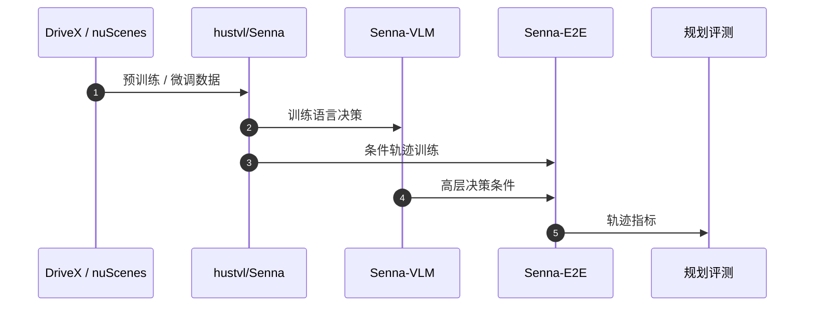

# Senna（Senna: Bridging Large Vision-Language Models and End-to-End Autonomous Driving · arXiv:2410.22313）

**Senna**（*Senna: Bridging Large Vision-Language Models and End-to-End Autonomous Driving*，[2410.22313](https://arxiv.org/abs/2410.22313)，arXiv 2024）由 **华中科技大学 hustvl（HUST）等** 提出，收录于深蓝AI《端到端自动驾驶：十大前沿算法盘点》**决策与控制解耦** 线索代表作。

## 一句话定义

Senna-VLM 输出自然语言高层决策，Senna-E2E 在该条件下做精确数值轨迹——让语言模型做常识、专用网络做几何。

## 英文缩写速查

| 缩写 | 英文全称 | 简要说明 |
|------|----------|----------|
| Senna | Senna VLM–E2E Driving | VLM 决策与 E2E 数值规划解耦框架 |
| VLM | Vision-Language Model | 高层语义决策大脑 |
| E2E | End-to-End | 数值轨迹小脑 |
| LLaVA | Large Language and Vision Assistant | 常见 VLM 基座依赖 |
| nuScenes | nuScenes Dataset | 微调与评测集 |

## 为什么重要

- 直接让 VLM 回归方向盘/XY 轨迹误差大；解耦是当前务实工程解。
- 在 DriveX 预训练 + nuScenes 微调设定下，盘点称规划误差降约 **27.12%**、碰撞率降约 **33.33%**（以论文为准）。
- 与 DriveVLM 的 CoT、EMMA 的一切皆语言形成「VLM 如何接入控制」对照三角。

## 核心信息

| 字段 | 内容 |
|------|------|
| **机构** | 华中科技大学 hustvl（HUST）等 |
| **arXiv** | [2410.22313](https://arxiv.org/abs/2410.22313) |
| Venue | arXiv 2024 |
| **演进线索** | 决策与控制解耦 |
| **开源** | **已开源** — [`hustvl/Senna`](https://github.com/hustvl/Senna) |
| **指标索引** | DriveX 预训练 + nuScenes 微调；盘点给出误差/碰撞率相对降幅（核对原表）。 |

## 核心原理

### 双模块

| 模块 | 角色 |
|------|------|
| **Senna-VLM** | 多视角图像 → 自然语言高层决策（如「红灯，直行减速停车」） |
| **Senna-E2E** | 以 VLM 决策为条件 → 精确数值轨迹 |

### 流程总览

## 源码运行时序图

关键复现路径：[`hustvl/Senna`](https://github.com/hustvl/Senna)（依赖 LLaVA 等，见 README）。

## 实验与评测

| 维度 | 记录 |
|------|------|
| 数据 | DriveX 预训练 + nuScenes 微调 |
| 报告点 | 规划误差约 **-27.12%**、碰撞率约 **-33.33%**（盘点相对降幅） |
| 对照 | 直接让 VLM 回归轨迹的基线 |

## 与相邻路线对比

| 路线 | 相对 Senna | 取舍 |
|------|------------|------|
| [DriveVLM](./paper-drivevlm.md) | CoT 一体化更强 | 延迟与幻觉 |
| [EMMA](./paper-emma-waymo-e2e.md) | 统一语言空间 | 闭源 |
| 纯 E2E（VAD 等） | 无语言常识 | 长尾弱 |

## 工程实践

| 维度 | 记录 |
|------|------|
| 典型评测 | nuScenes / NAVSIM / Bench2Drive / Waymo Open（依论文） |
| 开源状态 | **已开源** — [`hustvl/Senna`](https://github.com/hustvl/Senna) |
| 复现入口 | https://github.com/hustvl/Senna |
| 工程关注点 | 延迟、帧间一致性、可解释中间量表征、与模块化栈的接口 |

## 局限与风险

- 决策语言空间设计不当会导致条件信息瓶颈。
- 两套模型的延迟与一致性调度需系统层设计。
- DriveX 等数据若不完全公开，复现会受限。

## 关联页面

- [e2e-autonomous-driving-top10-algorithms](../overview/e2e-autonomous-driving-top10-algorithms.md) — 十大盘点父节点
- [自动驾驶核心算法盘点专辑](../overview/autonomous-driving-core-algorithms-series.md) — 模块化栈姊妹篇
- [生成式世界模型](../methods/generative-world-models.md)
- [S²-VLA](./paper-s-squared-vla.md) — 驾驶 VLA / NAVSIM 对照
- [M⁴World](./paper-m4world.md) — 驾驶世界模型后继
- [VLA](../methods/vla.md)

## 参考来源

- [深蓝AI：端到端自动驾驶十大前沿算法盘点](../../sources/blogs/wechat_shenlan_ai_ad_e2e_top10.md)
- [e2e_ad_senna.md](../../sources/papers/e2e_ad_senna.md) — 论文 source
- arXiv: [2410.22313](https://arxiv.org/abs/2410.22313)
- [repos/hustvl_senna.md](../../sources/repos/hustvl_senna.md)

## 推荐继续阅读

- 论文 PDF：<https://arxiv.org/pdf/2410.22313.pdf>
- 官方代码：<https://github.com/hustvl/Senna>
- 项目页/博客：<https://github.com/hustvl/Senna>
