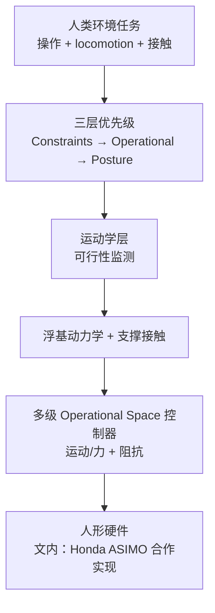

# A Whole-Body Control Framework for Humanoids Operating in Human Environments（ICRA 2006）

**A Whole-Body Control Framework for Humanoids Operating in Human Environments**（Sentis & Khatib；ICRA 2006, pp. 2641–2648；[DOI:10.1109/ROBOT.2006.1642100](https://doi.org/10.1109/ROBOT.2006.1642100)）把 [IJHR 2004](./paper-khatib-sentis-ijhr-2004-whole-body-dynamic-behavior.md) 的全身动态行为理论 **落地为面向人类环境的人形控制框架**：强调 **安全接触、柔顺交互、运行时可行性监测** 与 **浮基支撑接触动力学**。

## 一句话定义

**在约束–操作任务–姿态三层优先级下，用任务导向动态控制与操作空间多级合成，让人形在人类环境中同时完成操作、运动与安全接触。**

## 英文缩写速查

| 缩写 | 英文全称 | 简要说明 |
|------|----------|----------|
| WBC | Whole-Body Control | 全身多任务控制总称 |
| OSF | Operational Space Formulation | 末端任务空间动力学控制 |
| IK | Inverse Kinematics | 运动学层优先级与可行性监测 |
| PD | Proportional–Derivative | 低层跟踪；文中结合阻抗实现柔顺 |
| ASIMO | Advanced Step in Innovative Mobility | 文内工程合作平台（Honda 人形） |

## 为什么重要

- **「代表性论文」定位：** 国内 WBC 课程/综述常把本文与 IJHR 2004 并列为 Sentis–Khatib 主线；是 **人形环境 WBC** 最常被引用的会议版框架说明。
- **工程语义完整：** 除数学层级外，明确 **运动学层可行性监测**、**阻抗/柔顺**、**浮基模型与支撑接触** 如何进入同一栈。
- **软件后继明确：** [ControlIt!](./controlit.md) 的 WBOSC 算法线直接继承该框架的操作空间全身控制思想。

## 流程总览

## 核心机制（归纳）

### 1）与 IJHR 2004 的继承关系

| 维度 | IJHR 2004 | ICRA 2006（本文） |
|------|-----------|-------------------|
| 三层语义 | 约束 / 操作 / 姿态 | 同构，强调 **human environments** |
| 浮基与接触 | 数学基础 | **自由漂浮模型 + 支撑接触效应** 工程化 |
| 可行性 | 理论优先级 | **运动学层运行时监测** behavior feasibility |
| 交互 | 较少展开 | **阻抗控制**、软姿态、安全接触 |

### 2）控制原语与投影

- **约束处理任务** 最高优先级；**操作任务** 投影到约束零空间；**姿态** 占用剩余冗余。
- 可在 **多个层级** 合成 operational space 控制器，分别刻画各原语在约束下的动态行为。

### 3）工程背景与开源

- 文内提及与 **Honda** 合作向 **ASIMO** 实现框架。
- **截至入库日无官方开源仓库**；现代开源对照见 [ControlIt!](./controlit.md)、[TSID](https://github.com/stack-of-tasks/tsid)。

## 工程实践

| 项 | 内容 |
|----|------|
| 开源状态 | **未开源**（会议论文；ASIMO 实现未公开） |
| 软件对照 | [ControlIt!](https://github.com/liangfok/controlit) — WBOSC + 插件化 ROS 中间件 |
| MPC 分层参考 | 四足 [legbot-MPC-WBC](./legbot-mpc-wbc.md) 展示 MPC→低层执行栈（非人形，但分层读法相通） |

## 源码运行时序图

**不适用**（论文未发布可运行代码）。WBOSC 开源运行时序见 [ControlIt!](./controlit.md)。

## 局限与风险

- **勿与学习型 WBC 混淆：** 本文是 **模型-based 任务栈**，不涵盖 RL/VLA 端到端策略（见 [wbc-vs-rl](../comparisons/wbc-vs-rl.md)）。
- **ASIMO 细节不可复现：** 工程结论需通过开源栈（ControlIt!/TSID）或现代人形平台重新验证。

## 结论

**ICRA 2006 把 IJHR 2004 的全身优先级理论翻译成「人类环境人形」可叙述、可实现的 WBC 框架，是后续 WBOSC 软件与现代人形控制课程的代表性锚点。**

1. **与 IJHR 2004 成对阅读** — 2004 定结构，2006 定环境与工程叙事。
2. **可行性监测是工程亮点** — 不仅在动力学层求解，还在运动学层判断行为是否可执行。
3. **阻抗/柔顺是默认交互模式** — 人类环境任务不能只做刚性轨迹跟踪。
4. **无官方代码** — 复现与教学应转向 [ControlIt!](./controlit.md) 或 TSID/HQP 生态。
5. **浮基+支撑接触必须进模型** — 跳过人形接触切换会低估框架难度。
6. **与 MPC 分层可组合** — 高层规划（步态/接触力）+ 本文类 WBC 执行，见 [mpc-wbc-integration](../concepts/mpc-wbc-integration.md)。

## 与其他页面的关系

- 系统化起点：[paper-khatib-sentis-ijhr-2004-whole-body-dynamic-behavior.md](./paper-khatib-sentis-ijhr-2004-whole-body-dynamic-behavior.md)
- 理论源头：[paper-operational-space-formulation.md](./paper-operational-space-formulation.md)
- 软件：[controlit.md](./controlit.md)
- 概念：[whole-body-control.md](../concepts/whole-body-control.md)、[hub-wbc.md](../overview/hub-wbc.md)

## 参考来源

- [sentis_khatib_icra_2006_whole_body_control_framework.md](../../sources/papers/sentis_khatib_icra_2006_whole_body_control_framework.md)
- PDF：<https://khatib.stanford.edu/publications/pdfs/Sentis_2006_ICRA.pdf>

## 推荐继续阅读

- [DOI:10.1109/ROBOT.2006.1642100](https://doi.org/10.1109/ROBOT.2006.1642100)
- [ControlIt! arXiv:1506.01075](./controlit.md) — WBOSC 开源框架
- [Sentis 2005 ICHR — Behavioral Primitives](../../sources/papers/whole_body_control.md) — 行为原语层级控制前驱
