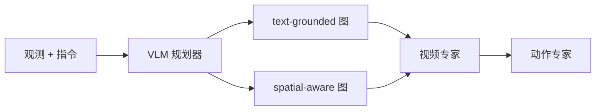

# SG-WAM（语义引导）：让 WAM 的未来视频听懂指令

**SG-WAM**（*Text-Grounded and Spatial-aware Semantic Guidance for World-Action Models*；[arXiv:2608.08839](https://arxiv.org/abs/2608.08839)）由 **香港科技大学广州校区 / Ola Dimensions** 提出：多数 WAM 主要靠视觉线索生成未来，现成 CLIP/T5 文本编码与当前画面解耦，于是预测视频和语言对不齐，动作跟着偏。

> **命名消歧：** 本页是 **语义引导** SG-WAM。另一篇 *Self-Guided World Modeling in Geometry-Aware Policy Space*（[arXiv:2608.01397](https://arxiv.org/abs/2608.01397)，[sg-wam.github.io](https://sg-wam.github.io/)）同缩写、不同问题（几何感知策略空间里的自监督世界建模）。**禁止合并节点。**

## 一句话定义

**用 VLM 规划器从当前图和指令预测「对准物体」与「场景几何」两份语义前瞻，注入 WAM 的视频专家，让未来帧和动作跟着指令走。**

## 英文缩写速查

| 缩写 | 英文全称 | 简要说明 |
|------|----------|----------|
| SG-WAM | Semantic Guidance for World-Action Models | 本文：VLM foresight 注入 WAM |
| WAM | World Action Model | 联合未来视频与动作生成 |
| VLM | Vision-Language Model | 规划器骨干（文中 Qwen3.5） |
| CFG | Classifier-Free Guidance | 训练时随机丢掉引导，推理放大 |
| LIBERO | Lifelong Robot Learning benchmark | 主仿真榜 |

## 为什么重要

- WAM 的短板正在从「会不会生成」转向「生成是否语义对齐」。
- 只加空间 token 仍缺指令级语义；需要同时锁目标物体和锁几何。
- LIBERO 已接近饱和（98.7% vs 98.5%），增量主要读 LIBERO-Plus 语言扰动和真机分心物体。

## 核心信息

| 项 | 内容 |
|----|------|
| **机构** | 香港科技大学广州校区（HKUST-GZ）；Ola Dimensions |
| **评测** | LIBERO / LIBERO-Plus；真机四任务 |
| **开源** | **未开源**（文内项目页 404；无训练仓） |

## 核心原理

### 方法栈

规划器在图像–指令序列上追加 query token：base 组共享语义，两组特异 token 分别对齐 **SigLIP2**（text-grounded，对准指令物体）与 **Depth Anything 3**（spatial-aware，场景几何）。Resampler 解成未来关键帧稠密特征图，投影后经并行 cross-attention 注入视频专家每一块；动作专家通过与视频专家的联合注意力继承引导。三阶段：只训规划器 → 与视频专家共训 → 再加动作专家。推理丢掉教师编码器。

### 流程总览

## 源码运行时序图

**不适用。** 论文给出的 [livfour.github.io/SG-WAM](https://livfour.github.io/SG-WAM/) 截至 2026-08-17 为 404；未找到可辨识的训练/推理入口。不要误用 [ReturnZhao/SG-WAM](https://github.com/ReturnZhao/SG-WAM)（另一篇，且仅占位 README）。

## 工程实践

| 项 | 建议 |
|----|------|
| 源码运行时序图 | **不适用**（实现未发布） |
| 读数 | 优先看 LIBERO-Plus 语言列和真机分心物体，不要只报 98.7% |
| 消歧 | 检索「SG-WAM」必须带 arXiv 号或「semantic guidance」 |
| 注入 | 文中动作头不直接吃 foresight，靠与视频专家联合注意 |

## 实验与评测

- **LIBERO：** 平均 **98.7%**，文称超过 LingBot-VA 98.5%；相对 FastWAM / GE-Act +1.1 / +2.2。
- **LIBERO-Plus：** 平均 **81.3%**（+3.5），语言扰动 **81.7%**（+2.2）。
- **真机：** 猕猴桃入篮、按序叠碗、按序填锅、提锅；每任务 100 条遥操作、50 trial。SG-WAM 四任务均高于 GE-Act 与 FastWAM；未见篮高与光照泛化仍最优。注意力可视化：RGB WAM 把注意散到机械臂和多个物体，SG-WAM 集中在被操作物体。

## 与其他工作对比

相对 [MECo-WAM](./paper-meco-wam-4d-geometry-cotraining.md) / [4D-WAM](./paper-4d-wam.md)：那两篇把 **几何/轨迹** 在训练期灌进表征，推理可去掉老师；本文把 **指令语义前瞻** 在推理期也注入生成。相对 [SHRIMP](./paper-shrimp.md)：语言在 SHRIMP 停在可编辑计划，在 SG-WAM 变成稠密 foresight 特征。相对同缩写 Self-Guided SG-WAM：那篇在策略表征空间做 EMA 自监督世界建模，不训独立 VLM 规划器。

## 结论

**WAM 跟不住指令时，优先补「当前画面上的语义前瞻」，而不是再加一个与观测无关的文本编码器。**

1. **两路 foresight 要分开** — 锁物体与锁几何不是同一个教师。
2. **三阶段训练** — 规划器先会预测未来特征，再进生成。
3. **饱和榜看扰动** — LIBERO +0.2 不如 Plus 语言列有信息。
4. **真机增益在分心物体** — 指令指定顺序/目标时差距最大。
5. **代码未开源** — 目前只能复用协议思想，不能复现 98.7%。

## 局限与风险

- 项目页 404，复现路径中断。
- 规划器每视角独立前向，多相机成本随视角线性涨。
- 与 Self-Guided SG-WAM 缩写碰撞，文献检索极易张冠李戴。

## 关联页面

- [World Action Models](../concepts/world-action-models.md)
- [4D-WAM](./paper-4d-wam.md) — 同批「让未来对动作有用」
- [MECo-WAM](./paper-meco-wam-4d-geometry-cotraining.md)
- [LIBERO](./libero-benchmark.md)
- [DyPES-VLA](./paper-dypes-vla.md) — 同 `livfour` 项目页账号的跨本体 VLA
- [LAMDA](./paper-lamda-tsr.md) — 同样把 VLM 当教师、但推理丢掉语言通路
- [SHRIMP](./paper-shrimp.md)

## 参考来源

- [SG-WAM 语义引导论文摘录](../../sources/papers/sg_wam_semantic_guidance_arxiv_2608_08839.md)
- [项目页归档（404）](../../sources/sites/livfour-sg-wam.md)
- [具身智能小站 9 篇盘点（2026-08-17）](../../sources/blogs/wechat_embodied_station_9_papers_2026-08-17.md)
- [arXiv:2608.08839](https://arxiv.org/abs/2608.08839)

## 推荐继续阅读

- [arXiv HTML 全文](https://arxiv.org/html/2608.08839)
- 对照：[Self-Guided SG-WAM 项目页](https://sg-wam.github.io/)（另一篇）
