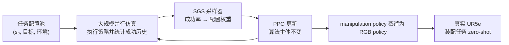

# SGS：把 RL 训练预算投到策略能力前沿

**SGS（Success-Guided Sampling）** 是一项任务配置自适应采样方法：在 PPO 外层根据策略近期成功率调整 episode reset 分布，让并行仿真训练主要消耗在当前“有进展但尚未掌握”的任务配置上。论文题为 [A Balanced Data Diet: Addressing the Exploration Bottleneck in Mega-Scale RL for Robot Control](https://arxiv.org/abs/2610.12465)（CoRL 2026），项目主页为 [sgs-rl.github.io](https://sgs-rl.github.io/)。

## 一句话定义

**SGS 是对训练任务采样分布的轻量修改，而不是新的 PPO 优化器：成功率决定配置采样权重，以减少过易与过难配置占用的大规模 rollout。**

## 英文缩写速查

| 缩写 | 英文全称 | 简要说明 |
|------|----------|----------|
| SGS | Success-Guided Sampling | 按任务配置成功历史自适应加权采样 |
| PPO | Proximal Policy Optimization | SGS 外层保持不变的策略优化算法 |
| RL | Reinforcement Learning | 在模拟器内通过交互采样优化策略 |
| PLR | Prioritized Level Replay | 官网规模实验中的 curriculum / replay 对照方法 |
| RGB | Red, Green, Blue | 蒸馏后真机 manipulation policy 使用的图像输入 |
| sim2real | Simulation-to-Real | 仿真训练策略向真实机器人迁移 |

## 为什么重要

大规模仿真能在每个批次并行产生大量轨迹，但环境数量增加不等于有效训练信号增加。均匀采样时，简单配置会重复提供已饱和的经验，极难配置则可能几乎全失败、缺乏可用梯度。尤其在精密接触操作或跨越复杂地形时，任务分布里同时混有不同“可学性”的配置，静态的 uniform reset 容易浪费算力。

SGS 提供一种比逐任务奖励塑形更轻的干预：任务/环境随机化仍提供广泛配置，采样器根据策略学习进度调配训练比例。论文报告其在并行环境扩展至百万级时，能够继续提升 locomotion 与 contact-rich assembly 的成功表现。

## 核心原理

### 配置、反馈与采样

任务配置由三部分组成：

[
c=(s_0,g,e)
]

其中 (s_0) 是机器人的初始状态，(g) 是目标，(e) 是环境（如地形或场景布局）。训练前建立固定配置池，并为每个配置保留有限成功历史。episode 结束时，将该次是否成功写入对应历史，再按成功率对应权重抽取下一配置。

官网可确认的定性权重规律是：

- **策略几乎从未成功：** 配置权重较低，避免预算被当前不可解的情形吞噬。
- **开始成功但尚未稳定：** 权重提高，聚焦正在形成能力的配置。
- **已稳定掌握：** 权重再降低，把训练转向尚未掌握的配置。

这不是纯粹的“失败优先”：失败过多的配置也会降权。它试图把采样质量放在“既不太简单，也不是难到学不到”的中间区域。官网将 SGS 描述为标准 PPO 加一个小型外环，唯一改变是 episode reset 时抽取哪个 task configuration。

### 训练—部署链路

## 方法栈与实验结果

### locomotion：扩展并行环境

项目页公布的 ANYmal D 多地形结果（3 seeds 均值 ± 95% 区间）：

| 并行环境 | SGS | PLR | Uniform | Linear |
|---:|---:|---:|---:|---:|
| 4K | 0.46 ± 0.02 | 0.00 ± 0.00 | 0.00 ± 0.00 | 0.00 ± 0.00 |
| 32K | 0.49 ± 0.11 | 0.13 ± 0.01 | 0.42 ± 0.04 | 0.32 ± 0.03 |
| 256K | 0.72 ± 0.05 | 0.55 ± 0.14 | 0.00 ± 0.00 | 0.00 ± 0.00 |
| 1M | 0.73 ± 0.01 | 0.54 ± 0.13 | 0.00 ± 0.00 | 0.00 ± 0.00 |

官网展示的地形包括 stepping stones、floating islands、climbing box、stairs 等；ANYmal C/D 分别有不同场景覆盖。

### manipulation：精密装配与 sim-to-real

官网展示 UR5e / Franka 的 nut-on-bolt、rod-in-hole、gear mesh、BNC connector、waterproof connector、rectangular peg 等。项目页的 Franka nut-and-bolt 规模结果为：

| 并行环境 | SGS | PLR | Uniform |
|---:|---:|---:|---:|
| 4K | 0.00 ± 0.01 | 0.00 ± 0.00 | 0.00 ± 0.00 |
| 32K | 0.06 ± 0.01 | 0.00 ± 0.00 | 0.00 ± 0.00 |
| 256K | 0.10 ± 0.14 | 0.02 ± 0.04 | 0.01 ± 0.04 |
| 1M | 0.70 ± 0.19 | 0.05 ± 0.11 | 0.06 ± 0.13 |

作者还报告将 manipulation 策略蒸馏为 RGB 输入策略，并在真实 UR5e 上 zero-shot 装配螺母、插杆和啮合齿轮。官网描述操纵任务使用相同奖励函数、没有 demonstration；模拟器交互仍会生成训练 rollout，因此“无示范/无真实世界训练数据”不等于“完全没有训练数据”。

## 与其他工作对比

| 维度 | Uniform reset | 线性 curriculum / PLR | SGS |
|---|---|---|---|
| 采样信号 | 配置均匀随机 | 预设难度进度或 replay priority | 每配置近期成功率 |
| 进度适配 | 无 | 依赖课程定义/难度度量 | 随当前策略掌握度变化 |
| PPO 主体 | 标准 PPO | 常与 PPO 配合 | 标准 PPO |
| 主要目标 | 覆盖配置 | 从易到难或重放困难级别 | 将预算聚焦于学习前沿 |
| 潜在代价 | 难/易任务都可能浪费算力 | 课程设计与难度排序依赖任务 | 依赖配置可重复、成功判据可靠及足量历史 |

因此 SGS 的主要贡献是训练分布管理，不应误称为更强的新型 policy architecture 或替代 PPO 的 RL 算法。

## 工程实践

1. **先定义配置粒度。** 明确哪些变化需要被独立追踪（初始位姿、物体目标、地形、布局），配置过粗会混淆不同难度，过细会使历史样本稀疏。
2. **校验成功判据。** 采样器依赖 episode success 指标；阈值噪声会直接反馈成错误的采样权重。
3. **检查有效探索与覆盖。** 除全局成功率外，按配置查看历史成功率、采样频数、配置覆盖、失败类型，防止 sampler 只集中在少数模式。
4. **公平对比算力。** 大规模并行下的收敛比较应统一环境步数 / simulator steps 与评估配置，不仅比较 wall-clock。
5. **逐任务审查 reset 策略。** 官网装配配置混合 reaching、stable-grasp 和 near-goal reset；这是任务初始化设计，不能误记为给定人工 demonstration。
6. **复现状态需谨慎。** 截至 2026-10-10，项目主页代码状态为 “coming soon”，尚无官方可运行仓库；论文/视频能支持机制与实验阅读，但当前不能直接照官方代码复跑。

## 源码运行时序图

**不适用：** 截至 2026-10-10 官网没有官方代码仓库链接，且标注 “Code (coming soon)”。目前没有可与源码模块或 README 入口对齐的可运行训练/推理调用路径。

## 结论

**结论：** SGS 的核心工程价值在于把“大规模并行采样”转换成“对当前策略仍有学习价值的大规模采样”，而不是改造 PPO 本身。

- 若 uniform PPO 在大量配置上出现成功率分化、环境扩容后收益停滞，先检查 batch 中过易/过难配置占比，再考虑按学习进度调采样。
- SGS 的有效性依赖任务配置能够复现、终止成功判据可信、配置历史足够稳定；仅增加环境数不会自动产生 SGS 所需信号。
- 项目报告百万级并行结果有显著提升，尤其公开的 Franka nut-and-bolt 1M 结果相对 uniform 高；比较时要带上任务、机器人、置信区间，勿外推成所有任务普遍 70%。
- RGB 真机展示建立在仿真训练与策略蒸馏之上；这证明 sim-to-real 路线，不代表模型没有使用仿真生成的数据。
- 代码待发布意味着目前更适合借鉴采样思想与基准读法，而非作为即刻可复现的开源基线。

## 局限与风险

- 当前官网“代码 coming soon”，独立复现成本未知；缺少源码使得成功率历史长度、权重函数、温度/平滑、配置池大小等实施细节需以论文全文核实，不从营销页面推断。
- 已公开对比表主要给出特定 locomotion 与 Franka 装配任务、配置和并行规模；不能仅凭这些数字断言 SGS 对所有机器人、奖励稀疏程度或 simulator 都优于其他课程方法。
- 大规模仿真对 reset 生成吞吐、GPU 内存、同步/异步执行和 success bookkeeping 有要求；百万 env 指论文系统规模，不是一般实验机即可复制。
- 零样本真机迁移仍受仿真物理/视觉差异、传感器标定、动作安全和部署保护限制。演示结果不等于任意装配工位的稳健性保证。

## 关联页面

- [PPO：近端策略优化](../methods/ppo.md)
- [强化学习方法总览](../methods/reinforcement-learning.md)
- [Sim2Real](../concepts/sim2real.md)
- [接触丰富操作](../concepts/contact-rich-manipulation.md)
- [机器人运动](../tasks/locomotion.md)
- [机器人操作](../tasks/manipulation.md)

## 参考来源

- [arXiv:2610.12465v1 原文摘录](../../sources/papers/sgs_arxiv_2610_12465.md)
- [SGS 官方项目页归档](../../sources/sites/sgs-rl-github-io.md)
- [arXiv abstract](https://arxiv.org/abs/2610.12465)
- [SGS 官方项目页](https://sgs-rl.github.io/)
