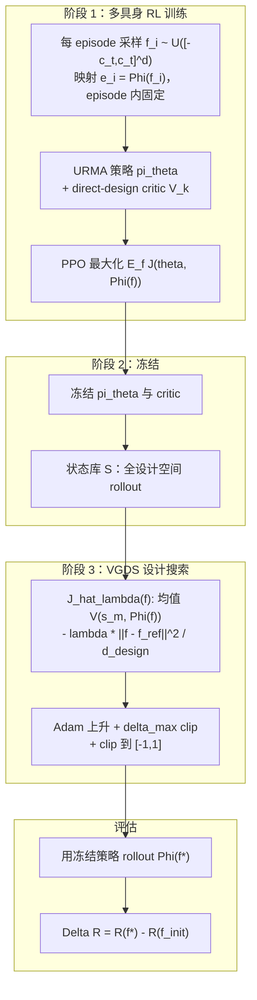

# Shape Your Body：多具身价值梯度机器人共设计

**Shape Your Body**（Bohlinger & Peters，TU Darmstadt；[项目页](https://nico-bohlinger.github.io/shape-your-body/)，[PDF](https://www.ias.informatik.tu-darmstadt.de/uploads/Team/NicoBohlinger/shape_your_body.pdf)，[arXiv HTML](https://arxiv.org/html/2606.00702v1)）提出：先把**多具身强化学习**训出的 **embodiment-aware 价值函数**当作**可微设计 surrogate**，再对固定拓扑下的连续机体/控制接口参数做 **Value-Gradient Design Search (VGDS)**，从而摊销「每个新机器人重跑整条 RL 共设计环」的成本。

## 一句话定义

> **一次**在大规模机器人设计分布上训练 URMA 策略 + critic → **冻结** → 对任意目标机的归一化设计向量 $f$，用 critic 在状态库上的预测做梯度上升，并用 $f_{\mathrm{ref}}$ 周围的软信赖域抑制外推——把共设计从「每初值一条 RL」变成「每初值几分钟搜索」。

## 为什么重要

- **共设计算力结构不同：** Transform2Act、BodyGen、Stackelberg PPO、FEACRL 等虽在单次运行内共享经验，但**换机器人或设计空间仍要重训**；VGDS 把昂贵部分摊销到**一次 7–9 h 级多具身训练**，之后每个 $f_{\mathrm{init}}$ 约 **1–2 min**（可批处理 critic）。
- **千维连续设计空间：** 在真实 URDF 级参数化下，单机器人即有 **358–688** 维（Go2 / MIT Humanoid / Golem），全集训练覆盖 **50** 基座机、**190–1177** 维/机——高于典型共设计论文的参数量级。
- **与多具身控制主线衔接：** 建立在 **URMA**（[One Policy to Run Them All](https://proceedings.mlr.press/v270/bohlinger25a.html)）及 **50 机极端 embodiment 随机化**（arXiv:2509.02815）之上；读者若已关注 [跨具身策略迁移](../queries/cross-embodiment-transfer-strategy.md) 或 [Any2Any](./paper-any2any-cross-embodiment-wbt.md)，本文补的是**形态参数侧**而非 WBT 轨迹侧。
- **价值梯度兼做工程诊断：** 按 body part × 参数类型分解 $f^\star - f_{\mathrm{ref}}$，可优先检查 PD、名义关节位、足几何、执行器速度限等——与「只给一个更优 URDF」的黑盒搜索区分开。

## 流程总览

**direct-design critic（相对标准 URMA）：** description 向量 $d_j$ 不仅参与 attention **键**，还进入 $g_\psi(o_j, d_j)$ 的**值**路径，使 $\nabla_f V$ 对质量、PD、几何等更敏感；$K$ 头集成均值缓解单头过拟合。

## VGDS 目标（与项目页一致）

设计向量 $f \in [-1,1]^{d_{\mathrm{design}}}$，参考 $f_{\mathrm{ref}}$（常为名义 URDF）。在状态库 $\mathcal{S}$ 上：

$$\hat{J}_\lambda(f)=\frac{1}{M}\sum_{m=1}^{M}\bar{V}(s_m,\Phi(f))-\lambda\frac{\|f-f_{\mathrm{ref}}\|_2^2}{d_{\mathrm{design}}}$$

迭代：对 minibatch 求 $\nabla_f \hat{J}_\lambda$，Adam 更新，每维梯度 clip 至 $\delta_{\max}$，再 clip $f$ 到合法盒。$\lambda$ 消融后实验取 **$\lambda=100$**（附录 D）。

## 实验摘要

| 设置 | 要点 |
|------|------|
| 仿真栈 | RL-X + **MuJoCo MJX**；速度跟踪 locomotion（与 URMA 系列一致） |
| 单机器人训练 | Go2（358 维）、MIT Humanoid（514）、Golem hexapod（688）；10 个 $f_{\mathrm{init}}$/机 |
| 搜索基线 | 同一冻结 critic：BO、CMA-ES、PSO、CEM、DE、ARS、TuRBO、**GC-PFO** 等；**GC-PFO** 通常最强 |
| vs RL 共设计 | Schaff2019、FEACRL、Transform2Act、BodyGen、Stackelberg PPO（均适配 URMA+PPO）：**终性能持平或略优**，但 VGDS **边际成本**低一个数量级以上 |
| 跨机泛化 | morphology class **留出**目标机，或 **50 机含目标**；后者在 Go2/Humanoid 上可超 $f_{\mathrm{ref}}$；Golem 上 **hexapod-only** critic 优于 50 机全集（四足/双足主导） |
| 设计分析 | Humanoid：名义关节位、PD、足尺寸；Golem：↓ action scale、↓ P、↑ D；Go2：后腿轴、足几何、前髋/小腿速度限；**耦合高维更新**，单组参数不足以解释全部 $\Delta R$ |

**交互验证：** [项目页](https://nico-bohlinger.github.io/shape-your-body/) 可在浏览器内切换 Reference / Co-Design、种子与 VGDS 迭代，并用速度指令驱动**本地 URMA 策略**（与论文叙事一致，非替代 sim 指标）。

## 常见误区或局限

1. **「等于再训一个共设计 RL」：** VGDS **不更新策略权重**；若 critic 在外推区乐观，信赖域也无法完全挽救——需要训练分布覆盖 $f_{\mathrm{ref}}$ 附近。
2. **「可以改拓扑」：** 当前仅 **固定运动链** 上的连续参数；加减连杆/关节无梯度路径（§5）。
3. **「优化结果可直接上真机」：** 全文在 MJX 速度跟踪任务；**未**集成制造、电子、材料约束；与 [Sim2Real](../concepts/sim2real.md) 仍是正交下一步。
4. **「50 机训练一定优于子集」：** 六足 Golem 反例说明 **训练分布与目标 morphology 匹配** 比「更大集合」更重要。
5. **与 WBT / 模仿学习混淆：** 本文任务是 **locomotion 速度跟踪 + 设计参数**，不是 [全身跟踪流水线](../concepts/whole-body-tracking-pipeline.md) 里的参考运动跟踪。

## 与其他路线对比（定性）

| 维度 | RL 共设计（Transform2Act 等） | VGDS（本文） | 跨具身 WBT 迁移（如 Any2Any） |
|------|------------------------------|--------------|------------------------------|
| 优化变量 | 机体 + 分阶段控制策略 | 机体（策略冻结） | 策略权重 / LoRA（机体给定） |
| 每新初值成本 | 完整或大规模 RL | 分钟级梯度搜索 | 后训练（~1% 全量） |
| 需要的数据 | 共设计 episode | 多具身 RL 预训练 | 源机 WBT 专家 + 目标机少量数据 |
| 典型任务 | 与内环 RL 同任务 | URMA 速度跟踪 | 参考运动跟踪 |

## 英文缩写速查

| 缩写 | 英文全称 | 简要说明 |
|------|----------|----------|
| Sim2Real | Simulation to Real | 把仿真中学到的策略迁移落地真机的工程主线 |
| RL | Reinforcement Learning | 通过与环境交互最大化长期回报来学习策略的范式 |
| PPO | Proximal Policy Optimization | 人形/足式 locomotion 中最常用的 on-policy 策略梯度算法 |
| URDF | Unified Robot Description Format | 统一机器人描述格式 |
| WBT | Whole-Body Tracking | 全身参考运动跟踪控制 |
| PD | Proportional–Derivative | 关节位置/阻抗底层控制，策略输出常为其 setpoint |
| MuJoCo | Multi-Joint dynamics with Contact | 接触丰富的刚体物理仿真引擎 |
| MJX | MuJoCo JAX | MuJoCo 的 JAX/XLA 后端，支持可微与批量仿真 |
| GC | Goal-conditioned Learning | 以目标/参考条件化策略以扩展技能覆盖 |
| LoRA | Low-Rank Adaptation | 低秩增量微调，低成本适配大模型 |
| DR | Domain Randomization | 训练时随机化仿真参数以提升跨域鲁棒迁移 |
| Locomotion | Robot Locomotion | 足式/人形等无轮移动能力的总称 |

## 参考来源

- [Shape Your Body 论文摘录](../../sources/papers/shape_your_body_arxiv_2606_00702.md)
- [项目页归档](../../sources/sites/shape-your-body-nico-bohlinger.md)
- Bohlinger & Peters, *Shape Your Body: Value Gradients for Multi-Embodiment Robot Design* (2026, under review)

## 关联页面

- [强化学习](../methods/reinforcement-learning.md) — PPO 与 critic 训练语境
- [域随机化](../concepts/domain-randomization.md) — 多具身训练中的 embodiment / DR 随机化
- [跨具身策略迁移选型](../queries/cross-embodiment-transfer-strategy.md) — 控制侧跨机 vs 本文设计侧
- [Any2Any](./paper-any2any-cross-embodiment-wbt.md) — 人形 WBT 跨机后训练对照
- [SLowRL / Go2](./paper-slowrl-safe-lora-locomotion-sim2real.md) — 四足真机微调（正交但共享 Go2 平台语境）

## 推荐继续阅读

- [arXiv HTML:2606.00702](https://arxiv.org/html/2606.00702v1) — 附录（环境、机器人表、$\lambda$ 消融、50 机全表）
- [URMA — One Policy to Run Them All](https://proceedings.mlr.press/v270/bohlinger25a.html) — 架构与前序多具身 locomotion
- [Towards Embodiment Scaling Laws in Robot Locomotion](https://arxiv.org/abs/2509.02815) — 50 机 URMAv2 与极端 ER 训练细节
- [交互演示](https://nico-bohlinger.github.io/shape-your-body/) — Reference vs Co-Design 与策略 live 控制
