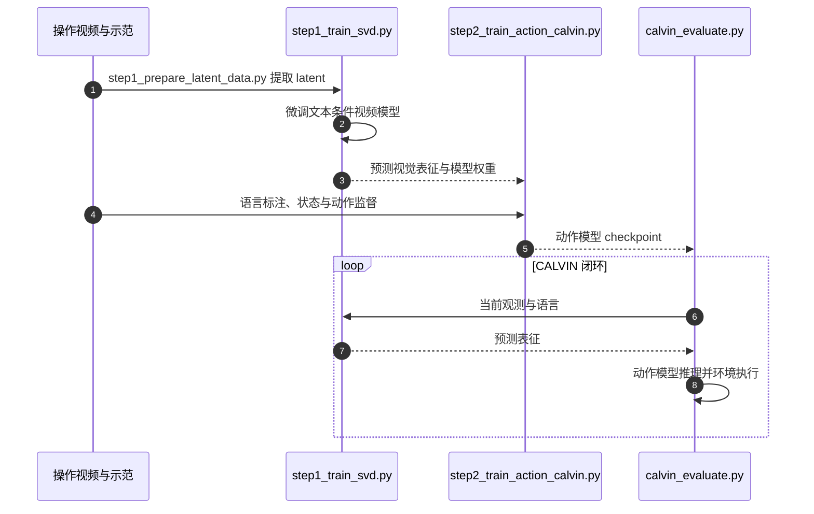

# Video Prediction Policy（VPP）

## 一句话定义

VPP 先将通用视频扩散模型适配到操作视频，再用模型内部的当前与预测未来表征学习隐式逆动力学，输出机器人动作。

## 英文缩写速查

| 缩写 | 英文全称 | 简要说明 |
| --- | --- | --- |
| VPP | Video Prediction Policy | 预测视觉表征条件下的动作策略 |
| VDM | Video Diffusion Model | 视频扩散模型 |
| TVP | Text-guided Video Prediction | 文本引导的视频预测阶段 |
| SVD | Stable Video Diffusion | 仓库使用的视频基础模型 |
| DiT | Diffusion Transformer | 动作侧扩散 Transformer |

## 为什么重要

静态视觉编码器未必包含任务所需的动态后果。VPP 把视频预训练提供的预测信息转为动作监督的条件，适合研究[世界与动作模型](../concepts/world-action-models.md)的级联接口；并在 RobotEra 灵巧手上验证多任务操作。

## 核心信息

| 字段 | 内容 |
| --- | --- |
| 论文 | [arXiv:2412.14803](https://arxiv.org/abs/2412.14803)，2024-12-19 v1，2025-05-04 v2；ICML 2025 Spotlight |
| 机构 | 清华大学、加州大学伯克利分校、上海人工智能实验室、上海期智研究院、星动纪元 |
| 官方资源 | [项目页](https://video-prediction-policy.github.io/)、[源码](https://github.com/roboterax/video-prediction-policy) |
| 与 ERA-42 的边界 | VPP 为具名联合研究；其开放状态不代表 ERA-42 产品完整资产开放 |

## 核心机制

1. **视频阶段**：统一人类与机器人操作视频的生成目标，先提取 latent，再微调文本条件 SVD，得到包含当前状态及未来动态的信息。
2. **动作阶段**：从视频模型内部聚合预测视觉表征，以扩散动作模型学习隐式逆动力学；CALVIN 与 XBot 的数据、归一化和动作接口分别适配。
3. **部署阶段**：观测和任务条件进入模型，动作头输出控制序列；视频生成质量会影响动作学习。视频预测和实际控制成功不是同一个指标。

## 源码运行时序图

这是 README 的 CALVIN 复现路径；真机对应 `step2_train_action_xbot.py` 与 `step3_deploy_real_xbot.py`，需要自行核对本体接口和状态/动作统计。

## 工程实践与开放范围

- 公开入口包含视频/动作训练、CALVIN 评测、预测示例和真机适配脚本。README 推荐 Python 3.10，CALVIN 需另装环境与 ABC-D 数据（约 500 GB）。训练报告单节点 8 张 A800/H100；本页未实际重跑。
- README 链接 `svd-robot`、`svd-robot-calvin-ft`、`dp-calvin` 权重与 `vpp_svd_latent` 特征。公开部分资产，不推定自采 XHAND 原始训练池全部开放。
- 先运行 `make_prediction.py` 检查预测质量，再训练动作模型；真机部署不能直接复用 CALVIN 动作尺度。

## 实验与评测

| 来源 | 报告与读法 |
| --- | --- |
| 官方 README | CALVIN ABC 平均完成链长 4.33；单一策略覆盖 100+ 真机灵巧操作任务，是来源报告而非本库复测 |
| arXiv v2 摘要 | CALVIN ABC-D 相对提升 18.6%，复杂真机灵巧操作成功率增加 31.6% |
| 官方项目页 | CALVIN 相对提升写为 41.5%，与当前摘要的 18.6% 不同；未确认统一基线口径，不能互换 |

## 结论

**VPP 的可操作价值是将预测视觉表征接入动作学习，并提供分阶段复现入口。**

- 先复现 CALVIN 链长，再考虑自有本体；不同数据和动作头需要重新核对。
- 视频生成视觉质量与闭环控制增益分开评测。
- 论文、项目页和 README 的指标口径分别保留，项目页与摘要差异尚未统一。
- 开放权重/latent 示例不等于完整真机数据池，也不等于 ERA-42 产品开源。

## 局限与风险

预测误差会传给动作模型；训练资源和大体积数据增加成本。真机复现还依赖观测格式、归一化和机器人 SDK。当前公开资产核查日期为 2026-10-08，代码首次公开日未确认；路线使用论文 v1 日期。

## 关联页面

- [星动纪元](./robotera.md)、[M7 VLA 基线](./cn-os-robotera-vla.md)
- [级联世界模型路线](../overview/world-models-route-01-cascade.md)、[世界模型 15 项目地图](../overview/world-models-15-open-source-technology-map.md)
- [VLA](../methods/vla.md)、[WAM](../concepts/world-action-models.md)

## 参考来源

- [官方项目页核查](../../sources/sites/video-prediction-policy.md)
- [官方源码与 README 补核](../../sources/repos/video-prediction-policy.md)
- [既有论文归档](../../sources/papers/shenlan_wm_survey_02_vpp.md)
- [原始世界模型专题策展](../../sources/blogs/wechat_shenlan_world_models_15_open_source_2026.md)
- [RCL 论文索引归档](../../sources/papers/rcl_awesome_wam_ref_2b3f47a14556997eb476_video-prediction-policy-a-generalist-rob.md)

## 推荐继续阅读

- [论文](https://arxiv.org/abs/2412.14803)、[项目](https://video-prediction-policy.github.io/)、[README](https://github.com/roboterax/video-prediction-policy)
