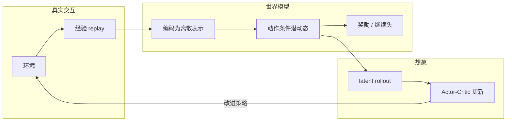
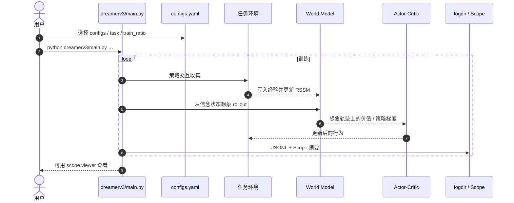

# DreamerV3（Mastering Diverse Domains through World Models）

**DreamerV3**（[arXiv:2301.04104](https://arxiv.org/abs/2301.04104)，Nature；Danijar Hafner 等 · **谷歌 DeepMind（Google DeepMind）** 谱系；[作者页](https://danijar.com/dreamerv3)，[公开复现](https://github.com/danijar/dreamerv3)）学习环境世界模型，并在 **潜空间想象轨迹** 上改进行为；**同一套超参** 在 **150+** 任务上超越大量专用方法。收录于 [深蓝 · 世界模型 15 开源项目](../overview/world-models-15-open-source-technology-map.md) **第 13/15**，路线 **03 虚拟沙盒**。

## 一句话定义

**用世界模型在脑内想象未来，并在想象中训练 actor-critic；固定超参即可跨越多域控制任务（含 Minecraft 从零采钻）。**

## 英文缩写速查

| 缩写 | 英文全称 | 简要说明 |
|------|----------|----------|
| DreamerV3 | Dreamer version 3 | 本文通配世界模型智能体 |
| RSSM | Recurrent State-Space Model | 潜动态骨干（承 PlaNet） |
| MBRL | Model-Based Reinforcement Learning | 所属范式 |
| ELBO | Evidence Lower Bound | 世界模型变分训练相关 |
| SAC | Soft Actor-Critic | 常见 model-free 对照族 |
| JAX | JAX | 公开复现实现栈 |

## 为什么重要

- **通配超参：** 减少「换域先调参」的专家税与算力税——与 [TD-MPC2](./paper-td-mpc2.md) 并列成为现代 MBRL 默认候选。
- **想象学习成熟形态：** 相对 [PlaNet](./paper-planet-latent-dynamics.md) 的在线 CEM，Dreamer 在模型生成的轨迹上直接做策略优化（见 [Latent Imagination](../concepts/latent-imagination.md)）。
- **标志性结果：** Minecraft 从零收集钻石（无人类数据/课程）被广泛引用为开放世界稀疏回报挑战。
- **沙盒地图锚点：** 15 项目地图 **13/15**；物理保真度文将其列为 **低维潜状态** 代表之一。
- **开源可跟进：** `danijar/dreamerv3`（MIT）+ 后继 [Open Dreamer](./open-dreamer.md)（Dreamer 4 管线）。

## 核心信息

| 字段 | 内容 |
|------|------|
| 编号（深蓝） | 13/15 |
| 路线 | 03 虚拟沙盒 |
| 出处 | Nature；预印本 arXiv:2301.04104 |
| 文内引用（2026-06-02 策展） | 1475 |
| arXiv | [2301.04104](https://arxiv.org/abs/2301.04104) |
| 开源 | **已开源（公开复现）** · [danijar/dreamerv3](https://github.com/danijar/dreamerv3) · MIT |
| 后继 | [Open Dreamer](./open-dreamer.md) / Dreamer 4 |
| 输出族 | 低维 / 离散潜状态（非主打视频） |

## 流程总览

## 核心原理 / 机制

### 世界模型

感官输入被编码为紧凑（常为 **categorical / 离散**）表示；模型给定动作预测未来表示与奖励等信号。训练目标使表示既可重建必要信息，又利于长期预测。

### 潜空间想象中的行为学习

智能体从当前信念状态出发，在模型内滚动多步「梦境」，于其上优化 actor 与 critic——大量梯度步消耗在想象里，从而提升数据效率。这是对 [World Models](./paper-ha-schmidhuber-world-models.md)「梦中训 C」与 PlaNet「梦中规划」的综合演进。

### 稳健化使通配成立

归一化、损失平衡、变换等技巧抑制跨域不稳；于是 **同一配置** 能覆盖控制、Atari、Minecraft 等差异巨大的域。增大模型与梯度步还可改善最终性能与样本效率（缩放叙事）。

### 在 15 地图与物理保真度中的位置

- **虚拟沙盒：** 用想象替代昂贵真机/仿真试错，见 [route-03](../overview/world-models-route-03-virtual-sandbox.md)。
- **保真度：** 潜变量快；接触级物理是否进表示，需靠动作/动力学敏感性测试，不能默认「能打游戏 = 懂物理」。

## 工程实践

| 项 | 实践要点 |
|----|----------|
| 开源状态 | **已开源**：[`danijar/dreamerv3`](https://github.com/danijar/dreamerv3)（MIT，JAX）。README：基于 DreamerV2 开源基座的 **reimplementation**，**与 Google/DeepMind 内部实现无关**。索引见 [`sources/repos/danijar-dreamerv3.md`](../../sources/repos/danijar-dreamerv3.md)。 |
| 后继 | [Open Dreamer](./open-dreamer.md) 面向 Dreamer 4：tokenizer + 动作条件动力学；完整 BC/RL agent 环仍待齐。 |
| 训练入口 | `python dreamerv3/main.py --logdir … --configs crafter`；复现用对应 `--configs`/`--task` |
| 调试 | `--configs debug` 缩小网络与 batch；`--jax.platform cpu` 可切 CPU |
| 选型 | 通配想象 RL 默认；要 MPC+隐式模型+海量 ckpt 看 TD-MPC2；要视频真机模拟叙事看 UniSim（未开源）。 |

## 源码运行时序图

节点对齐 [`sources/repos/danijar-dreamerv3.md`](../../sources/repos/danijar-dreamerv3.md)。

- **最短复现：** 装 JAX + `requirements.txt` → `crafter` 或 `debug` 冒烟 → 再换论文对应 config。
- **Dreamer 4：** 另走 [Open Dreamer](./open-dreamer.md) 训练/推理分仓流程。

## 实验与评测

| 轴 | 报告口径（以论文 / 作者页为准） |
|----|--------------------------------|
| 覆盖 | 150+ 任务；单一配置 |
| Minecraft | 从零采钻石（无人类数据/课程） |
| 对照 | 多域专用最优方法 / 强 model-free |
| 缩放 | 更大模型与更多梯度步 → 性能与效率 |
| 深蓝策展 | 15 地图引用量快照；机制以 PDF 为准 |

## 结论

**DreamerV3 把「潜空间想象中的通配 MBRL」做成跨域默认强基线；公开 JAX 复现可跟，但潜变量成功不等于物理保真。**

1. **想象中学策略** — 与 PlaNet 规划式、World Models 进化小 C 形成三代叙事。
2. **单一超参** — 降低换域成本；仍需核对任务包装与算力。
3. **Minecraft 钻石** — 开放世界稀疏回报的标志引用，不等于操纵接触物理已解决。
4. **开源** — 用 `danijar/dreamerv3`；内部 DeepMind 实现勿混为一谈。
5. **后继** — Dreamer 4 / Open Dreamer 走向可扩展视频 tokenizer + 动力学。
6. **保真度** — 归入低维潜状态族；部署前做动作/动力学敏感性与策略相关测试。
7. **地图** — 保持与 [world-models-15 地图](../overview/world-models-15-open-source-technology-map.md) 13/15 互链。

## 局限与风险

- **压缩损失：** 接触、动量等细节可能不进 latent。
- **复现声明：** 公开仓 ≠ 论文内部实现逐行一致。
- **域包装差异：** 「同一超参」仍依赖官方任务封装。
- **与视频 WM 不可互相替代：** 不能用 Dreamer 分数直接给 UniSim 式真机视频模拟器背书。

## 与其他工作对比

| 对比轴 | DreamerV3 | [TD-MPC2](./paper-td-mpc2.md) | [PlaNet](./paper-planet-latent-dynamics.md) | [UniSim](./paper-unisim.md) |
|--------|-----------|-------------------------------|---------------------------------------------|------------------------------|
| 决策学习 | 想象 actor-critic | 潜空间 MPC | CEM MPC | 仿真内 RL/规划（视频） |
| 通配叙事 | 150+ 任务 | 104 任务 | 较少域 | 演示向 |
| 开源 | danijar MIT | UCSD MIT+权重 | archived TF1 | 未开源 |
| 15 地图 | **13/15** | 非该清单核心 | 前代 | 非该清单 |

## 关联页面

- [世界模型 15 开源技术地图](../overview/world-models-15-open-source-technology-map.md)
- [世界模型路线 03：虚拟沙盒](../overview/world-models-route-03-virtual-sandbox.md)
- [世界模型物理保真度 × 输出轴](../overview/world-model-physics-fidelity-outputs.md)
- [Latent Imagination](../concepts/latent-imagination.md)
- [Model-Based RL](../methods/model-based-rl.md)
- [Generative World Models](../methods/generative-world-models.md)
- [Open Dreamer](./open-dreamer.md)
- [World Models](./paper-ha-schmidhuber-world-models.md) · [PlaNet](./paper-planet-latent-dynamics.md) · [TD-MPC2](./paper-td-mpc2.md) · [UniSim](./paper-unisim.md)
- [Online MBRL via Online Optimization](./paper-online-mbrl-robot-control.md) — HEAP 仿真中相对想象 RL 的真机一阶对照

## 参考来源

- [DreamerV3 论文 / 深蓝策展归档](../../sources/papers/shenlan_wm_survey_13_dreamerv3.md)
- [15 项目参考目录](../../sources/papers/shenlan_world_models_15_reference_catalog.md)
- [danijar/dreamerv3 代码索引](../../sources/repos/danijar-dreamerv3.md)
- [Open Dreamer 代码索引](../../sources/repos/open-dreamer.md)
- [深蓝 15 开源微信编译](../../sources/blogs/wechat_shenlan_world_models_15_open_source_2026.md)
- [微信：世界模型物理保真度策展](../../sources/blogs/wechat_embodied_ai_lab_world_model_physics_fidelity.md)
- [Online MBRL 论文归档（对照实验提及）](../../sources/papers/online_mbrl_robot_control_arxiv_2510_18518.md)

## 推荐继续阅读

- [arXiv:2301.04104](https://arxiv.org/abs/2301.04104)
- [danijar.com/dreamerv3](https://danijar.com/dreamerv3)
- [GitHub — danijar/dreamerv3](https://github.com/danijar/dreamerv3)
- [Open Dreamer](./open-dreamer.md) — Dreamer 4 开源后继
- [Online MBRL via Online Optimization](./paper-online-mbrl-robot-control.md) — 真实轨迹一阶更新对照
- [深蓝具身智能原文](https://mp.weixin.qq.com/s/KZT8sI4n7GvHWyM20wN3gg)
