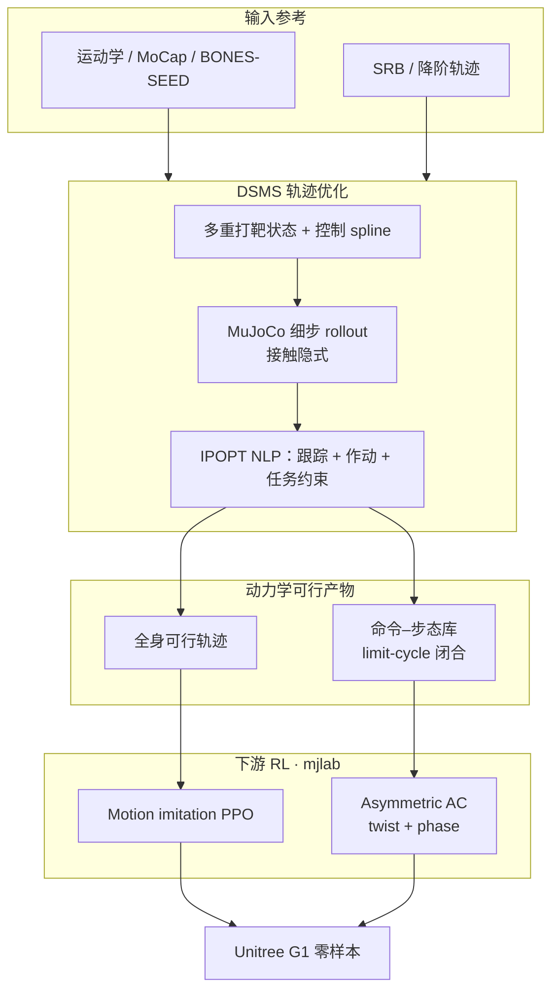
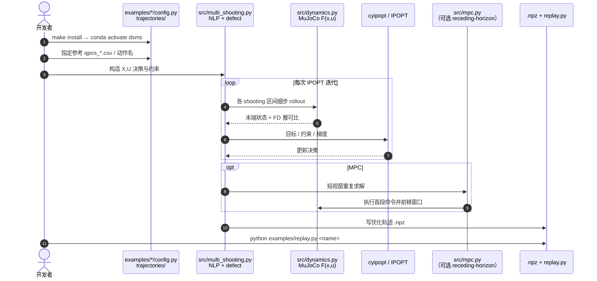

# Shooting for Contact（DSMS 动态运动重定向）

**Shooting for Contact**（*Contact-Implicit Multiple Shooting for Dynamic Motion Retargeting*，arXiv:[2608.03116](https://arxiv.org/abs/2608.03116)，[项目页](https://shooting-for-contact.github.io/)）由 **加州理工学院（Caltech）** 与 **德保罗大学（DePaul University）** 提出：用可微仿真器作转移映射的 **直接仿真多重打靶（DSMS）**，在无接触时刻表的前提下，把运动学可行参考精炼为 **全身动力学可行** 轨迹，再训 motion-imitation / 命令条件化爬行策略并 **零样本** 上 Unitree G1。算法细节见方法页 [DSMS](../methods/dsms-contact-implicit-multiple-shooting.md)；参考实现见 [sesteban951/shooting-for-contact](https://github.com/sesteban951/shooting-for-contact)。

## 一句话定义

**接触隐式 DSMS**：把 MuJoCo 离散动力学嵌进多重打靶 NLP，内部消化接触/摩擦/冲击，把运动学参考变成 RL 可学、真机可跑的动力学可行全身轨迹。

## 英文缩写速查

| 缩写 | 英文全称 | 简要说明 |
|------|----------|----------|
| DSMS | Direct Simulation-based Multiple Shooting | 本文核心：仿真器在环的直接多重打靶 NLP |
| NLP | Nonlinear Program | IPOPT/`cyipopt` 求解的轨迹优化问题 |
| SRB | Single Rigid Body | 降阶参考；需 DSMS 升格为全身可行 |
| KD | Kinodynamic Optimization | ROM 消融中的中等保真精炼基线 |
| PPO | Proximal Policy Optimization | 下游 motion imitation / crawling 策略 |
| G1 | Unitree G1 Humanoid | 主真机与仿真评测平台 |

## 为什么重要

- **补齐 kinematic → dynamic 缺口：** [OmniRetarget](./paper-hrl-stack-03-omniretarget.md) 等强运动学参考仍可能动力学不可行；DSMS 用全阶仿真转移强制动力学一致。
- **接触丰富无需排程：** 爬行、侧滚、多肢着地后空翻等滑动/冲击接触由仿真器解析，避免手写 contact schedule。
- **任意路径约束：** 相对 [DynaRetarget / SBTO](../methods/dynaretarget-sbto-motion-retargeting.md) 的采样式精炼，DSMS 可直接加等式/不等式任务与边界约束（limit-cycle 闭合、作动限等）。
- **下游 RL 与真机：** 动力学可行参考加速 PPO 收敛；G1 展示命令条件化爬行与 180° jump-turn，**无真机微调**。
- **已开源 trajopt：** 官方仓可复现 G1/Go2 示例；形态无关（换模型即可四足）。

## 核心信息

| 项 | 内容 |
|----|------|
| **机构** | 加州理工学院（Caltech）；德保罗大学（DePaul University） |
| **平台** | Unitree G1（真机）；Go2（形态迁移示例） |
| **开源** | **已开源** trajopt/MPC（[GitHub](https://github.com/sesteban951/shooting-for-contact)）；RL/真机部署脚本未随仓发布 |
| **求解器** | IPOPT + HSL ma57；MuJoCo ≥3.8；L-BFGS 曲率 |

## 流程总览

## 源码运行时序图

官方仓库 [sesteban951/shooting-for-contact](https://github.com/sesteban951/shooting-for-contact) **已开源** DSMS 求解与回放路径（归档见 [sources/repos/shooting-for-contact.md](../../sources/repos/shooting-for-contact.md)）。以 G1 tracking MPC / gait 为例：

- **复现入口：** `make install` 后跑 `examples/g1_gait/g1_gait.py` 或 `examples/g1_tracking_mpc/g1_tracking_mpc.py`，再用 `examples/replay.py` 回放。
- **边界：** 仓内是 **trajopt/MPC**；论文 mjlab PPO 与真机闭环 **不在本仓**——选型时勿把「代码已开源」读成「端到端 RL 可一键复现」。

## 核心原理

### DSMS 转录

- 决策：shooting-node 状态 \(\mathbf{X}\)、控制点 \(\mathbf{U}\)（ZOH / 分段线性）。
- 动力学：\(\mathbf{x}_{k+1}=\mathbf{F}(\mathbf{x}_k,\mathbf{u}_k)\)，\(\mathbf{F}\) 由仿真器定义；接触力不作决策变量。
- 目标：状态与 key-body 跟踪 + 力矩 / 命令变化率正则；路径与任务约束 \(g,h\) 任意可加。

### 跨场景用法

| 场景 | DSMS 用法 |
|------|-----------|
| 高动态（后空翻、翻滚） | Receding-horizon 拼接，整段由仿真生成 |
| 周期爬行库 | 单周期 NLP + limit-cycle 闭合 + twist 网格扫描 |
| 形态迁移 | 换 MuJoCo 模型（G1 ↔ Go2） |

## 工程实践

| 项 | 实践要点 |
|----|----------|
| 环境 | conda env `dsms`；`TRAJOPT_ROOT_DIR`；MuJoCo ≥3.8、cyipopt |
| 作动接口 | `torque` 或 `position`（低层 PD）——成本惩罚 **实现力矩** |
| 参考接入 | `trajectories/{g1,go2}/.../qpos_*dof.csv` + `time.csv` |
| 下游 RL | 论文：mjlab + rsl_rl PPO；(512,256,128) MLP；200 Hz 仿真 / 50 Hz 策略 |
| DR | base push、COM、编码器偏置、摩擦——覆盖室内粗糙与部分室外，**不含**草地柔顺/坡度建模 |
| 调试 | 先看 DSMS 是否收敛与 ghost 接触是否合理，再比 PPO \(\sigma\) 收敛与 sim-to-sim 落地率 |

## 实验与评测

### ROM 动态保真（Table I · backflip）

仅 SRB / SRB→KD 落地 **0/75**；**SRB→DSMS** 达 **75/75（100%）**。说明全阶仿真精炼对高动态参考几乎是硬门槛。

### 重定向方法对比（Table II · super-hero backflip）

| 方法 | Landed Success |
|------|----------------|
| OmniRetarget | 7/75（9.3%） |
| BONES-SEED | 60/75（80.0%） |
| DynaRetarget | 74/75（98.7%） |
| **DSMS** | **74/75（98.7%）** |

DSMS 与 DynaRetarget 成功率同档，但训练收敛更快（论文称相对最近竞争者约 **40 min** RTX 4090 墙钟优势）。

### 真机（§V-B · 项目页）

- **180° jump-turn：** SRB → DSMS → imitation policy；零样本落地恢复。
- **爬行：** twist 命令前后/转向；室内限高通道与粗糙段；室外草地爬坡。
- **速度跟踪：** 周期平均速度跟随命令趋势；瞬时骨盆速度随步态相位大幅振荡（预期现象）。

## 结论

**DSMS 的真影响是「接触隐式 + 全阶动力学可行参考」同时吃到任意约束与更快 RL 收敛；落地成功率与 DynaRetarget 同档，相对 OmniRetarget 拉开数量级差距。**

1. **先问参考是否动力学可行** — SRB/KD  alone 落地 0%；过 DSMS 后可达 100%（Table I）。
2. **选型：约束 vs 采样** — 需要硬等式/不等式与 IPOPT 结构时优先 DSMS；长时域物体交互采样精炼仍看 [DynaRetarget](../methods/dynaretarget-sbto-motion-retargeting.md)。
3. **接触丰富不必手写 schedule** — 爬行滑动、多肢着地由仿真器内部处理。
4. **下游读法** — 看 PPO 收敛与 sim-to-sim 落地，而非仅运动学 MPJPE。
5. **开源边界** — trajopt/MPC 可跑；mjlab 训练与真机栈以论文/项目页为准。
6. **形态无关** — 同配方可迁 Go2；换模型即重定向。

## 与其他工作对比

| 维度 | OmniRetarget | DynaRetarget (SBTO) | **DSMS（本文）** |
|------|--------------|---------------------|------------------|
| 动力学可行 | 弱（偏运动学） | 强（采样 rollout） | **强（仿真转移约束）** |
| 接触建模 | 硬运动学/SDF | 隐式（仿真） | **隐式（仿真）** |
| 任意 NLP 约束 | 弱 | 弱 | **强** |
| 求解器 | Sequential SOCP | CEM | **IPOPT** |
| 开源 | holosoma | sbto | **shooting-for-contact** |
| 典型强项 | 交互保留数据增广 | 长时域 loco-manipulation | 高动态 + 约束爬行库 |

## 局限与风险

- **二阶信息：** 依赖 L-BFGS 近似（MuJoCo 经典接口缺二阶导）；接触切换仍可能数值僵硬。
- **RL 栈分离：** 官方仓不含 mjlab 训练；复现 Table II 需自建跟踪环境。
- **License 未标明：** 入库日仓库无 SPDX LICENSE——商用前需向作者确认。
- **室外泛化：** DR 未覆盖草地柔顺与坡度；项目页室外成功属展示而非系统承诺。
- **勿与「又一个 GMR」混淆：** DSMS 是 **动力学精炼 / TO**，通常接在运动学重定向之后。

## 关联页面

- 方法页：[DSMS](../methods/dsms-contact-implicit-multiple-shooting.md)
- 概念：[Motion Retargeting](../concepts/motion-retargeting.md)、[Pipeline](../concepts/motion-retargeting-pipeline.md)
- 枢纽：[动作重定向知识链](../overview/hub-motion-retargeting.md)
- 对照：[DynaRetarget](./paper-notebook-dynaretarget-dynamically-feasible-retargeting-us.md)、[OmniRetarget](./paper-hrl-stack-03-omniretarget.md)、[GMR](../methods/motion-retargeting-gmr.md)
- 任务 / 平台：[Locomotion](../tasks/locomotion.md)、[Sim2Real](../concepts/sim2real.md)、[Unitree G1](./unitree-g1.md)

## 参考来源

- [shooting_for_contact_arxiv_2608_03116.md](../../sources/papers/shooting_for_contact_arxiv_2608_03116.md) — arXiv 策展摘录
- [shooting-for-contact-github-io.md](../../sources/sites/shooting-for-contact-github-io.md) — 项目页与开源核查
- [shooting-for-contact.md](../../sources/repos/shooting-for-contact.md) — GitHub 仓库归档
- 论文：<https://arxiv.org/abs/2608.03116>

## 推荐继续阅读

- [项目页](https://shooting-for-contact.github.io/)
- [GitHub 实现](https://github.com/sesteban951/shooting-for-contact)
- [DynaRetarget 项目页](https://atarilab.github.io/dynaretarget.io/) — 采样式动力学精炼对照
- [OmniRetarget 项目页](https://omniretarget.github.io/) — 交互保留运动学重定向对照
