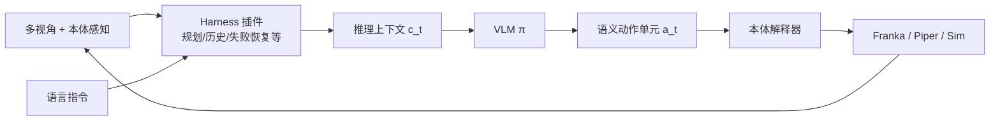
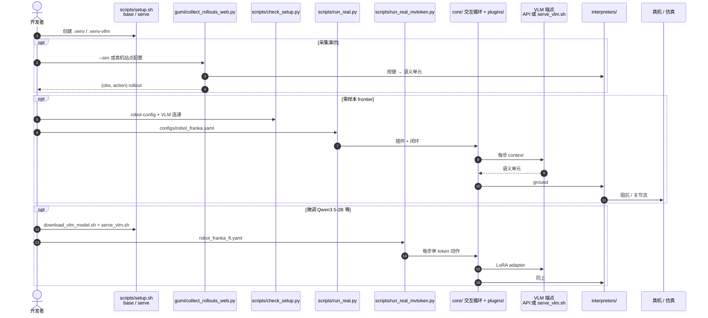

# Show-Harness（arXiv:2609.10522）

**Show-Harness**（*Just a VLM Agent Can Play Robots*，[arXiv:2609.10522](https://arxiv.org/abs/2609.10522)，[项目页](https://showlab.github.io/Show-Harness/)，[代码](https://github.com/showlab/Show-Harness)）由 **Show Lab @ 新加坡国立大学（NUS）** 提出：不把 VLM 压成连续 motor 回归，而是用 **离散语义动作单元 + 本体解释器** 把 foundation VLM 变成可直接负责细粒度物理决策的 situated agent。

## 一句话定义

**用 VLM 本就能理解的离散语义微动作作统一接口，frontier 模型可零样本闭环控机，2B 级开源 VLM 经 GUMI 数据少量 LoRA 微调即可在跨任务/环境/本体上超过代表 VLA 与 agent 基线。**

## 英文缩写速查

| 缩写 | 英文全称 | 简要说明 |
|------|----------|----------|
| VLM | Vision-Language Model | 视觉–语言基础模型（含闭源 frontier 与开源小模型） |
| VLA | Vision-Language-Action | 将 VLM 微调为连续/离散低层控制的端到端策略 |
| GUMI | GUI Manipulation Interface | 浏览器按键映射语义单元，人机/agent 同接口采集演示 |
| ZS | Zero-Shot | 不训机器人专用权重，直接驱动 harness（如 Gemini-3.1 Pro） |
| FT | Fine-Tuned | 在 GUMI 演示上对开源 backbone 做 LoRA 等轻量适配 |
| DoF | Degrees of Freedom | 自由度（Franka 7-DoF、AgileX 6-DoF 等） |

## 为什么重要

- **接口先于容量：** 论文主张瓶颈常是 **VLM–机器人接口**（语义可推理 + 物理够细），而非再堆 embodiment 预训练或更大 VLA。
- **一条词表跨本体：** `MV_*` / `GRASP` / `RELEASE` 等符号由解释器映射步长；换 Franka、AgileX 或仿真 **不改模型侧词汇**。
- **两条部署路线并存：** 闭源 frontier **零样本** 与 **数 GPU·小时** 微调 Qwen3.5-2B 等同接口，便于「先验证再降本」。
- **采集与部署同空间：** GUMI 把演示收集变成「玩机器人」，与在线 agent 共用动作空间，降低 teleop 硬件门槛。
- **全栈开源（2026-09 核查）：** 代码、harness 插件、GUMI、训练管线、[Show-Harness-VLMs](https://huggingface.co/showlab/Show-Harness-VLMs)、[Show-Harness-Data](https://huggingface.co/datasets/showlab/Show-Harness-Data)。

## 核心信息

| 项 | 内容 |
|----|------|
| **机构** | 新加坡国立大学 Show Lab（Mike Zheng Shou† 等） |
| **arXiv** | [2609.10522](https://arxiv.org/abs/2609.10522) |
| **项目页** | <https://showlab.github.io/Show-Harness/> |
| **代码** | <https://github.com/showlab/Show-Harness> |
| **权重** | <https://huggingface.co/showlab/Show-Harness-VLMs> |
| **数据** | <https://huggingface.co/datasets/showlab/Show-Harness-Data> |
| **开源** | **已开源** |

## 核心原理

### 语义动作空间

- 每个单元是 **无连续参数的符号**（如 `MV_FWD`、`ROTATE_CW`、`DONE`）；**解释器** 决定厘米级步长、夹爪语义与坐标约定。
- 消融表明：有语义的 `MV_LEFT` 与约定明确的 arbitrary 符号接近；**去掉约定** 成功率可跌至 ~5%（大量 timeout）——接口即动作空间，而非装饰。

### 闭环 Harness

每步：多视角观测 + 本体感知 + 历史 → **插件** 组装上下文 \(c_t\) → VLM 选一个 \(a_t \in \mathcal{A}\) → **解释器** 确定性执行 → 反馈写入历史。

### 流程总览

```mermaid
flowchart LR
  obs[多视角 + 本体感知] --> plug[Harness 插件<br/>规划/历史/失败恢复等]
  instr[语言指令] --> plug
  plug --> ctx[推理上下文 c_t]
  ctx --> vlm[VLM π]
  vlm --> unit[语义动作单元 a_t]
  unit --> interp[本体解释器]
  interp --> robot[Franka / Piper / Sim]
  robot --> obs
```

## 源码运行时序图

节点对齐 [`sources/repos/show-harness.md`](../../sources/repos/show-harness.md) 与 README Quick Start。

```mermaid
sequenceDiagram
    autonumber
    actor Dev as 开发者
    participant Setup as scripts/setup.sh<br/>base / serve
    participant GUMI as gumi/collect_rollouts_web.py
    participant Check as scripts/check_setup.py
    participant RunZS as scripts/run_real.py
    participant RunFT as scripts/run_real_mvtoken.py
    participant Core as core/ 交互循环 + plugins/
    participant VLM as VLM 端点<br/>API 或 serve_vlm.sh
    participant Int as interpreters/
    participant Robot as 真机 / 仿真
    Dev->>Setup: 创建 .venv / .venv-vllm
    opt 采集演示
        Dev->>GUMI: --sim 或真机站点配置
        GUMI->>Int: 按键 → 语义单元
        GUMI-->>Dev: (obs, action) rollout
    end
    opt 零样本 frontier
        Dev->>Check: robot-config + VLM 连通
        Dev->>RunZS: configs/robot_franka.yaml
        RunZS->>Core: 插件 + 闭环
        Core->>VLM: 每步 context
        VLM-->>Core: 语义单元
        Core->>Int: ground
        Int->>Robot: 阻抗 / 关节流
    end
    opt 微调 Qwen3.5-2B 等
        Dev->>Setup: download_vlm_model.sh + serve_vlm.sh
        Dev->>RunFT: robot_franka_ft.yaml
        RunFT->>Core: 每步单 token 动作
        Core->>VLM: LoRA adapter
        Core->>Int: 同上
    end
```

- **训练路径（独立）：** `train/` + LLaMA-Factory，与在线 harness 环境分离；见仓库 `train/README.md`。
- **换本体：** 仅换 `interpreters/` 与 `configs/primitives_<embodiment>.yaml`；**prompt 与词表不变**。

## 工程实践

| 项 | 建议 |
|----|------|
| 首次体验 | GUMI `--sim` 在浏览器熟悉动作单元，再切真机 `configs/site/franka.yaml` |
| 密钥 / 模型 | `configs/secrets.env`（Gemini 等）或本地 `scripts/serve_vlm.sh` |
| 安全 | 校准桌面 **安全下限** 与 begin pose；`check_setup.py` 预检相机与机械臂 |
| 微调复现 | HF 拉 adapter + 匹配 `models/chat_templates/`（vLLM 与训练渲染一致） |
| 插件 | 默认插件（多视角、子任务规划、本体感知等）可 ablation；见 `plugins/README.md` |
| 对照阅读 | 与 [VLA](../methods/vla.md) 比 **数据与算力**；与 [GTA-2](./paper-gta-2.md) 比 **在线微动作 vs 离线编译 ROS** |

## 局限与风险

- **空间精度仍绑 frontier 档位：** 项目页显示 instruction/plan 近饱和时，**空抓率** 仍随模型排名恶化——瓶颈在厘米级 grounding，非语言规划。
- **延迟与动态目标：** 更大 backbone 单步更慢；快速滚动等任务上 9B 可能不如 2B（~79 ms vs ~39 ms 量级，以论文为准）。
- **解释器改动 ≠ 重训模型：** 物理适配（步长、双 arm 联合预测）主要改解释器；但语义层新能力（Situated Planning、视频示范顺序）仍依赖插件或 ZS 能力。
- **指标引用：** 下文 headline 来自项目页与公众号导读；**分项任务与基线协议以 PDF 表格为准**。

## 实验与评测

| 设定 | Zero-Shot（frontier VLM） | Fine-Tuned（如 Qwen3.5-2B） | 备注 |
|------|---------------------------|-----------------------------|------|
| **跨任务**（10 tasks） | **89%** | **86%** | 优于代表 VLA / agent / CaP 基线（项目页 best baseline ~57%） |
| **跨环境**（4 shifts） | **100%** | **88%** | 背景、光照、视角、干扰物 |
| **跨本体**（Franka + AgileX） | **93%** | **87%** | best baseline ~52% |
| **仅仿真训练 → 真机** | — | **13/20** | π₀.5、GR00T 等可训练 VLA 基线 **0/20**（项目页） |
| **真机规模** | — | — | 文内共 **164** episode（AgileX + Franka；与早期索引一致） |

- **Frontier 横评（项目页）：** Gemini-3.1 Pro / GPT-5.6-sol / Opus 5 等 **86–96%** 档；较轻模型 **72–78%**。
- **插件消融（示例）：** 去掉 Multi-View Guidance 等默认插件可从 96% 配置显著跌落；Visual Prompt / Situated Planning 默认关闭但在目标 case 上 +50 pp 量级。

## 与其他工作对比

| 对照路线 | 差异 |
|----------|------|
| 端到端 [VLA](../methods/vla.md) | 需 embodiment 动作数据与策略微调；Show-Harness **不训低层策略**，VLM 每步选语义单元。 |
| [GTA-2](./paper-gta-2.md) | 同为 harness 思路；GTA-2 **多 VLM 离线编译 ROS**；Show-Harness **单 agent 在线微动作闭环**。 |
| 技能库 / VLA 作子模块的 agent | 物理「怎么做」常外包给 opaque executor；本文让 VLM **直接负责细粒度 how**。 |
| [JEPA Policy](./paper-jepa-policy.md) 等 IL 策略 | 优化 learned policy；本文优化 **VLM–执行接口**，可与策略路线互补。 |

## 结论

**Show-Harness 用「语义微动作 + 确定性解释器」证明：合适接口能从小模型与 frontier VLM 中榨出跨任务/环境/本体的操控能力，而不必先走大规模 VLA 预训练。**

- **选型先看接口再选模型：** 同一 harness 上换 Gemini / Qwen3.5-2B；失败多来自 **grounding 与步长**，而非子任务规划饱和。
- **降本路径清晰：** GUMI 采集 → `train/` LoRA → `run_real_mvtoken.py`；官方发布五档 real adapter + 仿真 `qwen3_5_2b_sim`。
- **跨本体靠解释器：** 模型侧词表固定；新硬件主要工程在 `interpreters/` 与安全校准，而非重训 VLA。
- **读数要对协议：** ZS/FT、held-out 任务（Teddy/Chess）、sim-only FT 真机 13/20 等条件不同，引用成功率务必对齐 PDF 与项目页小节。
- **复现入口：** [showlab/Show-Harness](https://github.com/showlab/Show-Harness) + [HF 权重](https://huggingface.co/showlab/Show-Harness-VLMs) + [HF 数据](https://huggingface.co/datasets/showlab/Show-Harness-Data)；预检 `check_setup.py` 再跑 `run_real*.py`。

## 关联页面

- [VLM 与操作 11 篇技术地图](../overview/vlm-manipulation-11-papers-technology-map.md)
- [灵巧手/WM/人形 14 篇技术地图](../overview/dexterous-wm-humanoid-14-papers-technology-map.md)
- [VLA](../methods/vla.md)
- [Manipulation](../tasks/manipulation.md)
- [GTA-2](./paper-gta-2.md)

## 参考来源

- [show-harness_arxiv_2609_10522.md](../../sources/papers/show-harness_arxiv_2609_10522.md)
- [show-harness 项目页](../../sources/sites/show-harness.md)
- [show-harness 仓库](../../sources/repos/show-harness.md)
- [wechat 11篇盘点](../../sources/blogs/wechat_embodied_station_11_papers_vlm_manipulation_2026-09-10.md)

## 推荐继续阅读

- [arXiv PDF](https://arxiv.org/pdf/2609.10522)
- [Show-Harness 项目页](https://showlab.github.io/Show-Harness/)
- [GitHub README（Quick Start / GUMI）](https://github.com/showlab/Show-Harness)
- [Awesome Multimodal Embodied Agents（Show Lab 综述仓）](https://github.com/showlab/Awesome-Multimodal-Embodied-Agent)
